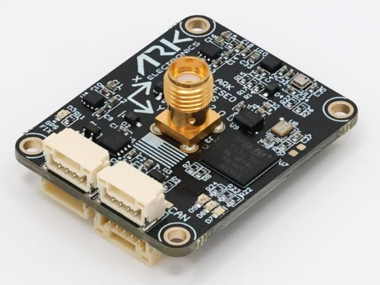

# ARK TESEO GPS

[ARK TESEO GPS](https://arkelectron.gitbook.io/ark-documentation/sensors/ark-teseo-gps) is a made in the USA and NDAA-compliant [DroneCAN](index.md) [GNSS/GPS](../gps_compass/index.md) L1/L5 GPS, magnetometer, barometer, IMU, and buzzer module.

## Де купити

Замовте цей модуль з:

- [ARK Electronics](https://arkelectron.com/product/ark-teseo-gps/) (US)

## Характеристики обладнання

- [Open Source Schematic and BOM](https://github.com/ARK-Electronics/ARK_Teseo_GPS)
- Датчики
  - [ST TESEO LIV4F GPS](https://www.st.com/en/positioning/teseo-liv4f.html)
    - L1/L5 bands
    - Simultaneous multi-constellation and multi-band GNSS (GPS, Galileo, GLONASS, BeiDou, QZSS)
    - IRNSS constellation ready
    - -162 dBm tracking sensitivity
    - Submeter positioning accuracy
  - [ST IIS2MDC Magnetometer](https://www.st.com/en/mems-and-sensors/iis2mdc.html)
  - [Bosch BMP390 Barometer](https://www.bosch-sensortec.com/products/environmental-sensors/pressure-sensors/pressure-sensors-bmp390.html)
  - [Invensense ICM-42688-P 6-Axis IMU](https://invensense.tdk.com/products/motion-tracking/6-axis/icm-42688-p/)
- STM32F412VGH6 MCU
- Dual Band (L1/L5) Helical GPS Antenna
- Два роз'єми стандарту CAN для Pixhawk (4 контакти JST GH)
- I2C and Timepulse/PPS Connector (5 Pin JST GH)
- Роз'єм для відлагодження стандарту Pixhawk (6 контактів JST SH)
- Вимоги до живлення
  - 5V
  - 137mA
- LED індикатори
  - GPS Fix
  - RGB Status
- USA Built
- NDAA Compliant

## Схема розташування виводів

### CAN - 4 Pin JST-GH

| Pin Number | Signal Name                | Напруга              |
| ---------- | -------------------------- | -------------------- |
| 1          | 5V                         | 5.0V |
| 2          | CAN_P | 5.0V |
| 3          | CAN_N | 5.0V |
| 4          | GND                        | GND                  |

### I2C + Timepulse - 5 Pin JST-GH

| Pin Number | Signal Name                                         | Напруга              |
| ---------- | --------------------------------------------------- | -------------------- |
| 1          | 5.0V Out (500mA) | 5.0V |
| 2          | I2C2_SCL                       | 3.3V |
| 3          | I2C2_SDA                       | 3.3V |
| 4          | TIMEPULSE                                           | 3.3V |
| 5          | GND                                                 | GND                  |

### Debug - 6 Pin JST-SH

| Pin Number | Signal Name                    | Напруга              |
| ---------- | ------------------------------ | -------------------- |
| 1          | 3.3V           | 3.3V |
| 2          | USART2_TX | 3.3V |
| 3          | USART2_RX | 3.3V |
| 4          | FMU_SWDIO | 3.3V |
| 5          | FMU_SWCLK | 3.3V |
| 6          | GND                            | GND                  |

## Дивіться також

- [ARK TESEO GPS Documentation](https://arkelectron.gitbook.io/ark-documentation/sensors/ark-teseo-gps) (ARK Docs)
