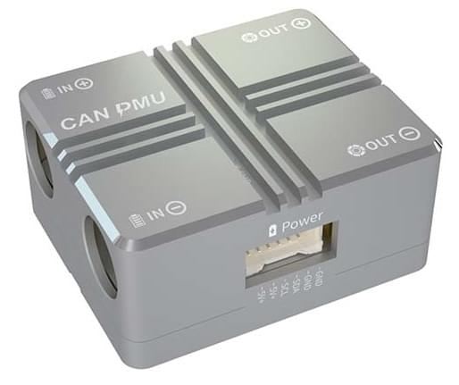
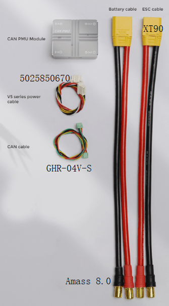
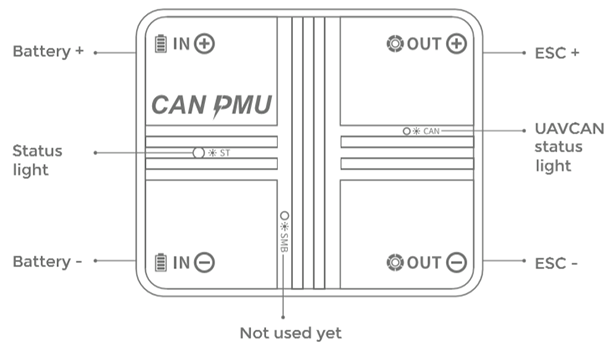
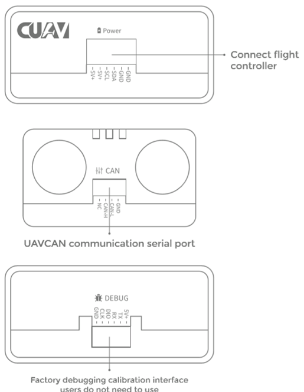
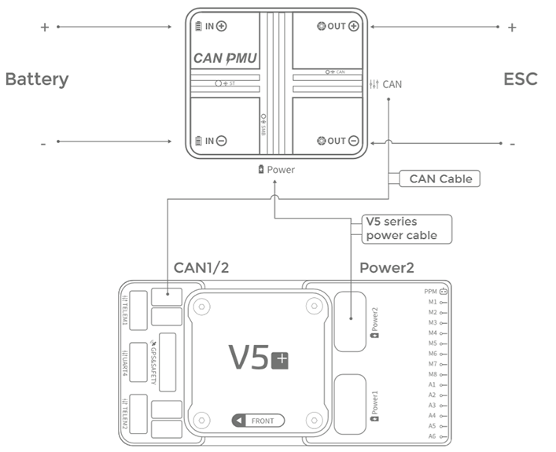
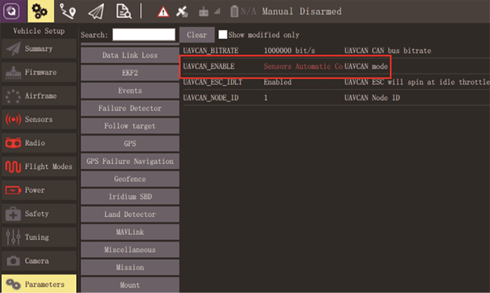
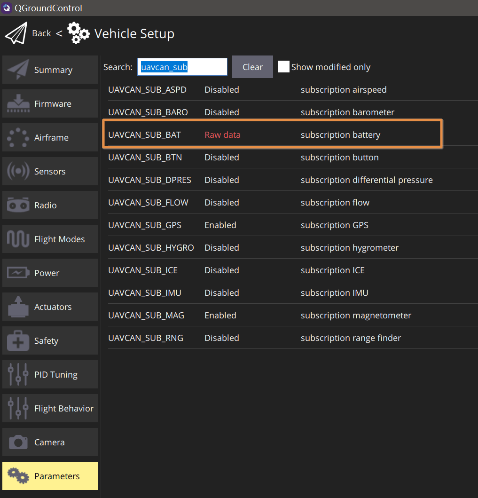

# CAUV CAN PMU

CAN PMU&reg; is a high-precision [DroneCAN](index.md) power module developed by CUAV&reg;.
Він використовує алгоритм компенсації CUAV ITT, який дозволяє дронам отримувати більш точні дані про заряд батареї.

Рекомендується для використання у великих комерційних транспортних засобах, але також може застосовуватися для дослідницьких транспортних засобів.

## Де купити

- [CUAV store](https://store.cuav.net/index.php)
- [CUAV aliexpress ](https://www.aliexpress.com/item/4000369700535.html)

## Характеристики обладнання

- **Processor:** STM32F412
- **Voltage input**: 6~62V\(2-15S\)
- **Max current:** 110A
- **Voltage accuracy:** ±0.05V
- **Current accuracy:** ±0.1A
- **Resolution:** 0.01A/V
- **Max output power:** 6000W/90S
- **Max stable power:** 5000W
- **Power port output:** 5.4V/5A
- **Operating temp:** -20~+100
- **Firmware upgrade:** Supported.
- **Calibration:** Not needed.
- **Interface Type:**
  - **IN/OUT:** XT90\(Cable）/Amass 8.0\(Module）
  - **Power port:** 5025850670
  - **CAN:** GHR-04V-S
- **Appearance:**
  - **Size:** 46.5mm \* 38.5mm \* 22.5mm
  - **Weight:** 76g

## Налаштування програмного забезпечення

### Вміст набору

### Схема розташування виводів

## Підключення

Кроки підключення:

- Підключіть керування польотом CAN1/2 та інтерфейс CAN модуля.
- Підключіть кабель живлення серії V5 до живлення керування польотом V5 Power2 (якщо інші керуючі пристрої підключені до інтерфейсу живлення) та інтерфейсу живлення модуля.

## Налаштування польотного контролера

Set the following parameters in _QGroundControl_ [Vehicle Setup > Parameters](../advanced_config/parameters.md) and then restart:

- [UAVCAN_ENABLE](../advanced_config/parameter_reference.md#UAVCAN_ENABLE): set to: _Sensors Automatic Config_

  

- [UAVCAN_SUB_BAT](../advanced_config/parameter_reference.md#UAVCAN_SUB_BAT): set to: _Raw data_

  

## Подальша інформація

[CAN PMU Manual](http://manual.cuav.net/power-module/CAN-PMU.pdf)

[CAN PMU Power detection module > Enable CAN PMU > PX4 firmware](http://doc.cuav.net/power-module/can-pmu/en/) (CUAV docs)
