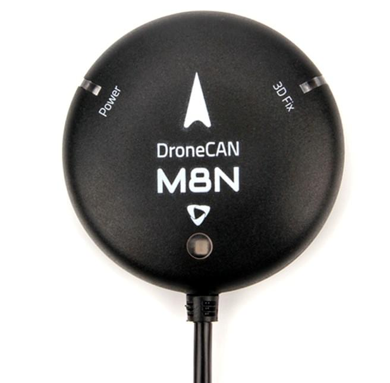
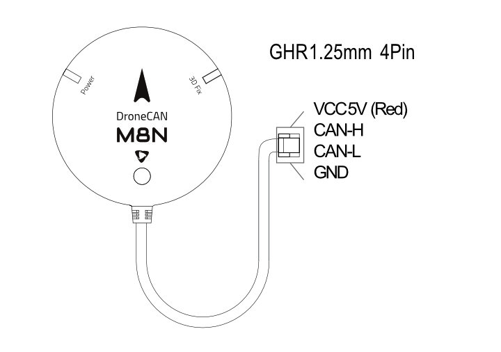
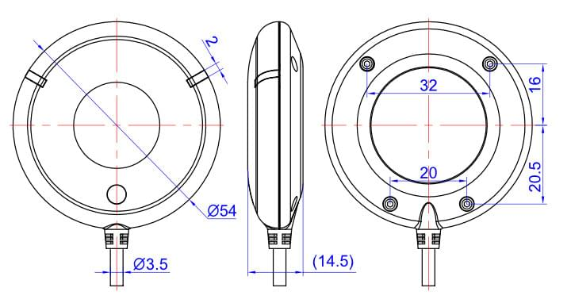

# Holybro DroneCAN M8N GPS

Holybro DroneCAN GPS має модуль UBLOX M8N, компас BMM150, триколірний індикатор світлодіодів.

The GPS module uses the [DroneCAN](index.md) protocol for communication.
З'єднання DroneCAN менше чутливі до електромагнітних перешкод порівняно з послідовним з'єднанням, що робить його більш надійним.
Крім того, використання DroneCAN означає, що GPS та компас не займають жодних портів послідовного керування польотом (різні/додаткові пристрої CAN можна підключити до того ж шини CAN за допомогою плати розгалужувача CAN).

## Де купити

Замовте цей модуль з:

- [Holybro](https://holybro.com/products/dronecan-m8n-gps)

## Характеристики обладнання

|                                                      | DroneCAN M8N                                                                                                                                       |
| ---------------------------------------------------- | -------------------------------------------------------------------------------------------------------------------------------------------------- |
| Приймач GNSS                                         | Ublox NEO M8N                                                                                                                                      |
| Кількість одночасних GNSS                            | 2 (Стандартний GPS + GLONASS)                                                                                                   |
| Процесор                                             | STM32G4 (170MHz, 512K FLASH)                                                                                                    |
| Компас                                               | BMM150                                                                                                                                             |
| Смуга частот                                         | 
GPS: L1C/A GLONASS: L10F Beidou: B1I Galileo: E1B/C
                                                                                |
| Система розширення GNSS                              | SBAS: WAAS, EGNOS, MSAS, QZSS                                                                                                      |
| Оновлення навігації                                  | 5Гц За замовчуванням (10Гц МАКС)                                                                                                |
| Чутливість навігації                                 | –167 dBm                                                                                                                                           |
| Холодний запуск                                      | \~ 26s                                                                                                                            |
| Точність                                             | 2.5m                                                                                                                               |
| Точність швидкості                                   | 0.05 m/s                                                                                                                           |
| Макс. # супутників                   | 22+                                                                                                                                                |
| Швидкість передачі даних по CAN BUS за замовчуванням | 1MHz                                                                                                                                               |
| Протокол зв'язку                                     | DroneCAN @ 1 Mbit/s                                                                                                                   |
| Підтримує автопілот FW                               | PX4, Ardupilot                                                                                                                                     |
| Тип порту                                            | GHR-04V-S                                                                                                                                          |
| Антена                                               | 25 x 25 x 4 мм керамічна патч-антена                                                                                                               |
| Напруга                                              | 4.7-5.2V                                                                                                           |
| Споживання електроенергії                            | Менше ніж 200мА @ 5В                                                                                                                  |
| Температура                                          | -40\~80C                                                                                                                          |
| Розмір                                               | 
Diameter: 54mm Thickness: 14.5mm
                                                                                                         |
| Вага                                                 | 36g                                                                                                                                                |
| Довжина кабелю                                       | 26cm                                                                                                                                               |
| Інше                                                 | <ul><li>LNA MAX2659ELT+ RF Amplifier</li><li>Rechargeable Farah capacitance</li><li>Low noise 3.3V regulator</li><li>26cm cable included</li></ul> |

## Налаштування програмного забезпечення

### Встановлення

The recommended mounting orientation is with the arrow on the GPS pointing towards the **front of vehicle**.

The sensor can be mounted anywhere on the frame, but you will need to specify its position, relative to vehicle centre of gravity, during [PX4 configuration](#px4-configuration).

### Підключення

The Holybro DroneCAN GPS підключений до шини CAN за допомогою стандартного кабелю Pixhawk 4 pin JST GH.
For more information, refer to the [CAN Wiring](../can/index.md#wiring) instructions.

### Схема розташування виводів

### Розміри

## Конфігурація PX4

You need to set necessary [DroneCAN](index.md) parameters and define offsets if the sensor is not centred within the vehicle.
Необхідні налаштування наведено нижче.

:::info
The GPS will not boot if there is no SD card in the flight controller when powered on.
:::

### Увімкнути DroneCAN

In order to use the ARK GPS board, connect it to the Pixhawk CAN bus and enable the DroneCAN driver by setting parameter [UAVCAN_ENABLE](../advanced_config/parameter_reference.md#UAVCAN_ENABLE) to `2` for dynamic node allocation (or `3` if using [DroneCAN ESCs](../dronecan/escs.md)).

Кроки наступні:

- In _QGroundControl_ set the parameter [UAVCAN_ENABLE](../advanced_config/parameter_reference.md#UAVCAN_ENABLE) to `2` or `3` and reboot (see [Finding/Updating Parameters](../advanced_config/parameters.md)).
- Підключіть GPS CAN до шини CAN Pixhawk.

Після активації модуль буде виявлено при завантаженні.
Дані GPS повинні надходити з частотою 5 Гц.

DroneCAN configuration in PX4 is explained in more detail in [DroneCAN > Enabling DroneCAN](../dronecan/index.md#enabling-dronecan).

### Конфігурація позиції датчика

Якщо датчик не знаходиться у центрі пристрою, вам також потрібно буде визначити зміщення датчика:

- Enable GPS yaw fusion by setting bit 3 of [EKF2_GPS_CTRL](../advanced_config/parameter_reference.md#EKF2_GPS_CTRL) to true.
- Enable [UAVCAN_SUB_GPS](../advanced_config/parameter_reference.md#UAVCAN_SUB_GPS), [UAVCAN_SUB_MAG](../advanced_config/parameter_reference.md#UAVCAN_SUB_MAG), and [UAVCAN_SUB_BARO](../advanced_config/parameter_reference.md#UAVCAN_SUB_BARO).
- Set [CANNODE_TERM](../advanced_config/parameter_reference.md#CANNODE_TERM) to `1` if this is that last node on the CAN bus.
- The parameters [EKF2_GPS_POS_X](../advanced_config/parameter_reference.md#EKF2_GPS_POS_X), [EKF2_GPS_POS_Y](../advanced_config/parameter_reference.md#EKF2_GPS_POS_Y) and [EKF2_GPS_POS_Z](../advanced_config/parameter_reference.md#EKF2_GPS_POS_Z) can be set to account for the offset of the ARK GPS from the vehicles centre of gravity.
