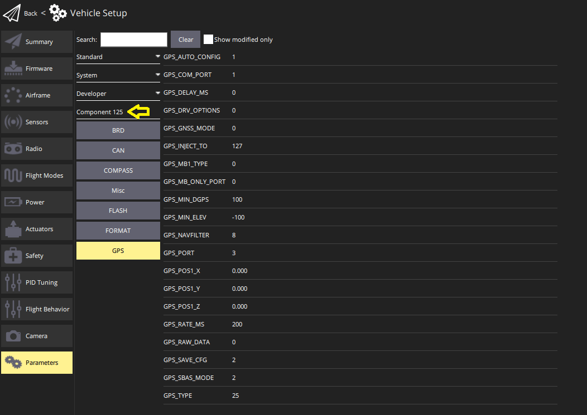

# DroneCAN

[DroneCAN](https://dronecan.github.io/) is a open software communication protocol for flight controllers and other [CAN](../can/index.md) devices on a vehicle to communicate with each other.

:::warning

- DroneCAN не активовано за замовчуванням, так само як і конкретні сенсори та функції, які його використовують.
  For setup information see [PX4 Configuration](#px4-configuration).
- PX4 вимагає SD-карту для активації динамічного виділення вузлів та оновлення прошивки.
  Карта SD не використовується під час польоту.

:::

:::info
DroneCAN was previously known as UAVCAN v0 (or just UAVCAN).
Ім'я було змінено в 2022 році.
:::

## Переваги DroneCAN

Підключення периферійних пристроїв через DroneCAN має багато переваг:

- Багато різних сенсорів та приводів вже підтримуються.
- CAN був спеціально розроблений для забезпечення надійного та надійного підключення на відносно великі відстані.
  Це дозволяє безпечне використання ESC на більших транспортних засобах та забезпечує резервне забезпечення зв'язку.
- Автобус є бідирекціональним, що дозволяє виконувати моніторинг стану здоров'я, діагностику та телеметрію обертів на хвилину (RPM).
- Проводка менше складна, оскільки ви можете мати один шину для підключення всіх ваших ESC і інших периферійних пристроїв DroneCAN.
- Налаштування стає простіше, оскільки ви налаштовуєте нумерацію ESC, обертаючи кожен двигун вручну.
- Це дозволяє користувачам налаштовувати та оновлювати прошивку всіх пристроїв, підключених через CAN, централізовано через PX4.

## Підтримуване обладнання

Підтримуються найпоширеніші типи периферійних пристроїв (датчики, ESCs та сервоприводи), які відповідають стандартам DroneCAN/UAVCAN v0.

Підтримувана апаратура включає (це не є вичерпним списком):

- [ESC/Motor controllers](../dronecan/escs.md)

- Датчики швидкості повітря
  - [Holybro High Precision DroneCAN Airspeed Sensor - DLVR](https://holybro.com/collections/sensors/products/high-precision-dronecan-airspeed-sensor-dlvr)
  - [RaccoonLab airspeed sensor](https://docs.raccoonlab.co/guide/airspeed)
  - [Thiemar airspeed sensor](https://github.com/thiemar/airspeed)

- Приймачі ГНСС для ГНСС (GPS, GLONASS, BeiDou та інше)
  - [ARK GPS](../dronecan/ark_gps.md)
  - [ARK RTK GPS](../dronecan/ark_rtk_gps.md)
  - [CubePilot Here3](https://www.cubepilot.org/#/here/here3)
  - [CUAV NEO v2 Pro GNSS](https://doc.cuav.net/gps/neo-series-gnss/en/neo-v2-pro.html)
  - [CUAV NEO 3 Pro GPS](../gps_compass/gps_cuav_neo_3pro.md)
  - [CUAV NEO 3X GPS](../gps_compass/gps_cuav_neo_3x.md)
  - [CUAV C-RTK2 PPK/RTK GNSS](../gps_compass/rtk_gps_cuav_c-rtk2.md)
  - [Holybro H-RTK ZED-F9P (DroneCAN variant)](../dronecan/holybro_h_rtk_zed_f9p_gps.md)
  - [Holybro DroneCAN M8N GPS](../dronecan/holybro_m8n_gps.md)
  - [Holybro DroneCAN M9N GPS](https://holybro.com/products/dronecan-m9n-gps)
  - [Holybro DroneCAN H-RTK F9P Rover](https://holybro.com/products/dronecan-h-rtk-f9p-rover)
  - [Holybro DroneCAN H-RTK F9P Helical](https://holybro.com/products/dronecan-h-rtk-f9p-helical)
  - [RaccoonLab GNSS Modules](https://docs.raccoonlab.co/guide/gps_mag_baro/)
  - [Zubax GNSS](https://zubax.com/products/gnss_2)

- Монітори живлення
  - [Pomegranate Systems Power Module](../dronecan/pomegranate_systems_pm.md)
  - [CUAV CAN PMU Power Module](../dronecan/cuav_can_pmu.md)
  - [RaccoonLab CAN Power Connectors and Management Units](../dronecan/raccoonlab_power.md)

- Компас
  - [Holybro RM3100 Professional Grade Compass](https://holybro.com/products/dronecan-rm3100-compass)
  - [RaccoonLab RM3100 Magnetometer](https://docs.raccoonlab.co/guide/gps_mag_baro/mag_rm3100.html)

- Датчики відстані
  - [ARK Flow](ark_flow.md)
  - [Ark Flow MR](ark_flow_mr.md)
  - [Avionics Anonymous Laser Altimeter UAVCAN Interface](../dronecan/avanon_laser_interface.md)
  - [RaccoonLab uRangefidner and Rangefinders Adapter](https://docs.raccoonlab.co/guide/rangefinder)

- Оптичний потік(Optical Flow)
  - [Ark Flow](ark_flow.md)
  - [Ark Flow MR](ark_flow_mr.md)

- Загальний вузол CAN (дозволяє використання датчиків I2C, SPI, UART на шині CAN).
  - [ARK CANnode](../dronecan/ark_cannode.md)
  - [RaccoonLab Nodes](../dronecan/raccoonlab_nodes.md)

## Налаштування програмного забезпечення

DroneCAN працює через мережу CAN.
DroneCAN hardware should be connected as described in [CAN > Wiring](../can/index.md#wiring).

## Виділення ідентифікатора вузла

Every DroneCAN device must be configured with a _node id_ that is unique on the vehicle.

Most devices support _Dynamic Node Allocation (DNA)_, which allows PX4 to automatically configure the node ID of each detected peripheral on system startup.
Консультуйте документацію виробника, щоб дізнатися, чи підтримує ваш пристрій ДНК та як її увімкнути.
Багато пристроїв автоматично перейдуть на ДНК, якщо ідентифікатор вузла встановлено на 0.
PX4 will enable the built in allocation server if the [UAVCAN_ENABLE](../advanced_config/parameter_reference.md#UAVCAN_ENABLE) parameter is > 1 (set to 2 or 3).

Деякі пристрої не підтримують ДНК.
Додатково, в певних критичних сценаріях ви можливо віддасте перевагу ручній налаштування ідентифікаторів вузлів заздалегідь замість покладанняся на сервер динамічного виділення.
If you wish to disable the DNA completely, set `UAVCAN_ENABLE` to `1` and manually set each node ID to a unique value.
Якщо ДНК все ще працює і певні пристрої потребують ручної конфігурації, присвойте цим пристроям значення, більше, ніж загальна кількість пристроїв DroneCAN, щоб уникнути конфліктів.

:::info
The PX4 node ID can be configured using the [UAVCAN_NODE_ID](../advanced_config/parameter_reference.md#UAVCAN_NODE_ID) parameter.
Параметр за замовчуванням встановлено на 1.
:::

:::warning
At time of writing, PX4 does not run the node allocation server on the CAN2 port.
This means that if you have a device that is _only_ connected to CAN2 (not redundantly to CAN1 and CAN2), you will need to manually configure its node ID.
:::

## Конфігурація PX4

DroneCAN is configured on PX4 by [setting specific PX4 parameters](../advanced_config/parameters.md) in QGroundControl.
Вам потрібно буде увімкнути сам DroneCAN, разом із підписками та публікаціями для будь-яких функцій, які ви використовуєте.

:::info
In some cases you may need to also configure parameters on the connected CAN devices (these can also be [set using QGC](#qgc-cannode-parameter-configuration)).
:::

### Увімкнення DroneCAN

To enable the PX4 DroneCAN driver, set the [UAVCAN_ENABLE](../advanced_config/parameter_reference.md#UAVCAN_ENABLE) parameter:

- `0`: DroneCAN driver disabled
- `1`: DroneCAN driver enabled for sensors, [DNA server](#node-id-allocation) disabled
- `2`: DroneCAN driver enabled for sensors, DNA server enabled
- `3`: DroneCAN driver enabled for sensors and ESCs, DNA server enabled

`2` or `3` are recommended, if DNA is supported.

### DroneCan Subscriptions & Publications

PX4 does not publish or subscribe to DroneCAN messages that _might_ be needed by default, in order to avoid spamming the CAN bus.
Instead you must enable publication or subscription to the messages associated with a particular feature by setting the associated [UAVCAN parameter](../advanced_config/parameter_reference.md#uavcan).

:::info
Sensor parameters may not exist (be visible in QGC) until you have enabled the associated DroneCAN [sensor subscription](#sensors)!

For example, [SENS_FLOW_MINHGT](../advanced_config/parameter_reference.md#SENS_FLOW_MINHGT) does not exist until [UAVCAN_SUB_FLOW](../advanced_config/parameter_reference.md#UAVCAN_SUB_FLOW) is enabled.
:::

For example, to use a connected DroneCAN smart battery you would enable the [UAVCAN_SUB_BAT](../advanced_config/parameter_reference.md#UAVCAN_SUB_BAT) parameter, which would subscribe PX4 to receive [BatteryInfo](https://dronecan.github.io/Specification/7._List_of_standard_data_types/#batteryinfo) DroneCAN messages.
If using a peripheral that needs to know if PX4 is armed, you would need to set the [UAVCAN_PUB_ARM](../advanced_config/parameter_reference.md#UAVCAN_PUB_ARM) parameter so that PX4 starts publishing [ArmingStatus](https://dronecan.github.io/Specification/7._List_of_standard_data_types/#armingstatus) messages.

The parameter names are prefixed with `UAVCAN_SUB_` and `UAVCAN_PUB_` to indicate whether they enable PX4 subscribing or publishing.
Решта назви вказує на конкретне повідомлення/функцію, яка встановлюється.

DroneCAN peripherals connected to PX4 can also be [configured using parameters via QGC](#qgc-cannode-parameter-configuration).
By convention, parameters named with the prefix [CANNODE\_](../advanced_config/parameter_reference.md#CANNODE_BITRATE) have prefined meaning, and may be documented in the parameter reference.
`CANNODE_` parameters prefixed with `CANNODE_PUB_` and `CANNODE_SUB_` enable the peripheral to publish or subscribe the associated DroneCAN message.
These allow DroneCAN peripherals to be configured to only subscribe and publish messages that they actually need (in the same way that PX4 uses the corresponding `UAVCAN_PUB_`/`UAVCAN_SUB_` parameters).
Note that a peripheral might might not use `CANNODE_` parameters, in which case it may have to publish/subscribe to particular messages whether or not they are needed.

Наступні розділи надають додаткові відомості про параметри периферійних пристроїв PX4 та DroneCAN, які використовуються для увімкнення певних функцій.

#### Датчики

Параметри/підписки сенсора DroneCAN, які можна активувати (у PX4 v1.14):

- [UAVCAN_SUB_ASPD](../advanced_config/parameter_reference.md#UAVCAN_SUB_ASPD): Airspeed
- [UAVCAN_SUB_BARO](../advanced_config/parameter_reference.md#UAVCAN_SUB_BARO): Barometer
- [UAVCAN_SUB_BAT](../advanced_config/parameter_reference.md#UAVCAN_SUB_BAT): Battery monitor/Power module
- [UAVCAN_SUB_BTN](../advanced_config/parameter_reference.md#UAVCAN_SUB_BTN): Button
- [UAVCAN_SUB_DPRES](../advanced_config/parameter_reference.md#UAVCAN_SUB_DPRES): Differential pressure
- [UAVCAN_SUB_FLOW](../advanced_config/parameter_reference.md#UAVCAN_SUB_FLOW): Optical flow
- [UAVCAN_SUB_GPS](../advanced_config/parameter_reference.md#UAVCAN_SUB_GPS): GPS
- [UAVCAN_SUB_GPS_R](../advanced_config/parameter_reference.md#UAVCAN_SUB_GPS_R)<Badge type="tip" text="PX4 v1.15" />: Subscribes to GNSS relative message ([RelPosHeading](https://dronecan.github.io/Specification/7._List_of_standard_data_types/#relposheading)).
  Only used for logging in PX4 v1.15.
- [UAVCAN_SUB_HYGRO](../advanced_config/parameter_reference.md#UAVCAN_SUB_HYGRO): Hygrometer
- [UAVCAN_SUB_ICE](../advanced_config/parameter_reference.md#UAVCAN_SUB_ICE): Internal combustion engine (ICE).
- [UAVCAN_SUB_IMU](../advanced_config/parameter_reference.md#UAVCAN_SUB_IMU): IMU
- [UAVCAN_SUB_MAG](../advanced_config/parameter_reference.md#UAVCAN_SUB_MAG): Magnetometer (compass)
- [UAVCAN_SUB_RNG](../advanced_config/parameter_reference.md#UAVCAN_SUB_RNG): Range finder (distance sensor).

#### GPS

Параметри PX4 DroneCAN:

- Enable [UAVCAN_SUB_GPS](../advanced_config/parameter_reference.md#UAVCAN_SUB_GPS).
- Enable [UAVCAN_SUB_MAG](../advanced_config/parameter_reference.md#UAVCAN_SUB_MAG) if the GPS module has an inbuilt compass.

GPS CANNODE parameter ([set using QGC](#qgc-cannode-parameter-configuration)):

- Set [CANNODE_TERM](../advanced_config/parameter_reference.md#CANNODE_TERM) to `1` for the last node on the CAN bus.

Інші параметри PX4:

- If the GPS is not positioned at the vehicle centre of gravity you can account for the offset using [EKF2_GPS_POS_X](../advanced_config/parameter_reference.md#EKF2_GPS_POS_X), [EKF2_GPS_POS_Y](../advanced_config/parameter_reference.md#EKF2_GPS_POS_Y) and [EKF2_GPS_POS_Z](../advanced_config/parameter_reference.md#EKF2_GPS_POS_Z).
- If the GPS module provides yaw information, you can enable GPS yaw fusion by setting bit 3 of [EKF2_GPS_CTRL](../advanced_config/parameter_reference.md#EKF2_GPS_CTRL) to true.

#### RTK-GPS

Set the same parameters as for [GPS](#gps) above.
Крім того, вам може знадобитися встановити наступні параметри в залежності від того, чи є ваша налаштування RTK Ровером і Фіксованою Базою, або Ровером і Рухомою Базою, або обома.

##### Ровер та фіксована база

Позиція ровера встановлюється за допомогою RTCM-повідомлень від базового модуля RTK (базовий модуль підключений до QGC, який надсилає інформацію RTCM до PX4 через MAVLink).

Параметри PX4 DroneCAN:

- [UAVCAN_PUB_RTCM](../advanced_config/parameter_reference.md#UAVCAN_PUB_RTCM):
  - Makes PX4 publish RTCM messages ([RTCMStream](https://dronecan.github.io/Specification/7._List_of_standard_data_types/#rtcmstream)) to the bus (which it gets from the RTK base module via QGC).

Rover module parameters (also [set using QGC](#qgc-cannode-parameter-configuration)):

- [CANNODE_SUB_RTCM](../advanced_config/parameter_reference.md#CANNODE_SUB_RTCM) tells the rover that it should subscribe to [RTCMStream](https://dronecan.github.io/Specification/7._List_of_standard_data_types/#rtcmstream) RTCM messages on the bus (from the moving base).

:::info
You could instead use [UAVCAN_PUB_MBD](../advanced_config/parameter_reference.md#UAVCAN_PUB_MBD) and [CANNODE_SUB_MBD](../advanced_config/parameter_reference.md#CANNODE_SUB_MBD), which also publish RTCM messages (these are newer).
Using the [RTCMStream](https://dronecan.github.io/Specification/7._List_of_standard_data_types/#rtcmstream) message means that you can implement moving base (see below) at the same time.
:::

##### Ровер та Рухома База

As discussed in [RTK GPS Heading with Dual u-blox F9P](../gps_compass/u-blox_f9p_heading.md) a vehicle can have two RTK modules in order to calculate yaw from GPS.
In this setup the vehicle has a _moving base_ RTK GPS and a _rover_ RTK GPS.

These parameters can be [set on moving base and rover RTK CAN nodes](#qgc-cannode-parameter-configuration), respectively:

- [CANNODE_PUB_MBD](../advanced_config/parameter_reference.md#CANNODE_PUB_MBD) causes a moving base GPS unit to publish [MovingBaselineData](https://dronecan.github.io/Specification/7._List_of_standard_data_types/#movingbaselinedata)RTCM messages onto the bus (for the rover)
- [CANNODE_SUB_MBD](../advanced_config/parameter_reference.md#CANNODE_SUB_MBD) tells the rover that it should subscribe to [MovingBaselineData](https://dronecan.github.io/Specification/7._List_of_standard_data_types/#movingbaselinedata) RTCM messages on the bus (from the moving base).

For PX4 you will also need to set [GPS_YAW_OFFSET](../advanced_config/parameter_reference.md#GPS_YAW_OFFSET) to indicate the relative position of the moving base and rover: 0 if your Rover is in front of your Moving Base, 90 if Rover is right of Moving Base, 180 if Rover is behind Moving Base, or 270 if Rover is left of Moving Base.

#### Барометр

Параметри PX4 DroneCAN:

- Enable [UAVCAN_SUB_BARO](../advanced_config/parameter_reference.md#UAVCAN_SUB_BARO).

#### Компас

Параметри PX4 DroneCAN:

- Enable [UAVCAN_SUB_MAG](../advanced_config/parameter_reference.md#UAVCAN_SUB_MAG).

#### Датчик відстані/Дальніметр

Параметри PX4 DroneCAN:

- Enable [UAVCAN_SUB_RNG](../advanced_config/parameter_reference.md#UAVCAN_SUB_RNG).
- Set [UAVCAN_RNG_MIN](../advanced_config/parameter_reference.md#UAVCAN_RNG_MIN) and [UAVCAN_RNG_MAX](../advanced_config/parameter_reference.md#UAVCAN_RNG_MAX), the minimum and maximum range of the distance sensor.

Інші параметри PX4:

- If the rangefinder is not positioned at the vehicle centre of gravity you can account for the offset using [EKF2_RNG_POS_X](../advanced_config/parameter_reference.md#EKF2_RNG_POS_X), [EKF2_RNG_POS_Y](../advanced_config/parameter_reference.md#EKF2_RNG_POS_Y) and [EKF2_RNG_POS_Z](../advanced_config/parameter_reference.md#EKF2_RNG_POS_Z).
- Other `EKF2_RNG_*` parameters may be relevant, in which case they should be documented with the specific rangefinder.

#### Оптичний потік Sensor

Параметри PX4 DroneCAN:

- Enable [UAVCAN_SUB_FLOW](../advanced_config/parameter_reference.md#UAVCAN_SUB_FLOW).

Інші параметри PX4:

- Set [SENS_FLOW_MINHGT](../advanced_config/parameter_reference.md#SENS_FLOW_MINHGT) and [SENS_FLOW_MAXHGT](../advanced_config/parameter_reference.md#SENS_FLOW_MAXHGT), the minimum and maximum height of the flow sensor.
- Set [SENS_FLOW_MAXR](../advanced_config/parameter_reference.md#SENS_FLOW_MAXR) the maximum angular flow rate of the sensor.
- Enable optical flow fusion by setting [EKF2_OF_CTRL](../advanced_config/parameter_reference.md#EKF2_OF_CTRL).
- To disable GPS aiding (optional), set [EKF2_GPS_CTRL](../advanced_config/parameter_reference.md#EKF2_GPS_CTRL) to `0`.
- If the optical flow unit is not positioned at the vehicle centre of gravity you can account for the offset using [EKF2_OF_POS_X](../advanced_config/parameter_reference.md#EKF2_OF_POS_X), [EKF2_OF_POS_Y](../advanced_config/parameter_reference.md#EKF2_OF_POS_Y) and [EKF2_OF_POS_Z](../advanced_config/parameter_reference.md#EKF2_OF_POS_Z).

Оптичні датчики потоку потребують даних дальномера.
Однак дальномер не обов'язково повинен бути частиною того ж модуля, і якщо він не є, то може бути не підключений через DroneCAN.
If the rangefinder is connected via DroneCAN (whether inbuilt or separate), you will also need to enable it as described in the [rangefinder section](#distance-sensor-range-finder) (above).

#### Периферійне озброєння

Параметри PX4 DroneCAN:

- [UAVCAN_PUB_ARM](../advanced_config/parameter_reference.md#UAVCAN_PUB_ARM) ([Arming Status](https://dronecan.github.io/Specification/7._List_of_standard_data_types/#armingstatus)): Publish when using DroneCAN components that require the PX4 arming status as a precondition for use.

### ESC & Servos

[DroneCAN ESCs and servos](../dronecan/escs.md) require the [motor order and servo outputs](../config/actuators.md) to be configured.

## Налаштування параметрів CANNODE QGC

QGroundControl може переглядати та змінювати параметри, що належать до пристроїв CAN, підключених до автопілота, за умови, що пристрої підключені до автопілота до запуску QGC.

CAN nodes are displayed separate sections in [Vehicle Settings > Parameters](../advanced_config/parameters.md) named _Component X_, where X is the node ID.
For example, the screenshot below shows the parameters for a CAN GPS with node id 125 (after the _Standard_, _System_, and _Developer_ parameter groupings).

## Налаштування пристрою

Більшість вузлів DroneCAN не потребують додаткової настройки, якщо це не вказано у їх документації, специфічній для пристрою.

## Оновлення прошивки

PX4 може оновлювати прошивку пристрою через DroneCAN.
Щоб оновити пристрій, все, що потрібно зробити, це скопіювати бінарний файл прошивки в кореневий каталог SD-карти контролера польоту та перезавантажити його.

Під час завантаження контролер польоту автоматично передасть прошивку на пристрій та оновить його.
If successful, the firmware binary will be removed from the root directory and there will be a file named **XX.bin** in the **/ufw** directory of the SD card.

## Усунення проблем

**Q**: My DroneCAN devices aren't working.

**A**: Check that the `UAVCAN_ENABLE` parameter is set correctly. To see a list of devices/nodes that PX4 has detected on the CAN bus, open NSH (i.e. go to the QGroundControl MAVLink Console) and type `uavcan status`.

---

**Q**: The DNA server isn't giving out node IDs.

**A**: PX4 requires an SD card to perform dynamic node allocation. Переконайтеся, що у вас (працюючий) вставлений і перезавантажтеся.

---

**Q**: The motors aren't spinning when armed.

**A**: Make sure `UAVCAN_ENABLE` is set to `3` to enable DroneCAN ESC output.

---

**Q**: The motors don't spin until throttle is increased.

**A**: Use [Acutator > Actuator Testing](../config/actuators.md#actuator-testing) to confirm that the motor outputs are set to the correct minimum values.

## Корисні посилання

- [Home Page](https://dronecan.github.io) (dronecan.github.io)
- [Protocol Specification](https://dronecan.github.io/Specification) (dronecan.github.io)
- [Implementations](https://dronecan.github.io/Implementations/) (dronecan.github.io)
- [Cyphal/CAN Device Interconnection](https://kb.zubax.com/pages/viewpage.action?pageId=2195476) (kb.zubax.com)
