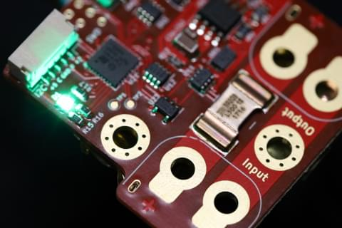
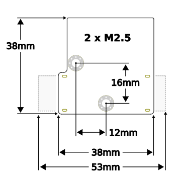

# Силовий модуль Pomegranate Systems

:::info
In 2022, UAVCAN (v0) was forked and is maintained as `DroneCAN`.
Хоча цей продукт все ще згадує "UAVCAN", він повністю сумісний з підтримкою DroneCAN в PX4.
:::



Цифровий модуль живлення з високороздільним інтегруванням струму, живлення 5В/2А з моніторингом потужності, один інтерфейс DroneCAN CANbus, та RGB індикатор статусу.

Detailed setup, configuration, and troubleshooting information can be found on the [manufacturer's device home page](https://p-systems.io/product/power_module).

## Характеристики обладнання

- **Input Voltage:** 6-26V \(2-6S\)
- **Max Continuous Current:**
  - **Benchtop:** 40A
  - **Forced Cooling:** 100A
- **Max 5V Output Current:** 2A
- **Voltage Resolution:** 0.04 ΔV
- **Current Resolution:**
  - **Primary / Battery Bus:** 0.02 ΔA
  - **5V bus:** 0.001 ΔA
- **CANbus Termination:** Electronic (on by default)
- **MCU:** STM32F302K8U
- **Electrical Interface:**
  - **Power:** Solder pads or XT60PW (right angle, board-mounted connectors)
  - **CANbus** Dual JST GH-4 (standard UAVCAN micro-connector)
  - **I2C / Serial:** JST GH-5
  - **5V Output:** Solder pads or CANbus / I2C connectors
- **Device Mass:**
  - **Without Connectors:** 9g
  - **With XT60PW Connectors:** 16g



## Налаштування прошивки

Модуль живлення працює на власній спеціальній (відкритому вихідному коді) прошивці компанії pomegranate systems.
Source code and build instructions can be found on [the bitbucket](https://bitbucket.org/p-systems/firmware/src/master).

## Налаштування польотного контролера

1. Enable DroneCAN by setting the [UAVCAN_ENABLE](../advanced_config/parameter_reference.md#UAVCAN_ENABLE) parameter to `2` (Sensors Automatic Config) or `3`.
2. Enable DroneCAN battery monitoring by setting [UAVCAN_SUB_BAT](../advanced_config/parameter_reference.md#UAVCAN_SUB_BAT) to `1` or `2` ( depending on your battery).
3. Set the following module parameters using the [MAVLink console](https://docs.qgroundcontrol.com/master/en/qgc-user-guide/analyze_view/mavlink_console.html):
  - Battery capacity in mAh: `battery_capacity_mAh`
  - Battery voltage when _full_: `battery_full_V`,
  - Battery voltage when _empty_: `battery_empty_V`
  - Turn on current integration: `enable_current_track`
  - (optional) Turn Off CANbus termination resistor :`enable_can_term`

**Example:** A Power Module with UAVCAN node id `125` connected to a `3S` LiPo with capacity of `5000mAh` can be configured with the following commands:

```sh
uavcan param set 125 battery_capacity_mAh 5000
uavcan param set 125 battery_full_V 12.5
uavcan param set 125 battery_empty_V 11.2
uavcan param set 125 enable_current_track 1
uavcan param save 125
```

See [device configuration page](https://p-systems.io/product/power_module/configuration) for a full list of parameters.
