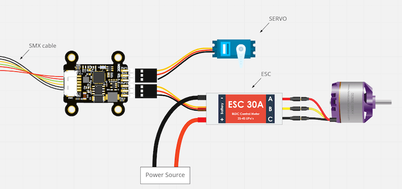
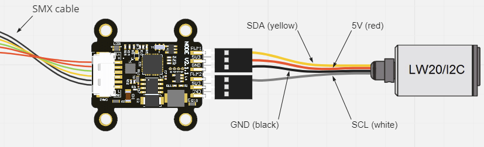

# RaccoonLab Mini/Micro Nodes

Mini/Micro are general purpose CAN nodes. The functionality of these devices depends on the firmware they are running.
The default and most popular usage is as a PWM-CAN adapter to control ESCs and servos using CAN (Cyphal or DroneCAN) communication:

- Micro is the smallest node with 2 groups of pins (PWM/5V/GND) to control 2 servos or ESCs.
- Mini v2: Features 2 x PWM/5V/GND for controlling servos or ESCs and 2 x PWM/FB/GND for controlling and receiving feedback from ESCs via UART.

## Cyphal/DroneCAN CAN-PWM Adapter Firmware

_Cyphal/DroneCAN CAN-PWM_ firmwares are the default for Mini and Micro nodes.
These convert a typical PX4 CAN setpoint to PWM for controlling ESCs or servos.

Please refer to the corresponding RaccoonLab docs pages for details: [Cyphal/CAN-PWM](https://docs.raccoonlab.co/guide/can_pwm/cyphal.html), [DroneCAN-PWM](https://docs.raccoonlab.co/guide/can_pwm/dronecan.html).

## Cyphal & DroneCAN Rangefinder Firmware

The _Cyphal & DroneCAN Rangefinder_ firmware is a single firmware that can work in either Cyphal or DroneCAN mode.
It supports LW20/I2C, Garmin Lite v3/I2C and TL-Luna/UART lidars.
For details, please check the [Rangefinder](https://docs.raccoonlab.co/guide/can_pwm/rangefinder.html) page.

## DroneCAN Fuel Sensor Firmware

_DroneCAN fuel tank_ firmware is based on the [AS5600 sensor board](https://docs.raccoonlab.co/guide/as5600/).
Please refer to [DroneCAN Fuel Tank](https://docs.raccoonlab.co/guide/can_pwm/fuel_tank.html) for details.

## DroneCAN Servo Gripper Firmware

_DroneCAN servo gripper_ is part of a [Mini Node Template Application](https://github.com/RaccoonlabDev/mini_v2_node).
Please refer to [DroneCAN Servo Gripper](https://docs.raccoonlab.co/guide/can_pwm/servo_gripper.html) for details.

## Custom Firmware

**Custom firmware** can be developed by anyone.
If you require custom features, you can use the [Mini Node Template Application](https://github.com/RaccoonlabDev/mini_v2_node).
You can configure the external pins to work in UART, I2C or ADC mode.
From the box, it supports basic Cyphal/DroneCAN features.
It has publishers and subscribers as an example.

## Which node to choose?

The differences between [Mini v2](https://docs.raccoonlab.co/guide/can_pwm/can_pwm_mini_v2.html) and [Micro](https://docs.raccoonlab.co/guide/can_pwm/can_pwm_micro.html) are summarized in the table below.
For more details, please refer to the corresponding pages.

|   |                 | Mini v2                                   | Micro                                       |
| - | --------------- | ----------------------------------------- | ------------------------------------------- |
|   | Зображення      | ![RaccoonLab Mini v2 Node][Mini v2 Node]  | ![RaccoonLab Micro Node][Micro Node]        |
| 1 | Вхідна напруга  | 5.5V – 30V                | 4.5V – 5.5V |
| 2 | DC-DC           | Так                                       | Ні                                          |
| 3 | Groups of pins  | - PWM+5V+GND x2   - PWM+FB+GND x2     | - PWM+5V+GND x2                             |
| 4 | CAN connectors  | - UCANPHY Micro x2   - 6-pin Molex x2 | - UCANPHY Micro x2                          |
| 5 | SWD interface   | +                                         | +                                           |
| 6 | Size, LxWxH, mm | 42x35x12                                  | 20x10x5                                     |
| 7 | Mass, g         | 5                                         | 3                                           |

[Mini v2 Node]: ../../assets/hardware/can_nodes/raccoonlab_mini_node.png
[Micro Node]: ../../assets/hardware/can_nodes/raccoonlab_micro_node.png

## Де купити

[RaccoonLab Store](https://raccoonlab.co/store)

[Cyphal store](https://cyphal.store/search?q=raccoonlab)
