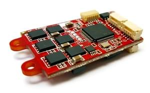
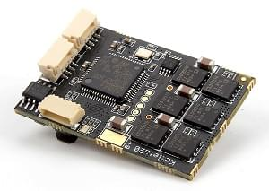
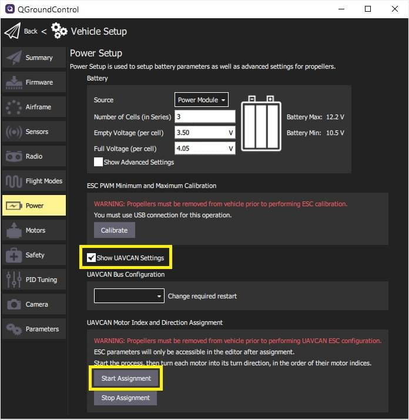

# Прошивка Sapog ESC

[Sapog](https://github.com/PX4/sapog#px4-sapog) firmware is an advanced open source sensorless PMSM/BLDC motor controller firmware designed for use in propulsion systems of electric unmanned vehicles.

While it can be controlled using traditional PWM input, it is designed to operate over CAN bus using [DroneCAN](index.md).

## Де купити

Декілька постачальників продають апаратне забезпечення ESC, яке працює на прошивці sapog:

- [Zubax Orel 20](https://zubax.com/products/orel_20)
- [Holybro Kotleta20](https://holybro.com/products/kotleta20)

<style>
#image_container {
  height: 100%;
  width: 100%;
  display: flex;
}
.image_column {
  width: 33%;
  text-align: center;
}

</style>

<div id="image_container">
  <div class="image_column">
  
  <br><a href="https://zubax.com/products/orel_20">Zubax Orel 20</a>
  </div>
  <div class="image_column">
    
    <br><a href="https://holybro.com/products/kotleta20">Holybro Kotleta20</a>
  </div>
</div>

## Налаштування програмного забезпечення

ESCs підключені до шини CAN за допомогою стандартного кабелю Pixhawk 4 pin JST GH.
For more information, refer to the [CAN Wiring](../can/index.md#wiring) instructions.
Порядок ESC не має значення.

## Налаштування прошивки

ESCs поставляються з встановленою заздалегідь ​​сбіркою Sapog. Якщо ви хочете оновити:

Збірка прошивки:

```sh
git clone --recursive https://github.com/PX4/sapog
cd sapog/firmware
make RELEASE=1
```

This will create a file `*.application.bin`. in `build/`.
Цей бінарний файл може бути прошитий через автопілот по DroneCAN через завантажувальник sapog.
See [DroneCAN Firmware Update](index.md#firmware-update).

Refer to the [project page](https://github.com/PX4/sapog) to learn more, including how to flash without using the DroneCAN bootloader (i.e. on a not-yet-programmed device) or for development.

## Налаштування польотного контролера

### Увімкнення DroneCAN

Підключіть ESC до шини CAN Pixhawk. Power up the entire vehicle using a battery or power supply (not just the flight controller over USB) and enable the DroneCAN driver by setting the parameter [UAVCAN_ENABLE](../advanced_config/parameter_reference.md#UAVCAN_ENABLE) to '3' to enable both dynamic node ID allocation and DroneCAN ESC output.

### Автоматичне перерахування кодів ESC за допомогою QGroundControl

This section shows how to enumerate any [Sapog-based](https://github.com/PX4/sapog#px4-sapog)-based ESCs "automatically" using _QGroundControl_.

:::tip
You can skip this section if there is only one ESC in your setup, because the ESC index is already set to zero by default.
:::

Для переліку ESC:

1. Power the vehicle with a battery and connect to _QGroundControl_

2. Navigate to **Vehicle Setup > Power** in QGC.

3. Start the process of ESC auto-enumeration by pressing the **Start Assignment** button, as shown on the screenshot below.

  

  Ви почуєте звук, що вказує на те, що керування польотом увійшло в режим переліку ESC.

4. Manually turn each motor in the correct direction of its rotation (as specified in the [Airframe Reference](../airframes/airframe_reference.md)), starting from the first motor and finishing with the last motor.
  Кожного разу, коли ви ввімкнете мотор, ви повинні почути підтвердний сигнал.

  ::: info
  Make sure to turn each of the motors in the correct direction, as the ESC will automatically learn and remember the direction (i.e. motors that spin clockwise during normal operation must also be turned clockwise during enumeration).

:::

5. Після того, як останній двигун перелічено, звук підтвердження повинен змінитися, щоб показати, що процедура переліку завершена.

6. Перезавантажте PX4 та Sapog ESC, щоб застосувати нові ідентифікатори переліку.

Наступне відео демонструє процес:

<lite-youtube videoid="4nSa8tvpbgQ" title="Zubax Orel 20 with PX4 Flight Stack - Auto-enumeration"/>

### Ручне перерахування ESC за допомогою Sapog

:::tip
We recommend automated [Sapog ESC Enumeration using QGroundControl](#automatic-esc-enumeration-using-qgroundcontrol) shown above rather than manual enumeration (as it is easier and safer).
:::

You can manually configure the ESC index and direction using the [DroneCAN GUI Tool](https://dronecan.github.io/GUI_Tool/Overview/).
Це надає наступні параметри конфігурації Sapog для кожного переліченого ESC:

- `esc_index`
- `ctl_dir`

:::info
See [Sapog reference manual](https://files.zubax.com/products/io.px4.sapog/Sapog_v2_Reference_Manual.pdf) for more information about the parameters.
:::

### Конфігурація PX4

Assign motors to outputs using the [Acutator](../config/actuators.md#actuator-testing) configuration screen.

## Усунення проблем

See [DroneCAN Troubleshooting](index.md#troubleshooting)

## Подальша інформація

- [PX4/Sapog](https://github.com/PX4/sapog#px4-sapog) (Github)
- [Sapog v2 Reference Manual](https://files.zubax.com/products/io.px4.sapog/Sapog_v2_Reference_Manual.pdf)
- [Using Sapog based ESC with PX4](https://kb.zubax.com/display/MAINKB/Using+Sapog-based+ESC+with+PX4) (Zubax KB)
