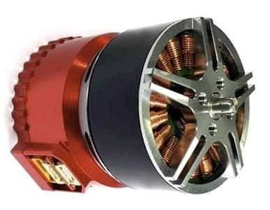

# Zubax Telega ESCs

Zubax Telega - це високотехнологічна, власна технологія бездатчикового керування двигуном FOC.
It is used in multiple products, including the [Zubax Myxa](https://shop.zubax.com/products/zubax-myxa) ESC, [Zubax Mitochondrik](https://shop.zubax.com/products/mitochondrik) motor controller module, and Zubax Sadulli integrated drive.

While Telega can be controlled using traditional PWM input, it is designed to operate over CAN bus using [DroneCAN](index.md).

:::info
ESCs based on Zubax Telega require non-trivial tuning of the propulsion system in order to deliver adequate performance and ensure robust operation.
Users who lack the necessary tuning expertise are advised to either [purchase pre-tuned UAV propulsion kits](https://zubax.com/products#electric-drives) or to use Zubax Robotic's professional tuning service.
Questions on this matter should be addressed to: [support@zubax.com](mailto:support@zubax.com).
:::

## Де купити

- [Zubax AmpDrive AD0505A/B "Myxa" ESC](https://shop.zubax.com/products/zubax-myxa): High-end PMSM/BLDC motor controller (FOC ESC) for light unmanned aircraft and watercraft.
- [Zubax BoolDrive BD1D50 "Mitochondrik"](https://shop.zubax.com/products/mitochondrik): Integrated sensorless PMSM/BLDC motor controller chip (used in ESCs and integrated drives)
- [Zubax AmpDrive AD0510 "Komar" ESC](https://shop.zubax.com/products/zubax-ad0510-komar-esc): Open hardware reference design for Mitochondrik

## Налаштування програмного забезпечення

ESCs підключені до шини CAN за допомогою стандартного кабелю Pixhawk 4 pin JST GH.
For more information, refer to the [CAN Wiring](../can/index.md#wiring) instructions. Порядок ESC не має значення.

## Налаштування прошивки

Motor enumeration for [Telega-based ESCs](https://telega.zubax.com/) is usually performed using the [Kucher tool](https://files.zubax.com/products/com.zubax.kucher/) (or less "GUI-friendly" [DroneCAN GUI Tool](https://dronecan.github.io/GUI_Tool/Overview/)).
Telega НЕ підтримує автоматичне перелічення, приводячи в рух двигун.

There is some guidance here: [Quick start guide for Myxa v0.1](https://forum.zubax.com/t/quick-start-guide-for-myxa/911) (Zubax blog).

Також для надійної продуктивності регулятори швидкості Telega потребують іншої налаштування та конфігурації двигуна. Дивіться вищезазначений посібник та іншу документацію Zubax для отримання додаткової інформації.

## Налаштування польотного контролера

### Увімкнути DroneCAN

Підключіть ESC до шини CAN Pixhawk. Power up the entire vehicle using a battery or power supply (not just the flight controller over USB) and enable the DroneCAN driver by setting the parameter [UAVCAN_ENABLE](../advanced_config/parameter_reference.md#UAVCAN_ENABLE) to `3` to enable both dynamic node ID allocation and DroneCAN ESC output.

### Конфігурація PX4

Assign motors to outputs using the [Acutator](../config/actuators.md#actuator-testing) configuration screen.

## Усунення проблем

### Двигуни не крутяться під час увімкнення

If the PX4 Firmware arms but the motors do not start to rotate, check that parameter `UAVCAN_ENABLE=3` to use DroneCAN ESCs.
If the motors do not start spinning before thrust is increased, use [Acutator > Actuator Testing](../config/actuators.md#actuator-testing) to confirm that the motor outputs are set to the correct minimum values.

### Пристрої DroneCAN не отримують ідентифікатор вузла/Оновлення прошивки не вдається

PX4 вимагає SD-карту для виділення вузла DroneCAN та під час оновлення вбудованого програмного забезпечення (яке відбувається під час завантаження).
Перевірте, що вставлена (працююча) SD-карта присутня і перезавантажте пристрій.
