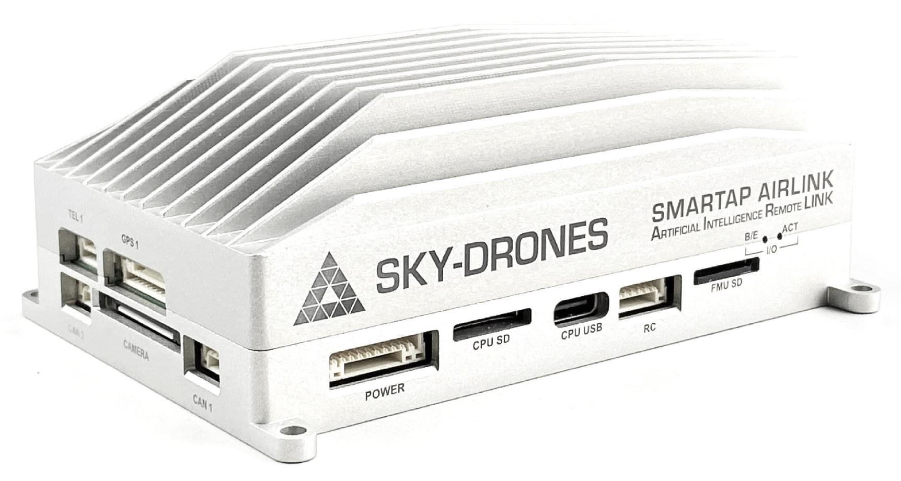
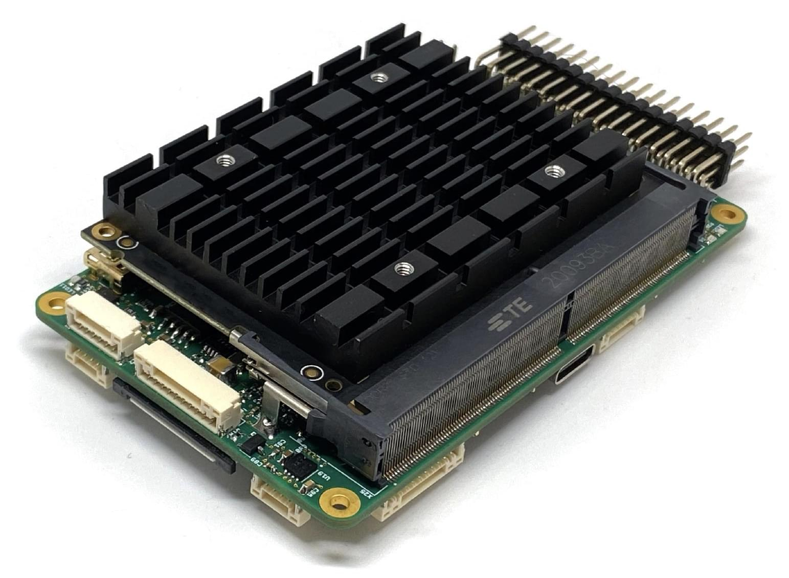
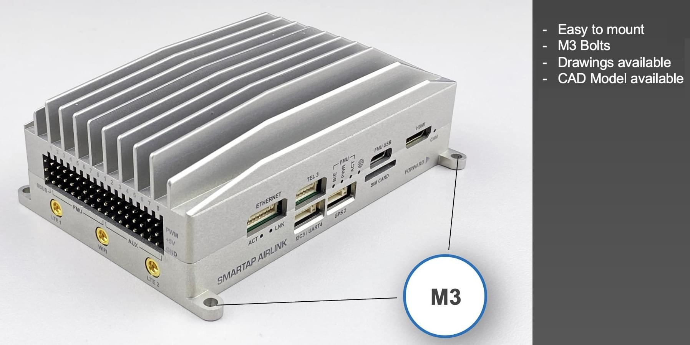
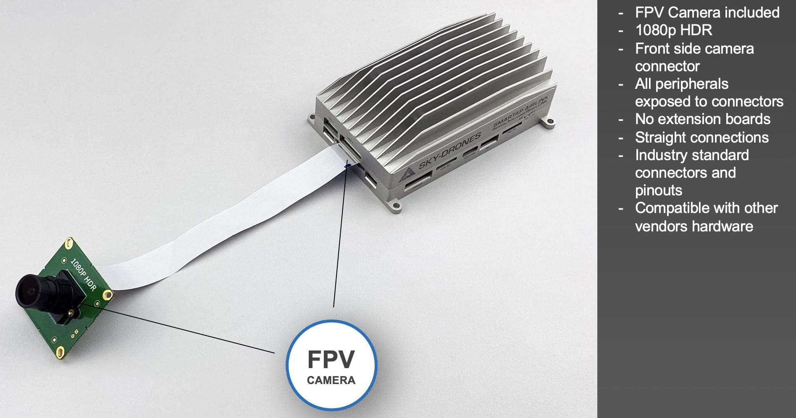
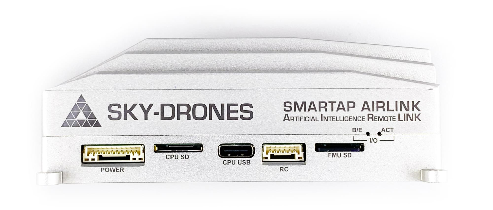
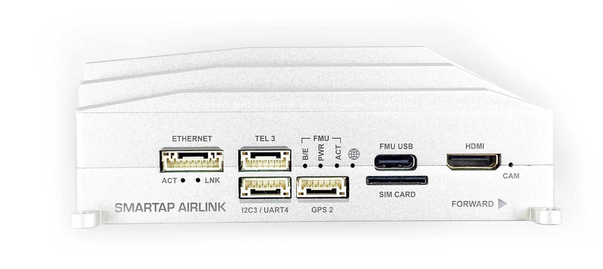
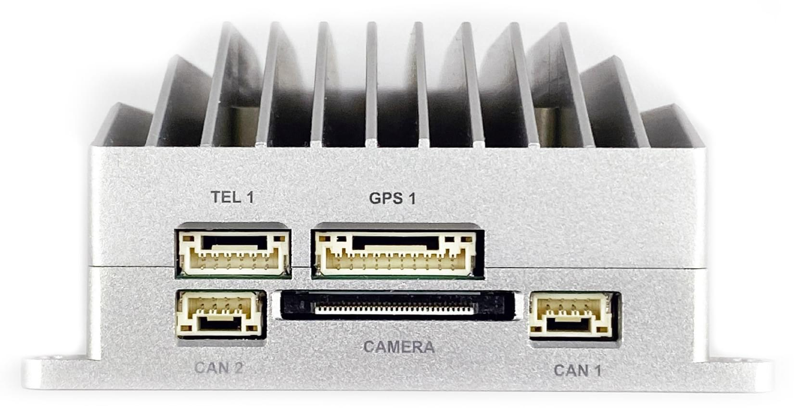
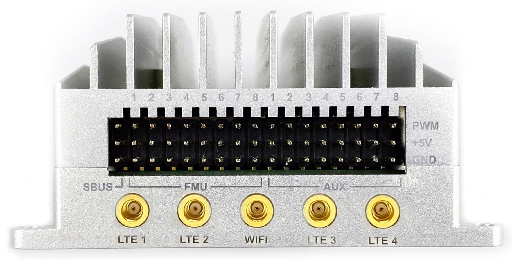
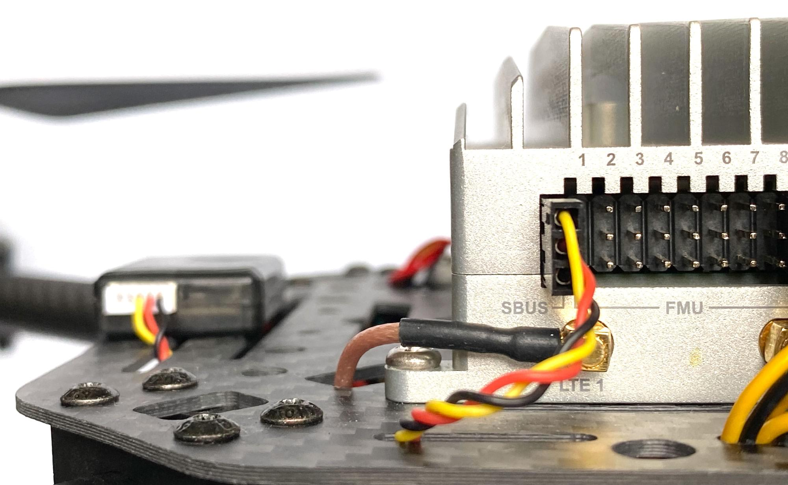
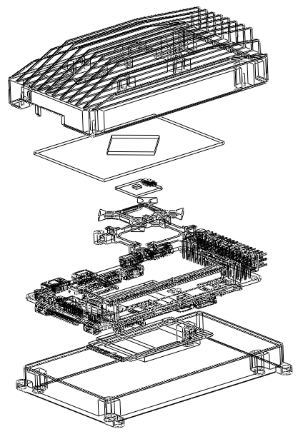

# Sky-Drones AIRLink

:::warning
PX4 не розробляє цей (або будь-який інший) автопілот.
Contact the [manufacturer](https://sky-drones.com/) for hardware support or compliance issues.
:::

[AIRLink](https://sky-drones.com/airlink) stands for Artificial Intelligence & Remote Link. Апарат складається з найсучаснішого автопілота безпілотника, комп'ютера зі штучним інтелектом та блоку зв'язку LTE/5G. AIRLink допомагає скоротити час виходу на ринок для нових виробників дронів з років і місяців до тижнів.


:::info
This flight controller is [manufacturer supported](../flight_controller/autopilot_manufacturer_supported.md).
:::

AIRLink має два комп'ютери та інтегрований LTE-модуль:

- Комп'ютер керування польотом (автопілот) має потрійне резервування з вібро- та термостабілізованим IMU.
- Потужний місійний комп'ютер зі штучним інтелектом забезпечує такі передові функції програмного забезпечення безпілотника, як комп'ютерний зір і оминання перешкод, потокове передавання цифрового відео високої чіткості та потокове передавання даних корисного вантажу.
- Модулі зв'язку LTE/5G та WiFi забезпечують постійне широкосмугове підключення до Інтернету, що дозволяє здійснювати віддалені робочі процеси.

## Основні характеристики

<lite-youtube videoid="VcBx9DLPN54" title="SmartAP AIRLink - The Most Advanced AI Drone Avionics"/>

## Характеристики

- **Sensors**

  - 3x акселерометри, 3x гіроскопи, 3x магнітометри, 3x датчики тиску
  - ГНСС, далекоміри, лідари, оптичний потік, камери
  - 3x-кратне резервування IMU
  - Гасіння вібрації
  - Стабілізація температури

- **Flight Controller**

  - STM32F7, ARM Cortex M7 з FPU, 216 МГц, 2 МБ Flash, 512 кБ оперативної пам'яті
  - STM32F1, співпроцесор вводу/виводу (IO)
  - Ethernet, 10/100 Мбіт/с
  - Локальна мережа з комп'ютером місії зі штучним інтелектом
  - 8x UART: Телеметрія 1, Телеметрія 2 ( місійний комп'ютер зі ШІ), Телеметрія 3, GPS 1, GPS 2, додатковий UART, послідовна консоль налагодження, ввід-вивід (IO)
  - 2x CAN: CAN1, CAN2
  - USB з MAVLink
  - Послідовна консоль для відладки
  - Вхід RC, вхід SBUS, вхід RSSI, вхід PPM
  - 16x PWM виходів сервоприводів (8 з IO, 8 з FMU)
  - 3x I2C порти
  - Потужний драйвер п'єзо-зуммера
  - Високопотужний RGB LED
  - Запобіжний вимикач / LED опція

- **AI Mission Computer**

  - 6-ядерний процесор: двоядерний Cortex-A72 + чотирьохядерний Cortex-A53
  - Графічний процесор Mali-T864, OpenGL ES1.1/2.0/3.0/3.1
  - VPU з декодуванням 4K VP8/9, 4K 10bits H265/H264 60fps
  - Дистанційне керування живленням, скидання програмного забезпечення, вимкнення живлення, пробудження RTC, сплячий режим
  - Оперативна пам'ять Dual Channel 4GB LPDDR4
  - 16GB eMMC
  - MicroSD до 256 Гб
  - Ethernet 10/100/1000 Native Gigabit
  - WiFi 802.11a/b/g/n/ac, Bluetooth
  - USB 3.0 Type C
  - 2х Video: 4-смугова MIPI CSI (FPV-камера) та 4-смугова MIPI CSI з входом HMDI (камера корисного навантаження)

- **LTE/5G Connectivity Module**

  - Пропускна здатність до 600 Мбіт/с
  - 5G sub-6 і mmWave, SA і NSA операції
  - 4G Cat 20, до 7xCA, 256-QAM DL/UL, 2xCA UL
  - 4 x 4 MIMO для 4G і 5G (до 6 діапазонів)
  - 3G HSPA+
  - Схвалено JRL/JTBL, FCC, PTCRB, RED, GCF
  - Антена, 4x4 MIMO
  - Bands: Worldwide

## Де купити

Купуйте в оригінальному магазині Sky-Drones (доставка по всьому світу з обробкою замовлення за 1-2 дні):

- [Buy AIRLink Enterprise 4G](https://sky-drones.com/sets/airlink-enterprise-set.html)
- [Buy AIRLink Enterprise 5G](https://sky-drones.com/sets/airlink-5g-enterprise-set.html)
- [Buy AIRLink Core 4G](https://sky-drones.com/autopilots/airlink-core.html)
- [Buy AIRLink Core 5G](https://sky-drones.com/store/airlink-5g-core.html)

## Аксесуари до AIRLink Enterprise Kit

<lite-youtube videoid="lex7axW8WQg" title="SmartAP AIRLink - Unboxing"/>

AIRLink Enterprise прибуває з усім необхідним для налаштування автопілота.

Стандартний набір містить:

- 1x AIRLink Enterprise unit
- 1x FPV камера з CSI кабелем
- 1x WiFi антена з роз'ємом MMCX
- 2x/4x LTE/5G антена з роз'ємом MMCX
- 1x кабель HDMI на міні HDMI
  1x набір кабелів (7 кабелів для всіх роз'ємів)

[AIRLink Telemetry](https://sky-drones.com/sets/airlink-telemetry-set.html) based on the Microhard LAN/IP-based RF micromodule is available as an add-on and is fully compatible with AIRLink.

## Видання

There are AIRLink editions that offer different integration levels required by drone manufacturers: _Enterprise_ and _Core_.
AIRLink Enterprise ідеально підходить для швидкого старту, оцінки та створення прототипів, тоді як Core оптимізовано для глибокої інтеграції та середньо- і крупносерійного виробництва.

**AIRLink Enterprise**

Корпоративна версія SmartAP AIRLink призначена для створення прототипів та виробництва дронів у малих та середніх обсягах.
Швидкий і простий процес підключення завдяки спеціальним монтажним отворам і вбудованому тепловідводу для розсіювання енергії.



**AIRLink Core**

Версія SmartAP AIRLink Core призначена для середніх і великих обсягів виробництва та глибокої інтеграції з обладнанням замовника. Він важить лише 89 г і може бути прикріплений до металевої рами для оптимального охолодження.



| Параметр               | AIRLink Enterprise                                                                               | AIRLink Core                                                                                                |
| ---------------------- | ------------------------------------------------------------------------------------------------ | ----------------------------------------------------------------------------------------------------------- |
| Корпус                 | Алюмінієвий, з інтегрованим тепловідводом і можливістю встановлення вентилятора. | Зовнішній тепловідвід або достатнє розсіювання тепла повинно бути передбачено конструкцією. |
| Розміри                | Д103 x Ш61 x В37 мм                                                                              | Д100 x Ш57 x В22 мм                                                                                         |
| Вага                   | 198 г                                                                                            | 89 г                                                                                                        |
| Температура середовища | -40°C-..+50°C                                                    | -40°C-..+50°C                                                               |

## Основні характеристики

- **Easy to mount**

  

- **FPV camera comes as standard**

  

## Інтерфейси

### Лівий бік



- **Left side interfaces:**

  - Power input with voltage & current monitoring
  - Місійний комп'ютер зі ШІ з картою пам'яті micro SD
  - Карта micro SD для польотного контролера
  - Місійний комп'ютер зі ШІ USB Type-C
  - Вхід PPM, вихід SBUS, монітор RSSI

- **POWER - JST GH SM10B-GHS-TB**

  | Номер виводу | Назва виводу                     | Напрямок | Напруга               | Функція                        |
  | ------------ | -------------------------------- | -------- | --------------------- | ------------------------------ |
  | 1            | 12V                              | IN       | +12V                  | Основний вхід живлення         |
  | 2            | 12V                              | IN       | +12V                  | Основний вхід живлення         |
  | 3            | 12V                              | IN       | +12V                  | Основний вхід живлення         |
  | 4            | BAT_CURRENT | IN       | +3.3V | Моніторинг струму акумулятора  |
  | 5            | BAT_VOLTAGE | IN       | +3.3V | Моніторинг напруги акумулятора |
  | 6            | 3V3                              | OUT      | +3.3V | Вихід 3.3В     |
  | 7            | PWR_KEY     | IN       | +3.3V | Вхід клавіші живлення          |
  | 8            | GND                              | Ground   |                       |                                |
  | 9            | GND                              | Ground   |                       |                                |
  | 10           | GND                              | Ground   |                       |                                |

- **CPU SD card - microSD**

- **CPU USB - USB Type C**

- **RC Connector - JST GH SM06B-GHS-TB**

  | Номер виводу | Назва виводу                  | Напрямок | Напруга               | Функція           |   |     |        |
  | ------------ | ----------------------------- | -------- | --------------------- | ----------------- | - | --- | ------ |
  | 1            | 5V                            | OUT      | +5V                   | Вихід 5В          |   |     |        |
  | 2            | PPM_IN   | IN       | +3.3V | PPM вхід          |   |     |        |
  | 3            | RSSI_IN  | IN       | +3.3V | RSSI вхід         |   |     |        |
  | 4            | FAN_OUT  | OUT      | +5V                   | Вихід вентилятора |   |     |        |
  | 5            | SBUS_OUT | OUT      | +3.3V | SBUS output       | 6 | GND | Ground |

* **FMU SD card - microSD**

### Правий бік



- **Right side interfaces:**

  - Ethernet-порт з виходом живлення
  - Телеметричний порт
  - Другий GPS-порт
  - Запасний порт I2C / UART
  - Польотний контролер USB Type-C
  - Мікро SIM-карта
  - Вхідний порт HDMI (камера корисного навантаження)

- **ETHERNET - JST GH SM08B-GHS-TB**

  | Номер виводу | Назва виводу                 | Напрямок | Напруга               | Функція                                |
  | ------------ | ---------------------------- | -------- | --------------------- | -------------------------------------- |
  | 1            | 5V                           | OUT      | +5V                   | Блок живлення радіомодуля              |
  | 2            | 5V                           | OUT      | +5V                   | Блок живлення радіомодуля              |
  | 3            | ETH_TXP | OUT      | +3.3V | Передача позитивного сигналу Ethernet  |
  | 4            | ETH_TXN | OUT      | +3.3V | Передача негативного сигналу Ethernet  |
  | 5            | ETH_RXP | IN       | +3.3V | Отримання позитивного сигналу Ethernet |
  | 6            | ETH_RXN | IN       | +3.3V | Отримання негативного сигналу Ethernet |
  | 7            | GND                          | Ground   |                       |                                        |
  | 8            | GND                          | Ground   |                       |                                        |

- **TEL3 - JST GH SM06B-GHS-TB**

  | Номер виводу | Назва виводу                    | Напрямок | Напруга               | Функція                |
  | ------------ | ------------------------------- | -------- | --------------------- | ---------------------- |
  | 1            | 5V                              | OUT      | +5V                   | Вихід джерела живлення |
  | 2            | USART2_TX  | OUT      | +3.3V | Телеметрія 3 TX        |
  | 3            | USART2_RX  | IN       | +3.3V | Телеметрія 3 RX        |
  | 4            | USART2_CTS | IN       | +3.3V | Телеметрія 3 CTS       |
  | 5            | USART2_RTS | OUT      | +3.3V | Телеметрія 3 RTS       |
  | 6            | GND                             | Ground   |                       |                        |

- **I2C3 / UART4 - JST GH SM06B-GHS-TB**

  | Номер виводу | Назва виводу                   | Напрямок | Напруга               | Функція                |
  | ------------ | ------------------------------ | -------- | --------------------- | ---------------------- |
  | 1            | 5V                             | OUT      | +5V                   | Вихід джерела живлення |
  | 2            | USART4_TX | OUT      | +3.3V | UART 4 TX              |
  | 3            | USART4_RX | IN       | +3.3V | UART 4 RX              |
  | 4            | I2C3_SCL  | I/O      | +3.3V | Годинник I2C3          |
  | 5            | I2C3_SDA  | I/O      | +3.3V | Дані I2C3              |
  | 6            | GND                            | Ground   |                       |                        |

- **GPS2 - JST GH SM06B-GHS-TB**

  | Номер виводу | Назва виводу                   | Напрямок | Напруга               | Функція                |
  | ------------ | ------------------------------ | -------- | --------------------- | ---------------------- |
  | 1            | 5V                             | OUT      | +5V                   | Вихід джерела живлення |
  | 2            | USART8_TX | OUT      | +3.3V | UART 8 TX              |
  | 3            | USART8_RX | IN       | +3.3V | UART 8 RX              |
  | 4            | I2C2_SCL  | I/O      | +3.3V | Годинник I2C2          |
  | 5            | I2C2_SDA  | I/O      | +3.3V | Дані I2C2              |
  | 6            | GND                            | Ground   |                       |                        |

- **FMU USB - USB Type C**

- **SIM Card - micro SIM**

- **HDMI - mini HDMI**

### Лицьова сторона



- **Front side interfaces:**

  - Основний порт GNSS і компаса
  - Основний телеметричний порт
  - Вхід для камери CSI
  - CAN 1
  - CAN 2

- **TEL1 - JST GH SM06B-GHS-TB**

  | Номер виводу | Назва виводу                    | Напрямок | Напруга               | Функція                |
  | ------------ | ------------------------------- | -------- | --------------------- | ---------------------- |
  | 1            | 5V                              | OUT      | +5V                   | Вихід джерела живлення |
  | 2            | USART7_TX  | OUT      | +3.3V | Телеметрія 1 TX        |
  | 3            | USART7_RX  | IN       | +3.3V | Телеметрія 1 RX        |
  | 4            | USART7_CTS | IN       | +3.3V | Телеметрія 1 CTS       |
  | 5            | USART7_RTS | OUT      | +3.3V | Телеметрія 1 RTS       |
  | 6            | GND                             | Ground   |                       |                        |

- **GPS1 - JST GH SM10B-GHS-TB**

  | Номер виводу | Назва виводу                    | Напрямок | Напруга               | Функція                    |
  | ------------ | ------------------------------- | -------- | --------------------- | -------------------------- |
  | 1            | 5V                              | OUT      | +5V                   | Вихід джерела живлення     |
  | 2            | USART1_TX  | OUT      | +3.3V | GPS 1 TX                   |
  | 3            | USART1_RX  | IN       | +3.3V | GPS 1 RX                   |
  | 4            | I2C1_SCL   | I/O      | +3.3V | Годинник Mag 1             |
  | 5            | I2C1_SDA   | I/O      | +3.3V | Дані Mag 1                 |
  | 6            | SAFETY_BTN | IN       | +3.3V | Кнопка безпеки             |
  | 7            | SAFETY_LED | OUT      | +3.3V | Індикатор безпеки          |
  | 8            | +3V3                            | OUT      | +3.3V | Вихід 3.3В |
  | 9            | BUZZER                          | OUT      | +5V                   | Вихід зумера               |
  | 10           | GND                             | Ground   |                       |                            |

- **CAN1 - JST GH SM04B-GHS-TB**

  | Номер виводу | Назва виводу                | Напрямок | Напруга | Функція                              |
  | ------------ | --------------------------- | -------- | ------- | ------------------------------------ |
  | 1            | 5V                          | OUT      | +5V     | Вихід джерела живлення               |
  | 2            | CAN1_H | I/O      | +5V     | CAN 1 High (120Ω) |
  | 3            | CAN1_L | I/O      | +5V     | CAN 1 Low (120Ω)  |
  | 4            | GND                         | Ground   |         |                                      |

- **CAN2 - JST GH SM04B-GHS-TB**

  | Номер виводу | Назва виводу                | Напрямок | Напруга | Функція                              |
  | ------------ | --------------------------- | -------- | ------- | ------------------------------------ |
  | 1            | 5V                          | OUT      | +5V     | Вихід джерела живлення               |
  | 2            | CAN2_H | I/O      | +5V     | CAN 2 High (120Ω) |
  | 3            | CAN2_L | I/O      | +5V     | CAN 2 Low (120Ω)  |
  | 4            | GND                         | Ground   |         |                                      |

- **CAMERA - FPC 30 pin, 0.5mm pitch**

### Задня сторона



- **Rear side interfaces:**

  - Вхід SBUS
  - 16 вихідних каналів ШІМ
  - 2 гнізда для антен LTE (MIMO)
  - WiFi antenna socket (AP & Station modes)

# Серійне мапування

AIRLink має велику кількість внутрішніх і зовнішніх послідовних портів:

| Серія   | UART    | Функція                                                                       |
| ------- | ------- | ----------------------------------------------------------------------------- |
| Серія 0 | USB     | Консоль                                                                       |
| Серія 1 | UART 7  | Телеметрія 1                                                                  |
| Серія 2 | UART 5  | Телеметрія 2 (використовується всередині комп'ютера місії) |
| Серія 3 | USART 1 | GPS 1                                                                         |
| Серія 4 | UART 8  | GPS 2                                                                         |
| Серія 5 | USART 3 | Консоль відладки (внутрішній роз'єм)                       |
| Серія 6 | USART 2 | Телеметрія 3                                                                  |
| Серія 7 | UART 4  | Зовнішній UART                                                                |

## RC-вхід

RC-вхід конфігурується на виводі SBUS і підключається до IO MCU через внутрішній інвертор.
Для PPM-приймачів, будь ласка, використовуйте штифт PPM роз'єму RC, розташований на лівій стороні пристрою.



## Виводи

AIRLink має 16 ШІМ-виходів. Основні виходи 1-8 і підключені до IO MCU. Виходи AUX 1-8 підключено до FMU.

| Output | Таймер   | Канал     |
| ------ | -------- | --------- |
| AUX 1  | Timer 1  | Channel 4 |
| AUX 2  | Timer 1  | Channel 3 |
| AUX 3  | Timer 1  | Channel 2 |
| AUX 4  | Timer 1  | Channel 1 |
| AUX 5  | Timer 4  | Channel 2 |
| AUX 6  | Timer 4  | Channel 3 |
| AUX 7  | Timer 12 | Channel 1 |
| AUX 8  | Timer 12 | Channel 2 |

[DShot](../peripherals/dshot.md) can be used on the first four AUX pins.

## Збірка прошивки

:::tip
Most users will not need to build this firmware!
It is pre-built and automatically installed by _QGroundControl_ when appropriate hardware is connected.
:::

To [build PX4](../dev_setup/building_px4.md) for this target:

```
make sky-drones_smartap-airlink
```

## Периферійні пристрої

- [SmartAP GPS](../gps_compass/gps_smartap.md) - GPS module with compass, pressure sensor and RGB LED
- [SmartAP PDB](../power_module/sky-drones_smartap-pdb.md) - Power Distribution Board

## Еталонний проєкт



AIRLink CAD model is available [here](https://docs.sky-drones.com/airlink/cad-model)

Еталонний дизайн AIRLink може бути наданий за запитом.
Get in touch at [Sky-Drones contact page](https://sky-drones.com/contact-us)

## Докладніше

For more information and instructions on setting up and using the AIRLink system see [AIRLink Documentation](https://docs.sky-drones.com/airlink/).

For technical help, support and customization please get in touch at [Sky-Drones contact page](https://sky-drones.com/contact-us).

More information can be found at [www.sky-drones.com](https://sky-drones.com).

Frequently asked questions are answered in [FAQ](https://docs.sky-drones.com/airlink/faq).

## Корисні посилання

- [AIRLink product page](https://sky-drones.com/airlink)
- [AIRLink documentation](https://docs.sky-drones.com/avionics/airlink)
- [AIRLink datasheet](https://3182378893-files.gitbook.io/~/files/v0/b/gitbook-x-prod.appspot.com/o/spaces%2F-MTMlWysgDtJq8Hid1v7%2Fuploads%2F8AiuNNSwLYnZSscj7uIV%2FAIRLink-Datasheet.pdf?alt=media&token=cbf0c4bf-9ab1-40c5-a0af-c6babdddb690)
- [Buy AIRLink Enterprise 4G](https://sky-drones.com/sets/airlink-enterprise-set.html)
- [Buy AIRLink Enterprise 5G](https://sky-drones.com/sets/airlink-5g-enterprise-set.html)
- [Buy AIRLink Core 4G](https://sky-drones.com/autopilots/airlink-core.html)
- [Buy AIRLink Core 5G](https://sky-drones.com/store/airlink-5g-core.html)
