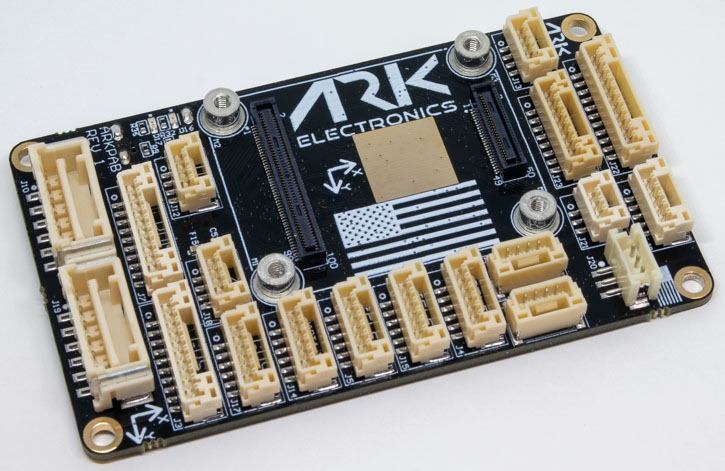
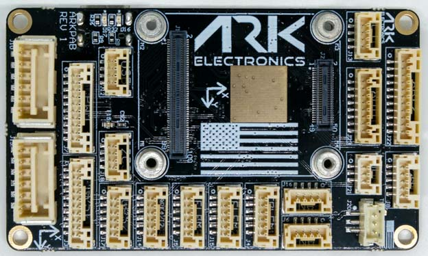
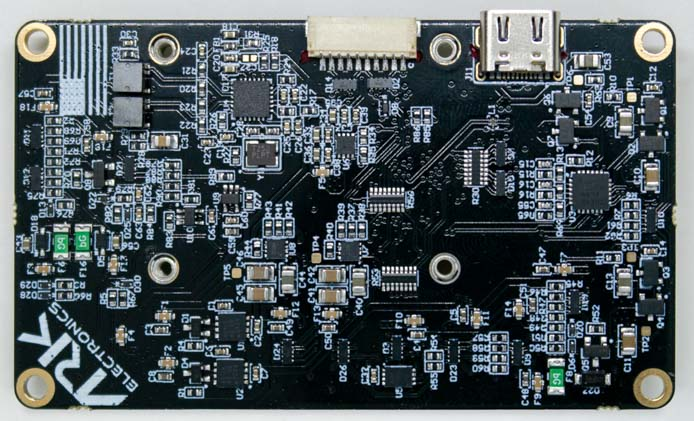

# ARK Pixhawk Autopilot Bus Carrier

:::warning
PX4 не розробляє цей (або будь-який інший) автопілот.
Contact the [manufacturer](https://arkelectron.com/contact-us/) for hardware support or compliance issues.
:::

The [ARK Pixhawk Autopilot Bus (PAB) Carrier](https://arkelectron.gitbook.io/ark-documentation/flight-controllers/ark-pixhawk-autopilot-bus-carrier) is a USA-built flight controller carrier board, based on the [Pixhawk Autopilot Bus open source standard](https://github.com/pixhawk/Pixhawk-Standards).

The PAB form factor enables the ARK PAB Carrier to be used with any [PAB-compatible flight controller](../flight_controller/pixhawk_autopilot_bus.md), such as the [ARKV6X](../flight_controller/ark_v6x.md).

### Де купити

Order From [Ark Electronics](https://arkelectron.com/product/ark-pixhawk-autopilot-bus-carrier/) (US)

## Функції

- [Pixhawk Autopilot Bus (PAB) Form Factor](https://github.com/pixhawk/Pixhawk-Standards/blob/master/DS-010%20Pixhawk%20Autopilot%20Bus%20Standard.pdf?_ga=2.20605755.2081055420.1671562222-391294592.1671562222)
- USA Built

## З’єднання

- Інтерфейс PAB Board to Board
  - 100 Pin Hirose DF40
  - 40 Pin Hirose DF40
- Подвійні входи цифрового модуля живлення
  - Вхід 5В
  - Монітор живлення I2C
  - 6-контактний Molex CLIK-Mate
- Ethernet
  - 100Mbps
  - Built in Magnetics
  - 4-контактний JST-GH
- Повноцінний порт перемикача безпеки GPS Plus
  - 10-контактний JST-GH
- Базовий порт GPS
  - 6-контактний JST-GH
- Подвійні CAN порти
  - 4-контактний JST-GH
- Потрійні телеметричні порти з контролем потоку
  - 6-контактний JST-GH
- Вісім ШІМ-виходів
  - 10-контактний JST-GH
- UART/I2C порт
  - 6-контактний JST-GH
- I2C порт
  - 4-контактний JST-GH
- PPM RC порт
  - 3-контактний JST-GH
- DSM RC порт
  - 3-контактний JST-GH
- SPI порт
  - 11-контактний JST-GH
- ADIO порт
  - 8-контактний JST-GH
- Відладочний порт
  - 10-контактний JST-SH

## Розміри

- Без модуля польотного контролера
  - 74.0мм х 43.5мм х 12,0мм
  - 22г

## Power

- 5V input on `POWER1`, `POWER2`, `USB C`, and the `USB JST-GH` connector
  - Input is prioritized in the following order: POWER1 > POWER2 > USB
  - `USB C` and the `USB JST-GH` are in parallel
  - Захист від перенапруги при 5,8 В
  - Захист від зниженої напруги 3,9 В
- `VDD_5V_HIPOWER` and `VDD_5V_PERIPH` can each provide a total of 1.5A across all the connectors

## Cвітлодіоди

- На ARK PAB є два світлодіода
  - `Red` is the ethernet power LED
  - `Green` is the ethernet activity LED

## Схема розташування виводів

## POWER1

| Pin                        | Сигнал                        | Вольтаж               |
| -------------------------- | ----------------------------- | --------------------- |
| 1 (red) | `VBRICK1`                     | +5.0В |
| 2 (blk) | `VBRICK1`                     | +5.0В |
| 3 (blk) | I2C1_SCL | +3.3V |
| 4 (blk) | I2C1_SDA | +3.3V |
| 5 (blk) | `GND`                         | GND                   |
| 6 (blk) | `GND`                         | GND                   |

## POWER2

| Pin                        | Сигнал                        | Вольтаж               |
| -------------------------- | ----------------------------- | --------------------- |
| 1 (red) | `VBRICK2`                     | +5.0В |
| 2 (blk) | `VBRICK2`                     | +5.0В |
| 3 (blk) | I2C2_SCL | +3.3V |
| 4 (blk) | I2C2_SDA | +3.3V |
| 5 (blk) | `GND`                         | GND                   |
| 6 (blk) | `GND`                         | GND                   |

## PWM

| Pin                            | Сигнал                                                             | Вольтаж               |
| ------------------------------ | ------------------------------------------------------------------ | --------------------- |
| 1 (red)     | VDD_SERVO (не підключений) | +5.0В |
| 2 (blk)     | FMU_CH1                                       | +3.3V |
| 3 (blk)     | FMU_CH2                                       | +3.3V |
| 4 (blk)     | FMU_CH3                                       | +3.3V |
| 5 (blk)     | FMU_CH4                                       | +3.3V |
| 6 (blk)     | FMU_CH5                                       | +3.3V |
| 7 (blk)     | FMU_CH6                                       | +3.3V |
| 8 (чорний)  | FMU_CH7                                       | +3.3V |
| 9 (чорний)  | FMU_CH8                                       | +3.3V |
| 10 (чорний) | `GND`                                                              | GND                   |

## GPS1

| Pin                            | Сигнал                                                                                | Вольтаж               |
| ------------------------------ | ------------------------------------------------------------------------------------- | --------------------- |
| 1 (red)     | `VDD_5V_PERIPH`                                                                       | +5.0В |
| 2 (blk)     | USART1_TX_GPS1                              | +3.3V |
| 3 (blk)     | USART1_RX_GPS1                              | +3.3V |
| 4 (blk)     | I2C1_SCL                                                         | +3.3V |
| 5 (blk)     | I2C1_SDA                                                         | +3.3V |
| 6 (blk)     | nSAFETY_SWITCH_IN                           | +3.3V |
| 7 (blk)     | nSAFETY_SWITCH_LED_OUT | +3.3V |
| 8 (чорний)  | `3V3_FMU`                                                                             | +3.3V |
| 9 (чорний)  | BUZZER                                                                                | +5.0В |
| 10 (чорний) | `GND`                                                                                 | GND                   |

## GPS2

| Pin                        | Сигнал                                                  | Вольтаж               |
| -------------------------- | ------------------------------------------------------- | --------------------- |
| 1 (red) | `VDD_5V_HIPOWER`                                        | +5.0В |
| 2 (blk) | UART8_TX_GPS2 | +3.3V |
| 3 (blk) | UART8_RX_GPS2 | +3.3V |
| 4 (blk) | I2C2_SCL                           | +3.3V |
| 5 (blk) | I2C2_SDA                           | +3.3V |
| 6 (blk) | `GND`                                                   | GND                   |

## TELEM1

| Pin                        | Сигнал                         | Вольтаж               |
| -------------------------- | ------------------------------ | --------------------- |
| 1 (red) | `VDD_5V_HIPOWER`               | +5.0В |
| 2 (blk) | UART7_TX  | +3.3V |
| 3 (blk) | UART7_RX  | +3.3V |
| 4 (blk) | UART7_CTS | +3.3V |
| 5 (blk) | UART7_RTS | +3.3V |
| 6 (blk) | `GND`                          | GND                   |

## TELEM2

| Pin                        | Сигнал                         | Вольтаж               |
| -------------------------- | ------------------------------ | --------------------- |
| 1 (red) | `VDD_5V_PERIPH`                | +5.0В |
| 2 (blk) | UART5_TX  | +3.3V |
| 3 (blk) | UART5_RX  | +3.3V |
| 4 (blk) | UART5_CTS | +3.3V |
| 5 (blk) | UART5_RTS | +3.3V |
| 6 (blk) | `GND`                          | GND                   |

## TELEM3

| Pin                        | Сигнал                          | Вольтаж               |
| -------------------------- | ------------------------------- | --------------------- |
| 1 (red) | `VDD_5V_HIPOWER`                | +5.0В |
| 2 (blk) | USART2_TX  | +3.3V |
| 3 (blk) | USART2_RX  | +3.3V |
| 4 (blk) | USART2_CTS | +3.3V |
| 5 (blk) | USART2_RTS | +3.3V |
| 6 (blk) | `GND`                           | GND                   |

## UART4/I2C3

| Pin                        | Сигнал                        | Вольтаж               |
| -------------------------- | ----------------------------- | --------------------- |
| 1 (red) | `VDD_5V_PERIPH`               | +5.0В |
| 2 (blk) | UART4_TX | +3.3V |
| 3 (blk) | UART4_RX | +3.3V |
| 4 (blk) | I2C3_SCL | +3.3V |
| 5 (blk) | I2C3_SDA | +3.3V |
| 6 (blk) | `GND`                         | GND                   |

## I2C3

| Pin                        | Сигнал                        | Вольтаж               |
| -------------------------- | ----------------------------- | --------------------- |
| 1 (red) | `VDD_5V_PERIPH`               | +5.0В |
| 2 (blk) | I2C3_SCL | +3.3V |
| 3 (blk) | I2C3_SDA | +3.3V |
| 4 (blk) | `GND`                         | GND                   |

## CAN1

| Pin                        | Сигнал                      | Вольтаж               |
| -------------------------- | --------------------------- | --------------------- |
| 1 (red) | `VDD_5V_HIPOWER`            | +5.0В |
| 2 (blk) | CAN1_H | +3.3V |
| 3 (blk) | CAN1_L | +3.3V |
| 4 (blk) | `GND`                       | GND                   |

## CAN2

| Pin                        | Сигнал                      | Вольтаж               |
| -------------------------- | --------------------------- | --------------------- |
| 1 (red) | `VDD_5V_PERIPH`             | +5.0В |
| 2 (blk) | CAN2_H | +3.3V |
| 3 (blk) | CAN2_L | +3.3V |
| 4 (blk) | `GND`                       | GND                   |

## USB

Всі сигнали паралельно з роз'ємом USB C

| Pin                        | Сигнал                     | Вольтаж               |
| -------------------------- | -------------------------- | --------------------- |
| 1 (red) | `VBUS_IN`                  | +5.0В |
| 2 (blk) | USB_N | +3.3V |
| 3 (blk) | USB_P | +3.3V |
| 4 (blk) | `GND`                      | GND                   |

## ETH

| Pin                        | Сигнал                                             | Вольтаж                                  |
| -------------------------- | -------------------------------------------------- | ---------------------------------------- |
| 1 (red) | ETH_RD_N | +50.0В допустима напруга |
| 2 (blk) | ETH_RD_P | +50.0В допустима напруга |
| 3 (blk) | ETH_TD_N | +50.0В допустима напруга |
| 4 (blk) | ETH_TD_P | +50.0В допустима напруга |

## ADIO

| Pin                           | Сигнал                                                | Вольтаж               |
| ----------------------------- | ----------------------------------------------------- | --------------------- |
| 1 (red)    | `VDD_5V_PERIPH`                                       | +5.0В |
| 2 (blk)    | FMU_CAP                          | +3.3V |
| 3 (blk)    | BOOTLOADER                                            | +3.3V |
| 4 (blk)    | FMU_RST_REQ | +3.3V |
| 5 (blk)    | nARMED                                                | +3.3V |
| 6 (blk)    | ADC1_3V3                         | +3.3V |
| 7 (blk)    | ADC1_6V6                         | +3.3V |
| 8 (чорний) | `GND`                                                 | GND                   |

## RC/SBUS

| Pin                        | Сигнал                                                                           | Вольтаж               |
| -------------------------- | -------------------------------------------------------------------------------- | --------------------- |
| 1 (red) | `VDD_5V_SBUS_RC`                                                                 | +5.0В |
| 2 (blk) | USART6_RX_SBUS_IN | +3.3V |
| 3 (blk) | USART6_TX                                                   | +3.3V |
| 4 (blk) | `VDD_3V3_SPEKTRUM`                                                               | +3.3V |
| 5 (blk) | `GND`                                                                            | GND                   |

## PPM

| Pin                        | Сигнал                                                                                 | Вольтаж               |
| -------------------------- | -------------------------------------------------------------------------------------- | --------------------- |
| 1 (red) | `VDD_5V_PPM_RC`                                                                        | +5.0В |
| 2 (blk) | DSM_INPUT/FMU_PPM_INPUT | +3.3V |
| 3 (blk) | `GND`                                                                                  | GND                   |

## DSM

| Pin                        | Сигнал                                                                                 | Вольтаж               |
| -------------------------- | -------------------------------------------------------------------------------------- | --------------------- |
| 1 (red) | `VDD_3V3_SPEKTRUM`                                                                     | +3.3V |
| 2 (blk) | `GND`                                                                                  | GND                   |
| 3 (blk) | DSM_INPUT/FMU_PPM_INPUT | +3.3V |

## SPI6

| Pin                            | Сигнал                           | Вольтаж               |
| ------------------------------ | -------------------------------- | --------------------- |
| 1 (red)     | `VDD_5V_PERIPH`                  | +5.0В |
| 2 (blk)     | SPI6_SCK    | +3.3V |
| 3 (blk)     | SPI6_MISO   | +3.3V |
| 4 (blk)     | SPI6_MOSI   | +3.3V |
| 5 (blk)     | SPI6_nCS1   | +3.3V |
| 6 (blk)     | SPI6_nCS2   | +3.3V |
| 7 (blk)     | SPIX_nSYNC  | +3.3V |
| 8 (чорний)  | SPI6_DRDY1  | +3.3V |
| 9 (чорний)  | SPI6_DRDY2  | +3.3V |
| 10 (чорний) | SPI6_nRESET | +3.3V |
| 11 (blk)    | `GND`                            | GND                   |

## Відладочний порт

The [PX4 System Console](../debug/system_console.md) and [SWD interface](../debug/swd_debug.md) run on the **FMU Debug** port.

The pinouts and connector comply with the [Pixhawk Debug Full](../debug/swd_debug.md#pixhawk-debug-full) interface defined in the [Pixhawk Connector Standard](https://github.com/pixhawk/Pixhawk-Standards/blob/master/DS-009%20Pixhawk%20Connector%20Standard.pdf) interface (JST SM10B connector).

| Pin                            | Сигнал                              | Вольтаж               |
| ------------------------------ | ----------------------------------- | --------------------- |
| 1 (red)     | `Vtref`                             | +3.3V |
| 2 (blk)     | Console TX (OUT) | +3.3V |
| 3 (blk)     | Console RX (IN)  | +3.3V |
| 4 (blk)     | `SWDIO`                             | +3.3V |
| 5 (blk)     | `SWCLK`                             | +3.3V |
| 6 (blk)     | `SWO`                               | +3.3V |
| 7 (blk)     | NFC GPIO                            | +3.3V |
| 8 (чорний)  | PH11                                | +3.3V |
| 9 (чорний)  | nRST                                | +3.3V |
| 10 (чорний) | `GND`                               | GND                   |

Інформацію про використання цього порту див:

- [SWD Debug Port](../debug/swd_debug.md)
- [PX4 System Console](../debug/system_console.md) (Note, the FMU console maps to USART3).

## Дивіться також

- [ARK Pixhawk Autopilot Bus Carrier](https://arkelectron.gitbook.io/ark-documentation/flight-controllers/ark-pixhawk-autopilot-bus-carrier) (ARK Docs)
