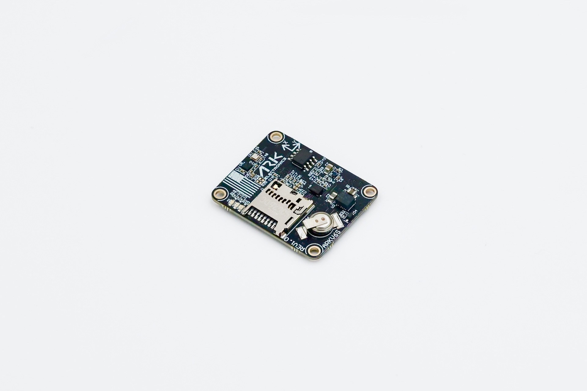

# ARK Electronics ARKV6S

:::warning
PX4 не розробляє цей (або будь-який інший) автопілот.
Contact the [manufacturer](https://arkelectron.com/contact-us/) for hardware support or compliance issues.
:::

The USA-built [ARKV6S](https://arkelectron.gitbook.io/ark-documentation/flight-controllers/arkv6s) flight controller is a low-cost, single-IMU variant of the [ARKV6X](../flight_controller/ark_v6x.md), based on the [FMUV6X and Pixhawk Autopilot Bus open source standards](https://github.com/pixhawk/Pixhawk-Standards).

The Pixhawk Autopilot Bus (PAB) form factor enables the ARKV6S to be used on any [PAB-compatible carrier board](../flight_controller/pixhawk_autopilot_bus.md), such as the [ARK Pixhawk Autopilot Bus Carrier](../flight_controller/ark_pab.md).



:::info
This flight controller is [manufacturer supported](../flight_controller/autopilot_manufacturer_supported.md).
:::

## Where To Buy {#store}

Order From [Ark Electronics](https://arkelectron.com/product/arkv6s-flight-controller/) (US)

## Датчики

- [Invensense IIM-42653 Industrial IMU](https://www.invensense.tdk.com/en-us/products/6-axis/iim-42653)
- [Bosch BMP390 Barometer](https://www.bosch-sensortec.com/en/products/environmental-sensors/pressure-sensors/bmp390/)
- [ST IIS2MDC Magnetometer](https://www.st.com/en/mems-and-sensors/iis2mdc.html)

## Мікропроцесор

- [STM32H743IIK6 MCU](https://www.st.com/en/microcontrollers-microprocessors/stm32h743ii.html)
  - 480MHz
  - 2MB Flash
  - 1MB RAM

## Інші характеристики

- FRAM
- [Pixhawk Autopilot Bus (PAB) Form Factor](https://github.com/pixhawk/Pixhawk-Standards/blob/master/DS-010%20Pixhawk%20Autopilot%20Bus%20Standard.pdf)
- LED індикатори
- Слот MicroSD
- USA Built
- Розроблений з нагрівачем потужністю 1 Вт. Підтримує датчики в теплі в екстремальних умовах

## Вимоги до живлення

- 5V
- 500 мА
  - 300 мА для основної системи
  - 200 мА для нагрівача

## Додаткова інформація

- Вага: 5.0 g
- Розміри: 3,6 x 2,9 x 0,5 см

## Схема розташування виводів

For pinout of the ARKV6S see the [DS-10 Pixhawk Autopilot Bus Standard](https://github.com/pixhawk/Pixhawk-Standards/blob/master/DS-010%20Pixhawk%20Autopilot%20Bus%20Standard.pdf)

## Налаштування послідовного порту

| UART   | Пристрій   | Порт                            |
| ------ | ---------- | ------------------------------- |
| USART1 | /dev/ttyS0 | GPS                             |
| USART2 | /dev/ttyS1 | TELEM3                          |
| USART3 | /dev/ttyS2 | Debug Console                   |
| UART4  | /dev/ttyS3 | UART4 & I2C |
| UART5  | /dev/ttyS4 | TELEM2                          |
| USART6 | /dev/ttyS5 | PX4IO/RC                        |
| UART7  | /dev/ttyS6 | TELEM1                          |
| UART8  | /dev/ttyS7 | GPS2                            |

:::info
The mapping above applies to the running PX4 firmware.
The ARKV6S bootloader enables only `UART7` (TELEM1), so when flashing firmware over UART with [`px4_uploader.py`](https://github.com/PX4/PX4-Autopilot/blob/main/Tools/px4_uploader.py) you must connect to the `TELEM1` port — no other UART will respond in bootloader mode.
:::

## Збірка прошивки

```sh
make ark_fmu-v6s_default
```

## Дивіться також

- [ARK Electronics ARKV6S](https://arkelectron.gitbook.io/ark-documentation/flight-controllers/arkv6s) (ARK Docs)
