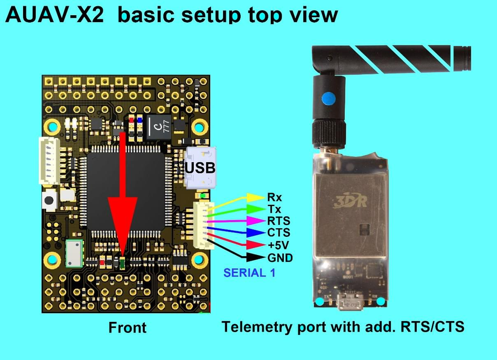

# Автопілот AUAV-X2 (припинено)

<Badge type="info" text="Discontinued" />

:::warning
This flight controller has been [discontinued](../flight_controller/autopilot_experimental.md) and is no longer commercially available.
:::

:::warning
PX4 не розробляє цей (або будь-який інший) автопілот.
Contact the [manufacturer](https://store.mrobotics.io/) for hardware support or compliance issues.
:::

The [AUAV&reg;](http://www.auav.com/) _AUAV-X2 autopilot_ is based on the [Pixhawk&reg;-project](https://pixhawk.org/) **FMUv2** open hardware design. It runs PX4 on the [NuttX](https://nuttx.apache.org/) OS.

## Короткий опис

- Main System-on-Chip: [STM32F427](http://www.st.com/web/en/catalog/mmc/FM141/SC1169/SS1577/LN1789)
  - Процесор: мікроконтролер ARM STM32F427VIT6 - Ревізія 3
  - ІО: мікроконтролер ARM STM32F100C8T6
- Датчики:
  - Invensense MPU9250 9DOF
  - Invensense ICM-20608 6DOF
  - MEAS MS5611 барометр
- Розміри/Вага
  - Розмір: 36мм х 50мм
  - Точки кріплення: 30,5 мм х 30,5 мм діаметр 3,2 мм
  - Вага: 10.9g
- Схема Power OR-ing з оберненою захистом від зворотної напруги. Необхідний модуль живлення 5V!

## Підключення

- 2.54 мм заголовки:
- GPS (USART4)
- i2c
- Вхід RC
- PPM вхід
- Вхідний спектр
- RSSI вхід
- вхід SBUS
- sBus вихід
- Вхід живлення
- Вихід зумера
- Вихід світлодіода
- 8 x Виводи сервоприводів
- 6 x Aux outputs
- USART7 (Консоль)
- USART8 (OSD)

## Доступність

Більше не у виробництві.
This has been superseded by the [mRo X2.1](mro_x2.1.md).
mRobotics є дистриб'ютором продукції AUAV з серпня 2017 року.

## Ключові посилання

- [User Manual](http://arsovtech.com/wp-content/uploads/2015/08/AUAV-X2-user-manual-EN.pdf)
- [DIY Drones Post](http://diydrones.com/profiles/blogs/introducing-the-auav-x2-1-flight-controller)

## Посібник з підключення

## Креслення

The board is based on the [Pixhawk project](https://pixhawk.org/) **FMUv2** open hardware design.

- [FMUv2 + IOv2 schematic](https://raw.githubusercontent.com/PX4/Hardware/master/FMUv2/PX4FMUv2.4.5.pdf) -- Schematic and layout

:::info
As a CC-BY-SA 3.0 licensed Open Hardware design, all schematics and design files are [available](https://github.com/PX4/Hardware).
:::

## Налаштування послідовного порту

| UART   | Пристрій   | Порт                                          |
| ------ | ---------- | --------------------------------------------- |
| UART1  | /dev/ttyS0 | IO debug                                      |
| USART2 | /dev/ttyS1 | TELEM1 (керування потоком) |
| USART3 | /dev/ttyS2 | TELEM2 (керування потоком) |
| UART4  |            |                                               |
| UART7  | CONSOLE    |                                               |
| UART8  | SERIAL4    |                                               |
