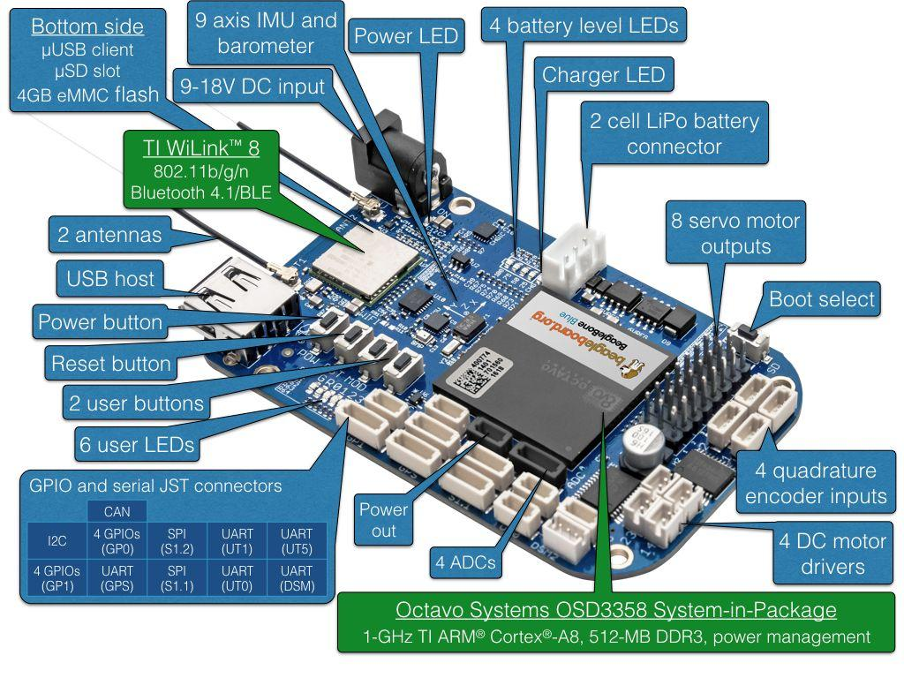

# BeagleBone Blue

<LinkedBadge type="warning" text="Experimental" url="../flight_controller/autopilot_experimental.md"/>

:::warning
PX4 не розробляє цей (або будь-який інший) автопілот.
Contact the [manufacturer](https://beagleboard.org/blue) for hardware support or compliance issues.
:::

[BeagleBone Blue](https://beagleboard.org/blue) is an all-in-one Linux-based computer.
Хоча ця компактна і недорога плата оптимізована для робототехніки, вона має всі необхідні датчики і периферійні пристрої, необхідні для керування польотом.
This topic shows how to set up the board to run PX4 with [librobotcontrol](https://github.com/StrawsonDesign/librobotcontrol) robotics package.



## OS Image

_BeagleBone Blue_ images can be found here:

- [Latest stable OS image](https://beagleboard.org/latest-images).
- [Test OS images](https://rcn-ee.net/rootfs/bb.org/testing/) (updated frequently).

Information about flashing OS images can be found on [this page](https://github.com/beagleboard/beaglebone-blue/wiki/Flashing-firmware).
Other useful information can be found in the [FAQ](https://github.com/beagleboard/beaglebone-blue/wiki/Frequently-Asked-Questions-\(FAQ\)).

:::tip
Optionally you can update to a realtime kernel, and if you do, re-check if _librobotcontrol_ works properly with the realtime kernel.
:::

The latest OS images at time of updating this document is [bone-debian-10.3-iot-armhf-2020-04-06-4gb.img.xz](https://debian.beagle.cc/images/bone-debian-10.3-iot-armhf-2020-04-06-4gb.img.xz).

## Збірка для крос-компіляторів (рекомендується)

The recommended way to build PX4 for _BeagleBone Blue_ is to compile on a development computer and upload the PX4 executable binary directly to the BeagleBone Blue.

:::tip
This approach is recommended over [native build](#native_builds) due to speed of deployment and ease of use.
:::

:::info
The PX4 build requires [librobotcontrol](http://strawsondesign.com/docs/librobotcontrol/) which is automatically included in the build (but it can be installed and tested independently if required).
:::

### Налаштування Beaglebone Blue WIFI

Для зручного доступу до плати ви можете підключити її до домашньої мережі через Wi-Fi.

Кроки наступні (виконайте на платі):

```sh
sudo su
connmanctl
connmanctl>scan wifi
connmanctl>services
#(at this point you should see your network SSID appear.)
connmanctl>agent on
connmanctl>connect <SSID>
	Enter Passphrase
connmanctl>quit
```

:::info
The format of the `<SSID>` above is normally the text 'wifi' followed by a string of other characters.
Після введення команди вам буде запропоновано ввести пароль для wifi.
:::

### SSH root-логін на Beaglebone

Root-логін можна увімкнути на платі за допомогою:

```sh
sudo su
echo "PermitRootLogin yes" >>  /etc/ssh/sshd_config && systemctl restart sshd
```

### Налаштування крос-компілятора

1. First set up _rsync_ (this is used to transfer files from the development computer to the target board over a network - WiFi or Ethernet).
   For _rsync_ over SSH with key authentication, follow the steps here (on the development machine):

   1. Створіть ключ SSH, якщо ви раніше цього не робили:

      ```
      ssh-keygen -t rsa
      ```

      1. ENTER //no passphrase
      2. ENTER
      3. ENTER

   2. Define the BeagleBone Blue board as `beaglebone` in **/etc/hosts** and copy the public SSH key to the board for password-less SSH access:

      ```
      ssh-copy-id debian@beaglebone
      ```

   3. Крім того, ви можете використовувати IP-адресу beaglebone безпосередньо:

      ```
      ssh-copy-id debian@<IP>
      ```

   4. На запитання, чи довіряєте ви: yes

   5. Введіть root пароль

2. Налаштування крос-компіляції

   1. Завантаження інструментів

      1. First install the toolchain into _/opt/bbblue_toolchain/gcc-arm-linux-gnueabihf_.
         Ось приклад використання софт-посилання для вибору версії набору інструментів, яку ви хочете використовувати:

         ```sh
         mkdir -p /opt/bbblue_toolchain/gcc-arm-linux-gnueabihf
         chmod -R 777 /opt/bbblue_toolchain
         cd /opt/bbblue_toolchain/gcc-arm-linux-gnueabihf
         ```

         The ARM Cross Compiler for _BeagleBone Blue_ can be found at [Linaro Toolchain Binaries site](https://www.linaro.org/downloads/#gnu_and_llvm).

         :::tip
         GCC in the toolchain should be compatible with kernel in _BeagleBone Blue_.
         General rule of thumb is to choose a toolchain where version of GCC is not higher than version of GCC which comes with the OS image on _BeagleBone Blue_.

:::

         Download and unpack [gcc-linaro-13.0.0-2022.06-x86_64_arm-linux-gnueabihf.tar.xz](https://snapshots.linaro.org/gnu-toolchain/13.0-2022.06-1/arm-linux-gnueabihf/gcc-linaro-13.0.0-2022.06-x86_64_arm-linux-gnueabihf.tar.xz) to the bbblue_toolchain folder.

         Different ARM Cross Compiler versions for _BeagleBone Blue_ can be found at [Linaro Toolchain Binaries site](http://www.linaro.org/downloads/).

         ```sh
         wget https://snapshots.linaro.org/gnu-toolchain/13.0-2022.06-1/arm-linux-gnueabihf/gcc-linaro-13.0.0-2022.06-x86_64_arm-linux-gnueabihf.tar.xz
         tar -xf gcc-linaro-13.0.0-2022.06-x86_64_arm-linux-gnueabihf.tar.xz
         ```

         :::tip
         The GCC version of the toolchain should be compatible with kernel in _BeagleBone Blue_.

:::

         As a general rule of thumb is to choose a toolchain where the version of GCC is not higher than the version of GCC which comes with the OS image on _BeagleBone Blue_.

      2. Додайте його до PATH в ~/.profile, як показано нижче

         ```sh
         export PATH=$PATH:/opt/bbblue_toolchain/gcc-arm-linux-gnueabihf/gcc-linaro-13.0.0-2022.06-x86_64_arm-linux-gnueabihf/bin
         ```

         ::: info
         Logout and Login to apply the change, or execute the same line on your current shell.

:::

      3. Налаштуйте інші залежності, завантаживши вихідний код PX4, а потім виконайте сценарії налаштування:

         ````
         git clone https://github.com/PX4/PX4-Autopilot.git --recursive
         ols
         ```

         You may have to edit the upload target to match with your setup:

         ```sh
         nano PX4-Autopilot/boards/beaglebone/blue/cmake/upload.cmake

         # in row 37 change debian@beaglebone.lan TO root@beaglebone (or root@<IP>)
         ````

         See the [Development Environment Setup](../dev_setup/dev_env_linux_ubuntu.md) instructions for additional information.

### Налаштування крос-компіляції та завантаження

Компіляція та завантаження

```
make beaglebone_blue_default upload
```

:::info
Without upload, files stored local in build folder.
:::

To test the uploaded files, run the following commands on the _BeagleBone Blue_ board:

```sh
cd /home/debian/px4
sudo ./bin/px4 -s px4.config
```

:::info
Currently _librobotcontrol_ requires root access.
:::

<a id="native_builds"></a>

## Нативні збірки (необов'язково)

Ви також можете нативно створювати збірки PX4 безпосередньо на BeagleBone Blue.

Після придбання готової бібліотеки,

1. Select the _librobotcontrol_ installation directory, and set it in the `LIBROBOTCONTROL_INSTALL_DIR` environment variable so that other unwanted headers will not be included
2. Install **robotcontrol.h** and **rc/\*** into `$LIBROBOTCONTROL_INSTALL_DIR/include`
3. Install pre-built native (ARM) version of librobotcontrol.\* into `$LIBROBOTCONTROL_INSTALL_DIR/lib`

Виконайте наступні команди на BeagleBone Blue (тобто через SSH):

1. Встановіть залежності:

   ```sh
   sudo apt-get update
   sudo apt-get install cmake python3-empy=3.3.4-2
   ```
2. Клонуйте програмне забезпечення PX4 безпосередньо на плату BeagleBone Blue.
3. Continue with the [standard build system installation](../dev_setup/dev_env_linux.md).

## Зміни в конфігурації

Усі зміни можна вносити безпосередньо в файл налаштувань px4.config на beaglebone.
Наприклад, ви можете змінити WIFI на wlan.

:::info
If you want to change permanently, you have to change **PX4-Autopilot/posix-configs/bbblue/px4.config** on the Build Machine before build.
:::

## Автозапуск під час завантаження

Ось приклад [/etc/rc.local]:

```sh
#!/bin/sh -e
#
# rc.local
#
# This script is executed at the end of each multiuser runlevel.
# Make sure that the script will "exit 0" on success or any other
# value on error.
#
# In order to enable or disable this script just change the execution
# bits.
#
# By default this script does nothing.

# wait for services to start up
/bin/sleep 25

cd /home/debian/px4

/home/debian/px4/bin/px4 -d -s /home/debian/px4/px4.config > /home/debian/px4/PX4.log &

exit 0
```

Below is a _systemd_ service example [/lib/systemd/system/px4-quad-copter.service]:

```sh
[Unit]
Description=PX4 Quadcopter Service
After=networking.service network-online.target
StartLimitIntervalSec=0
Conflicts=px4-fixed-wing.service

[Service]
WorkingDirectory=/home/debian/px4
User=root
ExecStart=/home/debian/px4/bin/px4 -d -s /home/debian/px4/px4.config

Restart=on-failure
RestartSec=1

[Install]
WantedBy=multi-user.target
```

### Інше

#### Силова серворейка

Коли PX4 починає працювати, він автоматично подає живлення на сервоприводи.

#### Унікальні можливості

BeagleBone Blue має деякі унікальні функції, такі як кілька варіантів інтерфейсів WiFi та джерел живлення.
Refer to comments in **/home/debian/px4/px4.config** for usage of these features.

#### Перетворювач сигналів SBUS

Сигнал SBUS від приймача (наприклад, FrSky X8R) є інвертованим сигналом.
UARTs на BeagleBone Blue можуть працювати лише з неінвертованим сигналом рівня 3,3 В.
[This tutorial](../tutorials/linux_sbus.md) contains a SBUS signal inverter circuit.

#### Типові підключення

Для квадрокоптера з GPS і приймачем SBUS, ось типові схеми підключення:

1. Підключіть ESC двигуна 1, 2, 3 та 4 до каналу 1, 2, 3 та 4 вихідних сигналів сервоприводів на BeagleBone Blue відповідно.
   Якщо ваш роз'єм ESC містить вихідний контакт живлення, вийміть його і не підключайте його до вихідного контакту живлення каналу сервоприводу на BeagleBone Blue.

2. Connect the above mentioned converted SBUS signal to the dsm2 port if you have the matching connector for dsm2, otherwise connect it to any other available UART port and change the corresponding port in **/home/debian/px4/px4.config** accordingly.

3. Підключіть сигнали модуля GPS до порту GPS на платі BeagleBone Blue.
   Зверніть увагу, що сигнальні контакти порту GPS на BeagleBone Blue підтримують лише 3,3 В, тому обирайте свій GPS-модуль відповідно.
