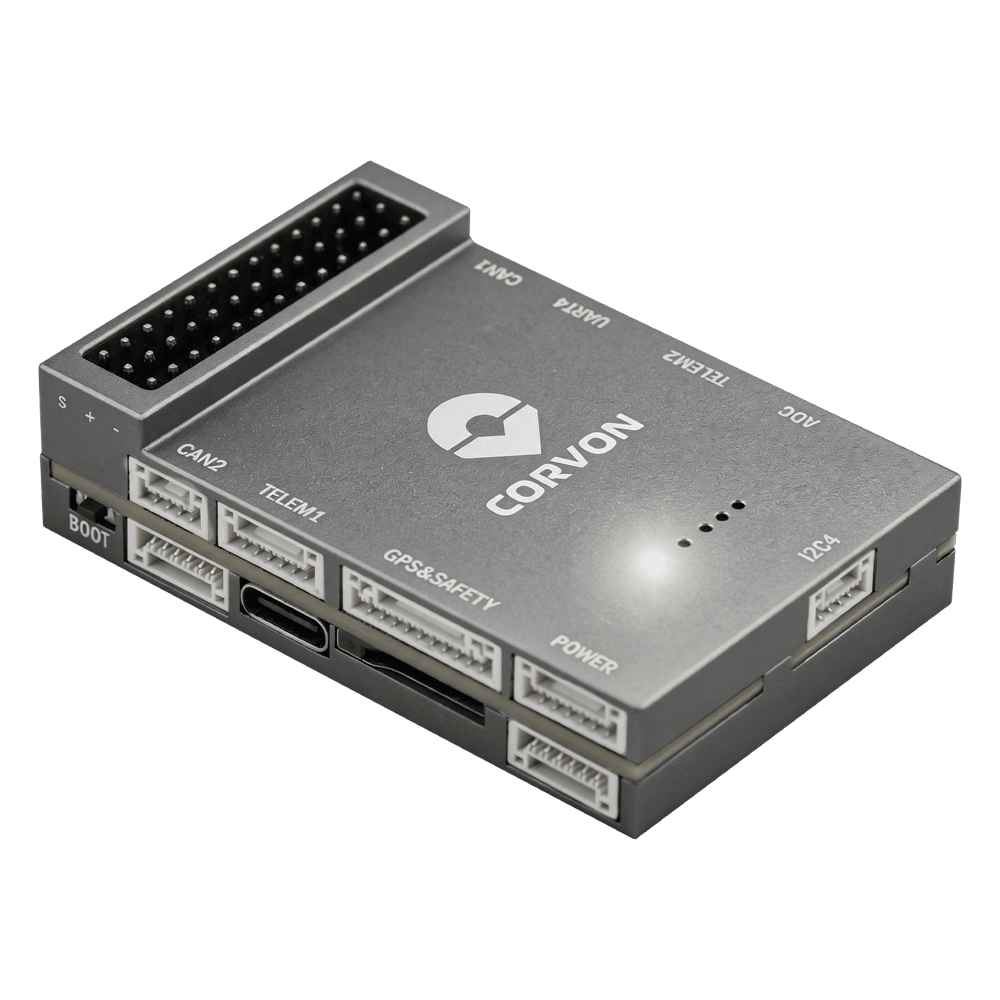
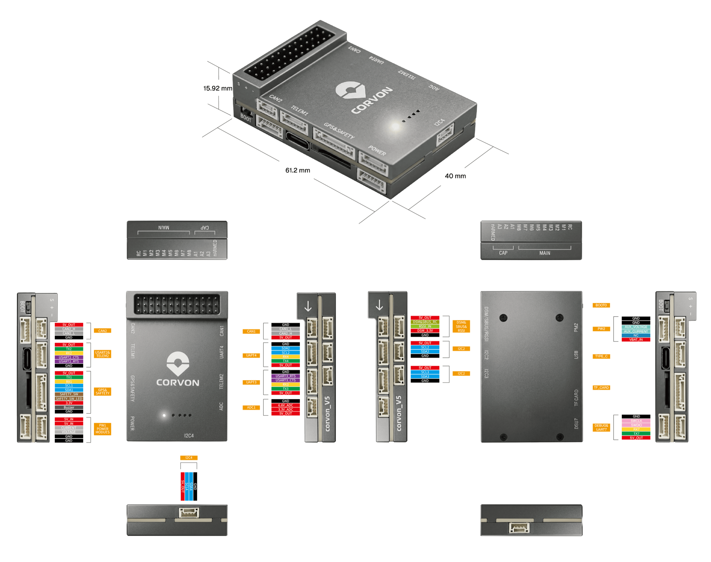
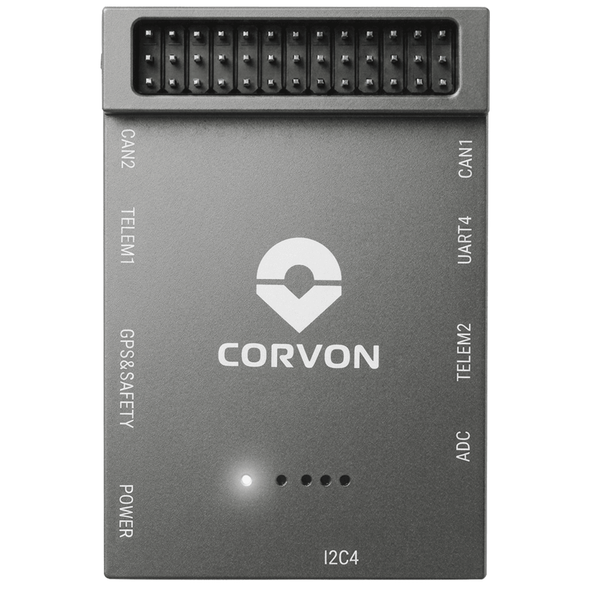
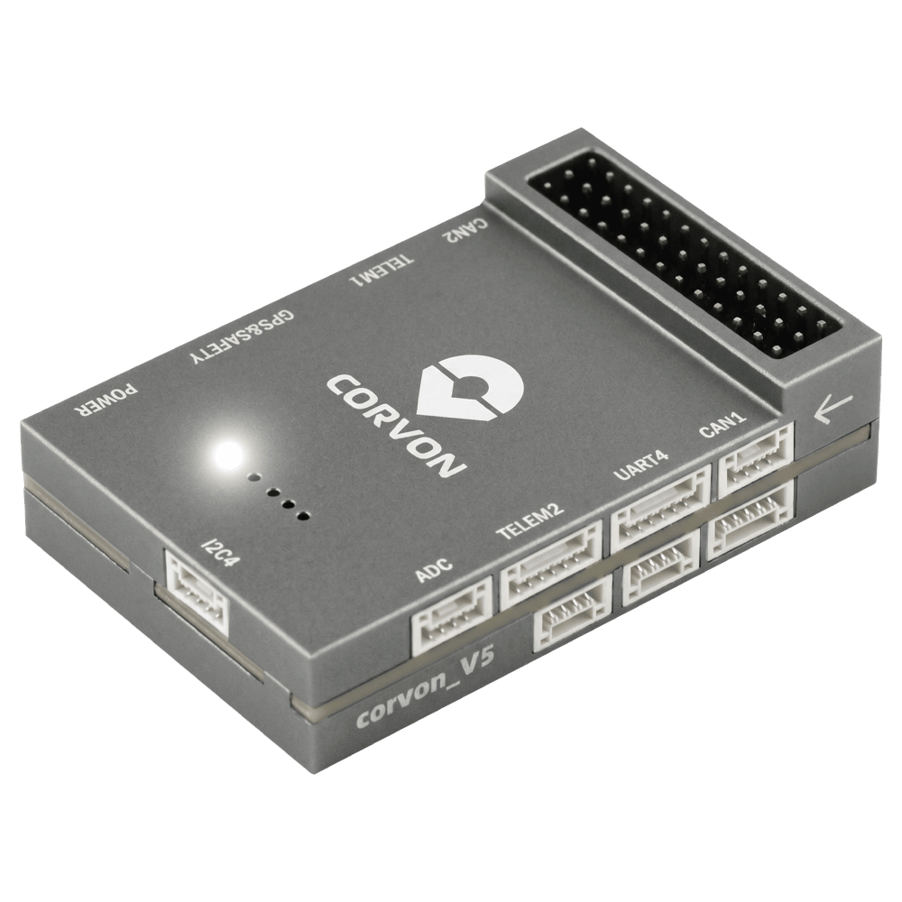

# CORVON V5 Autopilot

<Badge type="tip" text="PX4 v1.18" />

:::warning
PX4 не розробляє цей (або будь-який інший) автопілот.
Contact the [manufacturer](https://corvon.tech) for hardware support or compliance issues.
:::

The CORVON V5 is based on the Pixhawk FMUv5 design standard and runs PX4 on NuttX.



:::info
This flight controller is [manufacturer supported](autopilot_manufacturer_supported.md).
:::

## Specifications {#specifications}

- **Main FMU Processor:** STM32F765IIK
  - 32 Bit Arm® Cortex®-M7, 216MHz, 2MB memory, 512KB RAM

- **On-board sensors:**
  - Акселератор/гіроскоп: ICM-20689
  - Акселератор/гіроскоп: ICM-20602
  - Акселератор/гіроскоп: BMI088
  - Магнітометр: IST8310
  - Барометр: MS5611

- **Interfaces:**
  - 8 PWM outputs
  - 3 виділених PWM/Capture входи на FMU
  - Виділений R/C вхід для CPPM
  - Виділений вхід R/C для Spektrum / DSM і S.Bus
  - Аналоговий / PWM вхід RSSI
  - 4 загальних послідовних порти
  - 3 I2C порти
  - 4 шини SPI
  - 2 CAN шини
  - Аналогові входи для напруги / струму з батареї
  - 2 додаткових аналогових входи
  - Підтримка nARMED

- **Power System:**
  - Power Brick Input: 4.75~5.5V
  - USB-C Power Input: 4.75~5.25V

- **Weight and Dimensions:**
  - Weight: 42.1g
  - Dimensions: 61.2 x 40 x 15.9mm

- **Other Characteristics:**
  - Operating temperature: -20 ~ 85°C (Measured value)

## Where to Buy {#store}

- [CORVON Store](https://corvon.tech)

## Connectors and Interfaces



## Схема розташування виводів

Download Corvon V5 pinouts from here: [corvon_v5_pinout.xlsx](https://github.com/PX4/PX4-Autopilot/raw/main/docs/assets/flight_controller/corvon_v5/corvon_v5_pinout.xlsx)

## Налаштування послідовного порту

| UART   | Пристрій     | Порт                                     | Flow Control |
| ------ | ------------ | ---------------------------------------- | :----------: |
| USART1 | `/dev/ttyS0` | GPS                                      |       -      |
| USART2 | `/dev/ttyS1` | TELEM1                                   |      Так     |
| USART3 | `/dev/ttyS2` | TELEM2                                   |      Так     |
| UART4  | `/dev/ttyS3` | TELEM4                                   |       -      |
| USART6 | `/dev/ttyS4` | RC                                       |       -      |
| UART7  | `/dev/ttyS5` | Debug Console                            |       -      |
| UART8  | `/dev/ttyS6` | Reserved for optional onboard RTK module |       -      |

:::info
UART8 is reserved for an optional onboard UM982 module footprint and is not intended for general external use.
:::

## Radio Control {#radio_control}

Для того щоб керувати транспортним засобом _вручну_, потрібна система радіоуправління (RC) (PX4 не потребує системи радіоуправління для автономних режимів польоту).
Вам потрібно [вибрати сумісний передавач/приймач](../getting_started/rc_transmitter_receiver.md) і _зв'язати_ їх таким чином, щоб вони взаємодіяли (ознайомтеся з інструкціями, що додаються до вашого конкретного передавача/приймача).

The ports and supported protocols are:

- `DSM/SBUS/RSSI` (FMU): SBUS, DSM/DSMX, ST24, SUMD, CRSF, and GHST receivers
- `RC`: PPM

For PPM and S.Bus receivers, a single signal wire carries all channels.
If your receiver outputs individual PWM signals (one wire per channel) it must be connected via a [PPM encoder](../getting_started/rc_transmitter_receiver.md).

### GPS & Compass {#gps_compass}

PX4 supports GPS modules connected to the GPS port(s) listed below.
The module should be [mounted on the frame](../assembly/mount_gps_compass.md) as far away from other electronics as possible, with the direction marker pointing towards the front of the vehicle.

The GPS ports are:

- `GPS&SAFETY` (FMU): 10-pin JST GH ([Pixhawk Connector Standard](https://github.com/pixhawk/Pixhawk-Standards/blob/master/DS-009%20Pixhawk%20Connector%20Standard.pdf)) — GPS, compass (I2C), safety switch, buzzer, LED.

Вбудований безпечний вимикач в GPS-модулі увімкнений _за замовчуванням_ (коли включений, PX4 не дозволить вам готувати до польоту).
To disable the safety switch press and hold it for 1 second.
You can press the safety switch again to enable safety and disarm the vehicle.

## PWM Outputs {#pwm_outputs}

This flight controller supports up to 8 FMU PWM outputs (`MAIN`).

[DShot](../peripherals/dshot.md) is not supported.

The 8 outputs are in 3 groups:

- Outputs 1-4 in group1 (Timer1)
- Outputs 5-6 in group2 (Timer4)
- Outputs 7-8 in group3 (Timer12)

All outputs within the same group must use the same output protocol and rate.

## Debug Port {#debug_port}

The [PX4 System Console](../debug/system_console.md) and [SWD interface](../debug/swd_debug.md) operate on the **FMU Debug** port (`DSU7`).

The debug port (`DSU7`) has the following pinout:

| Pin | Сигнал                         | Вольтаж               |
| --- | ------------------------------ | --------------------- |
| 1   | GND                            | GND                   |
| 2   | FMU_SWCLK | +3.3V |
| 3   | FMU_SWDIO | +3.3V |
| 4   | DEBUG RX                       | +3.3V |
| 5   | DEBUG TX                       | +3.3V |
| 6   | 5V+                            | +5V                   |

:::warning
The 5V+ pin (6) provides 5V, but the CPU logic runs at 3.3V!

Some JTAG/SWD adapters (like SEGGER J-Link) may use the Vref voltage pin to set the logic level on the SWD data lines. Connecting 5V to the adapter's `Vtref` can damage the CPU.
For a direct connection to a _Segger Jlink_, we recommend you use a 3.3V source to provide `Vtref` to the JTAG adapter (i.e. providing 3.3V and _NOT_ 5V).
:::

## Номінальна напруга

CORVON V5 must be powered from the **POWER** connector during flight, and may also be powered from **USB** for bench testing.

- **POWER input:** 4.75~5.5V
- **USB input:** 4.75~5.25V

The **PM2** connector **cannot power** the flight controller.
On PX4, **do not use** this interface.

## Збірка прошивки

Щоб зібрати PX4 для цього контролера:

```sh
make corvon_v5_default
```

## Встановлення прошивки PX4

Прошивку можна встановити будь-якими звичайними способами:

- **Build and upload the source**

  ```sh
  make corvon_v5_default upload
  ```

- **Load the firmware using _QGroundControl_.**
  You can use either pre-built firmware or your own custom firmware.

:::info
If this target is not listed in _QGroundControl_, build and upload from source or load a custom firmware file (see [Installing PX4 Main, Beta or Custom Firmware](../config/firmware.md#installing-px4-main-beta-or-custom-firmware)).
:::

## Підтримувані платформи / Конструкції

Будь-який мультикоптер / літак / наземна платформа / човен, який може керуватися звичайними RC сервоприводами або сервоприводами Futaba S-Bus.
The complete set of supported configurations can be seen in the [Airframes Reference](../airframes/airframe_reference.md).

## Зображення





## Подальша інформація

- [Corvon Tech](https://corvon.tech)
