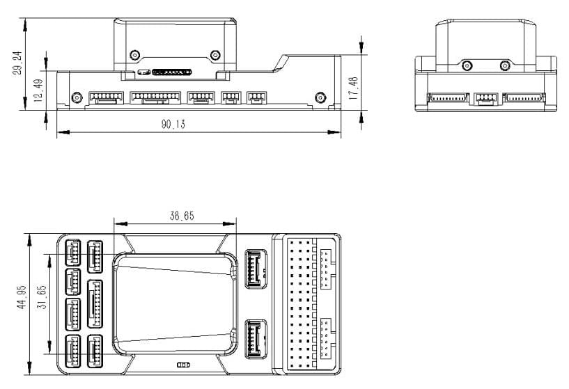
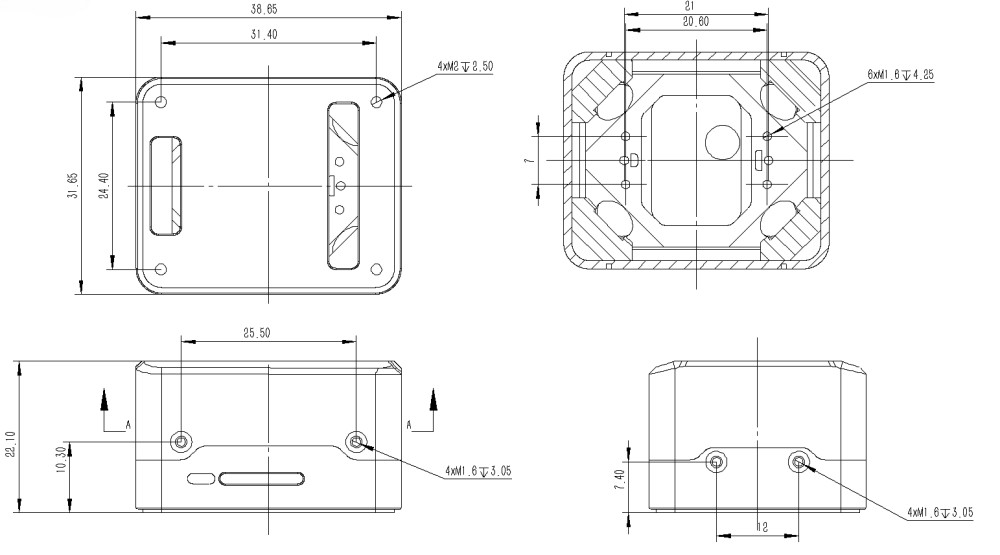

# CUAV Pixhawk V6X

:::warning
PX4 не розробляє цей (або будь-який інший) автопілот.
Contact the [manufacturer](https://store.cuav.net/) for hardware support or compliance issues.
:::

_Pixhawk V6X_<sup>&reg;</sup> is the latest update to the successful family of Pixhawk® flight controllers designed and made in collaboration with CUAV<sup>&reg;</sup> and the PX4 team.

It is based on the [Pixhawk​​® Autopilot FMUv6X Standard](https://github.com/pixhawk/Pixhawk-Standards/blob/master/DS-012%20Pixhawk%20Autopilot%20v6X%20Standard.pdf), [Autopilot Bus Standard](https://github.com/pixhawk/Pixhawk-Standards/blob/master/DS-010%20Pixhawk%20Autopilot%20Bus%20Standard.pdf), and [Connector Standard](https://github.com/pixhawk/Pixhawk-Standards/blob/master/DS-009%20Pixhawk%20Connector%20Standard.pdf).


:::tip
This autopilot is [supported](../flight_controller/autopilot_pixhawk_standard.md) by the PX4 maintenance and test teams.
:::

Pixhawk<sup>&reg;</sup> V6X принесе вам найвищий рівень продуктивності, стабільності та надійності у всіх аспектах.

- Процесор Arm® Cortex®-M7 (STM32H753) з операційною точкою (FPU), високошвидкісні операції на частоті 480 МГц та 2 МБ флеш-пам'яті.
  Розробники можуть бути більш продуктивними та ефективними, що дозволяє використовувати складніші алгоритми та моделі.
- Високопродуктивний бортовий, низькозвуковий ІНС та автомобільний магнітний компас на основі відкритого стандарту FMUv6X.
  Мета полягає в досягненні кращої стабільності та антиінтерференційної здатності.
- Triple redundant IMU & double redundant barometer on separate buses.
  Коли автопілот PX4 виявляє відмову датчика, система безперервно переключається на інший, щоб забезпечити надійність керування польотом.
- Кожен незалежний LDO живить кожен набір сенсорів з незалежним керуванням живленням.
  Система віброізоляції для фільтрації високочастотної вібрації та зменшення шуму для забезпечення точних показань, що дозволяє транспортним засобам досягати кращих загальних характеристик польоту.
- Зовнішня шина датчика (SPI5) має дві лінії вибору мікросхем та сигнали готовності даних для додаткових датчиків та навантаження з інтерфейсом SPI.
- Інтегрований мікросхемний Ethernet PHY для високошвидкісного зв'язку по Ethernet з пристроями на борту, такими як комп'ютери місій.
- Нова система ізоляції вібрацій, призначена для фільтрації високочастотних вібрацій та зменшення шуму для забезпечення точних вимірювань.
- IMUs are temperature-controlled by onboard heating resistors, allowing optimum working temperature of IMUs&#x20;
- Modular flight controller: separated IMU, FMU, and Base system connected by a 100-pin & a 50-pin Pixhawk®​ Autopilot Bus connector.

Pixhawk® V6X ідеально підходить для корпоративних дослідницьких лабораторій, академічних досліджень та комерційних застосувань.

### Processors & Sensors

- Процесор FMU: STM32H753
  - 32 Bit Arm® Cortex®-M7, 480MHz, 2MB flash memory, 1MB RAM
- IO Processor: STM32F103
  - 32 Bit Arm® Cortex®-M3, 72MHz, 20KB SRAM
- Сенсори на платі
  - Акселератор/гіроскоп: BMI088
  - Accel/Gyro: ICM-42688-P
  - Accel/Gyro: ICM-20649
  - Mag: RM3100
  - Барометр: 2x ICP-20100

### Електричні дані

- Номінальна напруга:
  - Максимальна вхідна напруга: 5,7 В
  - Вхід USB Power: 4.75~5.25V
  - Вхід на серворейку: 0\~9.9В
- Номінальний струм:
  - Комбінований обмежувач вихідного струму TELEM1 і GPS2: 1,5 А
  - Комбінований обмежувач вихідного струму всіх інших портів: 1.5A

### Інтерфейси

- 16 PWM виводів сервоприводів
- 1 Виділений R/C вхід для Spektrum / DSM та S.Bus з аналоговим / PWM RSSI входом
- 3 TELEM-порти (з повним контролем потоку)
- 1 UART4(Seial та I2C)
- 2 порти GPS
  - 1 повноцінний порт GPS плюс порт перемикача безпеки (GPS1)
  - 1 базовий GPS-порт (з I2C, GPS2)
- 2 USB порти
  - 1 TYPE-C
  - JST GH1.25
- 1 порт Ethernet
  - Transformerless Applications
  - 100Mbps
- 1 шина SPI
  - 2 лінії вибору чіпу
  - 2 лінії готових даних
  - 1 SPI SYNC лінія
  - 1 лінія SPI reset
- 2 CAN шини для CAN периферії
  - CAN шина має individual silent controls або ESC RX-MUX control
- 4 порти вводу живлення
  - 2 входи живлення Dronecan/UAVCAN
  - 2 входи живлення SMBUS/I2C
- 1 AD & IO port
  - 2 додаткових аналогових входи (3,3 і 6,6 В)
  - 1 PWM/Capture вхід
- 2 виділених для відлагодження
  - FMU Debug
  - IO debug

### Механічні характеристики

- Вага
  - Модуль політного контролера: 99г
  - Основний модуль: 43г
  - Baseboard: 56г
- Operating & storage temperature: -20 ~ 85°c
- Розмір

  - Політний контролер

    

  - Основний модуль

    

## Де купити

Order from [CUAV](https://store.cuav.net/).

## Зборка/інсталяція

The [Pixhawk V6X Wiring Quick Start](../assembly/quick_start_cuav_pixhawk_v6x.md) provides instructions on how to assemble required/important peripherals including GPS, Power Module etc.

## Схема розташування виводів


Примітки:

- The [camera capture pin](../camera/fc_connected_camera.md#camera-capture-configuration) (`PI0`) is pin 2 on the AD&IO port, marked above as `FMU_CAP1`.

## Налаштування послідовного порту

| UART   | Пристрій   | Порт          |
| ------ | ---------- | ------------- |
| USART1 | /dev/ttyS0 | GPS           |
| USART2 | /dev/ttyS1 | TELEM3        |
| USART3 | /dev/ttyS2 | Debug Console |
| UART4  | /dev/ttyS3 | UART4         |
| UART5  | /dev/ttyS4 | TELEM2        |
| USART6 | /dev/ttyS5 | PX4IO/RC      |
| UART7  | /dev/ttyS6 | TELEM1        |
| UART8  | /dev/ttyS7 | GPS2          |

## Номінальна напруга

_Pixhawk V6X_ can be triple-redundant on the power supply if three power sources are supplied.
The three power rails are: **POWERC1/POWER1**, **POWERC2/POWER2** and **USB**.

- **POWER C1** and **POWER C2** are DroneCAN/UAVCAN battery interfaces (recommended)；**POWER1** and **POWER2** are SMbus/I2C battery interfaces (backup).
- **POWER C1** and **POWER1** use the same power switch, **POWER C2** and **POWER2** use the same power switch.

**Normal Operation Maximum Ratings**

За таких умов всі джерела живлення будуть використовуватися в цьому порядку для живлення системи:

1. **POWER C1**, **POWER C2**, **POWER1** and **POWER2** inputs (4.75V to 5.7V)
2. **USB** input (4.75V to 5.25V)

**Absolute Maximum Ratings**

За таких умов система не буде витрачати жодної потужності (не буде працювати), але залишиться неушкодженою.

1. **POWER1** and **POWER2** inputs (operational range 4.7V to 5.7V, 0V to 10V undamaged)
2. **USB input** (operational range 4.7V to 5.7V, 0V to 6V undamaged)
3. **Servo input:** `VDD_SERVO` pin of **FMU PWM OUT** and **I/O PWM OUT** (0V to 42V undamaged)

**Voltage monitoring**

Digital DroneCAN/UAVCAN battery monitoring is enabled by default (see [Quickstart > Power](../assembly/quick_start_cuav_pixhawk_v6x.md#power)).

:::info
Analog battery monitoring via an ADC is not supported on this particular board, but may be supported in variations of this flight controller with a different baseboard.
:::

## Збірка прошивки

:::tip
Most users will not need to build this firmware!
It is pre-built and automatically installed by _QGroundControl_ when appropriate hardware is connected.
:::

To [build PX4](../dev_setup/building_px4.md) for this target:

```
make px4_fmu-v6x_default
```

<a id="debug_port"></a>

## Відладочний порт

The [PX4 System Console](../debug/system_console.md) and [SWD interface](../debug/swd_debug.md) run on the **FMU Debug** port.

The pinouts and connector comply with the [Pixhawk Debug Full](../debug/swd_debug.md#pixhawk-debug-full) interface defined in the [Pixhawk Connector Standard](https://github.com/pixhawk/Pixhawk-Standards/blob/master/DS-009%20Pixhawk%20Connector%20Standard.pdf) interface (JST SM10B connector).

| Pin                            | Сигнал                              | Вольтаж               |
| ------------------------------ | ----------------------------------- | --------------------- |
| 1 (red)     | `Vtref`                             | +3.3V |
| 2 (blk)     | Console TX (OUT) | +3.3V |
| 3 (blk)     | Console RX (IN)  | +3.3V |
| 4 (blk)     | `SWDIO`                             | +3.3V |
| 5 (blk)     | `SWCLK`                             | +3.3V |
| 6 (blk)     | `SWO`                               | +3.3V |
| 7 (blk)     | NFC GPIO                            | +3.3V |
| 8 (чорний)  | PH11                                | +3.3V |
| 9 (чорний)  | nRST                                | +3.3V |
| 10 (чорний) | `GND`                               | GND                   |

Інформацію про підключення та використання цього порту див:

- [PX4 System Console](../debug/system_console.md#pixhawk_debug_port) (Note, the FMU console maps to USART3).
- [SWD Debug Port](../debug/swd_debug.md)

## Периферійні пристрої

- [Digital Airspeed Sensor](https://holybro.com/products/digital-air-speed-sensor)
- [Telemetry Radio Modules](https://holybro.com/collections/telemetry-radios?orderby=date)
- [Rangefinders/Distance sensors](../sensor/rangefinders.md)

## Підтримувані платформи / Конструкції

Будь-який мультикоптер / літак / наземна платформа / човен, який може керуватися звичайними RC сервоприводами або сервоприводами Futaba S-Bus.
The complete set of supported configurations can be seen in the [Airframes Reference](../airframes/airframe_reference.md).

## Подальша інформація

- [Документація CUAV](https://doc.cuav.net/) (CUAV)
- [Pixhawk V6X Wiring QuickStart](../assembly/quick_start_cuav_pixhawk_v6x.md)
- [Pixhawk Автопілот FMUv6X Стандартний](https://github.com/pixhawk/Pixhawk-Standards/blob/master/DS-012%20Pixhawk%20Autopilot%20v6X%20Standard.pdf)
- [Стандарт шини автопілота Pixhawk](https://github.com/pixhawk/Pixhawk-Standards/blob/master/DS-010%20Pixhawk%20Autopilot%20Bus%20Standard.pdf)
- [Стандарт Pixhawk Connector Standard](https://github.com/pixhawk/Pixhawk-Standards/blob/master/DS-009%20Pixhawk%20Connector%20Standard.pdf)
