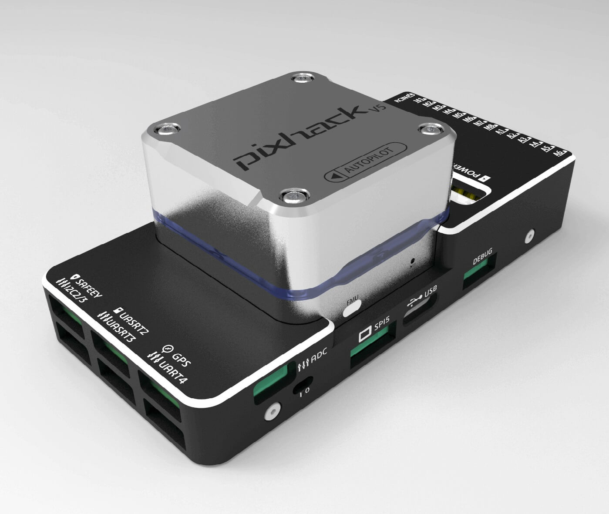
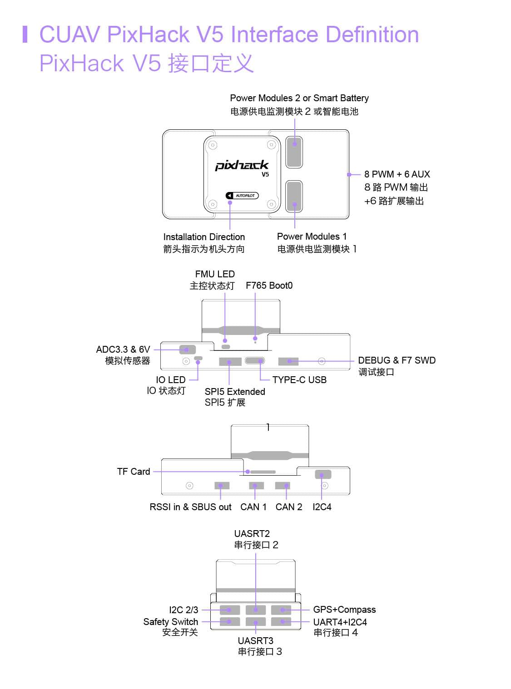
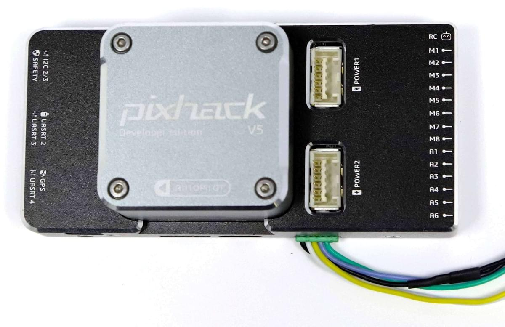

# CUAV v5 (Знято з виробництва)

<Badge type="info" text="Discontinued" />

:::warning
This flight controller has been [discontinued](../flight_controller/autopilot_experimental.md) and is no longer commercially available.
:::

:::warning
PX4 не розробляє цей (або будь-який інший) автопілот.
Contact the [manufacturer](https://store.cuav.net/) for hardware support or compliance issues.
:::

_CUAV v5_<sup>&reg;</sup> (previously "Pixhack v5") is an advanced autopilot designed and made by CUAV<sup>&reg;</sup>.
The board is based on the [Pixhawk-project](https://pixhawk.org/) **FMUv5** open hardware design.
It runs PX4 on the [NuttX](https://nuttx.apache.org/) OS, and is fully compatible with PX4 firmware.
Він призначений насамперед для академічних і комерційних розробників.



## Короткий опис

- Головний FMU процесор: STM32F765
  - 32 Bit Arm® Cortex®-M7, 216MHz, 2MB memory, 512KB RAM

- IO Processor: STM32F100
  - 32 Bit Arm®️ Cortex®️-M3, 24MHz, 8KB SRAM

- Бортові сенсори:

  - Акселерометр/Гіроскоп: ICM-20689
  - Акселерометр/Гіроскоп: BMI055
  - Магнітометр: IST8310
  - Барометр: MS5611

- Інтерфейси:
  - 8-14 PWM виходів (6 з IO, 8 з FMU)
  - 3 виділених PWM/Capture входи на FMU
  - Виділений R/C вхід для CPPM
  - Спеціалізований R/C вхід для PPM і S.Bus
  - аналоговий / PWM вхід RSSI
  - Вихід сервоприводу S.Bus
  - 5 загальних послідовних портів
  - 4x I2C порти
  - 4 шини SPI
  - 2 CANBuses з послідовними ESC
  - Аналогові входи для напруги / струму з 2 батарей

- Система живлення:
  - Живлення: 4.3~5.4В
  - Вхід USB: 4.75~5.25В
  - Вхід сервоприводу: 0~36V

- Вага та розміри:
  - Вага: 90г
  - Розміри: 44x84x12мм

- Інші характеристики:
  - Робоча температура: -20 ~ 80°С (виміряне значення)

## Де купити

Замовлення від [CUAV](https://cuav.taobao.com/index.htm?spm=2013.1.w5002-16371268426.2.411f26d9E18eAz).

## Підключення



:::warning
Інтерфейс RCIN призначений лише для живлення радіоприймача і не може бути підключений до будь-якого джерела живлення/навантаження.
:::

## Номінальна напруга

_CUAV v5_ can be triple-redundant on the power supply if three power sources are supplied. The three power rails are: **POWER1**, **POWER2** and **USB**.

:::info
The output power rails **FMU PWM OUT** and **I/O PWM OUT** (0V to 36V) do not power the flight controller board (and are not powered by it).
You must supply power to one of **POWER1**, **POWER2** or **USB** or the board will be unpowered.
:::

**Normal Operation Maximum Ratings**

За таких умов всі джерела живлення будуть використовуватися в цьому порядку для живлення системи:

1. Входи **POWER1** та **POWER2** (4,3 - 5,4 В)
2. **USB** input (4.75V to 5.25V)

## Збірка прошивки

:::tip
Most users will not need to build this firmware!
It is pre-built and automatically installed by _QGroundControl_ when appropriate hardware is connected.
:::

To [build PX4](../dev_setup/building_px4.md) for this target:

```
make px4_fmu-v5_default
```

## Відладочний порт

The [PX4 System Console](../debug/system_console.md) and [SWD interface](../debug/swd_debug.md) operate on the **FMU Debug** port.
Simply connect the FTDI cable to the Debug & F7 SWD connector.
Щоб отримати доступ до порту відладки вводу/виводу, користувач повинен видалити оболонку CUAV v5.
Обидва порти мають стандартні послідовні контакти і можуть бути підключені до стандартного кабелю FTDI (3,3 В, але допускається 5 В).

Схема підключення показана.



| pin | CUAV v5 debug                 |
| --- | ----------------------------- |
| 1   | GND                           |
| 2   | FMU-SWCLK                     |
| 3   | FMU-SWDIO                     |
| 4   | UART7_RX |
| 5   | UART7_TX |
| 6   | VCC                           |

## Налаштування послідовного порту

| UART   | Пристрій   | Порт                                                |
| ------ | ---------- | --------------------------------------------------- |
| UART1  | /dev/ttyS0 | GPS                                                 |
| USART2 | /dev/ttyS1 | TELEM1 (керування потоком)       |
| USART3 | /dev/ttyS2 | TELEM2 (керування потоком)       |
| UART4  | /dev/ttyS3 | TELEM4                                              |
| USART6 | /dev/ttyS4 | TX - RC-вхід з роз'єму SBUS_RC |
| UART7  | /dev/ttyS5 | Debug Console                                       |
| UART8  | /dev/ttyS6 | PX4IO                                               |

<!-- Note: Got ports using https://github.com/PX4/PX4-user_guide/pull/672#issuecomment-598198434 -->

## Периферійні пристрої

- [Цифровий датчик швидкості польоту](https://item.taobao.com/item.htm?spm=a1z10.3-c-s.w4002-16371268452.37.6d9f48afsFgGZI\&id=9512463037)
- [Телеметричні радіо модулі](https://cuav.taobao.com/category-158480951.htm?spm=2013.1.w5002-16371268426.4.410b7a821qYbBq\&search=y\&catName=%CA%FD%B4%AB%B5%E7%CC%A8)
- [Rangefinders/Distance sensors](../sensor/rangefinders.md)

## Підтримувані платформи / Конструкції

Будь-який мультикоптер / літак / наземна платформа / човен, який може керуватися звичайними RC сервоприводами або сервоприводами Futaba S-Bus.
The complete set of supported configurations can be seen in the [Airframes Reference](../airframes/airframe_reference.md).

## Подальша інформація

- [FMUv5 reference design pinout](https://docs.google.com/spreadsheets/d/1-n0__BYDedQrc_2NHqBenG1DNepAgnHpSGglke-QQwY/edit#gid=912976165).
- [Документація CUAV V5](http://doc.cuav.net/flight-controller/v5-autopilot/en/v5.html)
- [CUAV Github](https://github.com/cuav)
