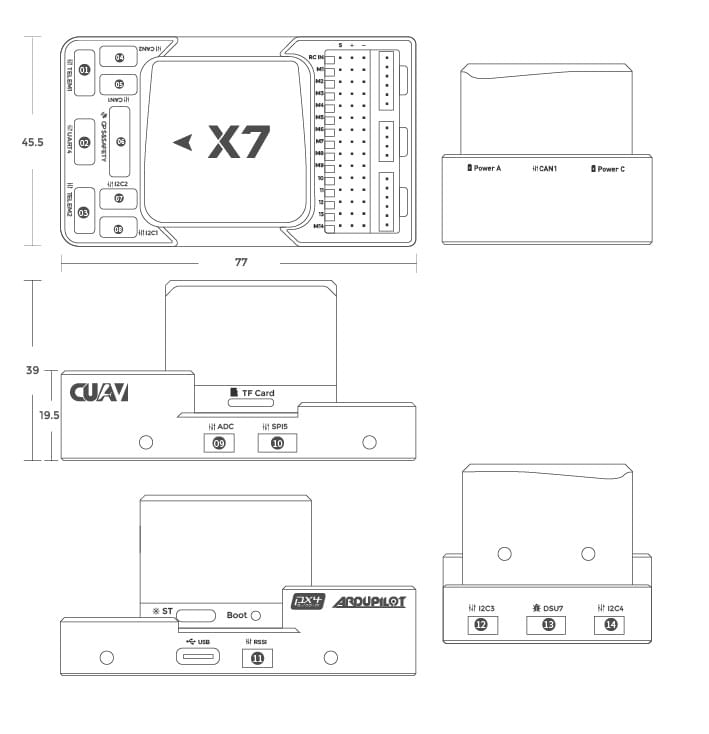
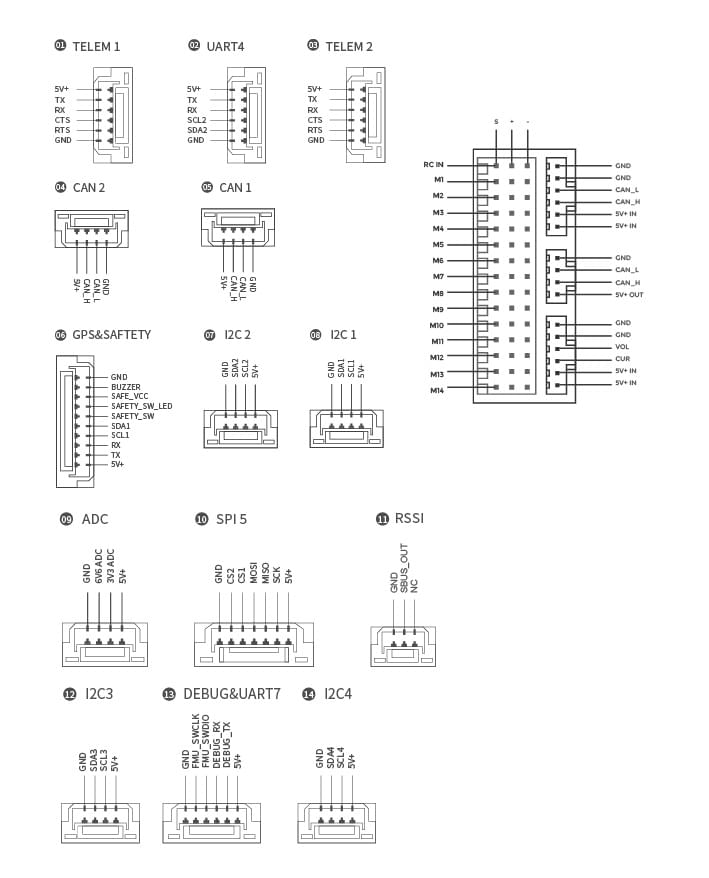

# Польотний контролер CUAV X7

:::warning
PX4 не розробляє цей (або будь-який інший) автопілот.
Contact the [manufacturer](https://www.cuav.net) for hardware support or compliance issues.
:::

The [X7](http://doc.cuav.net/flight-controller/x7/en/x7.html)<sup>&reg;</sup> flight controller is a high-performance autopilot.
Це ідеальний вибір для промислових дронів і великомасштабних важких дронів.
В основному постачається комерційним виробникам.


Контролер польоту використовує модульний дизайн і може бути поєднаний з різними базовими платами.
Ви можете розробити спеціалізовану плату-носій для вашого БПЛА, щоб покращити інтеграцію комерційних систем, зменшити кількість проводів, підвищити надійність системи та підвищити конкурентоспроможність вашого БПЛА (наприклад, інтегруючи датчики швидкості повітря, телеметрію або навіть супутниковий комп'ютер на платі-носії).
CUAV також надає вам на вибір різноманітні несучі плати.

:::info
This flight controller is [manufacturer supported](../flight_controller/autopilot_manufacturer_supported.md).
:::

## Функції

- Внутрішнє поглинання ударів
- Модульна конструкція, може бути саморобною несучою платою
- Підтримка USB_HS, швидше завантаження журналів (PX4 ще не підтримується)
- Підтримка більшої кількості виходів DShot
- Підтримка нагріву IMU, покращення роботи датчика
- Виділений порт для акумулятора CAN
- 3 комплекти датчиків IMU
- Автомобільний компас RM3100
- Високопродуктивний процесор

:::tip
The manufacturer [CUAV Docs](https://doc.cuav.net/flight-controller/x7/en/) are the canonical reference for the X7.
Вони повинні використовуватися за перевагою, оскільки вони містять найбільш повну та актуальну інформацію.
:::

## Короткий опис

- Головний FMU процесор: STM32H743

- Бортові сенсори:

  - Акселерометр/Гіроскоп: ICM-20689
  - Прискорювач/гіроскоп: ICM-20649
  - Акселерометр/Гіроскоп: BMI088
  - Магнітометр: RM3100
  - Барометр: MS5611\*2

- Інтерфейси:
  - 14 ШІМ-виходів （12 підтримує Dshot）
  - Підтримка декількох входів RC (SBU / CPPM / DSM)
  - Аналоговий / PWM вхід RSSI
  - 2 GPS порти (GPS і UART4 порти)
  - 4 шини i2c (два виділені порти i2c)
  - 2 порти CAN шини
  - 2 порти живлення (Power A - загальний інтерфейс адаптера, Power C - інтерфейс акумулятора DroneCAN)
  - 2 входи АЦП
  - 1 USB порт

- Система живлення:
  - Живлення: 4.3~5.4В
  - Вхід USB: 4.75~5.25В
  - Вхід сервоприводу: 0~36V

- Вага та розміри:
  - Вага: 101 g

- Інші характеристики:
  - Робоча температура: -20 ~ 80°c (виміряне значення)
  - Три імуси
  - Підтримка компенсації температури
  - Внутрішнє поглинання ударів

:::info
When it runs PX4 firmware, only 8 pwm works, the remaining 6 pwm are still being adapted, so it is not compatible with VOLT now.
:::

## Де купити

[CUAV Store](https://store.cuav.net)

[CUAV aliexpress](https://www.aliexpress.com/item/4001042683738.html?spm=a2g0o.detail.1000060.2.1ebb2a9d3WDryi&gps-id=pcDetailBottomMoreThisSeller&scm=1007.13339.169870.0&scm_id=1007.13339.169870.0&scm-url=1007.13339.169870.0&pvid=f0df2481-1c0a-44eb-92a4-9c11c6cb3d06&_t=gps-id:pcDetailBottomMoreThisSeller,scm-url:1007.13339.169870.0,pvid:f0df2481-1c0a-44eb-92a4-9c11c6cb3d06,tpp_buckets:668%230%23131923%2320_668%23808%234094%23518_668%23888%233325%2319_668%234328%2319934%23630_668%232846%238115%23807_668%232717%237566%23827_668%231000022185%231000066058%230_668%233468%2315607%2376)

## З'єднання (Проводка)

[CUAV X7 Wiring Quickstart](http://doc.cuav.net/flight-controller/x7/en/quick-start/quick-start-x7.html)

## Розмір та роз'єми





:::warning
The `RCIN` port is limited to powering the RC receiver and cannot be connected to any power/load.
:::

## Номінальна напруга

The _X7 AutoPilot_ can be triple-redundant on the power supply if three power sources are supplied.
The power rails are: **POWERA**, **POWERC** and **USB**.

:::info
The output power rails **PWM OUT** (0V to 36V) do not power the flight controller board (and are not powered by it).
You must supply power to one of **POWERA**, **POWERC** or **USB** or the board will be unpowered.
:::

**Normal Operation Maximum Ratings**

За таких умов всі джерела живлення будуть використовуватися в цьому порядку для живлення системи:

1. **POWERA** and **POWERC** inputs (4.3V to 5.4V)
2. **USB** input (4.75V to 5.25V)

## Збірка прошивки

:::tip
Most users will not need to build this firmware!
It is pre-built and automatically installed by _QGroundControl_ when appropriate hardware is connected.
:::

To [build PX4](../dev_setup/building_px4.md) for this target:

```
make cuav_x7pro_default
```

## Захист від перенапруги

The _X7_ has over-current protection on the 5 Volt Peripheral and 5 Volt high power, which limits the current to 2.5A.
The _X7_ has short circuit protection.

:::warning
Up to 2.5 A can be delivered to the connectors listed as pin 1 (although these are only rated at 1 A).
:::

## Відладочний порт

The system's serial console and SWD interface operate on the **DSU7** port.
Просто підключіть кабель FTDI до роз'єму DSU7 (у списку продуктів є кабель CUAV FTDI).


The [PX4 System Console](../debug/system_console.md) and [SWD interface](../debug/swd_debug.md) operate on the **FMU Debug** port (`DSU7`).

The debug port (`DSU7`) uses a [JST BM06B](https://www.digikey.com.au/product-detail/en/jst-sales-america-inc/BM06B-GHS-TBT-LF-SN-N/455-1582-1-ND/807850) connector and has the following pinout:

| Pin                        | Сигнал                            | Вольтаж               |
| -------------------------- | --------------------------------- | --------------------- |
| 1 (red) | 5V+                               | +5V                   |
| 2 (blk) | DEBUG TX (OUT) | +3.3V |
| 3 (blk) | DEBUG RX (IN)  | +3.3V |
| 4 (blk) | FMU_SWDIO    | +3.3V |
| 5 (blk) | FMU_SWCLK    | +3.3V |
| 6 (blk) | GND                               | GND                   |

CUAV provides a dedicated debugging cable, which can be connected to the `DSU7` port.
This splits out an FTDI cable for connecting the [PX4 System Console](../debug/system_console.md) to a computer USB port, and SWD pins used for SWD/JTAG debugging.
The provided debug cable does not connect to the SWD port `Vref` pin (1).


:::warning
The SWD Vref pin (1) uses 5V as Vref but the CPU is run at 3.3V!

Деякі JTAG-адаптери (SEGGER J-Link) використовують напругу Vref для встановлення напруги на лініях SWD.
For direct connection to _Segger Jlink_ we recommended you use the 3.3 Volts from pin 4 of the connector marked `DSM`/`SBUS`/`RSSI` to provide `Vtref` to the JTAG (i.e. providing 3.3V and _NOT_ 5V).
:::

## Підтримувані платформи / Конструкції

Будь-який мультикоптер / літак / наземна платформа / човен, який може керуватися звичайними RC сервоприводами або сервоприводами Futaba S-Bus.
The complete set of supported configurations can be seen in the [Airframes Reference](../airframes/airframe_reference.md).

## Подальша інформація

- [Quick start](http://doc.cuav.net/flight-controller/x7/en/quick-start/quick-start-x7.html)
- [CUAV docs](http://doc.cuav.net)
- [x7 schematic](https://github.com/cuav/hardware/tree/master/X7_Autopilot)
