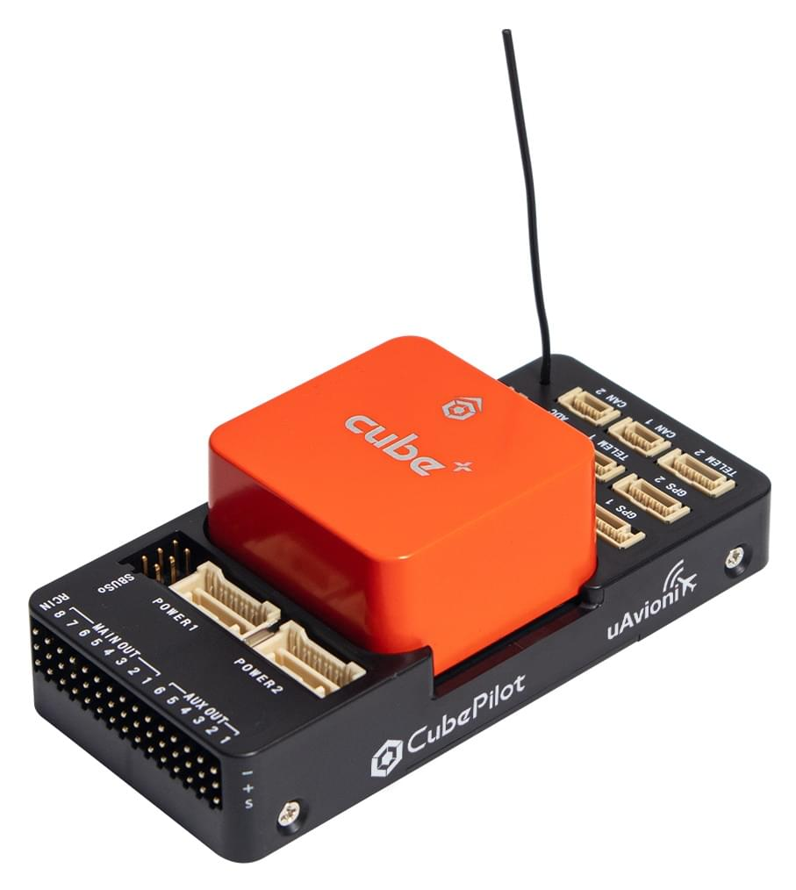

# Контролер польоту CubePilot Cube Orange+

:::warning
PX4 не розробляє цей (або будь-який інший) автопілот.
Contact the [manufacturer](https://cubepilot.org/#/home) for hardware support or compliance issues.
:::

The [Cube Orange+](https://www.cubepilot.com/#/cube/features) flight controller is a flexible autopilot intended primarily for manufacturers of commercial systems.
Cube Orange+ схожий з Cube Orange, але має потужніший двоядерний процесор (STM32H757 та деякі інші сенсори.



Контролер призначений для використання зі специфічною для домену несучою платою, щоб зменшити кількість дротів, підвищити надійність і спростити збірку.
Наприклад, несуча плата для комерційного інспекційного апарату може містити з'єднання для комп'ютера-компаньйона, тоді як несуча плата для пілота може містити ESC для рами транспортного засобу.

Несуча плата ADS-B включає налаштований приймач ADSB-In на 1090 МГц від uAvionix.
Це забезпечує позиціонування і розташування комерційних пілотованих літаків в межах досяжності Cube.
Ця функція автоматично налаштована і ввімкнена у прошивці PX4 за замовчуванням.

Cube має віброізоляцію на двох IMU, з третім фіксованим IMU в якості еталонного/резервного.

:::tip
The manufacturer [Cube Docs](https://docs.cubepilot.org/user-guides/autopilot/the-cube-module-overview) contain detailed information, including an overview of the [Differences between Cube Colours](https://docs.cubepilot.org/user-guides/autopilot/the-cube-module-overview#differences-between-cube-colours).
:::

## Основні характеристики

- 32bit STM32H757ZI (32bit [ARM Cortex M7](https://en.wikipedia.org/wiki/ARM_Cortex-M#Cortex-M7), 400 MHz, Flash 2MB, RAM 1MB).
- 32 bit STM32F103 відмовостійкий копроцесор
- 14 ШІМ / серво виходів (8 з відмовостійкими і ручним керуванням, 6 допоміжних, сумісних з великими потужностями)
- Широкі можливості підключення додаткових периферійних пристроїв (UART, I2C, CAN)
- Інтегрована система резервного копіювання для відновлення в польоті та ручного керування з виділеним процесором та автономним джерелом живлення (для літаків з фіксованим крилом)
- Резервна система інтегрує систему мікшування, забезпечуючи узгоджені режими автопілота та ручного заміщення ( для літаків з фіксованим крилом)
- Резервні входи живлення та автоматичне перемикання на резервне джерело
- Зовнішній запобіжний вимикач
- Головний візуальний індикатор - багатоколірний світлодіод
- Потужний багатотональний п'єзозвуковий індикатор
- Карта microSD для високошвидкісної фіксації даних протягом тривалого періоду часу

<a id="stores"></a>

## Де купити

- [Reseller list](https://www.cubepilot.com/#/reseller/list)

## Збірка

[Cube Wiring Quickstart](../assembly/quick_start_cube.md)

## Характеристики

- **Processor:**
  - STM32H757 (32bit [ARM Cortex M7](https://en.wikipedia.org/wiki/ARM_Cortex-M#Cortex-M7))
  - 400 МГц
  - 1 МБ RAM
  - 2 МБ флеш-пам'яті \(повністю доступна\)
- **Failsafe co-processor:** <!-- inconsistent info on failsafe processor: 32 bit STM32F103 failsafe co-processor http://www.proficnc.com/all-products/191-pixhawk2-suite.html -->
  - STM32F103 (32bit _ARM Cortex-M3_)
  - 24 МГц
  - 8 KB SRAM
- **Sensors:** (all connected via SPI)
  - **Accelerometer:** (3) ICM42688p, ICM20948, ICM20649
  - **Gyroscope:** (3) ICM42688p, ICM20948, ICM20649
  - **Compass:** (1) ICM20948
  - **Barometric Pressure Sensor:** (2) MS5611
- **Operating Conditions:**
  - **Operating Temp:** -10C to 55C
  - **IP rating/Waterproofing:** Not waterproof
  - **Servo rail input voltage:** 3.3V / 5V
  - **USB port input:**
    - Напруга: 4В - 5.7В
    - Номінальний струм: 250 мА
  - **POWER:**
    - Вхідна напруга: 4.1В - 5.7В
    - Номінальний вхідний струм: 2,5 А
    - Номінальна вхідна/вихідна потужність: 14 Вт
- **Dimensions:**
  - **Cube:** 38.25mm x 38.25mm x 22.3mm
  - **Carrier:** 94.5mm x 44.3mm x 17.3mm
- **Interfaces**
  - Порти вводу-виводу: 14 ШІМ-виходів сервоприводів (8 від IO, 6 від FMU)
  - 5x UART (послідовні порти), один високої потужності, 2x з контролем потоку ГВП
  - 2x CAN (один з внутрішнім 3.3В трансивером, один на конекторі розширювача)
  - **R/C inputs:**
    - Spektrum DSM / DSM2 / DSM-X® Satellite сумісний вхід
    - Futaba S.BUS® сумісний вхід і вивід
    - Вхід сигналу PPM-SUM
  - Вхід RSSI (ШІМ або напруга)
  - I2C
  - SPI
  - 3.3В АЦП вхід
  - Внутрішній порт microUSB і розширення зовнішнього порту microUSB

## Порти

### Верхня частина (GPS, TELEM тощо)


## Схема розташування виводів

#### TELEM1, TELEM2 порти

| Pin                        | Сигнал                       | Вольтаж               |
| -------------------------- | ---------------------------- | --------------------- |
| 1 (red) | VCC                          | +5V                   |
| 2 (blk) | TX (OUT)  | +3.3V |
| 3 (blk) | RX (IN)   | +3.3V |
| 4 (blk) | CTS (IN)  | +3.3V |
| 5 (blk) | RTS (OUT) | +3.3V |
| 6 (blk) | GND                          | GND                   |

#### GPS1 порт

| Pin                           | Сигнал                      | Вольтаж               |
| ----------------------------- | --------------------------- | --------------------- |
| 1 (red)    | VCC                         | +5V                   |
| 2 (blk)    | TX (OUT) | +3.3V |
| 3 (blk)    | RX (IN)  | +3.3V |
| 4 (blk)    | SCL I2C2                    | +3.3V |
| 5 (blk)    | SDA I2C2                    | +3.3V |
| 6 (blk)    | Кнопка безпеки              | GND                   |
| 7 (blk)    | Button LED                  | GND                   |
| 8 (чорний) | GND                         | GND                   |

<!-- check is i2c2 -->

#### GPS2 порт

| Pin                        | Сигнал                      | Вольтаж               |
| -------------------------- | --------------------------- | --------------------- |
| 1 (red) | VCC                         | +5V                   |
| 2 (blk) | TX (OUT) | +3.3V |
| 3 (blk) | RX (IN)  | +3.3V |
| 4 (blk) | SCL I2C1                    | +3.3V |
| 5 (blk) | SDA I2C1                    | +3.3V |
| 6 (blk) | GND                         | GND                   |

#### ADC

| Pin                        | Сигнал | Вольтаж                     |
| -------------------------- | ------ | --------------------------- |
| 1 (red) | VCC    | +5V                         |
| 2 (blk) | ADC IN | up to +6.6V |
| 3 (blk) | GND    | GND                         |

#### I2C

| Pin                        | Сигнал | Вольтаж                                           |
| -------------------------- | ------ | ------------------------------------------------- |
| 1 (red) | VCC    | +5V                                               |
| 2 (blk) | SCL    | +3.3 (pullups) |
| 3 (blk) | SDA    | +3.3 (pullups) |
| 4 (blk) | GND    | GND                                               |

#### CAN1 & CAN2

| Pin                        | Сигнал                     | Вольтаж |
| -------------------------- | -------------------------- | ------- |
| 1 (red) | VCC                        | +5V     |
| 2 (blk) | CAN_H | +12V    |
| 3 (blk) | CAN_L | +12V    |
| 4 (blk) | GND                        | GND     |

#### POWER1 & POWER2

| Pin                        | Сигнал          | Вольтаж               |
| -------------------------- | --------------- | --------------------- |
| 1 (red) | VCC             | +5V                   |
| 2 (red) | VCC             | +5V                   |
| 3 (blk) | CURRENT sensing | +3.3V |
| 4 (blk) | VOLTAGE sensing | +3.3V |
| 5 (blk) | GND             | GND                   |
| 6 (blk) | GND             | GND                   |

#### USB

| Pin                        | Сигнал                       | Вольтаж               |
| -------------------------- | ---------------------------- | --------------------- |
| 1 (red) | VCC                          | +5V                   |
| 2 (blk) | OTG_DP1 | +3.3V |
| 3 (blk) | OTG_DM1 | +3.3V |
| 4 (blk) | GND                          | GND                   |
| 5 (blk) | BUZZER                       | Напруга батареї       |
| 6 (blk) | FMU Error LED                |                       |

#### SPKT

| Pin                        | Сигнал | Вольтаж               |
| -------------------------- | ------ | --------------------- |
| 1 (blk) | IN     |                       |
| 2 (blk) | GND    | GND                   |
| 3 (red) | OUT    | +3.3V |

#### TELEM1, TELEM2

| Pin                        | Сигнал                       | Вольтаж                     |
| -------------------------- | ---------------------------- | --------------------------- |
| 1 (red) | VCC                          | +5V                         |
| 2 (blk) | TX (OUT)  | +3.3В до 5В |
| 3 (blk) | RX (IN)   | +3.3В до 5В |
| 4 (blk) | CTS (OUT) | +3.3В до 5В |
| 5 (blk) | RTS (IN)  | +3.3В до 5В |
| 6 (blk) | GND                          | GND                         |

## Налаштування послідовного порту

| UART   | Пристрій   | Порт                                          |
| ------ | ---------- | --------------------------------------------- |
| USART2 | /dev/ttyS0 | TELEM1 (керування потоком) |
| USART3 | /dev/ttyS1 | TELEM2 (керування потоком) |
| UART4  | /dev/ttyS2 | GPS1                                          |
| USART6 | /dev/ttyS3 | PX4IO                                         |
| UART7  | /dev/ttyS4 | CONSOLE/ADSB-IN                               |
| UART8  | /dev/ttyS5 | GPS2                                          |

<!-- Note: Got ports using https://github.com/PX4/PX4-user_guide/pull/672#issuecomment-598198434 -->

<!-- https://github.com/PX4/PX4-Autopilot/blob/main/boards/cubepilot/cubeorange/default.px4board -->

<!-- https://github.com/PX4/PX4-Autopilot/blob/main/boards/cubepilot/cubeorange/nuttx-config/nsh/defconfig#L188-L197 -->

### Порти USB/SDCard


## Збірка прошивки

:::warning
The firmware for Orange+ will be present in releases from PX4 v1.14.
:::

To [build PX4](../dev_setup/building_px4.md) for this target, open up the terminal and enter:

```
make cubepilot_cubeorangeplus
```

:::info
The firmware for Cube Orange+ and Cube Orange are not compatible.
Due to a power feature of the STM32H757 it required [updates in NuttX](https://github.com/PX4/NuttX/pull/214) and therefore a new board config, bootloader, build target, etc.
:::

## Креслення

Board schematics and other documentation can be found here: [The Cube Project](https://github.com/proficnc/The-Cube).

## Додаткова інформація/документація

- [Cube Wiring Quickstart](../assembly/quick_start_cube.md)
- Cube Docs (виробник):
  - [Cube Module Overview](https://docs.cubepilot.org/user-guides/autopilot/the-cube-module-overview)
  - [Cube User Manual](https://docs.cubepilot.org/user-guides/autopilot/the-cube-user-manual)
  - [Mini Carrier Board](https://docs.cubepilot.org/user-guides/carrier-boards/mini-carrier-board)
