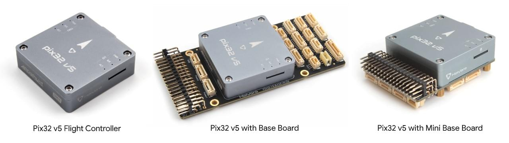
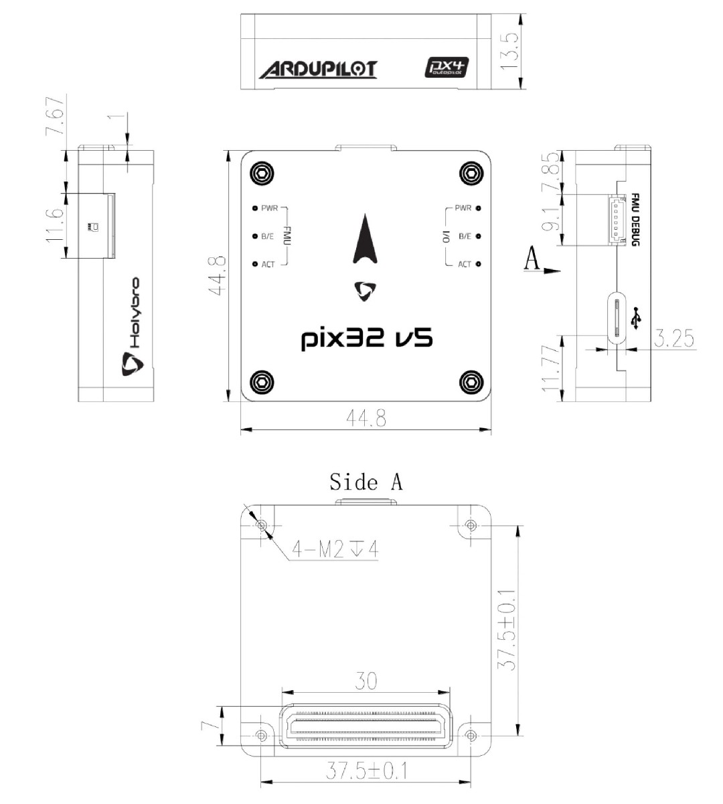

# Holybro Pix32 v5

:::warning
PX4 не розробляє цей (або будь-який інший) автопілот.
Contact the [manufacturer](https://holybro.com/) for hardware support or compliance issues.
:::

[Pix32 v5](https://holybro.com/products/pix32-v5)<sup>&reg;</sup> is an advanced autopilot flight controller designed and made by Holybro<sup>&reg;</sup>.
Він оптимізований для роботи з прошивкою PX4, яка призначена як для академічних, так і для комерційних розробників.
It is based on the [Pixhawk-project](https://pixhawk.org/) **FMUv5** open hardware design and runs PX4 on the [NuttX](https://nuttx.apache.org/) OS.
Це можна вважати варіантом версії Pixhawk4.

Pix32 v5 розроблено для пілотів, які потребують потужності, гнучкої та настроюваної системи керування польотами.
Він складається з окремого контролера польоту та базової плати, які з'єднані 100-контактним роз'ємом.
Цей дизайн дозволяє користувачам вибирати базову плату від Holybro або налаштовувати свою власну.



:::info
This flight controller is [manufacturer supported](../flight_controller/autopilot_manufacturer_supported.md).
:::

## Короткий опис

- Головний FMU процесор: STM32F765
  - 32 Bit Arm® Cortex®-M7, 216MHz, 2MB memory, 512KB RAM
- IO Processor: STM32F100
  - 32 Bit Arm®️ Cortex®️-M3, 24MHz, 8KB SRAM
- Бортові сенсори:
  - Акселератор/гіроскоп: ICM-20689
  - Accel/Gyro: BMI055 або ICM20602
  - Магнітометр: IST8310
  - Барометр: MS5611
- GPS: u-blox Neo-M8N GPS/ГЛОНАСС приймач; інтегрований магнетометр IST8310
- Інтерфейси:
  - 8-16 PWM виходи (8 із IO, 8 із FMU)
  - 3 виділених PWM/Capture входи на FMU
  - Виділений R/C вхід для CPPM
  - Виділений R/C вхід для Spektrum / DSM та S.Bus з аналоговим / PWM RSSI входом
  - Спеціалізований S.BUS вивід сервоприводу
  - 5 загальних послідовних портів
    - 2 з повним контролем потоку
    - 1 з відокремленням 1.5A поточної межі
  - 3 I2C порти
  - 4 шини SPI
    - 1 внутрішня шина датчика високої швидкості SPI з 4 обраними чіпами і 6 DRDY
    - 1 внутрішня SPI шина, виділена для
    - Барометр з 2-ма чіпами, не DRDY
    - 1 внутрішній SPI bus, виділений для FRAM
    - Підтримує спеціалізовану SPI калібрування EEPROM, розташовану на модулі сенсорів
    - 1 зовнішній bus SPI
  - До 2 CANBus для подвійного CAN з послідовним ESC
    - Кожен CANBus має окреме керування тихим контролером або ESC RX-MUX
    - Аналогові входи для напруги / струму з 2 батарей
    - 2 додаткових аналогових входи
- Електрична система:
  - Вивід енергомодуля 4.9~5.5 В
  - Максимальна вхідна напруга: 6 В
  - Максимальний струм у значенні: 120 A
  - Вхід USB Power: 4.75~5.25V
  - Вхід сервоприводу: 0~36V
- Вага та розміри:
  - Розміри: 45x45x13.5мм
  - Вага: 33.0гр
- Environmental Data, Quality & Reliability:
  - Температура роботи: -40 ~ 85°c
  - Температура зберігання: -40 / 85℃
  - CE
  - FCC
  - Сумісний із RoHS (без свинцю)

Additional information can be found in the [Pix32 V5 Technical Data Sheet](https://cdn.shopify.com/s/files/1/0604/5905/7341/files/Holybro_PIX32-V5_technical_data_sheet_v1.1.pdf).

## Де купити

Order from [Holybro website](https://holybro.com/products/pix32-v5).

## Зборка/інсталяція

The [Pix32 v5 Wiring Quick Start](../assembly/quick_start_holybro_pix32_v5.md) provides instructions on how to assemble required/important peripherals including GPS, Power Management Board etc.

## Макети базової плати


## Схема розташування виводів

[_pix32 v5_ and mini baseboard](https://cdn.shopify.com/s/files/1/0604/5905/7341/files/Holybro_Pix32-V5-Base-Mini-Pinouts.pdf)

## Розміри



## Номінальна напруга

_Pix32 v5_ can be triple-redundant on the power supply if three power sources are supplied.
The three power rails are: **POWER1**, **POWER2** and **USB**.

:::info
The output power rails **FMU PWM OUT** and **I/O PWM OUT** (0V to 36V) do not power the flight controller board (and are not powered by it).
You must supply power to one of **POWER1**, **POWER2** or **USB** or the board will be unpowered.
:::

**Normal Operation Maximum Ratings**

За таких умов всі джерела живлення будуть використовуватися в цьому порядку для живлення системи:

1. **POWER1** and **POWER2** inputs (4.9V to 5.5V)
2. **USB** input (4.75V to 5.25V)

**Absolute Maximum Ratings**

За таких умов система не буде витрачати жодної потужності (не буде працювати), але залишиться неушкодженою.

1. **POWER1** and **POWER2** inputs (operational range 4.1V to 5.7V, 0V to 10V undamaged)
2. **USB** input (operational range 4.1V to 5.7V, 0V to 6V undamaged)
3. Servo input: VDD_SERVO pin of **FMU PWM OUT** and **I/O PWM OUT** (0V to 42V undamaged)

## Збірка прошивки

:::tip
Most users will not need to build this firmware!
It is pre-built and automatically installed by _QGroundControl_ when appropriate hardware is connected.
:::

To [build PX4](../dev_setup/building_px4.md) for this target:

```
зробіть holybro_durandal-v1_default
```

## Відладочний порт

The system's [serial console](../debug/system_console.md) and SWD interface runs on the **FMU Debug** port

<!--while the I/O console and SWD interface can be accessed via **I/O Debug** port.-->


The pinout uses the standard [Pixhawk Debug Mini](../debug/swd_debug.md#pixhawk-debug-mini) interface defined in the [Pixhawk Connector Standard](https://github.com/pixhawk/Pixhawk-Standards/blob/master/DS-009%20Pixhawk%20Connector%20Standard.pdf).

## Периферійні пристрої

- [Digital Airspeed Sensor](../sensor/airspeed.md)
- [Telemetry Radio Modules](../telemetry/index.md)
- [Rangefinders/Distance sensors](../sensor/rangefinders.md)

## Підтримувані платформи / Конструкції

Будь-який мультикоптер / літак / наземна платформа / човен, який може керуватися звичайними RC сервоприводами або сервоприводами Futaba S-Bus.
The complete set of supported configurations can be seen in the [Airframes Reference](../airframes/airframe_reference.md).

## Додаткова інформація

- [Pix32 v5 Technical Data Sheet](https://cdn.shopify.com/s/files/1/0604/5905/7341/files/Holybro_PIX32-V5_technical_data_sheet_v1.1.pdf)
- [Pix32 v5 Pinouts](https://cdn.shopify.com/s/files/1/0604/5905/7341/files/Holybro_Pix32-V5-Base-Mini-Pinouts.pdf)
- [Pix32 v5 Base Board Schematic Diagram](https://cdn.shopify.com/s/files/1/0604/5905/7341/files/Holybro_PIX32-V5-BASE-Schematic_diagram.pdf)
- [Pix32 v5 Mini Base Board Schematic Diagram](https://cdn.shopify.com/s/files/1/0604/5905/7341/files/Holybro_PIX32-V5-Base-Mini-Board_Schematic_diagram.pdf)
- [FMUv5 reference design pinout](https://docs.google.com/spreadsheets/d/1-n0__BYDedQrc_2NHqBenG1DNepAgnHpSGglke-QQwY/edit#gid=912976165).
