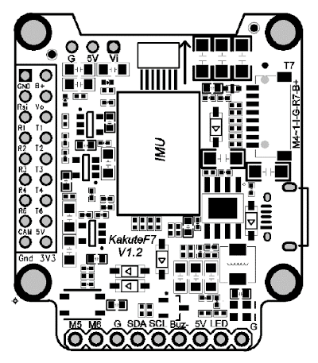
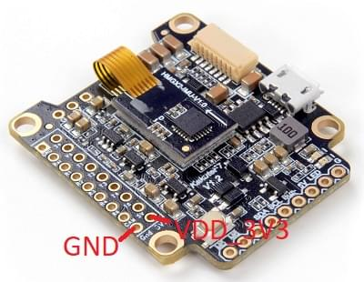

# Holybro Kakute F7 (Знято з виробництва)

<Badge type="info" text="Discontinued" />

:::warning
PX4 не розробляє цей (або будь-який інший) автопілот.
Contact the [manufacturer](https://holybro.com/) for hardware support or compliance issues.
:::

The _Kakute F7_ from Holybro is a flight controller board designed for racers.


:::info
This flight controller is [manufacturer supported](../flight_controller/autopilot_manufacturer_supported.md).
:::

## Основні характеристики

- Main System-on-Chip: [STM32F745VGT6](https://www.st.com/en/microcontrollers-microprocessors/stm32f745vg.html)
  - ЦП: 216 МГц ARM Cortex M7 з одноточністю FPU
  - RAM: 320 KB SRAM
  - FLASH: 1 МБ
- Стандартна форма гонщика: 36x36 мм зі стандартним отвором 30,5 мм
- ICM20689 Accel / Gyro (М'які кріплення)
- BMP280 Baro
- microSD (логування)
- 6 UARTs
- 1 шина I2C
- 6 PWM виводів
- Вбудований чіп OSD (AB7456 через SPI)

## Де купити

Плату можна придбати в одному з наступних магазинів (наприклад):

- [getfpv](https://www.getfpv.com/holybro-kakute-f7-tekko32-f3-metal-65a-4-in-1-esc-combo.html)

:::tip
The _Kakute F7_ is designed to work with the _Tekko32_ 4-in-1 ESC and they can be bought in combination.
:::

## Конектори та контакти

This is the silkscreen for the _Kakute F7_, showing the top of the board:



| Pin          | Функція                                                                                          | PX4 default                 |
| ------------ | ------------------------------------------------------------------------------------------------ | --------------------------- |
| B+           | Позитивна напруга батареї (2S-6S)                                             |                             |
| 5V           | Вихід 5В (максимум 2A)                                                        |                             |
| VO           | Відеовихід на відеопередавач                                                                     |                             |
| VI           | Відеовхід з камери FPV                                                                           |                             |
| G або GND    | Ground                                                                                           |                             |
| SDA, SCL     | Підключення I2C (для периферійних пристроїв)                                  |                             |
| R1, T1       | UART1 RX та TX                                                                                   | TELEM1                      |
| R2, T2       | UART2 RX та TX                                                                                   | TELEM2                      |
| R3, T3       | UART2 RX та TX                                                                                   | Консоль відлагодження NuttX |
| R4, T4       | UART4 RX та TX                                                                                   | GPS1                        |
| R6, T6       | UART6 RX та TX                                                                                   | RC порт                     |
| R7, T7       | UART7 RX та TX (RX знаходиться у роз'ємі для використання з 4-в-1 ESC)        | Телеметрія DShot            |
| LED          | Дріт сигнальний для адресованих світлодіодів WS2182 (не тестувався)           |                             |
| Buz-         | Негативна нога п'єзожучка (Підключіть позитивну ногу динаміку до контакту 5В) |                             |
| 3V3          | 3.3V вивід (200 мA max)                                       |                             |
| M1 до M4     | Вихід сигналу двигуна (розташований у роз'ємі для використання в 4-в-1 ESC)   |                             |
| М5, М6       | Додаткові виходи сигналу двигуна (розташовані на боці плати)                  |                             |
| RSI          | Аналоговий вхід RSSI (0-3,3 В) від приймача                                   |                             |
| Завантаження | Кнопка завантажувача                                                                             |                             |

<a id="bootloader"></a>

## Оновлення завантажувача PX4

The board comes pre-installed with [Betaflight](https://github.com/betaflight/betaflight/wiki).
Before PX4 firmware can be installed, the _PX4 bootloader_ must be flashed.
Download the [kakutef7_bl.hex](https://github.com/PX4/PX4-user_guide/raw/main/assets/flight_controller/kakutef7/kakutef7_bl_0b3fbe2da0.hex) bootloader binary and read [this page](../advanced_config/bootloader_update_from_betaflight.md) for flashing instructions.

## Збірка прошивки

To [build PX4](../dev_setup/building_px4.md) for this target:

```
make holybro_kakutef7_default
```

## Встановлення прошивки PX4

Прошивку можна встановити будь-якими звичайними способами:

- Збудуйте та завантажте джерело
  ```
  make holybro_kakutef7_default upload
  ```
- [Load the firmware](../config/firmware.md) using _QGroundControl_.
  Ви можете використовувати або готове вбудоване програмне забезпечення, або власне користувацьке програмне забезпечення.

## Налаштування

If you use a 4-in-1 ESC with Betaflight/Cleanflight motor assignment you can use the [Actuator](../config/actuators.md) configuration UI to set the motor ordering appropriately.

In addition to the [basic configuration](../config/index.md), the following parameters are important:

| Параметр                                                                                                       | Налаштування                                                                                                                                                  |
| -------------------------------------------------------------------------------------------------------------- | ------------------------------------------------------------------------------------------------------------------------------------------------------------- |
| [SYS_HAS_MAG](../advanced_config/parameter_reference.md#SYS_HAS_MAG) | Це має бути вимкнено, оскільки у платі немає внутрішнього магніту. Ви можете активувати це, якщо приєднаєте зовнішній магніт. |

## Налаштування послідовного порту

| UART   | Пристрій   | Порт                                      |
| ------ | ---------- | ----------------------------------------- |
| USART1 | /dev/ttyS0 | TELEM1                                    |
| USART2 | /dev/ttyS1 | TELEM2                                    |
| USART3 | /dev/ttyS2 | Debug Console                             |
| UART4  | /dev/ttyS3 | GPS1                                      |
| USART6 | /dev/ttyS4 | RC SBUS                                   |
| UART7  | /dev/ttyS5 | Телеметрія ESC (DShot) |

<!-- Note: Got ports using https://github.com/PX4/PX4-user_guide/pull/672#issuecomment-598198434 -->

## Відладочний порт

### Системна консоль

UART3 RX and TX are configured for use as the [System Console](../debug/system_console.md).

### SWD

The [SWD interface](../debug/swd_debug.md) (JTAG) pins are:

- `SWCLK`: Test Point 2 (Pin 72 on the CPU)
- `SWDIO`: Test Point 3 (Pin 76 on CPU)
- `GND`: As marked on board
- `VDD_3V3`: As marked on board

Ці показані нижче.

 
