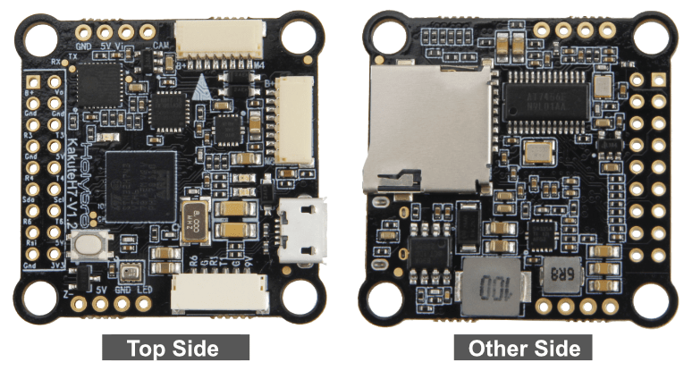
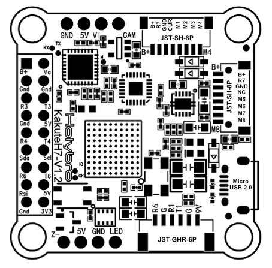
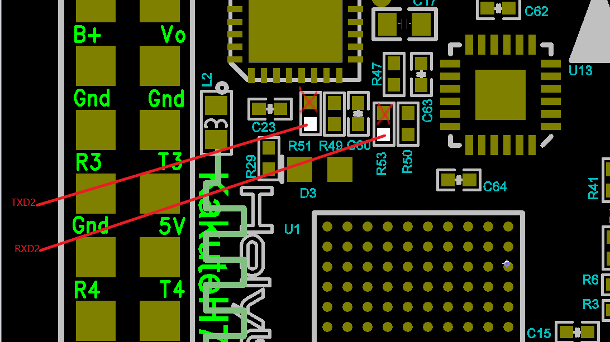
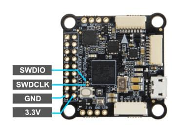

# Holybro Kakute H7

<Badge type="tip" text="PX4 v1.13" />

:::warning
PX4 не розробляє цей (або будь-який інший) автопілот.
Contact the [manufacturer](https://holybro.com/) for hardware support or compliance issues.
:::

The [Holybro Kakute H7](https://holybro.com/products/kakute-h7) is full of features including dual plug-and-play 4in1 ESC ports, HD camera plug, barometer, OSD, 6x UARTs, full Blackbox MicroSD card slot, 5V and 9V BEC, easy soldering layout, and much more.

The Kakute H7 builds upon the best features of its predecessor, the [Kakute F7](../flight_controller/kakutef7.md), and further improves on hardware components and layout.
Подвійні роз'єми підключення 4-в-1 ESC спрощують підтримку конфігурацій x8 та Octocopter, забезпечуючи простоту збирання.

The board also has an on-board barometer, LED & buzzer pad, and I2C pad (SDA & SCL) for external GPS/Magnetometers.



:::info
This flight controller is [manufacturer supported](../flight_controller/autopilot_manufacturer_supported.md).
:::

## Основні характеристики

- MCU: Процесор STM32H743 32-біт, який працює на частоті 480 МГц
- IMU: MPU6000
- Барометр: BMP280
- OSD: AT7456E
- Bluetooth-чіп на борту: вимкнено з PX4
- 2x JST-SH1.0_8pin port (For Single or 4in1 ESCs, x8/Octocopter plug & play compatible)
- 1x JST-GH1.25_6pin port (For HD System like Caddx Vista & Air Unit)
- Напруга вхідної батареї: 2S - 8S
- BEC 5В 2A &Cont.
- BEC 9В 1.5A Cont.
- Монтаж: 30,5 х 30,5 мм / отвір Φ4 мм з прокладками Φ3 люверси
- Розміри: 35 x 35мм
- Вага: 8г

## Де купити

Плату можна придбати в одному з наступних магазинів (наприклад):

- [Holybro](https://holybro.com/products/kakute-h7)

:::tip
The _Kakute H7_ is designed to work with the _Tekko32_ 4-in-1 ESC and they can be bought in combination.
:::

## Конектори та контакти

This is the silkscreen for the _Kakute H7_, showing the top of the board:



| Pin          | Функція                                                                                          | PX4 default                 |
| ------------ | ------------------------------------------------------------------------------------------------ | --------------------------- |
| B+           | Позитивна напруга батареї (2S-8S)                                             |                             |
| SDA, SCL     | Підключення I2C (для периферійних пристроїв)                                  |                             |
| 5V           | Вихід 5В (максимум 2A)                                                        |                             |
| 3V3          | Вихід 3.3В (максимум 0.25A)                   |                             |
| VI           | Відеовхід з камери FPV                                                                           |                             |
| VO           | Відеовихід на відеопередавач                                                                     |                             |
| CAM          | Контроль OSD камери                                                                              |                             |
| G або GND    | Ground                                                                                           |                             |
| RSI          | Аналоговий вхід RSSI (0-3,3 В) від приймача                                   |                             |
| R1, T1       | UART1 RX та TX                                                                                   | TELEM1                      |
| R3, T3       | UART2 RX та TX                                                                                   | Консоль відлагодження NuttX |
| R4, T4       | UART4 RX та TX                                                                                   | GPS1                        |
| R6, T6       | UART6 RX та TX (R6 також розташований в GH plug)                              | RC порт                     |
| R7           | UART7 RX (RX знаходиться у роз'ємах для використання з 4-в-1 ESC)             | Телеметрія DShot            |
| LED          | Дріт сигнальний для адресованих світлодіодів WS2182 (не тестувався)           |                             |
| Z-           | Негативна нога п'єзожучка (Підключіть позитивну ногу динаміку до контакту 5В) |                             |
| M1 до M4     | Вихід сигналу двигуна (розташований у роз'ємі для використання в 4-в-1 ESC)   |                             |
| M5 to M8     | Вихід сигналу двигуна (розташований у роз'ємі для використання в 4-в-1 ESC)   |                             |
| Завантаження | Кнопка завантажувача                                                                             |                             |

## PX4 Bootloader Update {#bootloader}

The board comes pre-installed with [Betaflight](https://github.com/betaflight/betaflight/wiki).
Before PX4 firmware can be installed, the _PX4 bootloader_ must be flashed.
Download the [kakuteh7_bl.hex](https://github.com/PX4/PX4-user_guide/raw/main/assets/flight_controller/kakuteh7/holybro_kakuteh7_bootloader.hex) bootloader binary and read [this page](../advanced_config/bootloader_update_from_betaflight.md) for flashing instructions.

## Збірка прошивки

To [build PX4](../dev_setup/building_px4.md) for this target:

```sh
make holybro_kakuteh7_default
```

## Встановлення прошивки PX4

Прошивку можна встановити будь-якими звичайними способами:

- Збудуйте та завантажте джерело

  ```sh
  make holybro_kakuteh7_default upload
  ```

- [Load the firmware](../config/firmware.md) using _QGroundControl_.
  Ви можете використовувати або готове вбудоване програмне забезпечення, або власне користувацьке програмне забезпечення.

:::info
Якщо ви завантажуєте готове програмне забезпечення через QGroundcontrol, вам необхідно використовувати щоденну версію QGC або версію QGC новішу за 4.1.7.
:::

## Конфігурація PX4

In addition to the [basic configuration](../config/index.md), the following parameters are important:

| Параметр                                                                                                       | Налаштування                                                                                                                                                  |
| -------------------------------------------------------------------------------------------------------------- | ------------------------------------------------------------------------------------------------------------------------------------------------------------- |
| [SYS_HAS_MAG](../advanced_config/parameter_reference.md#SYS_HAS_MAG) | Це має бути вимкнено, оскільки у платі немає внутрішнього магніту. Ви можете активувати це, якщо приєднаєте зовнішній магніт. |

## Налаштування послідовного порту

| UART   | Пристрій   | Порт                                      |
| ------ | ---------- | ----------------------------------------- |
| USART1 | /dev/ttyS0 | TELEM1                                    |
| USART2 | /dev/ttyS1 | TELEM2                                    |
| USART3 | /dev/ttyS2 | Debug Console                             |
| UART4  | /dev/ttyS3 | GPS1                                      |
| USART6 | /dev/ttyS4 | RC SBUS                                   |
| UART7  | /dev/ttyS5 | Телеметрія ESC (DShot) |

### Using TELEM2 (USART2)

The `TELEM2` port (USART2) has no exposed solder pads as it is intended for use with Bluetooth telemetry (this does not work with PX4).

You can expose the solder pads and use the port by removing the two resistors marked with an X.
No other configuration should be required.



## Відладочний порт

### Системна консоль

UART3 RX and TX are configured for use as the [System Console](../debug/system_console.md).

### SWD

The [SWD interface](../debug/swd_debug.md) (JTAG) pins are:

- `SWCLK`: Test Point 2 (Pin 72 on the CPU)
- `SWDIO`: Test Point 3 (Pin 76 on CPU)
- `GND`: As marked on board
- `VDD_3V3`: As marked on board

Ці показані нижче.


