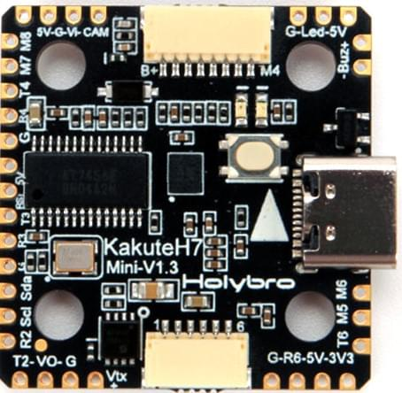
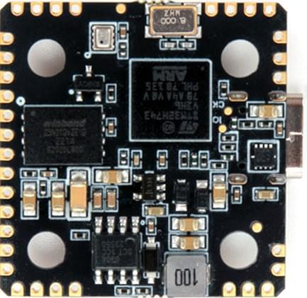

# Holybro Kakute H7 mini

<Badge type="tip" text="PX4 v1.13" />

:::warning
PX4 не розробляє цей (або будь-який інший) автопілот.
Contact the [manufacturer](https://holybro.com/) for hardware support or compliance issues.
:::

The [Holybro Kakute H7 mini](https://holybro.com/collections/autopilot-flight-controllers/products/kakute-h7-mini) flight controller is intended for lightweight frame builds (such as racers, etc.).

Цей контролер польоту повний функцій, включаючи роз'єм для HD-камери, подвійні роз'єми ESC 4in1 plug-and-play, перемикач VTX ON/OFF Pit (напруга батареї), барометр, OSD, 6x UART, 128 МБ Flash для журналювання (ще не підтримується з PX4), BEC на 5В, та більші пластини для паяння з простим розташуванням та багато іншого.

The Kakute H7 mini builds upon the best features of its predecessor, the [Kakute F7](../flight_controller/kakutef7.md), and the [Kakute H7](../flight_controller/kakuteh7.md). The board also has an on-board barometer, LED & buzzer pad, and I2C pad (SDA & SCL) for external GPS/magnetometers.

 

:::info
This flight controller is [manufacturer supported](../flight_controller/autopilot_manufacturer_supported.md).
:::

:::info
PX4 runs on the H7 mini v1.3 and later.
:::

## Основні характеристики

- MCU: Процесор STM32H743 32-біт, який працює на частоті 480 МГц
- IMU: BMI270
- Барометр: BMP280
- OSD: AT7456E
- 6x UARTs (1,2,3,4,6,7)
- VTX On/Off Pit Switch: Не використовується з PX4
- 9x Вихід PWM (8 Вихід Двигуна, 1 Світлодіод)
- 2x JST-SH1.0_8pin port (For Single or 4in1 ESCs, x8/Octocopter plug & play compatible)
- 1x JST-GH1.5_6pin port (For HD System like Caddx Vista & Air Unit)
- Напруга введення батареї: 2S-6S
- BEC 5В 2A &Cont.
- Mounting: 20 x 20mm/Φ3.6mm hole with M3 & M2 Grommets
- Розміри: 30x31x6мм
- Вага: 5.5г

## Де купити

Плату можна придбати в одному з наступних магазинів (наприклад):

- [Holybro](https://holybro.com/products/kakute-h7-mini)

## Конектори та контакти


| Pin          | Функція                                                                                          | PX4 default                 |
| ------------ | ------------------------------------------------------------------------------------------------ | --------------------------- |
| B+           | Позитивна напруга батареї (2S-6S)                                             |                             |
| VTX+         | Позитивна напруга батареї (2S-6S)                                             |                             |
| SDA, SCL     | Підключення I2C (для периферійних пристроїв)                                  |                             |
| 5V           | Вихід 5В (максимум 2A)                                                        |                             |
| 3V3          | Вихід 3.3В (максимум 0.25A)                   |                             |
| VI           | Відеовхід з камери FPV                                                                           |                             |
| VO           | Відеовихід на відеопередавач                                                                     |                             |
| CAM          | Контроль OSD камери                                                                              |                             |
| G або GND    | Ground                                                                                           |                             |
| RSI          | Аналоговий вхід RSSI (0-3,3 В) від приймача                                   |                             |
| R1, T1       | UART1 RX та TX                                                                                   | TELEM1                      |
| R2, T2       | UART2 RX та TX                                                                                   | TELEM2                      |
| R3, T3       | UART2 RX та TX                                                                                   | Консоль відлагодження NuttX |
| R4, T4       | UART4 RX та TX                                                                                   | GPS1                        |
| R6, T6       | UART6 RX та TX (R6 також розташований в GH plug)                              | RC порт                     |
| R7           | UART7 RX (RX знаходиться у роз'ємах для використання з 4-в-1 ESC)             | Телеметрія DShot            |
| LED          | Дріт сигнальний для адресованих світлодіодів WS2182 (не тестувався)           |                             |
| Z-           | Негативна нога п'єзожучка (Підключіть позитивну ногу динаміку до контакту 5В) |                             |
| M1 до M4     | Вихід сигналу двигуна (розташований у роз'ємі для використання в 4-в-1 ESC)   |                             |
| M5 to M8     | Вихід сигналу двигуна (розташований у роз'ємі для використання в 4-в-1 ESC)   |                             |
| Завантаження | Кнопка завантажувача                                                                             |                             |

<a id="bootloader"></a>

## Оновлення завантажувача PX4

The board comes pre-installed with [Betaflight](https://github.com/betaflight/betaflight/wiki).
Before the PX4 firmware can be installed, the _PX4 bootloader_ must be flashed.
Download the [holybro_kakuteh7mini_bootloader.hex](https://github.com/PX4/PX4-user_guide/raw/main/assets/flight_controller/kakuteh7mini/holybro_kakuteh7mini_bootloader.hex) bootloader binary and read [this page](../advanced_config/bootloader_update_from_betaflight.md) for flashing instructions.

## Збірка прошивки

To [build PX4](../dev_setup/building_px4.md) for this target:

```
make holybro_kakuteh7mini_default
```

## Встановлення прошивки PX4

:::info
Якщо ви завантажуєте готове програмне забезпечення через QGroundcontrol, вам необхідно використовувати щоденну версію QGC або версію QGC новішу за 4.1.7.
До випуску вам потрібно буде вручну зібрати та встановити прошивку.
:::

Прошивку можна встановити вручну будь-якими звичайними способами:

- Збудуйте та завантажте джерело:

  ```
  make holybro_kakuteh7mini_default upload
  ```

- [Load the firmware](../config/firmware.md) using _QGroundControl_.
  Ви можете використовувати або готове вбудоване програмне забезпечення, або власне користувацьке програмне забезпечення.

:::info
KakuteH7mini is supported with PX4 main and v1.14 or newer.
:::

## Конфігурація PX4

In addition to the [basic configuration](../config/index.md), the following parameters are important:

| Параметр                                                                                                       | Налаштування                                                                                                                                                  |
| -------------------------------------------------------------------------------------------------------------- | ------------------------------------------------------------------------------------------------------------------------------------------------------------- |
| [SYS_HAS_MAG](../advanced_config/parameter_reference.md#SYS_HAS_MAG) | Це має бути вимкнено, оскільки у платі немає внутрішнього магніту. Ви можете активувати це, якщо приєднаєте зовнішній магніт. |

## Налаштування послідовного порту

| UART   | Пристрій   | Порт                                      |
| ------ | ---------- | ----------------------------------------- |
| USART1 | /dev/ttyS0 | TELEM1                                    |
| UART2  | /dev/ttyS1 | TELEM2                                    |
| USART3 | /dev/ttyS2 | Debug Console                             |
| UART4  | /dev/ttyS3 | GPS1                                      |
| USART6 | /dev/ttyS4 | RC SBUS                                   |
| UART7  | /dev/ttyS5 | Телеметрія ESC (DShot) |

## Відладочний порт

### Системна консоль

UART3 RX and TX are configured for use as the [System Console](../debug/system_console.md).

### SWD

The [SWD interface](../debug/swd_debug.md) (JTAG) pins are:

- `SWCLK`: Test Point 2 (Pin 72 on the CPU)
- `SWDIO`: Test Point 3 (Pin 76 on CPU)
- `GND`: As marked on board
- `VDD_3V3`: As marked on board
