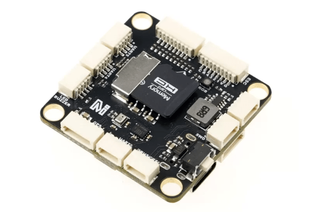
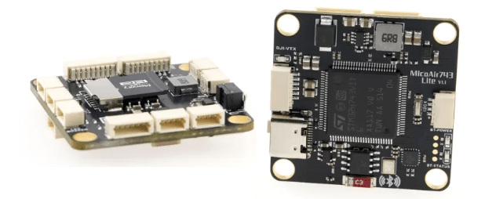
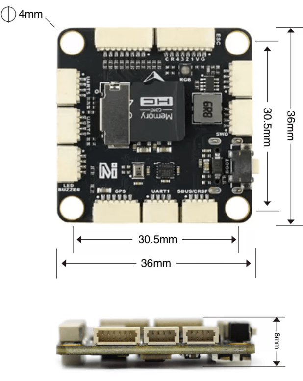
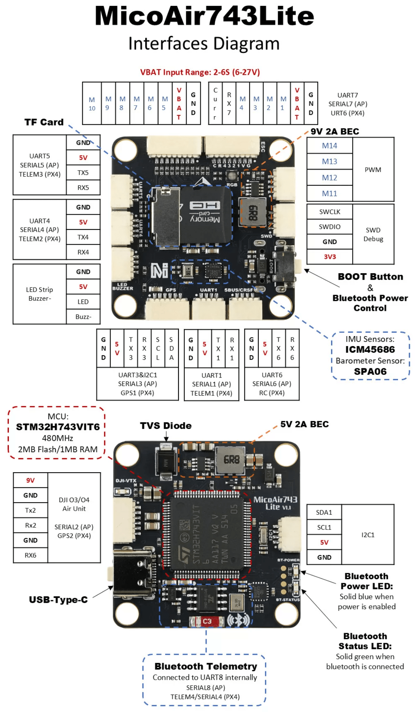
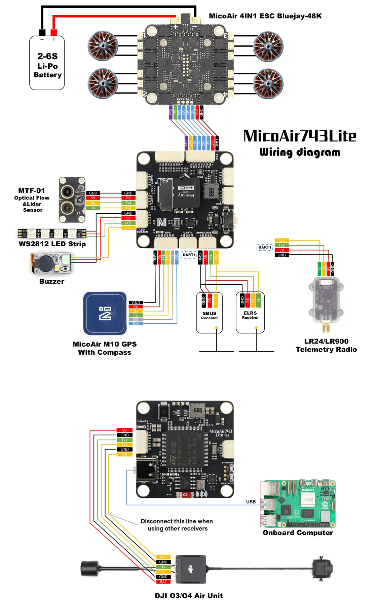

# MicoAir743-Lite

<Badge type="tip" text="main (planned for: PX4 v1.17)" />

:::warning
PX4 не розробляє цей (або будь-який інший) автопілот.
Contact the [manufacturer](https://micoair.com/) for hardware support or compliance issues.
:::

MicoAir743-Lite is an ultra-high performance H743 flight controller with an unbeatable price, featuring the ICM45686 IMU sensor and integrated Bluetooth telemetry.



Equipped with a high-performance H7 processor, the MicoAir743-Lite features a compact form factor with SH1.0 connectors (which are more suitable than Pixhawk-standard GH1.25 for this board size).
When paired with with Bluetooth telemetry, the board can be debugged with a phone or PC.

:::info
This flight controller is [manufacturer supported](../flight_controller/autopilot_manufacturer_supported.md).
:::

## MicoAir743-Lite (v1.1)



## Короткий опис

### Processors & Sensors

- FMU Processor: STM32H743
  - 32 Bit Arm® Cortex®-M7, 480MHz, 2MB flash memory, 1MB RAM
- Сенсори на платі
  - Accel/Gyro: ICM-45686 (with BalancedGyro™ Technology)
  - Barometer: SPA06
- On-board Bluetooth Telemetry
  - Connected to UART8 internally, baudrate 115200
  - Connecting to QGC (PC or Android phone) via Bluetooth
- Інші характеристики:
  - Operating & storage temperature: -20 ~ 85°c

### Інтерфейси

- 8 UART (TELEM / GPS / RC)
- 14 PWM outputs （10 supports DShot）
- Support multiple RC inputs (SBUS / CRSF / DSM)
- 1 GPS port
- 1 I2C порт
- 2 ADC port2 (VBAT, Current)
- 1 DJI O3/O4 VTX connector
- 1 MicroSD Card Slot
- 1 USB Type-C

### Електричні дані

- VBAT Input:
  - 2\~6S (6\~27V)
- USB Power Input:
  - 4.75\~5.25V
- BEC Output:
  - 5V 2A (for controller, receiver, GPS, optical flow or other devices)
  - 9V 2A (for video transmitter, camera)

### Механічні характеристики

- Mounting: 30.5 x 30.5mm, Φ4mm
- Dimensions: 36 x 36 x 8 mm
- Weight: 10g



## Де купити

Order from [MicoAir Tech Store](https://store.micoair.com/product/micoair743-lite/).

## Схема розташування виводів

Pinouts definition can be found in the [MicoAir743-Lite_pinout.xlsx](https://raw.githubusercontent.com/PX4/PX4-Autopilot/refs/heads/main/docs/assets/flight_controller/micoair743_lite/micoair743_lite_pinout.xlsx) file.

## Налаштування послідовного порту

| UART   | Пристрій   | Порт   |
| ------ | ---------- | ------ |
| USART1 | /dev/ttyS0 | TELEM1 |
| USART2 | /dev/ttyS1 | GPS2   |
| USART3 | /dev/ttyS2 | GPS1   |
| UART4  | /dev/ttyS3 | TELEM2 |
| UART5  | /dev/ttyS4 | TELEM3 |
| USART6 | /dev/ttyS5 | RC     |
| UART7  | /dev/ttyS6 | URT6   |
| UART8  | /dev/ttyS7 | TELEM4 |

## Interfaces Diagram

:::note
All the connectors used on the board are SH1.0
:::



## Зразок схеми з'єднань



## Збірка прошивки

To [build PX4](../dev_setup/building_px4.md) for this target:

```sh
make micoair_h743-lite_default
```

## Встановлення прошивки PX4

Прошивку можна встановити будь-якими звичайними способами:

- Збудуйте та завантажте джерело

  ```sh
  make micoair_h743-lite_default upload
  ```

- [Load the firmware](../config/firmware.md) using _QGroundControl_.
  Ви можете використовувати або готове вбудоване програмне забезпечення, або власне користувацьке програмне забезпечення.

  ::: info
  At time of writing the only pre-built software is `PX4 main` (see [Installing PX4 Main, Beta or Custom Firmware](../config/firmware.md#installing-px4-main-beta-or-custom-firmware)).
  Release builds will be supported for PX4 v1.17 and later.

:::

## Радіоуправління

A [Radio Control (RC) system](../getting_started/rc_transmitter_receiver.md) is required if you want to manually control your vehicle (PX4 does not require a radio system for autonomous flight modes).

The RC port is connected to the FMU and you can attach a receiver that uses the protocols `DSM`, `SBUS`, `CSRF`, `GHST`, or other protocol listed in [Radio Control modules](../modules/modules_driver_radio_control.md).
You will need to enable the protocol by setting the corresponding parameter `RC_xxxx_PRT_CFG`, such as [RC_CRSF_PRT_CFG](../advanced_config/parameter_reference.md#RC_CRSF_PRT_CFG) for a [CRSF receiver](../telemetry/crsf_telemetry.md).

## Підтримувані платформи / Конструкції

Будь-який мультикоптер / літак / наземна платформа / човен, який може керуватися звичайними RC сервоприводами або сервоприводами Futaba S-Bus.
The complete set of supported configurations can be seen in the [Airframes Reference](../airframes/airframe_reference.md).

## Периферійні пристрої

- [MicoAir Telemetry Radio Modules](https://micoair.com/radio_telemetry/)
- [MicoAir Optical & Range Sensor](https://micoair.com/optical_range_sensor/)
- [MicoAir GPS](https://micoair.com/gps/)
- [MicoAir ESC Modules](https://micoair.com/esc/)

## Подальша інформація

- [MicoAir Tech.](https://micoair.com/)
- [Details about MicoAir743-Lite](https://micoair.com/flightcontroller_micoair743lite/)
- [QGroundControl Download and Install](https://docs.qgroundcontrol.com/Stable_V5.0/en/qgc-user-guide/getting_started/download_and_install.html)
