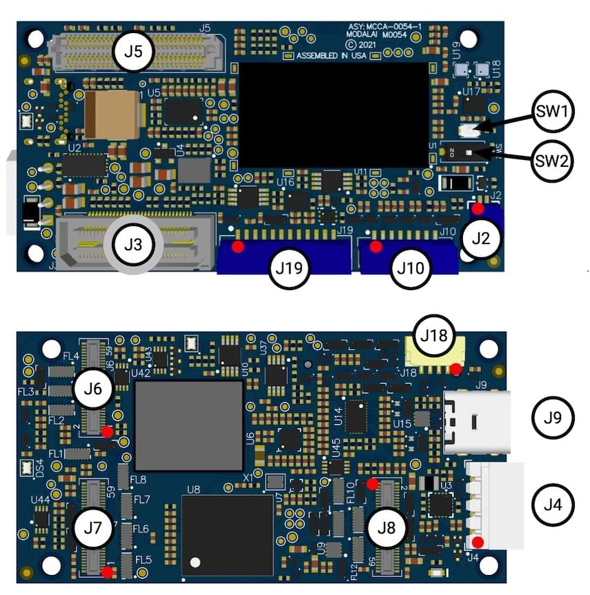

# ModalAI VOXL 2

:::warning
PX4 не розробляє цей (або будь-який інший) автопілот.
Contact the [manufacturer](https://forum.modalai.com/) for hardware support or compliance issues.
:::

The ModalAI [VOXL 2](https://modalai.com/voxl-2) ([Datasheet](https://docs.modalai.com/voxl2-datasheets/)) is ModalAI’s next-gen autonomous computing platform built around the Qualcomm QRB5165 processor. VOXL 2 має 8 ядер, вбудований PX4, сім одночасних камер, бортовий ШІ до 15+ TOPS та підтримку 5G зв'язку. З вагою 16 грамів, VOXL 2 - це майбутнє повністю автономних та підключених дронів!

:::info
This flight controller is [manufacturer supported](../flight_controller/autopilot_manufacturer_supported.md).
:::

## Характеристики

### Система

| Характеристика                                                                               | VOXL 2                                                                                                             |
| -------------------------------------------------------------------------------------------- | ------------------------------------------------------------------------------------------------------------------ |
| CPU                                                                                          | QRB5165  8 ядер до 3.091ГГц  8ГБ LPDDR5 128ГБ Flash                                       |
| OS                                                                                           | Ubuntu 18.04 - Linux Kernel v4.19                                                  |
| GPU                                                                                          | Графічний процесор Adreno 650 - 1024 ALU                                                                           |
| NPU                                                                                          | 15 TOPS                                                                                                            |
| Налаштування контролера польоту                                                              | Так (датчики DSP, PX4)                                                                          |
| Вбудований WiFi                                                                              | Ні                                                                                                                 |
| Додаткове підключення                                                                        | WiFi, 5G, 4G/LTE, Microhard                                                                                        |
| Кодування відео                                                                              | 8K30 h.264/h.265 108MP still images                                                |
| Датчики комп'ютерного зору                                                                   | QTY 6 4-lane CSI, QTY4 CCI (e.g. 2 stereo pair, hires, трекінг) |
| Датчик трекінгу                                                                              | Так                                                                                                                |
| Розміри                                                                                      | 70мм х 36мм                                                                                                        |
| Вага                                                                                         | 16г                                                                                                                |
| VOXL SDK: навігація без GPS, SLAM, уникання перешкод, розпізнавання об'єктів | Так                                                                                                                |
| ROS                                                                                          | ROS 1 & 2                                                                                      |
| QGroundControl                                                                               | Так                                                                                                                |
| ATAK                                                                                         | Так                                                                                                                |
| Сумісний з NDAA ’20 Section 848                                                              | Так, зібрано в США                                                                                                 |
| PMD TOF                                                                                      | Так (SDK 1.0 та новіше)                                                         |
| FLIR Boson                                                                                   | USB                                                                                                                |
| FLIR Lepton                                                                                  | USB, SPI                                                                                                           |

:::info
More detailed hardware documentation can be found [here](https://docs.modalai.com/voxl-flight-datasheet/).
:::

## Розміри

### 2D розмір

### 3D розміри

[3D STEP File](https://storage.googleapis.com/modalai_public/modal_drawings/M0054_VOXL2_PVT_SIP_REVA.step)

## Сумісність прошивки PX4

### гілка voxl-dev

ModalAI is actively maintaining a [branched PX4 version](https://github.com/modalai/px4-firmware/tree/voxl-dev) that can be used.

As VOXL 2 runs Ubuntu, the production releases of PX4 for VOXL 2 are distributed through [apt package management](https://docs.modalai.com/configure-pkg-manager/) and the [VOXL SDK](https://docs.modalai.com/voxl-sdk/).

More information about the firmware can be found [here](https://docs.modalai.com/voxl2-px4-developer-guide/).

### основна гілка

PX4 mainline supports VOXL 2 (board documentation [here](https://github.com/PX4/PX4-Autopilot/tree/main/boards/modalai/voxl2)).

## QGroundControl Підтримка

Ця плата підтримується QGroundControl 4.0 та пізнішими версіями.

## Доступність

- [PX4 Autonomy Developer Kit](https://www.modalai.com/products/px4-autonomy-developer-kit)
- [Starling 2](https://www.modalai.com/products/starling-2)
- [Starling 2 MAX](https://www.modalai.com/products/starling-2-max)
- [Sentinel Development Drone powered by VOXL 2](https://www.modalai.com/pages/sentinel)
  - [Demo Video](https://www.youtube.com/watch?v=hMhQgWPLGXo)
- [VOXL 2 Flight Deck, ready to mount, tune and fly](https://www.modalai.com/collections/ready-to-mount/products/voxl-2-flight-deck)
- [VOXL 2 Development Kits](https://www.modalai.com/products/voxl-2)
  - [Demo Video](https://www.youtube.com/watch?v=aVHBWbwp488)

## Швидкий Старт

Quickstarts from the vendor are located [here](https://docs.modalai.com/voxl2-quickstarts/).

### VOXL SDK

VOXL SDK (Software Development Kit) consists of the open source [voxl-px4](https://docs.modalai.com/voxl-px4/), [core libraries](https://docs.modalai.com/core-libs/), [services](https://docs.modalai.com/mpa-services/), [tools](https://docs.modalai.com/inspect-tools/), [utilities](https://docs.modalai.com/sdk-utilities/), and [build environments](https://docs.modalai.com/build-environments/) that ModalAI provide to accelerate the use and development of VOXL compute boards and accessories.

VOXL SDK працює на VOXL, VOXL 2 та RB5 Flight!

Вихідний код для проєктів у межах VOXL SDK можна знайти на https://gitlab.com/voxl-public, поруч з інструкціями зі збірки.

### З’єднання

Detailed information about the pinouts can be found [here](https://docs.modalai.com/voxl2-connectors/) along with a [video overview here](https://www.youtube.com/watch?v=xmqI3msjqdo)

Усі односторонні сигнали на роз'ємах B2B J3, J5, J6, J7 та J8 є 1,8В CMOS, якщо явно не вказано інше.
All single ended signals on cable-to-board connectors J10, J18, & J19 are 3.3V CMOS unless explicitly noted.

| З’єднання | Опис                                                             | MPN (Сторона плати)                      | З'єднання MPN (сторона плати/кабелю) | Тип                          | Загальний опис функцій сигналізації                                                                                                                                                                                                                                                                                                                 |
| --------- | ---------------------------------------------------------------- | ----------------------------------------------------------- | ------------------------------------------------------- | ---------------------------- | --------------------------------------------------------------------------------------------------------------------------------------------------------------------------------------------------------------------------------------------------------------------------------------------------------------------------------------------------- |
| J2        | Охолодження                                                      | SM02B-SRSS-TB(LF)(SN) | SHR-02V-S                                               | Cable Header, 2-pin R/A      | 5V DC для вентилятора + регулювання FAN-повернення (GND)                                                                                                                                                                                                                                                                         |
| J3        | Legacy B2B                                                       | QSH-030-01-L-D-K-TR                                         | QTH-030-01-L-D-A-K-TR                                   | B2B накопичувач, 60-pin      | 5V/3.8V/3.3V/1.8V живлення для плати, JTAG і Debug Signals QUP expansion, GPIOs, USB3.1 Gen 2 (USB1)                                                                                                                                                             |
| J4        | Максимальна потужність                                           | 22057045                                                    | 0050375043                                              | Конектор, 4-pin R/A          | +5В основний постійний струм + GND, I2C@5V для живлення моніторів                                                                                                                                                                                                                                                                      |
| J5        | Високошвидкісне підключення плата-плата (B2B) | ADF6-30-03.5-L-4-2-A-TR                     | ADM6-30-01.5-L-4-2-A-TR                 | B2B Роз'єм, 120-pin          | Більше потужності 3.8V/3.3V/1.8V для встановлюваних плат, потужність 5V для режиму «SOM», розширення QUP, GPIO (включно з I2S), SDCC (SD Card V3.0), UFS1 (другорядна UFS Flash), 2L PCIe Gen 3, AMUX та сигнали SPMI PMIC |
| J6        | Група камери 0                                                   | DF40C-60DP-0.4V(51)      | DF40C-60DS-0.4V                         | B2B плагін, 60-пін           | Qty-2 4L MIPI порти CSI, сигнали управління CCI і камери, 8 рейок живлення (від 1.05-V до 5V) для камер і інших сенсорів, виділених порту SPI (QUP)                                                                                                                                           |
| J7        | Група камери 1                                                   | DF40C-60DP-0.4V(51)      | DF40C-60DS-0.4V                         | B2B плагін, 60-пін           | Qty-2 4L MIPI порти CSI, сигнали управління CCI і камери, 8 рейок живлення (від 1.05-V до 5V) для камер і інших сенсорів, виділених порту SPI (QUP)                                                                                                                                           |
| J8        | Група камери 2                                                   | DF40C-60DP-0.4V(51)      | DF40C-60DS-0.4V                         | B2B плагін, 60-пін           | Qty-2 4L MIPI порти CSI, сигнали управління CCI і камери, 8 рейок живлення (від 1.05-V до 5V) для камер і інших сенсорів, виділених порту SPI (QUP)                                                                                                                                           |
| J9        | USB-C (ADB)                                   | UJ31-CH-3-SMT-TR                                            | USB Type-C                                              | Кабель-з'єднувач, 24-pin R/A | ADB USB-C з перезапуском та альтернативним режимом відображення порту (USB0)                                                                                                                                                                                                                                                     |
| J10       | Розширення SPI                                                   | SM08B-GHS-TB(LF)(SN)  | GHR-08V-S                                               | Конектор, 8-pin R/A          | SPI@3.3V з 2 CS_N пінами, 32kHz CLK_OUT@3.3V                                                                                                                                                                                                    |
| J18       | ESC (Доступ SLPI)                             | SM04B-GHS-TB(LF)(SN)  | GHR-04V-S                                               | Конектор, 4-pin R/A          | ESC UART@3.3V, опорна напруга 3.3V                                                                                                                                                                                                                                                                     |
| J19       | GNSS/MAG/RC/I2C (доступ SLPI)                 | SM12B-GHS-TB(LF)(SN)  | GHR-12V-S                                               | Конектор, 6-pin R/A          | GNSS UART@3.3V, Магнетометр I2C@3.3V, 5V, RC UART, Запасна I2C                                                                                                                                                                                                                            |

### Посібник користувача

The PX4 user guide for VOXL 2 is available [here](https://docs.modalai.com/voxl-px4/).

### Інструкція розробника

The PX4 developer guide for VOXL 2 is available [here](https://docs.modalai.com/voxl-px4-developer-guide/).

### Як зібрати

See the [VOXL PX4 Build Guide](https://docs.modalai.com/voxl2-px4-build-guide/) on how to build.

## Підтримка

Please visit the [ModalAI Forum](https://forum.modalai.com/category/26/voxl-2) for more information.
