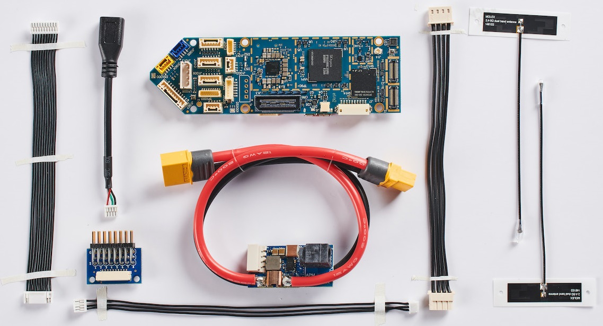
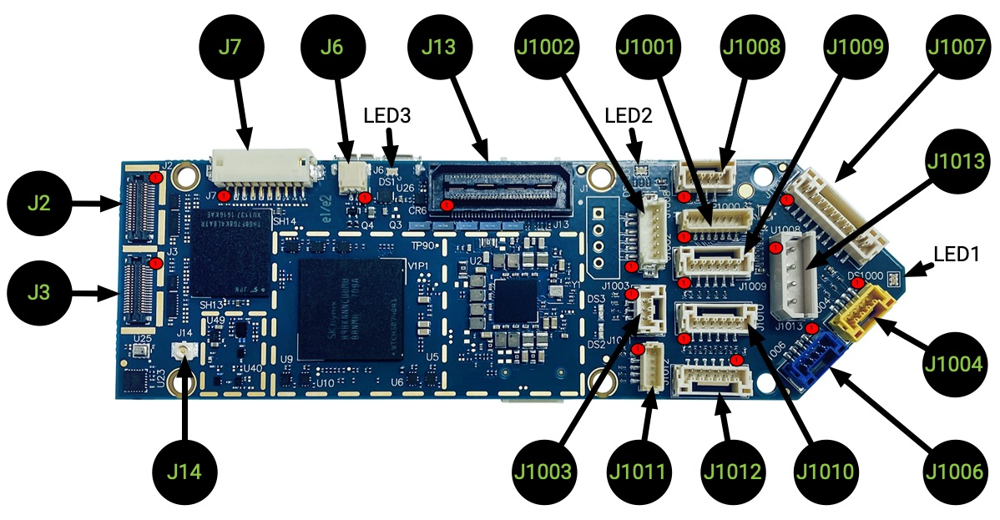
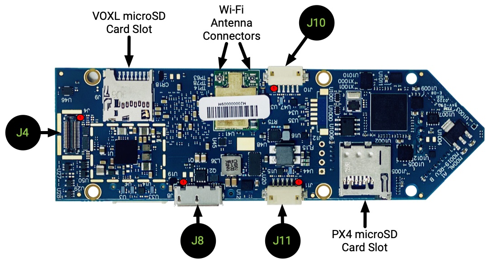

# ModalAI VOXL Flight

<Badge type="tip" text="PX4 v1.11" />

:::warning
PX4 не розробляє цей (або будь-який інший) автопілот.
Contact the [manufacturer](https://forum.modalai.com/) for hardware support or compliance issues.
:::

The ModalAI [VOXL Flight](https://modalai.com/voxl-flight) ([Datasheet](https://docs.modalai.com/voxl-flight-datasheet)) is one of the first computing platforms to combine the power and sophistication of Snapdragon with the flexibility and ease of use of PX4 on an STM32F7.
Виготовлений у США, VOXL Flight підтримує уникнення перешкод та навігацію без сигналу GPS (в приміщенні), поєднуючи це з контролером польоту PX4 на одній платі.



:::info
This flight controller is [manufacturer supported](../flight_controller/autopilot_manufacturer_supported.md).
:::

## Характеристики

### Система

| Характеристика | Подробиці |
| :------------- | :-------- |
| Вага           | 26 г      |

### Супутні комп'ютери

| Характеристика            | Подробиці                                                                                                                                                                                                                                                          |
| :------------------------ | :----------------------------------------------------------------------------------------------------------------------------------------------------------------------------------------------------------------------------------------------------------------- |
| Базова операційна система | Linux Yocto Jethro з ядром 3.18. Additional Linux Operating Systems can be used by running Docker on VOXL, details [here](https://docs.modalai.com/docker-on-voxl/)                                                                |
| Обчислення                | Qualcomm Snapdragon 821 w/ 4GB LPDDR4 1866MHz, Snapdragon 821 [Datasheet](https://developer.qualcomm.com/download/sd820e/qualcomm-snapdragon-820e-processor-apq8096sge-device-specification.pdf), [Docs](https://developer.qualcomm.com/hardware/apq-8096sg/tools) |
| CPU                       | Чотирьохядерний процесор до 2,15 ГГц                                                                                                                                                                                                                               |
| GPU                       | Графічний процесор Adreno 530 на частоті 624МГц                                                                                                                                                                                                                    |
| Обчислення DSP            | Шестизначний цифровий сигнальний процесор (cDSP) 825МГц                                                                                                                                                                                         |
| Сенсор DSP                | Шестизначний сенсор DSP (sDSP) 700МГц                                                                                                                                                                                                           |
| Відео                     | Захоплення відео 4k30 h.264/5 w/ 720p FPV                                                                                                                                                                                                          |
| Інтерфейси камери         | Підтримка MIPI-CSI2, USB UVC, HDMI                                                                                                                                                                                                                                 |
| Wi-Fi                     | Pre-certified Wi-Fi module [QCNFA324 FCC ID:PPD-QCNFA324](https://fccid.io/PPD-QCNFA324), QCA6174A modem, 802.11ac 2x2 Dual-band, Bluetooth 4.2 (dual-mode)                                     |
| 4G LTE                    | [Optional add-on module](https://www.modalai.com/collections/voxl-add-ons/products/voxl-lte)                                                                                                                                                                       |
| Microhard pDDL            | [Optional add-on module](https://www.modalai.com/collections/voxl-add-ons/products/voxl-microhard-modem-usb-hub)                                                                                                                                                   |
| GNSS                      | WGR7640 10Гц                                                                                                                                                                                                                                                       |
| I/O                       | 1x USB3.0 OTG (порт ADB), 1x USB2.0 (порт розширення), 2x UART, 3x I2C, додаткові GPIO та SPI можуть бути налаштовані                                                                        |
| Сховище                   | 32ГБ (UFS 2.0), картка Micro SD                                                                                                                                                                                                 |
| Програмне забезпечення    | Docker, OpenCV 2.4.11, 3.4.6, 4.2, ROS Indigo, Qualcomm Machine Vision SDK, see [GitLab](https://gitlab.com/voxl-public) for lots of open source examples!                         |
| IMUs                      | ICM-42688 (SPI10), ICM-20948 (SPI1)                                                                                                                                                                                          |
| Барометр                  | BMP280                                                                                                                                                                                                                                                             |

### Політний контролер

| Характеристика       | Подробиці                                                        |
| :------------------- | :--------------------------------------------------------------- |
| MCU                  | 216MHz, 32-bit ARM M7 [STM32F765II][stm32f765ii]                 |
| Оперативна Пам'ять   | 256Kb FRAM                                                       |
|                      | 2Mbit Flash                                                      |
|                      | 512Kbit SRAM                                                     |
| Прошивка             | [PX4][px4]                                                       |
| IMUs                 | [ICM-20602][icm-20602] (SPI1)                                    |
|                      | ICM-42688 (SPI2)                              |
|                      | [BMI088][bmi088] (SPI6)                                          |
| Барометр             | [BMP388][bmp388] (I2C4)                                          |
| Елемент захисту      | [A71CH][a71ch] (I2C4)                                            |
| Карта microSD        | [Information on supported cards](../dev_log/logging.md#sd-cards) |
| Вхідні дані          | GPS/Mag                                                          |
|                      | Spektrum                                                         |
|                      | Телеметрія                                                       |
|                      | CAN шина                                                         |
|                      | PPM                                                              |
| Виводи               | 6 світлодіодів (2xRGB)                        |
|                      | 8 каналів PWM                                                    |
| Додаткові Інтерфейси | 3 послідовні порти                                               |
|                      | I2C                                                              |
|                      | GPIO                                                             |

<!-- reference links for above table (improve layout) -->

[stm32f765ii]: https://www.st.com/en/microcontrollers-microprocessors/stm32f765ii.html
[px4]: https://github.com/PX4/PX4-Autopilot/tree/main/boards/modalai/fc-v1
[icm-20602]: https://www.invensense.com/products/motion-tracking/6-axis/icm-20602/
[bmi088]: https://www.bosch-sensortec.com/bst/products/all_products/bmi088_1
[bmp388]: https://www.bosch-sensortec.com/products/environmental-sensors/pressure-sensors/bmp388/
[a71ch]: https://www.nxp.com/products/security-and-authentication/authentication/plug-and-trust-the-fast-easy-way-to-deploy-secure-iot-connections:A71CH

:::info
More detailed hardware documentation can be found [here](https://docs.modalai.com/voxl-flight-datasheet/).
:::

## Розміри


[3D STEP File](https://storage.googleapis.com/modalai_public/modal_drawings/M0019_VOXL-Flight.zip)

## Сумісність прошивки PX4

_VOXL Flight_ is fully compatible with the official PX4 Firmware from PX4 v1.11.

ModalAI maintains a [branched PX4 version](https://github.com/modalai/px4-firmware/tree/modalai-1.11) for PX4 v1.11.
Це включає підтримку UART ESC та поліпшення в VIO та VOA, які планується включити в основний код.

More information about the firmware can be found [here](https://docs.modalai.com/flight-core-firmware/).

## QGroundControl Підтримка

Ця плата підтримується QGroundControl 4.0 та пізнішими версіями.

## Доступність

- [VOXL Flight Complete Kit](https://modalai.com/voxl-flight)
- [VOXL Flight Board](https://www.modalai.com/products/voxl-flight?variant=31707275362355) (only)
- [VOXL Flight integrated with Obstacle Avoidance Cameras (VOXL Flight Deck)](https://modalai.com/flight-deck) ([Datasheet](https://docs.modalai.com/voxl-flight-deck-platform-datasheet/))
- [VOXL Flight in a ready to fly VOXL m500 Development Drone](https://www.modalai.com/collections/development-drones/products/voxl-m500) ([Datasheet](https://docs.modalai.com/voxl-m500-reference-drone-datasheet/))

## Швидкий Старт

A quickstart from the vendor is located [here](https://docs.modalai.com/voxl-flight-quickstart/).

### voxl-vision-px4

The VOXL Flight runs [voxl-vision-px4](https://gitlab.com/voxl-public/modal-pipe-architecture/voxl-vision-px4) on the companion computer portion of the hardware serving as a sort of MAVLink proxy.
For details, the source code is available [here](https://gitlab.com/voxl-public/modal-pipe-architecture/voxl-vision-px4)

### З’єднання

Detailed information about the pinouts can be found [here](https://docs.modalai.com/voxl-flight-datasheet-connectors/).

#### Верх



_Note: 1000 Series connectors accessible from the STM32/PX4_

| З’єднання | Опис                                                                   | Використовується                                     |
| --------- | ---------------------------------------------------------------------- | ---------------------------------------------------- |
| J2        | Датчик зображення 4k (CSI0) високої якості          | Snapdragon - Linux                                   |
| J3        | Стерео Датчик Зображення (CSI1)                     | Snapdragon - Linux                                   |
| J6        | Конектор вентилятора охолодження                                       | Snapdragon - Linux                                   |
| J7        | BLSP6 (GPIO) та BLSP9 (UART)     | Snapdragon - Linux                                   |
| J13       | Expansion B2B                                                          | Snapdragon - Linux                                   |
| J14       | Підключення вбудованої антени GNSS                                     | Snapdragon - Linux                                   |
| J1001     | Програмний та відлагоджувальний/UART3                                  | STM32 - PX4                                          |
| J1002     | UART ESC, UART2/TELEM3                                                 | STM32 - PX4                                          |
| J1003     | PPM RC In                                                              | STM32 - PX4                                          |
| J1004     | Вхід RC, Spektrum/SBus/UART6                                           | STM32 - PX4                                          |
| J1006     | Роз'єм USB 2.0 (PX4/QGroundControl) | STM32 - PX4                                          |
| J1007     | 8-Канальний вихід PWM/DShot                                            | STM32 - PX4                                          |
| J1008     | CAN шина                                                               | STM32 - PX4                                          |
| J1009     | I2C3, UART4                                                            | STM32 - PX4                                          |
| J1010     | Телеметрія (TELEM1)                                 | STM32 - PX4                                          |
| J1011     | I2C2, кнопка безпеки                                                   | STM32 - PX4                                          |
| J1012     | External GPS & Mag, UART1, I2C1                    | STM32 - PX4                                          |
| J1013     | Вхід живлення, I2C3                                                    | STM32 - PX4 (живить весь систему) |

#### Низ



_Note: 1000 Series connectors accessible from the STM32/PX4_

| З’єднання      | Опис                                                                       | Використовується            |
| -------------- | -------------------------------------------------------------------------- | --------------------------- |
| J4             | Датчик відстеження / оптичного потоку зображення (CSI2) | Snapdragon - Linux          |
| J8             | USB 3.0 OTG                                                | Snapdragon - Linux, **adb** |
| J10            | BLSP7 UART та I2C off-board                                                | Snapdragon - Linux          |
| J11            | BLSP12 UART та I2C off-board                                               | Snapdragon - Linux          |
| VOXL microSD   |                                                                            | Snapdragon - Linux          |
| PX4 microSD    | 32Gb Max                                                                   | STM32 - PX4                 |
| Wi-Fi Antennas | У комплекті                                                                | Snapdragon - Linux          |

### Посібник користувача

The full user guide is available [here](https://docs.modalai.com/voxl-flight-quickstart).

### Як зібрати

To [build PX4](../dev_setup/building_px4.md) for this target:

```
make modalai_fc-v1
```

## Налаштування послідовного порту

_Note: mappings shown are for the PX4 controlled interfaces only_

| UART   | Пристрій   | Порт                                        |
| ------ | ---------- | ------------------------------------------- |
| USART1 | /dev/ttyS0 | GPS1 (J1012)             |
| USART2 | /dev/ttyS1 | TELEM3 (J1002)           |
| USART3 | /dev/ttyS2 | Консоль відладки (J1001) |
| UART4  | /dev/ttyS3 | Розширення UART (J6)     |
| UART5  | /dev/ttyS4 | UART між PX4 та Комп'ютером-компаньйоном    |
| USART6 | /dev/ttyS5 | RC (J1004)               |
| UART7  | /dev/ttyS6 | TELEM1 (J1010)           |
| UART8  | /dev/ttyS7 | N/A                                         |

<!-- Note: Got ports using https://github.com/PX4/PX4-user_guide/pull/672#issuecomment-598198434 -->

## Підтримка

Please visit the [ModalAI Forum](https://forum.modalai.com/category/8/voxl-flight) for more information.
