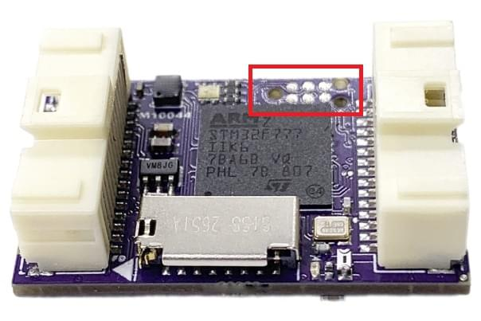
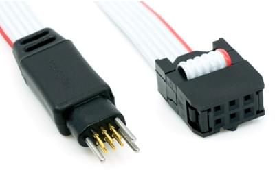

# Контролер польоту mRo Control Zero F7

:::warning
PX4 не розробляє цей (або будь-який інший) автопілот.
Contact the [manufacturer](https://store.mrobotics.io/) for hardware support or compliance issues.
:::

The _mRo Control Zero F7<sup>&reg;</sup>_ is a new flight controller from mRo.


Це безкомпромісний трикомпонентний комерційний контролер польоту з трьома IMU.
Це включає 8 виходів PWM (здатні до DShot), 3x IMU, 1x Магнітомер, 1x Датчик атмосферного тиску (Висотомір), 6x UART та SD-карту, все це зберігається на PCB розміром 32 мм x 20 мм.
PWM-сигнали здійснюють двосторонню комунікацію, захищені від EMI і переносяться до рівнів логіки 5В.
Усі елементи доступні за допомогою передніх та задніх роз'ємів Molex PicoClasp з 30 контактами.
Міцний пластиковий корпус, конформне покриття плати та опціональне калібрування температури включені.

:::info
This flight controller is [manufacturer supported](../flight_controller/autopilot_manufacturer_supported.md).
:::

## Основні характеристики

- Мікропроцесор:

  - 32-bit STM32F777 Cortex<sup>&reg;</sup> M4 core with FPU rev. 3
  - 216 MHz/512 KB RAM/2 MB Flash
  - F-RAM Cypress MF25V02-G 256-Кбіт неволатильна пам'ять (Flash-пам'ять, яка працює так же швидко, як RAM)

- Датчики:

  - [Bosch BMI088](https://www.bosch-sensortec.com/bst/products/all_products/bmi088_1) 3-axis accelerometer/gyroscope (internally vibration dampened)
  - [Invensense ICM-20602](https://www.invensense.com/products/motion-tracking/6-axis/icm-20602/) 3-axis accelerometer/gyroscope
  - [Invensense ICM-20948](https://www.invensense.com/products/motion-tracking/9-axis/icm-20948/) 3-axis accelerometer/gyroscope/magnetometer
  - [Infineon DPS310 barometer](https://www.infineon.com/cms/en/product/sensor/pressure-sensors/pressure-sensors-for-iot/dps310/) (So smooth and NO more light sensitivity)

- Інтерфейси:

  - 6x UART (загальна кількість послідовних портів), 3x з HW керуванням потоком, 1x FRSky Telemetry (типи D або Х), 1x Консоль та 1x GPS+I2C
  - 8x Виходи PWM (всі здатні до DShot)
  - 1x CAN
  - 1x I2C
  - 1x SPI
  - Spektrum DSM / DSM2 / DSM-X® Satellite compatible вхід та біндинг
  - Futaba S.BUS® & S.BUS2® compatible input
  - Вивід телеметрії порту FRSky
  - Graupner SUMD
  - Yuneec ST24
  - PPM сигнал входу суми
  - 1x JTAG (Роз'єм TC2030)
  - 1x RSSI (PWM чи вольтаж) вхід
  - LED триколор

- Вага та розміри (без кейса):

  - Вага: 5.3г (0.19oz)
  - Ширина: 20 мм (0.79")
  - Довжина: 32 мм (1,26")

- Система живлення:
  - 3x Низькозатратний лінійний регулятор напруги Ultra Low Noise LDO

## Де купити

- [mRo Control Zero](https://store.mrobotics.io/mRo-Control-Zero-F7-p/mro-ctrl-zero-f7.htm)

## Збірка прошивки

:::tip
Most users will not need to build this firmware!
It is pre-built and automatically installed by _QGroundControl_ when appropriate hardware is connected.
:::

To [build PX4](../dev_setup/building_px4.md) for this target:

```
make mro_ctrl-zero-f7
```

## Відладочні порти

### Порт Консолі

The [PX4 System Console](../debug/system_console.md) runs on `USART7` using the pins listed below.
This is a standard serial pinout, designed to connect to a [3.3V FTDI](https://www.digikey.com/en/products/detail/TTL-232R-3V3/768-1015-ND/1836393) cable (5V tolerant).

| mRo control zero f7 |             | FTDI |                                     |
| ------------------- | ----------- | ---- | ----------------------------------- |
| 17                  | USART7 Tx   | 5    | FTDI RX (yellow) |
| 19                  | USART7 Rx   | 4    | FTDI TX (orange) |
| 6                   | USART21 GND | 1    | FTDI GND (black) |

### SWD Port

The [SWD port](../debug/swd_debug.md) (JTAG) for FMU debugging is a TC2030 debug connector, as shown below.



You can use the [Tag Connect](https://www.tag-connect.com/) cable [TC2030 IDC NL](https://www.tag-connect.com/product/tc2030-idc-nl) below (with associated [retaining clip](https://www.tag-connect.com/product/tc2030-clip-retaining-clip-board-for-tc2030-nl-cables)) to attach to either a BlackMagic probe or a ST-LINK V2 debugger.



There is also an [ARM20-CTX 20-Pin to TC2030-IDC adapter](https://www.tag-connect.com/product/arm20-ctx-20-pin-to-tc2030-idc-adapter-for-cortex) that can be used with other debug probes.

## Схема розташування виводів


## Налаштування послідовного порту

| UART   | Пристрій   | Порт                                                                                              |
| ------ | ---------- | ------------------------------------------------------------------------------------------------- |
| USART2 | /dev/ttyS0 | TELEM1 (керування потоком)                                                     |
| USART3 | /dev/ttyS1 | TELEM2 (керування потоком)                                                     |
| UART4  | /dev/ttyS2 | GPS1                                                                                              |
| USART6 | /dev/ttyS3 | Flex порт (можна налаштувати як SPI або UART із Flow Control). |
| UART7  | /dev/ttyS4 | CONSOLE                                                                                           |
| UART8  | /dev/ttyS5 | Вільний послідовний порт (зазвичай для телеметрії FrSky)                       |

<!-- Note: Got ports using https://github.com/PX4/PX4-user_guide/pull/672#issuecomment-598198434 -->

<!-- https://github.com/PX4/PX4-Autopilot/blob/main/boards/mro/ctrl-zero-f7/nuttx-config/nsh/defconfig#L202-L207 -->

## Подальша інформація

- [Introducing the new mRo Control Zero Autopilot](https://mrobotics.io/introducing-the-new-mro-control-zero-autopilot/) (blog)
- [Quick Start Guide](https://mrobotics.io/mrocontrolzero/)
