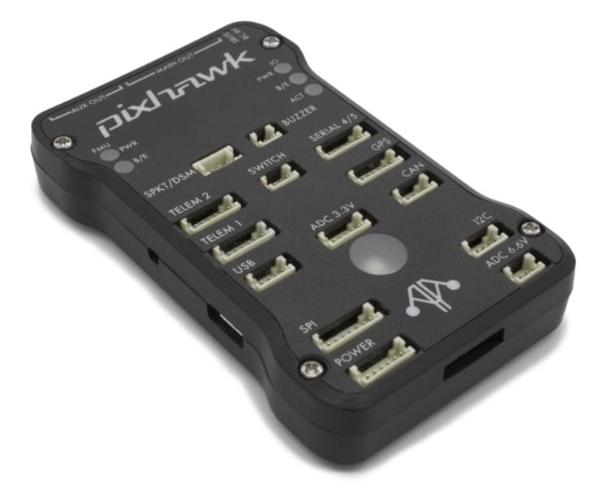

# mRo Pixhawk Flight Controller (Pixhawk 1)

:::warning
PX4 не розробляє цей (або будь-який інший) автопілот.
Contact the [manufacturer](https://store.mrobotics.io/) for hardware support or compliance issues.
:::

The _mRo Pixhawk<sup>&reg;</sup>_ is a hardware compatible version of the original [Pixhawk 1](../flight_controller/pixhawk.md). It runs PX4 on the [NuttX](https://nuttx.apache.org/) OS.

:::tip
The controller can be used as a drop-in replacement for the 3DR<sup>&reg;</sup> [Pixhawk 1](../flight_controller/pixhawk.md).
The main difference is that it is based on the [Pixhawk-project](https://pixhawk.org/) **FMUv3** open hardware design, which corrects a bug that limited the original Pixhawk 1 to 1MB of flash.
:::



Assembly/setup instructions for use with PX4 are provided here: [Pixhawk Wiring Quickstart](../assembly/quick_start_pixhawk.md)

:::tip
This autopilot is [supported](../flight_controller/autopilot_pixhawk_standard.md) by the PX4 maintenance and test teams.
:::

## Основні характеристики

- Мікропроцесор:
  - 32-bit STM32F427 Cortex<sup>&reg;</sup> M4 core з FPU
  - 168 MHz/256 KB RAM/2 MB Flash
  - 32 bit STM32F103 відмовостійкий копроцесор
  - 24 MHz/8 KB RAM/64 KB Flash

- Датчики:
  - ST Micro L3GD20 3-axis 16-бітний гіроскоп
  - ST Micro LSM303D 3-вісний 14-бітний акселерометр / магнітометр
  - Invensense<sup>&reg;</sup> MPU 6000 3-вісний акселерометр/гіроскоп
  - MEAS MS5611 барометр

- Інтерфейси:
  - 5x UART (послідовні порти), один високої потужності, 2x з контролем потоку ГВП
  - 2x CAN
  - Вхід, сумісний з приймачами Spektrum DSM / DSM2 / DSM-X® Satellite до DX8 (DX9 та вище не підтримуються)
  - Futaba<sup>&reg;</sup> S.BUS сумісний вхід та вихід
  - Сигнал суми PPM
  - Вхід RSSI (ШІМ або напруга)
  - I2C
  - SPI
  - 3.3 та 6.6V ADC входи
  - Зовнішній порт microUSB

- Система живлення:

  - Ідеальний діодний контролер з автоматичним перемиканням на резервне живлення
  - Сервопривід високої потужності (7 В) і готовий до великого струму
  - Усі периферійні виводи захищені від перевантаження по струму, усі входи захищені від електростатичного розряду

- Вага та розміри:
  - Вага: 38г (1,31 унції)
  - Ширина: 50 мм (1.96")
  - Товщина: 15.5 мм (.613")
  - Довжина: 81.5 мм (3.21")

## Доступність

- [Bare Bones](https://store.mrobotics.io/Genuine-PixHawk-1-Barebones-p/mro-pixhawk1-bb-mr.htm) - Just the board (useful as a 3DR Pixhawk replacement)
- [mRo Pixhawk 2.4.6 Essential Kit!](https://store.mrobotics.io/Genuine-PixHawk-Flight-Controller-p/mro-pixhawk1-minkit-mr.htm) - Everything except for telemetry radios
- [mRo Pixhawk 2.4.6 Cool Kit! (Limited edition)](https://store.mrobotics.io/product-p/mro-pixhawk1-fullkit-mr.htm) - Everything you need including telemetry radios

## Збірка прошивки

:::tip
Most users will not need to build this firmware!
It is pre-built and automatically installed by _QGroundControl_ when appropriate hardware is connected.
:::

To [build PX4](../dev_setup/building_px4.md) for this target:

```
make px4_fmu-v3_default
```

## Відладочні порти

See [3DR Pixhawk 1 > Debug Ports](../flight_controller/pixhawk.md#debug-ports)

## Схема розташування виводів

See [3DR Pixhawk 1 > Pinouts](../flight_controller/pixhawk.md#pinouts)

## Налаштування послідовного порту

| UART   | Пристрій   | Порт                                          |
| ------ | ---------- | --------------------------------------------- |
| UART1  | /dev/ttyS0 | IO debug                                      |
| USART2 | /dev/ttyS1 | TELEM1 (керування потоком) |
| USART3 | /dev/ttyS2 | TELEM2 (керування потоком) |
| UART4  |            |                                               |
| UART7  | CONSOLE    |                                               |
| UART8  | SERIAL4    |                                               |

<!-- Note: Got ports using https://github.com/PX4/PX4-user_guide/pull/672#issuecomment-598198434 -->

## Креслення

The board is based on the [Pixhawk-project](https://pixhawk.org/) **FMUv3** open hardware design.

- [FMUv3 schematic](https://github.com/PX4/Hardware/raw/master/FMUv3_REV_D/Schematic%20Print/Schematic%20Prints.PDF) -- Schematic and layout

:::info
As a CC-BY-SA 3.0 licensed Open Hardware design, all schematics and design files are [available](https://github.com/PX4/Hardware).
:::
