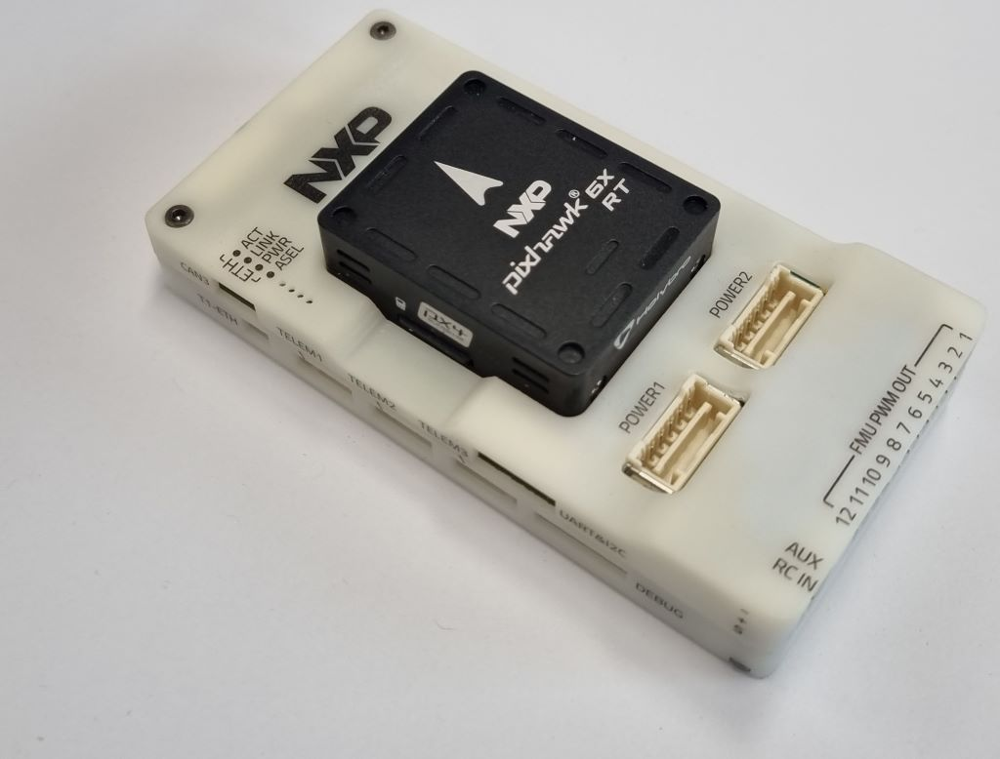
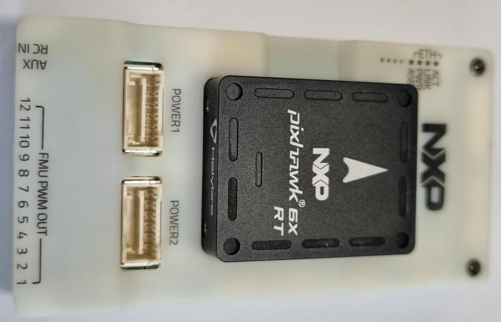
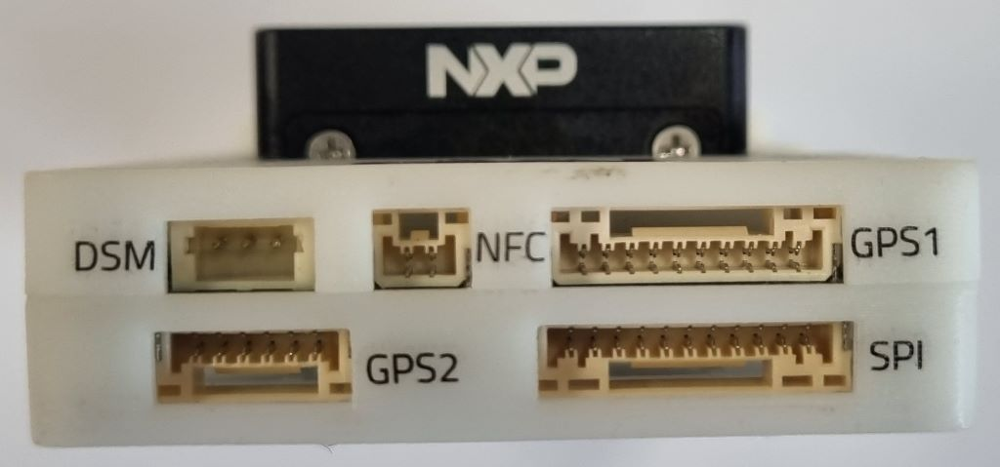
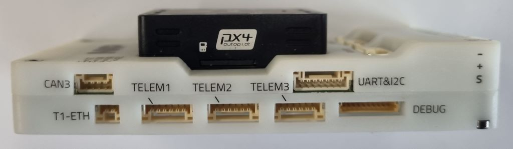
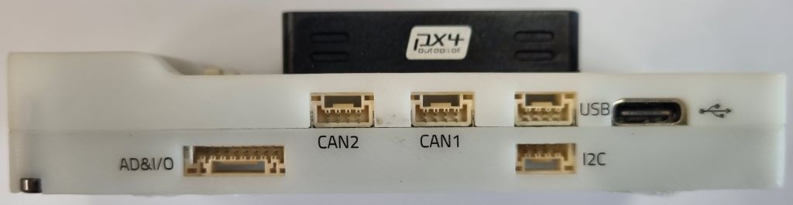

# NXP MR-VMU-RT1176 Flight Controller

<Badge type="tip" text="PX4 v1.15" />

:::warning
PX4 не розробляє цей (або будь-який інший) автопілот.
Contact the [manufacturer](https://www.nxp.com) for hardware support (https://community.nxp.com/) or compliance issues.
:::

The _MR-VMU-RT1176_ reference design is based on the [Pixhawk<sup>&reg;</sup> FMUv6X-RT open standard](https://github.com/pixhawk/Pixhawk-Standards/blob/master/DS-020%20Pixhawk%20Autopilot%20v6X-RT%20Standard.pdf), the latest update to the successful family of Pixhawk<sup>&reg;</sup> flight controllers.

This is NXP's open source _reference design_ for using FMUv6X-RT, and was designed and made in collaboration with industry partners<sup>&reg;</sup>, NXP's mobile robotics team and the PX4 team.
As a reference/evaluation design, it is intended to be replicated, modified or integrated in production volume by others.
It has already gone through all FCC/CE ROHS REACH UKCA, EMI/RFI ESD certifications and is available globally
Several 3rd party manufacturers (such as Holybro.com) provide this or derivative commercial products.



The board includes the same FMU module found on Pixhawk 6X-RT paired with an NXP-based carrier board.
The carrier board offers 100Base-T1 (two-wire) automotive ethernet, an NFC antenna (Connected to SE051), and a third CAN bus.
It also removes the IO processor to enable 12 PWM ports, with 8 providing Dshot capability.

This board takes advantage of multiple Pixhawk​​® open standards, such as the FMUv6X-RT Standard, [Autopilot Bus Standard](https://github.com/pixhawk/Pixhawk-Standards/blob/master/DS-010%20Pixhawk%20Autopilot%20Bus%20Standard.pdf), and [Connector Standard](https://github.com/pixhawk/Pixhawk-Standards/blob/master/DS-009%20Pixhawk%20Connector%20Standard.pdf).
Оснащений високопродуктивним процесором NXP i.mx RT1176 dual core, модульним дизайном, потрійним резервуванням, платою IMU з контролем температури, ізольованими доменами сенсорів, що забезпечує неймовірну продуктивність, надійність та гнучкість.

:::tip
This autopilot is [supported](../flight_controller/autopilot_pixhawk_standard.md) by the PX4 maintenance and test teams.
:::

## Введення

Inside the MR-VMU-RT1176, you can find an NXP i.MX RT1176, paired with sensor technology from Bosch®, InvenSense®, giving you flexibility and reliability for controlling any autonomous vehicle, suitable for both academic and commercial applications.

The Pixhawk® 6X-RT's i.MX RT1176 Crossover dual-core MCU contain an Arm® Cortex®-M7 core running up to 1GHz and Arm® Cortex®-M4 core running up to 400MHz, has 2MB SRAM and external XIP Flash with 64MB.
The PX4 Autopilot takes advantage of the increased processing power and RAM.
Thanks to this increased processing power, developers can be more productive and efficient with their development work, allowing for complex algorithms and models.

The FMUv6X-RT open standard includes high-performance, low-noise IMUs on board, designed for better stabilization.
Triple-redundant IMU & double-redundant barometer on separate buses.
Коли PX4 виявляє відмову датчика, система плавно перемикатися на інший, щоб забезпечити надійність керування польотом.

Кожен незалежний LDO живить кожен набір сенсорів з незалежним керуванням живленням.
Система віброізоляції для фільтрації високочастотної вібрації та зменшення шуму для забезпечення точних показань, що дозволяє транспортним засобам досягати кращих загальних характеристик польоту.

Зовнішня шина датчиків (SPI5) має дві лінії вибору чипів та сигнали готовності даних для додаткових датчиків та корисного навантаження з інтерфейсом SPI, а також з інтегрованим Microchip Ethernet PHY, високошвидкісний обмін даними з комп'ютерами місії через ethernet тепер можливий.

The MR-VMU-RT1176 reference design is perfect for developers at corporate research labs, startups, academics (research, professors, students), and commercial application that like to try out T1 (2 wire) automotive ethernet.

Note that since it is a reference design, this _particular_ board is not produced in high volume.
Similar variants will be available from our licensees.

## Ключові пункти дизайну

- High performance [NXP i.MX RT1170 1GHz Crossover MCU](https://www.nxp.com/products/processors-and-microcontrollers/arm-microcontrollers/i-mx-rt-crossover-mcus/i-mx-rt1170-1-ghz-crossover-mcu-with-arm-cortex-cores:i.MX-RT1170) with Arm® Cortex® cores
- Hardware secure element [NXP EdgeLock SE051](https://www.nxp.com/products/security-and-authentication/authentication/edgelock-se051-proven-easy-to-use-iot-security-solution-with-support-for-updatability-and-custom-applets:SE051).
  This is an extension to the widely trusted EdgeLock SE050 Plug & Trust secure element family, supports applet updates in the field and delivers proven security certified to CC EAL 6+, with AVA_VAN.5 up to the OS level, for strong protection against the most recent attack scenarios.
  This can be used, for example, to securely store operator ID or certificates.
- Modular flight controller: separated IMU, FMU, and Base system connected by a 100-pin & a 50-pin Pixhawk® Autopilot Bus connector.
- Redundancy: 3x IMU sensors & 2x Barometer sensors on separate buses
- Triple-redundancy domains: Completely isolated sensor domains with separate buses and separate power control
- Нова система ізоляції вібрацій для фільтрації високочастотних вібрацій та зменшення шуму для забезпечення точних вимірювань
- 100Base-T1 2-Wire Ethernet interface for high-speed mission computer integration
- IMUs are temperature-controlled by onboard heating resistors, allowing optimum working temperature of IMUs&#x20;

### Processors & Sensors

- FMU процесор: NXP i.MX RT1176
  - 32 Bit Arm® Cortex®-M7, 1GHz
  - 32 Bit Arm® Cortex®-M4, 400MHz вторинне ядро
  - 64MB зовнішньої флеш пам'яті
  - 2MB RAM
- Апаратний захисний елемент NXP EdgeLock SE051
  - Сертифіковано згідно з вимогами IEC62443-4-2
  - 46 kB користувацької пам'яті з опціями персоналізації до 104 kB
  - Сертифіковане рішення Groundbreaking CC EAL6+ для IoT
  - AES та 3DES шифрування і дешифрування
- Сенсори на платі
  - Accel/Gyro: ICM-20649 або BMI088
  - Accel/Gyro: ICM-42688-P
  - Accel/Gyro: ICM-42670-P
  - Mag: BMM150
  - Barometer: 2x BMP388

### Електричні дані

- Номінальна напруга:
  - Максимальна вхідна напруга: 6 В
  - Вхід USB Power: 4.75~5.25V
  - Вхід Servo Rail: 0\~36V
- Номінальний струм:
  - `TELEM1` output current limiter: 1.5A
  - Комбінований обмежувач вихідного струму всіх інших портів: 1.5A

### Механічні характеристики

- Розміри
  - Модуль політного контролера: 38.8 x 31.8 x 14.6mm
  - Standard Baseboard: 50 x 96 x 16.7mm
- Вага
  - Модуль політного контролера: 23g
  - Стандартна базова плата: 51g

### Інтерфейси

- 12 PWM servo outputs, 8 with D-SHOT

- R/C вхід для Spektrum / DSM

- Виділений R/C вхід для PPM та S.Bus входу

- Спеціалізований аналоговий / PWM вхід RSSI та вивід S.Bus

- 4 general purpose serial ports:
  - 3 з повним контролем потоку
  - 1 з окремим обмеженням струму 1.5A (Telem1)
  - 1 з I2C та додатковою лінією GPIO для зовнішнього NFC зчитувача

- 2 порти GPS
  - 1 повний GPS плюс порт запобіжного перемикача
  - 1 базовий порт GPS

- 1 I2C порт

- 1 порт Ethernet
  - Transformerless Applications
  - 100Mbps

- 1 шина SPI
  - 2 лінії вибору чіпу
  - 2 лінії готових даних
  - 1 SPI SYNC лінія
  - 1 лінія SPI reset

- 3 CAN Buses for CAN peripheral (2 currently supported by PX4)
  - CAN шина має individual silent controls або ESC RX-MUX control

- 2 порти вводу живлення з SMBus

- 1 AD & IO port

- 2 додаткових аналогових входи

- 1 PWM/Capture вхід

- 2 виділені відладочні та GPIO лінії

- Інші характеристики:
  - Operating & storage temperature: -40 ~ 85°c

## Де купити

Order from [NXP](https://www.nxp.com).

## Зборка/інсталяція

Wiring is similar to the [Holybro Pixhawk 6X](../flight_controller/pixhawk6x.md#connections) and other boards that follow the [Pixhawk Connector Standard](https://github.com/pixhawk/Pixhawk-Standards/blob/master/DS-009%20Pixhawk%20Connector%20Standard.pdf).

<!-- TBD - provide sample wiring diagram. -->

## З'єднання

_MR-VMU-RT1176_ connectors (following [Pixhawk Connector Standard](https://github.com/pixhawk/Pixhawk-Standards/blob/master/DS-009%20Pixhawk%20Connector%20Standard.pdf))






Для додаткової інформації дивіться:

- [NXP MR-VMU-RT1176 Baseboard Connections](https://nxp.gitbook.io/vmu-rt1176/production-v1-carrier-board-connectors) (nxp.gitbook.io)

## Схема розташування виводів

[NXP MR-VMU-RT1176 Baseboard Pinout](https://nxp.gitbook.io/vmu-rt1176/pin-out) (nxp.gitbook.io)

Примітки:

- The [camera capture pin](../camera/fc_connected_camera.md#camera-capture-configuration) (`PI0`) is pin 2 on the AD&IO port, marked above as `FMU_CAP1`.

## Налаштування послідовного порту

| UART   | Пристрій   | Порт     |
| ------ | ---------- | -------- |
| UART1  | /dev/ttyS0 | Debug    |
| UART3  | /dev/ttyS1 | GPS      |
| UART4  | /dev/ttyS2 | TELEM1   |
| UART5  | /dev/ttyS3 | GPS2     |
| UART6  | /dev/ttyS4 | PX4IO    |
| UART8  | /dev/ttyS5 | TELEM2   |
| UART10 | /dev/ttyS6 | TELEM3   |
| UART11 | /dev/ttyS7 | External |

<!--
## Dimensions

TBD
-->

## Номінальна напруга

_MR-VMU-RT1176_ can be triple-redundant on the power supply if three power sources are supplied.
The three power rails are: **POWER1**, **POWER2** and **USB**.
The **POWER1** & **POWER2** ports on the MR-VMU-RT1176 uses the 6 circuit [2.00mm Pitch CLIK-Mate Wire-to-Board PCB Receptacle](https://www.molex.com/molex/products/part-detail/pcb_receptacles/5024430670).

### Максимальна напруга нормальної роботи

За таких умов всі джерела живлення будуть використовуватися в цьому порядку для живлення системи:

1. **POWER1** and **POWER2** inputs (4.9V to 5.5V)
2. **USB** input (4.75V to 5.25V)

### Абсолютна максимальна напруга

За таких умов система не буде витрачати жодної потужності (не буде працювати), але залишиться неушкодженою.

1. **POWER1** and **POWER2** inputs (operational range 4.1V to 5.7V, 0V to 10V undamaged)
2. **USB** input (operational range 4.1V to 5.7V, 0V to 6V undamaged)
3. Servo input: VDD_SERVO pin of **FMU PWM OUT** and **I/O PWM OUT** (0V to 42V undamaged)

### Моніторинг напруги

Digital I2C battery monitoring is enabled by default (see [Quickstart > Power](../assembly/quick_start_pixhawk6x.md#power)).

:::info
Analog battery monitoring via an ADC is not supported on this particular board, but may be supported in variations of this flight controller with a different baseboard.
:::

## Збірка прошивки

:::tip
Most users will not need to build this firmware!
It is pre-built and automatically installed by _QGroundControl_ when appropriate hardware is connected.
:::

To [build PX4](../dev_setup/building_px4.md) for this target:

```sh
make px4_fmu-v6xrt_default
```

## Debug Port {#debug_port}

The [PX4 System Console](../debug/system_console.md) and [SWD interface](../debug/swd_debug.md) run on the **FMU Debug** port.

The pinouts and connector comply with the [Pixhawk Debug Full](../debug/swd_debug.md#pixhawk-debug-full) interface defined in the [Pixhawk Connector Standard](https://github.com/pixhawk/Pixhawk-Standards/blob/master/DS-009%20Pixhawk%20Connector%20Standard.pdf) interface (JST SM10B connector).

| Pin                            | Сигнал                              | Вольтаж               |
| ------------------------------ | ----------------------------------- | --------------------- |
| 1 (red)     | `Vtref`                             | +3.3V |
| 2 (blk)     | Console TX (OUT) | +3.3V |
| 3 (blk)     | Console RX (IN)  | +3.3V |
| 4 (blk)     | `SWDIO`                             | +3.3V |
| 5 (blk)     | `SWCLK`                             | +3.3V |
| 6 (blk)     | `SWO`                               | +3.3V |
| 7 (blk)     | NFC GPIO                            | +3.3V |
| 8 (чорний)  | PH11                                | +3.3V |
| 9 (чорний)  | nRST                                | +3.3V |
| 10 (чорний) | `GND`                               | GND                   |

Інформацію про використання цього порту див:

- [SWD Debug Port](../debug/swd_debug.md)
- [PX4 System Console](../debug/system_console.md) (Note, the FMU console maps to USART3).

## Периферійні пристрої

- [Digital Airspeed Sensor](https://holybro.com/products/digital-air-speed-sensor)
- [Telemetry Radio Modules](https://holybro.com/collections/telemetry-radios?orderby=date)
- [Rangefinders/Distance sensors](../sensor/rangefinders.md)

## Підтримувані платформи / Конструкції

Будь-який мультикоптер / літак / наземна платформа / човен, який може керуватися звичайними RC сервоприводами або сервоприводами Futaba S-Bus.
The complete set of supported configurations can be seen in the [Airframes Reference](../airframes/airframe_reference.md).

## Подальша інформація

- [Update Pixhawk 6X-RT Bootloader](../advanced_config/bootloader_update_v6xrt.md)
- [Pixhawk 6X Wiring QuickStart](../assembly/quick_start_pixhawk6x.md)
- [PM02D Power Module](../power_module/holybro_pm02d.md)
- [PM03D Power Module](../power_module/holybro_pm03d.md)
- [Pixhawk FMUv6X-RT open standard](https://github.com/pixhawk/Pixhawk-Standards/blob/master/DS-020%20Pixhawk%20Autopilot%20v6X-RT%20Standard.pdf)
- [Pixhawk Autopilot Bus Standard](https://github.com/pixhawk/Pixhawk-Standards/blob/master/DS-010%20Pixhawk%20Autopilot%20Bus%20Standard.pdf).
- [Pixhawk Connector Standard](https://github.com/pixhawk/Pixhawk-Standards/blob/master/DS-009%20Pixhawk%20Connector%20Standard.pdf).
