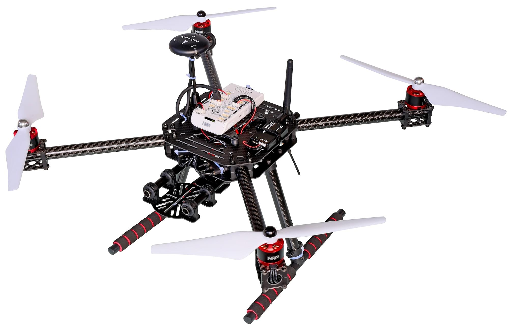

# NXP RDDRONE-FMUK66 FMU (Discontinued)

<Badge type="info" text="Discontinued" />

:::warning
This flight controller has been [discontinued](../flight_controller/autopilot_experimental.md) and is no longer commercially available.
:::

:::warning
PX4 не розробляє цей (або будь-який інший) автопілот.
Contact the [manufacturer](https://www.nxp.com/) for hardware support or compliance issues.
:::

RDDRONE-FMUK66 FMU - це еталонний дизайн, який використовує компоненти NXP Semiconductor із тісною відповідністю специфікаціям Pixhawk FMUv4, додавши двохжильний автомобільний Ethernet 100BASET1 та безпечний елемент A71CH (RevC) або SE050 (RevD).
NXP надає схеми, гербери, BOM та вихідні файли, щоб будь-хто міг відтворити, змінити або використати цей дизайн для інших цілей.

This is the official FMU for use with [HoverGames](https://www.hovergames.com/).


NXP FMU та включені периферійні пристрої були протестовані на відповідність директивам FCC/CE/RoHs/REACH.

:::info
These flight controllers are [manufacturer supported](../flight_controller/autopilot_manufacturer_supported.md).
:::

## Короткий опис

- **Main FMU Processor:**
  - Мікроконтролер Kinetis K66 MK66FN2MOVLQ18 працює на частоті 180 МГц Cortex-M4F MCU, 2 МБ флеш-пам'яті, 256 КБ SRAM, два USB (FS + HS), Ethernet, 144-LQFP.
- **On-board sensors:**
  - Акселерометр/гіроскоп: BMI088/ICM42688 (RevD)...
  - Акселерометр/Магнітометр: FXOS8700CQ
  - Гіроскоп: FXAS21002CQ
  - Magnetometer: BMM150
  - Барометр: ML3115A2
  - Барометр: BMP280
- **GPS:**
  - u-blox Neo-M8N GPS/GLONASS приймач; інтегрований магнетометр IST8310

This FMU is provided only as a kit, and includes [Segger Jlink EDU mini debugger](https://www.segger.com/products/debug-probes/j-link/models/j-link-edu-mini/), DCD-LZ debugger adapter, USB-TTL-3V3 console cable, HolyBro GPS module, battery power module, SDCard and case, screws and stickers.
Telemetry radios ([HGD-TELEM433](https://www.nxp.com/part/HGD-TELEM433) and [HGD-TELEM915](https://www.nxp.com/part/HGD-TELEM915)) must be purchased separately to match ISM band frequencies used in your country.


A "Lite" version RDDRONE-FMUK66L is also available which does not include the power module, GPS, Jlink or USB-TTL-3V3 console cable or SDCard.[Scroll down to see FMUK66L in the buy section of the FMUK66 buy page](https://www.nxp.com/design/designs/px4-robotic-drone-fmu-rddrone-fmuk66:RDDRONE-FMUK66#buy)

Additional information can be found in the [Technical Data Sheet](https://www.nxp.com/design/designs/px4-robotic-drone-fmu-rddrone-fmuk66:RDDRONE-FMUK66). <!-- www.nxp.com/rddrone-fmuk66 -->

## Де купити

**RDDRONE-FMUK66** reference design kit may be purchased direct from NXP or from any of NXP's authorised worldwide network of [electronics distributors](https://www.nxp.com/support/sample-and-buy/distributor-network:DISTRIBUTORS).

- [Purchase Link](https://www.nxp.com/design/designs/px4-robotic-drone-fmu-rddrone-fmuk66:RDDRONE-FMUK66#buy) (www.nxp.com)
- Телеметричні радіопередавачі придбаються окремо в залежності від частотного діапазону:
  - [HGD-TELEM433](https://www.nxp.com/part/HGD-TELEM433)
  - [HGD-TELEM915](https://www.nxp.com/part/HGD-TELEM915)

:::info
_RDDRONE-FMUK66_ FMU is also included in the complete HoverGames drone kit: [KIT-HGDRONEK66](https://www.nxp.com/applications/solutions/industrial/aerospace-and-mobile-robotics/uavs-drones-and-rovers/nxp-hovergames-drone-kit-including-rddrone-fmuk66-and-peripherals:KIT-HGDRONEK66#buy)
:::

<!--
## Connectors

[Connector Diagram]

## Pinouts

[Pinouts listing or link]

## Dimensions

[Dimensions]

-->

## Зборка/інсталяція

https://nxp.gitbook.io/hovergames

## Збірка прошивки

:::tip
Most users will not need to build this firmware!
It is pre-built and automatically installed by _QGroundControl_ when appropriate hardware is connected.
:::

To [build PX4](../dev_setup/building_px4.md) for this target:

```
make nxp_fmuk66-v3_default
```

## Відладочний порт

The [PX4 System Console](../debug/system_console.md) and the [SWD interface](../debug/swd_debug.md) run on the [DCD-LZ FMU Debug](https://nxp.gitbook.io/hovergames/rddrone-fmuk66/connectors/debug-interface-dcd-lz) port.

NXP's DCD-LZ is a 7 pin JST-GH connector and adds the nRST/MCU_RESET pin to the [Pixhawk 6-Pin standard debug port](https://github.com/pixhawk/Pixhawk-Standards/blob/master/DS-009%20Pixhawk%20Connector%20Standard.pdf).

Адаптер DCD-LZ дозволяє використовувати стандартний інтерфейс JTAG/SWD з 10 контактами (тобто за допомогою Segger Jlink) та стандартний кабель типу FTDI USB-TTL-3V3 з 5 контактами.

<!--

## Peripherals

* [List of anything people should use with this hardware]

-->

## Підтримувані платформи / Конструкції

Будь-який мультикоптер / літак / наземна платформа / човен, який може керуватися звичайними RC сервоприводами або сервоприводами Futaba S-Bus.
The complete set of supported configurations can be seen in the [Airframes Reference](../airframes/airframe_reference.md).



:::tip
The NXP [HoverGames Drone Kit](https://www.nxp.com/kit-hgdronek66) (shown above) is a complete drone development kit that includes everything needed to build a quadcopter.
Вам потрібно лише поставити акумулятор LiPo 3S/4S.
:::

## Подальша інформація

- [HoverGames online documentation](https://nxp.gitbook.io/hovergames) PX4 user and programming guide, specific assembly, construction, debugging, programming instructions.

- 3DModels supporting HoverGames and RDDRONE-FMUK66 can be found on _Thingiverse_ at these search links: fmuk66, hovergames.


