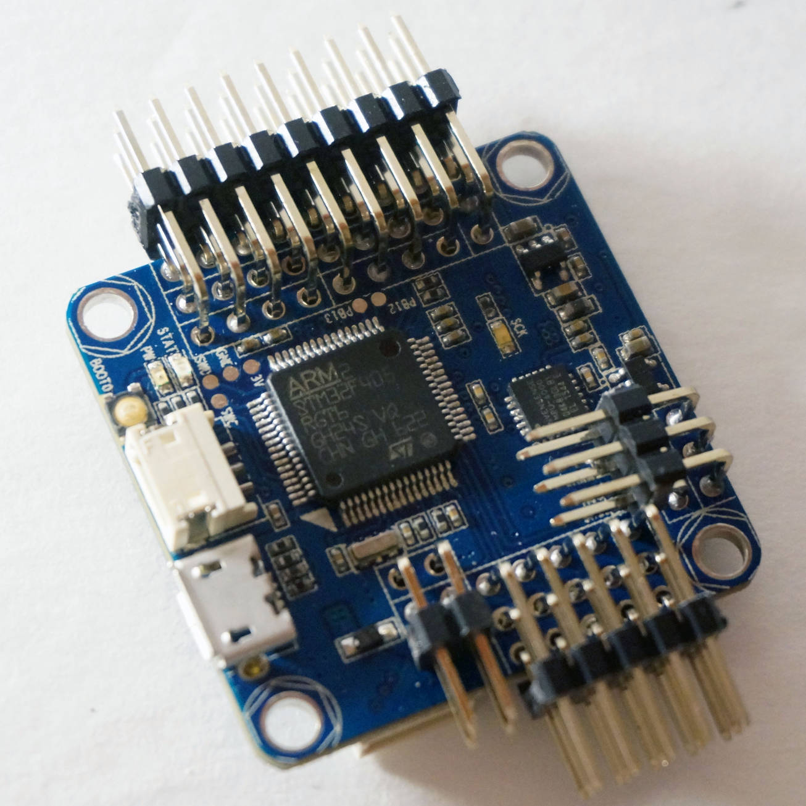
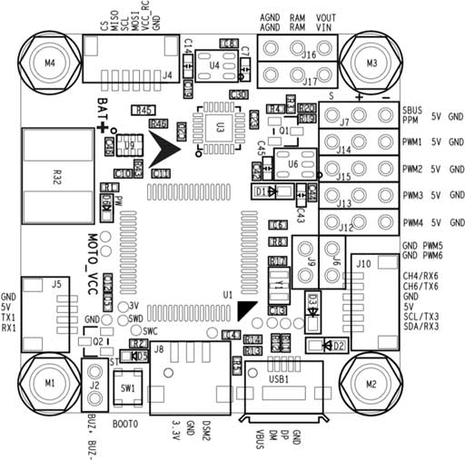
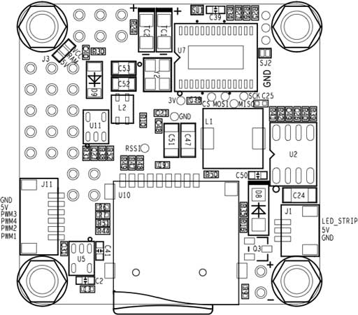
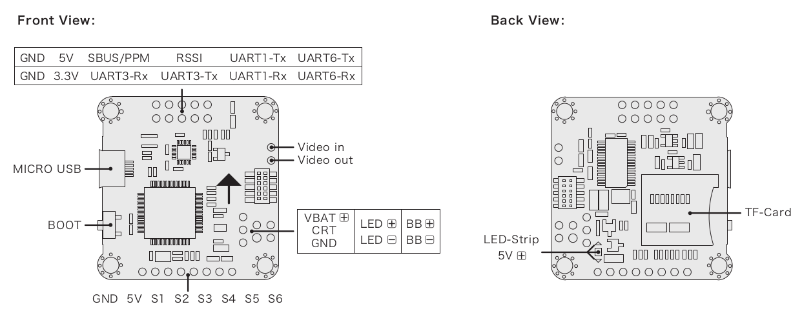
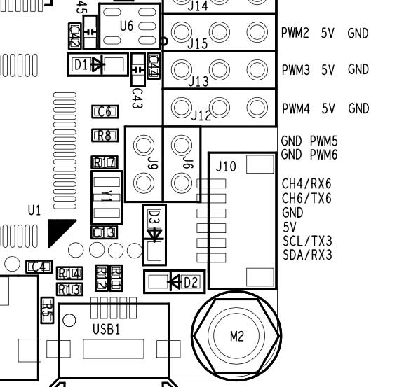
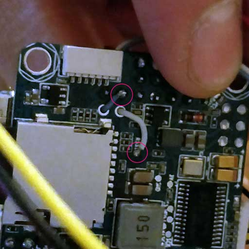
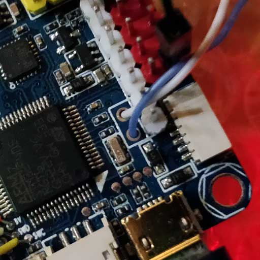
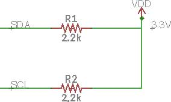
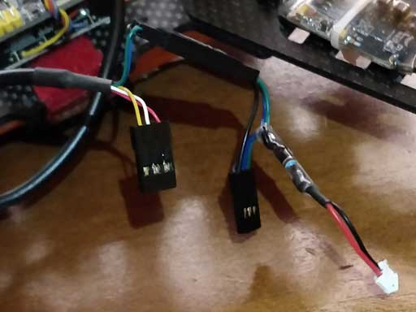

# Omnibus F4 SD

:::warning
This flight controller has been [discontinued](../flight_controller/autopilot_experimental.md) and is no longer commercially available.
:::

:::warning
PX4 не розробляє цей (або будь-який інший) автопілот.
Звертайтесь до виробника з питань щодо підтримки або відповідності.
:::

The _Omnibus F4 SD_ is a controller board designed for racers.
На відміну від звичайної гоночної дошки, вона має деякі додаткові функції, такі як SD-карта та швидший процесор.



These are the main differences compared to a [Pixracer](../flight_controller/pixracer.md):

- Нижча ціна
- Менше портів вводу/виводу (хоча все ще можна підключити GPS або датчик потоку, наприклад)
- Requires external pull up resistor on the I2C bus for external GPS, see [I2C](#i2c) below.
- Менше ОЗП (192 КБ проти 256 КБ) та FLASH (1 МБ проти 2 МБ)
- Same board dimensions as a _Pixracer_, but slightly smaller form factor (because it has less connectors)
- Інтегрований OSD (ще не реалізований у програмному забезпеченні)

:::tip
All the usual PX4 features can still be used for your racer!
:::

:::info
This flight controller is [manufacturer supported](../flight_controller/autopilot_manufacturer_supported.md).
:::

## Основні характеристики

- Main System-on-Chip: [STM32F405RGT6](https://www.st.com/en/microcontrollers/stm32f405rg.html)
  - CPU: 168 МГц ARM Cortex M4 з одноточним FPU
  - RAM: 192 KB SRAM
  - FLASH: 1 МБ
- Стандартна форма гонщика: 36x36 мм зі стандартним отвором 30,5 мм
- MPU6000 Акселератор / Гіроскоп
- BMP280 Baro (встановлений не на всі плати)
- microSD (логування)
- Futaba S.BUS і S.BUS2 / Spektrum DSM2 і DSMX / Graupner SUMD / PPM input / Yuneec ST24
- OneShot PWM (налаштовується)
- Вбудований датчик струму
- Вбудований чіп OSD (AB7456 через SPI)

## Де купити

Дошка виробляється різними вендорами, з деякими варіаціями (наприклад, з барометром або без нього).

:::tip
PX4 is compatible with boards that support the Betaflight OMNIBUSF4SD target (if _OMNIBUSF4SD_ is present on the product page the board should work with PX4).
:::

:::tip
Any Omnibus F4 labeled derivative (e.g. clone) should work as well. Однак розподіл живлення на цих платах має різну якість.
:::

Ось дошки, які були протестовані і відомо, що працюють:

- [Hobbywing XRotor Flight Controller F4](https://www.hobbywing.com/en/products/info.html?id=164)

  ::: info
  This board fits on top of the [Hobbywing XRotor Micro 40A 4in1 ESC](https://www.hobbywing.com/en/products/info.html?id=116) without soldering. Ця плата ESC також забезпечує живлення для плати Omnibus.

:::

  Купуйте у:

  - [Hobbywing XRotor F4 Flight Controller w/OSD](https://www.getfpv.com/hobbywing-xrotor-f4-flight-controller-w-osd.html) (getfpv)

- Original Airbot Omnibus F4 SD

  Купуйте у:

  - [Airbot (CN manufacturer)](https://store.myairbot.com/omnibusf4prov3.html)
  - [Ready To Fly Quads (US reseller)](https://quadsrtf.com/product/flip-32-f4-omnibus-rev-2/)

Аксесуари в комплекті:

- [ESP8266 WiFi Module](../telemetry/esp8266_wifi_module.md) for MAVLink telemetry.
  Потрібно підключити ці контакти: GND, RX, TX, VCC та CH-PD (CH-PD до 3,3В). Швидкість передачі даних становить 921600.

## З’єднання

Плати від різних виробників (на основі цього дизайну) можуть мати дуже різні макети.
Макети / Silkscreen-и для різних версій показані нижче.

### Airbot Omnibus F4 SD

Нижче подані silkscreen-и для Airbot Omnibus F4 SD (V1), що показують як верхню, так і нижню частину.




### Hobbywing XRotor Flight Controller F4

Нижче наведені silkscreen-и для Hobbywing XRotor Flight Controller F4.



## Схема розташування виводів

### Радіоуправління

RC підключений до одного з наступних портів:

- UART1
- Порт SBUS/PPM (через інвертор, йде до UART1)

:::info
Some Omnibus F4 boards have a jumper connecting either or both the MCU SBUS and PPM to a single pin header. Встановіть ваш перемикач або припойте перемичку до відповідного контакту MCU перед використанням.
:::

### UARTs

- UART6: Порт GPS

  - TX: MCU pin PC6

  - RX: MCU pin PC7

  - Airbot Omnibus F4 SD знаходиться на порту J10 (TX6/RX6):

  

- UART4

  - TX: MCU pin PA0
  - RX: MCU pin PA1
  - 57600 baud
  - This can be configured as the `TELEM 2` port.
  - Airbot Omnibus F4 SD Pinout:
    - TX: RSSI pin
    - RX: PWM out 5

  

  

### I2C

Є один доступний порт I2C через:

- SCL: Пін MCU PB10 (може мати мітку TX3)
- SDA: пін MCU PB11 (може мати напис RX3)

:::info
You will need external pullups on both signals (clock and data).
Ви можете використовувати 2,2 тис. підтяжок, наприклад, щоб прикріпити зовнішню магнітолу.
:::

- Airbot Omnibus F4 SD Pinout is on Port J10 (SCL [clock] / SCA [data]): 

Ось приклад імплементації. Я використовував штекер Spektrum, щоб отримати 3,3 В від порту DSM, підключаючи лише 3,3 В + до кожної лінії через резистор 2,2к.





## Налаштування послідовного порту

| UART   | Пристрій   | Порт     |
| ------ | ---------- | -------- |
| USART1 | /dev/ttyS0 | SerialRX |
| USART4 | /dev/ttyS1 | TELEM1   |
| USART6 | /dev/ttyS2 | GPS      |

<!-- Note: Got ports using https://github.com/PX4/PX4-user_guide/pull/672#issuecomment-598198434 -->

## RC Телеметрія

The Omnibus supports telemetry to the RC Transmitter using [FrSky Telemetry](../peripherals/frsky_telemetry.md) or [CRSF Crossfire Telemetry](#crsf_telemetry).

<a id="crsf_telemetry"></a>

### Телеметрія CRSF (TBS Crossfire Telemetry)

[TBS CRSF Telemetry](../telemetry/crsf_telemetry.md) may be used to send telemetry data from the flight controller (the vehicle's attitude, battery, flight mode and GPS data) to an RC transmitter such as a Taranis.

Benefits over [FrSky telemetry](../peripherals/frsky_telemetry.md) include:

- Лише один UART потрібен для RC та телеметрії.
- Протокол CRSF оптимізований для низької затримки.
- 150 Гц частота оновлення RC.
- Сигнали неінвертовані, тому не потрібна (зовнішня) логіка інвертора.

:::info
If you use CRSF Telemetry you will need to build custom PX4 firmware.
На відміну від цього, телеметрія FrSky може використовувати завчасно побудоване програмне забезпечення.
:::

For Omnibus we recommend the [TBS Crossfire Nano RX](http://team-blacksheep.com/products/prod:crossfire_nano_rx), since it is specifically designed for small Quads.

On the handheld controller (e.g. Taranis) you will also need a [Transmitter Module](http://team-blacksheep.com/shop/cat:rc_transmitters#product_listing).
Це можна підключити ззаду до пульта радіо керування.

:::info
The referenced links above contains the documentation for the TX/RX modules.
:::

#### Установка

Підключіть контакти Nano RX та Omnibus, як показано:

| Omnibus UART1 | Nano RX |
| ------------- | ------- |
| TX            | Ch2     |
| RX            | Ch1     |

Наступне оновіть модулі TX/RX для використання протоколу CRSF та налаштуйте телеметрію.
Instructions for this are provided in the [TBS Crossfire Manual](https://www.team-blacksheep.com/tbs-crossfire-manual.pdf) (search for 'Setting up radio for CRSF').

#### Налаштування CRSF PX4

Вам потрібно буде створити власну прошивку, щоб використовувати CRSF.
For more information see [CRSF Telemetry](../telemetry/crsf_telemetry.md#px4-configuration).

## Креслення

The schematics are provided by [Airbot](https://myairbot.com/): [OmnibusF4-Pro-Sch.pdf](http://bit.ly/obf4pro).

<a id="bootloader"></a>

## Оновлення завантажувача PX4

The board comes pre-installed with [Betaflight](https://github.com/betaflight/betaflight/wiki).
Before PX4 firmware can be installed, the _PX4 bootloader_ must be flashed.
Download the [omnibusf4sd_bl.hex](https://github.com/PX4/PX4-user_guide/raw/main/assets/flight_controller/omnibus_f4_sd/omnibusf4sd_bl_d52b70cb39.hex) bootloader binary and read [this page](../advanced_config/bootloader_update_from_betaflight.md) for flashing instructions.

## Збірка прошивки

To [build PX4](../dev_setup/building_px4.md) for this target:

```
make omnibus_f4sd_default
```

## Встановлення прошивки PX4

Ви можете використовувати або готове вбудоване програмне забезпечення, або власне користувацьке програмне забезпечення.

:::warning
If you use [CRSF Telemetry](../telemetry/crsf_telemetry.md#px4-configuration) in your radio system, as describe above, then you must use custom firmware.
:::

Прошивку можна встановити будь-якими звичайними способами:

- Збудуйте та завантажте джерело

  ```
  make omnibus_f4sd_default upload
  ```

- [Load the firmware](../config/firmware.md) using _QGroundControl_.

## Налаштування

In addition to the [basic configuration](../config/index.md), the following parameters are important:

| Параметр                                                                                                         | Налаштування                                                                                                                                                  |
| ---------------------------------------------------------------------------------------------------------------- | ------------------------------------------------------------------------------------------------------------------------------------------------------------- |
| [SYS_HAS_MAG](../advanced_config/parameter_reference.md#SYS_HAS_MAG)   | Це має бути вимкнено, оскільки у платі немає внутрішнього магніту. Ви можете активувати це, якщо приєднаєте зовнішній магніт. |
| [SYS_HAS_BARO](../advanced_config/parameter_reference.md#SYS_HAS_BARO) | Вимкніть це, якщо ваша плата не має барометра.                                                                                                |

## Додаткова інформація

[This page](https://blog.dronetrest.com/omnibus-f4-flight-controller-guide/) provides a good overview with pinouts and setup instructions.
