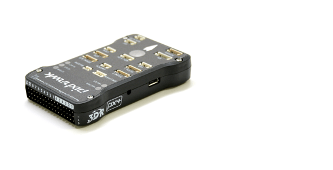
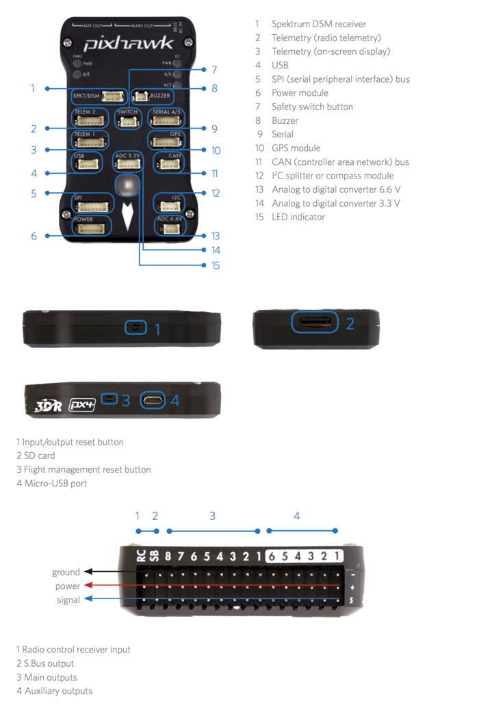
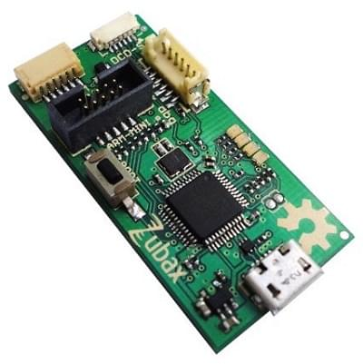
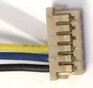
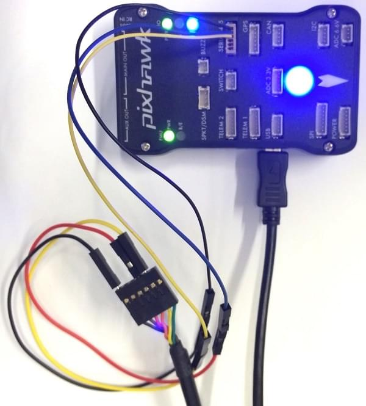
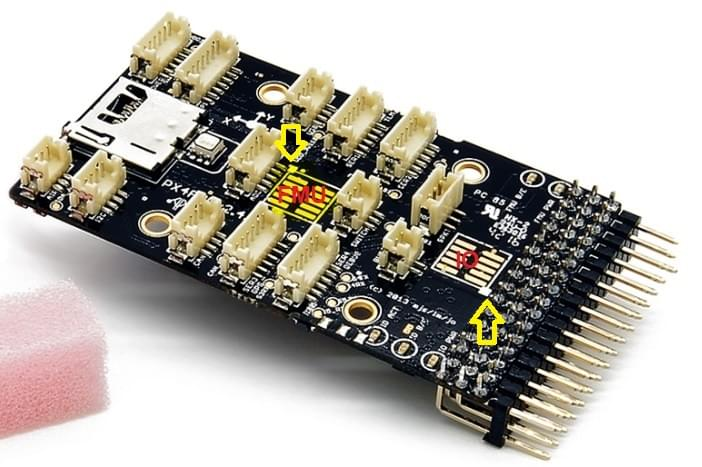
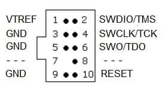

# 3DR Pixhawk 1 Flight Controller (знято з виробництва)

:::warning
This flight controller has been [discontinued](../flight_controller/autopilot_experimental.md) and is no longer commercially available.
You can use the [mRo Pixhawk](../flight_controller/mro_pixhawk.md) as a drop-in replacement.
:::

:::warning
PX4 не розробляє цей (або будь-який інший) автопілот.
Звертайтесь до виробника з питань щодо підтримки або відповідності.
:::

The _3DR Pixhawk<sup>&reg;</sup> 1_ autopilot is a popular general purpose flight controller based on the [Pixhawk-project](https://pixhawk.org/) **FMUv2** open hardware design (it combines the functionality of the PX4FMU + PX4IO).
It runs PX4 on the [NuttX](https://nuttx.apache.org/) OS.



Assembly/setup instructions for use with PX4 are provided here: [Pixhawk Wiring Quickstart](../assembly/quick_start_pixhawk.md)

## Основні характеристики

- Main System-on-Chip: [STM32F427](http://www.st.com/web/en/catalog/mmc/FM141/SC1169/SS1577/LN1789)
  - CPU: 180 MHz ARM<sup>&reg;</sup> Cortex<sup>&reg;</sup> M4 з одинарною точністю FPU
  - RAM: 256 KB SRAM (L1)
- Failsafe System-on-Chip: STM32F100
  - CPU: 24 MHz ARM Cortex M3
  - RAM: 8 KB SRAM
- Wifi: ESP8266 зовнішній
- GPS: u-blox<sup>&reg;</sup> 7/8 (Hobbyking<sup>&reg;</sup>) / u-blox 6 (3D Robotics)
- Optical flow: [PX4 Flow unit](../sensor/px4flow.md)
- Резервні входи живлення та автоматичне перемикання на резервне джерело
- Зовнішній запобіжний вимикач
- Головний візуальний індикатор - багатоколірний світлодіод
- Потужний багатотональний п'єзозвуковий індикатор
- Карта microSD для високошвидкісної фіксації даних протягом тривалого періоду часу

Підключення

- 1x I2C
- 1x CAN (2x опційно)
- 1x ADC
- 4x UART (2x з контролем потоку)
- 1x Консоль
- 8x ШІМ з ручним управлінням
- 6x PWM / GPIO / PWM вхід
- S.BUS / PPM / Spektrum вхід
- S.BUS вивід

# Де купити

Ця плата, що оригінально вироблялася компанією 3DR&reg;, була стандартною платформою мікроконтролера для PX4&reg;. While the board is no longer manufactured by 3DR, you can use the [mRo Pixhawk](../flight_controller/mro_pixhawk.md) as a drop-in replacement.

Замовте mRo Pixhawk з:

- [Bare Bones](https://store.mrobotics.io/Genuine-PixHawk-1-Barebones-p/mro-pixhawk1-bb-mr.htm) - Just the board (useful as a 3DR Pixhawk replacement)
- [mRo Pixhawk 2.4.6 Essential Kit](https://store.mrobotics.io/Genuine-PixHawk-Flight-Controller-p/mro-pixhawk1-minkit-mr.htm) - includes everything except for telemetry radios
- [mRo Pixhawk 2.4.6 Cool Kit! (Limited edition)](https://store.mrobotics.io/product-p/mro-pixhawk1-fullkit-mr.htm) - includes everything you need including telemetry radios

## Характеристики

### Процесор

- 32bit STM32F427 [Cortex-M4F](http://en.wikipedia.org/wiki/ARM_Cortex-M#Cortex-M4) core with FPU
- 168 MHz
- 256 KB RAM
- 2 MB Flash
- 32 bit STM32F103 відмовостійкий копроцесор

### Датчики

- ST Micro L3GD20H 16 bit гіроскоп
- ST Micro LSM303D 14 bit акселерометр / магнітометр
- Invensense MPU 6000 3-вісний акселерометр/гіроскоп
- MEAS MS5611 барометр

### Інтерфейси

- 5x UART (послідовні порти), один високої потужності, 2x з контролем потоку ГВП
- 2x CAN (один з внутрішнім 3.3В трансивером, один на конекторі розширювача)
- Spektrum DSM / DSM2 / DSM-X® Satellite сумісний вхід
- Futaba S.BUS® сумісний вхід і вивід
- Вхід сигналу PPM sum
- Вхід RSSI (ШІМ або напруга)
- I2C
- SPI
- 3.3 та 6.6V ADC входи
- Внутрішній порт microUSB і розширення зовнішнього порту microUSB

<lite-youtube videoid="gCCC5A-Bvv4" title="PX4 Pixhawk (3DR) Multicolor Led in action"/>

### Система живлення та захист

- Ідеальний діодний контролер з автоматичним перемиканням на резервне живлення
- Сервопривід високої потужності (max. 10В) і сильного струму (10A+)
- Усі периферійні виводи захищені від перевантаження по струму, усі входи захищені від електростатичного розряду

## Номінальна напруга

Pixhawk може мати потрійну резервність у джерелі живлення, якщо подаються три джерела живлення. Три шини: вхід модуля живлення, вхід сервоприводу, вхід USB.

### Максимальна напруга нормальної роботи

За таких умов всі джерела живлення будуть використовуватися в цьому порядку для живлення системи

- Вхід модуля живлення (4.8В до 5.4В)
- Servo rail input (4.8V to 5.4V) **UP TO 10V FOR MANUAL OVERRIDE, BUT AUTOPILOT PART WILL BE UNPOWERED ABOVE 5.7V IF POWER MODULE INPUT IS NOT PRESENT**
- Вхід живлення USB (4.8В до 5.4В)

### Абсолютна максимальна напруга

За таких умов система не буде витрачати жодної потужності (не буде працювати), але залишиться неушкодженою.

- Вхід модуля живлення (4.1В до 5.7В, 0В до 20В неушкоджений)
- Вхід сервоприводу (4.1В до 5.7В, 0В до 20В)
- Вхід живлення USB (4.1В до 5.7В, 0В до 6В)

## Креслення

[FMUv2 + IOv2 schematic](https://raw.githubusercontent.com/PX4/Hardware/master/FMUv2/PX4FMUv2.4.5.pdf) -- Schematic and layout

:::info
As a CC-BY-SA 3.0 licensed Open Hardware design, all schematics and design files are [available](https://github.com/PX4/Hardware).
:::

## З'єднання

Порти Pixhawk показані нижче.
Вони використовують роз’єми Hirose DF13 (передують роз’ємам JST-GH, визначеним у стандарті роз’ємів Pixhawk).

:::warning
Many 3DR Pixhawk clones use Molex picoblade connectors instead of DF13 connectors.
Вони мають прямокутні штифти замість квадратних, і їх не можна вважати сумісними.
:::



:::tip
The `RC IN` port is for RC receivers only and provides sufficient power for that purpose.
**NEVER** connect any servos, power supplies or batteries to it or to the receiver connected to it.
:::

## Схема розташування виводів

#### TELEM1, TELEM2 порти

| Pin                        | Сигнал                       | Вольтаж               |
| -------------------------- | ---------------------------- | --------------------- |
| 1 (red) | VCC                          | +5V                   |
| 2 (blk) | TX (OUT)  | +3.3V |
| 3 (blk) | RX (IN)   | +3.3V |
| 4 (blk) | CTS (IN)  | +3.3V |
| 5 (blk) | RTS (OUT) | +3.3V |
| 6 (blk) | GND                          | GND                   |

#### Порт GPS

| Pin                        | Сигнал                      | Вольтаж               |
| -------------------------- | --------------------------- | --------------------- |
| 1 (red) | VCC                         | +5V                   |
| 2 (blk) | TX (OUT) | +3.3V |
| 3 (blk) | RX (IN)  | +3.3V |
| 4 (blk) | CAN2 TX                     | +3.3V |
| 5 (blk) | CAN2 RX                     | +3.3V |
| 6 (blk) | GND                         | GND                   |

#### SERIAL 4/5 port

У зв'язку з обмеженням простору два порти знаходяться на одному роз'ємі.

| Pin                        | Сигнал                     | Вольтаж               |
| -------------------------- | -------------------------- | --------------------- |
| 1 (red) | VCC                        | +5V                   |
| 2 (blk) | TX (#4) | +3.3V |
| 3 (blk) | RX (#4) | +3.3V |
| 4 (blk) | TX (#5) | +3.3V |
| 5 (blk) | RX (#5) | +3.3V |
| 6 (blk) | GND                        | GND                   |

#### ADC 6.6V

| Pin                        | Сигнал | Вольтаж                     |
| -------------------------- | ------ | --------------------------- |
| 1 (red) | VCC    | +5V                         |
| 2 (blk) | ADC IN | up to +6.6V |
| 3 (blk) | GND    | GND                         |

#### ADC 3.3V

| Pin                        | Сигнал | Вольтаж                  |
| -------------------------- | ------ | ------------------------ |
| 1 (red) | VCC    | +5V                      |
| 2 (blk) | ADC IN | до +3.3V |
| 3 (blk) | GND    | GND                      |
| 4 (blk) | ADC IN | до +3.3V |
| 5 (blk) | GND    | GND                      |

#### I2C

| Pin                        | Сигнал | Вольтаж                                           |
| -------------------------- | ------ | ------------------------------------------------- |
| 1 (red) | VCC    | +5V                                               |
| 2 (blk) | SCL    | +3.3 (pullups) |
| 3 (blk) | SDA    | +3.3 (pullups) |
| 4 (blk) | GND    | GND                                               |

#### CAN

| Pin                        | Сигнал                     | Вольтаж |
| -------------------------- | -------------------------- | ------- |
| 1 (red) | VCC                        | +5V     |
| 2 (blk) | CAN_H | +12V    |
| 3 (blk) | CAN_L | +12V    |
| 4 (blk) | GND                        | GND     |

#### SPI

| Pin                        | Сигнал                                                 | Вольтаж              |
| -------------------------- | ------------------------------------------------------ | -------------------- |
| 1 (red) | VCC                                                    | +5V                  |
| 2 (blk) | SPI_EXT_SCK  | +3.3 |
| 3 (blk) | SPI_EXT_MISO | +3.3 |
| 4 (blk) | SPI_EXT_MOSI | +3.3 |
| 5 (blk) | !SPI_EXT_NSS | +3.3 |
| 6 (blk) | !GPIO_EXT                         | +3.3 |
| 7 (blk) | GND                                                    | GND                  |

#### POWER

| Pin                        | Сигнал  | Вольтаж               |
| -------------------------- | ------- | --------------------- |
| 1 (red) | VCC     | +5V                   |
| 2 (blk) | VCC     | +5V                   |
| 3 (blk) | CURRENT | +3.3V |
| 4 (blk) | VOLTAGE | +3.3V |
| 5 (blk) | GND     | GND                   |
| 6 (blk) | GND     | GND                   |

#### SWITCH

| Pin                        | Сигнал                                                   | Вольтаж               |
| -------------------------- | -------------------------------------------------------- | --------------------- |
| 1 (red) | VCC                                                      | +3.3V |
| 2 (blk) | !IO_LED_SAFETY | GND                   |
| 3 (blk) | SAFETY                                                   | GND                   |

## Налаштування послідовного порту

| UART   | Пристрій   | Порт                                          |
| ------ | ---------- | --------------------------------------------- |
| UART1  | /dev/ttyS0 | IO debug                                      |
| USART2 | /dev/ttyS1 | TELEM1 (керування потоком) |
| USART3 | /dev/ttyS2 | TELEM2 (керування потоком) |
| UART4  |            |                                               |
| UART7  | CONSOLE    |                                               |
| UART8  | SERIAL4    |                                               |

<!-- Note: Got ports using https://github.com/PX4/PX4-user_guide/pull/672#issuecomment-598198434 -->

## Відладочні порти

### Порт Консолі

The [PX4 System Console](../debug/system_console.md) runs on the port labeled [SERIAL4/5](#serial-4-5-port).

:::tip
A convenient way to connect to the console is to use a [Dronecode probe](https://kb.zubax.com/display/MAINKB/Dronecode+Probe+documentation), as it comes with connectors that can be used with several different Pixhawk devices.
Simply connect the 6-pos DF13 1:1 cable on the [Dronecode probe](https://kb.zubax.com/display/MAINKB/Dronecode+Probe+documentation) to the Pixhawk `SERIAL4/5` port.


:::

The pinout is standard serial pinout, designed to connect to a [3.3V FTDI](https://www.digikey.com/en/products/detail/TTL-232R-3V3/768-1015-ND/1836393) cable (5V tolerant).

| 3DR Pixhawk 1 |                              | FTDI |                                     |
| ------------- | ---------------------------- | ---- | ----------------------------------- |
| 1             | +5V (red) |      | N/C                                 |
| 2             | S4 Tx                        |      | N/C                                 |
| 3             | S4 Rx                        |      | N/C                                 |
| 4             | S5 Tx                        | 5    | FTDI RX (yellow) |
| 5             | S5 Rx                        | 4    | FTDI TX (orange) |
| 6             | GND                          | 1    | FTDI GND (black) |

Підключення кабелю FTDI до 6-контактного роз’єму DF13 1:1 показано на малюнку нижче.



Повна проводка показана нижче.



:::info
For information on how to _use_ the console see: [System Console](../debug/system_console.md).
:::

### SWD Port

The [SWD](../debug/swd_debug.md) (JTAG) ports are hidden under the cover (which must be removed for hardware debugging).
Є окремі порти для FMU та IO, як показано нижче.



Порти являють собою 10-контактні роз’єми JTAG ARM, які вам, ймовірно, доведеться паяти.
Схема контактів для портів показана нижче (квадратні маркери в кутах вище вказують на контакт 1).



:::info
All Pixhawk FMUv2 boards have a similar SWD port.
:::

## Збірка прошивки

:::tip
Most users will not need to build this firmware!
It is pre-built and automatically installed by _QGroundControl_ when appropriate hardware is connected.
:::

To [build PX4](../dev_setup/building_px4.md) for this target:

```
make px4_fmu-v3_default
```

## Частини / Корпуси

- **ARM MINI JTAG (J6)**: 1.27 mm 10pos header (SHROUDED), for Black Magic Probe: FCI 20021521-00010D4LF ([Distrelec](https://www.distrelec.ch/en/minitek-127-straight-male-pcb-header-surface-mount-rows-10-contacts-27mm-pitch-amphenol-fci-20021521-00010d4lf/p/14352308), [Digi-Key](https://www.digikey.com/en/products/detail/20021521-00010T1LF/609-4054-ND/2414951),) or Samtec FTSH-105-01-F-DV-K (untested) or Harwin M50-3600542 ([Digikey](https://www.digikey.com/en/products/detail/harwin-inc/M50-3600542/2264370) or [Mouser](http://ch.mouser.com/ProductDetail/Harwin/M50-3600542/?qs=%2fha2pyFadujTt%2fIEz8xdzrYzHAVUnbxh8Ki%252bwWYPNeEa09PYvTkIOQ%3d%3d))
  - JTAG Adapter Option #1: [BlackMagic Probe](https://1bitsquared.com/products/black-magic-probe). Зверніть увагу, що може поставлятися без кабелів (перевірте у виробника).
    If so, you will need the **Samtec FFSD-05-D-06.00-01-N** cable ([Samtec sample service](https://www.samtec.com/products/ffsd-05-d-06.00-01-n) or Digi-Key Link: SAM8218-ND) or Tag Connect Ribbon and a Mini-USB cable.
  - JTAG Adapter Option #2: [Digi-Key Link: ST-LINK/V2](https://www.digikey.com/product-detail/en/stmicroelectronics/ST-LINK-V2/497-10484-ND) / [ST USER MANUAL](http://www.st.com/internet/com/TECHNICAL_RESOURCES/TECHNICAL_LITERATURE/USER_MANUAL/DM00026748.pdf), needs an ARM Mini JTAG to 20pos adapter: [Digi-Key Link: 726-1193-ND](https://www.digikey.com/en/products/detail/texas-instruments/MDL-ADA2/1986451)
  - JTAG Adapter Option #3: [SparkFun Link: Olimex ARM-TINY](http://www.sparkfun.com/products/8278) or any other OpenOCD-compatible ARM Cortex JTAG adapter, needs an ARM Mini JTAG to 20pos adapter: [Digi-Key Link: 726-1193-ND](https://www.digikey.com/en/products/detail/texas-instruments/MDL-ADA2/1986451)
- **USARTs**: Hirose DF13 6 pos ([Digi-Key Link: DF13A-6P-1.25H(20)](https://www.digikey.com/products/en?keywords=H3371-ND))
  - Mates: Hirose DF13 6 pos housing ([Digi-Key Link: Hirose DF13-6S-1.25C](https://www.digikey.com/products/en?keywords=H2182-ND))
- **I2C and CAN**: Hirose DF13 4 pos ([Digi-Key Link: DF13A-4P-1.25H(20)](https://www.digikey.com/en/products/detail/hirose-electric-co-ltd/DF13A-4P-1-25H-20/530666) - discontinued)

## Підтримувані платформи / Конструкції

Будь-який мультикоптер / літак / наземна платформа / човен, який може керуватися звичайними RC сервоприводами або сервоприводами Futaba S-Bus.
