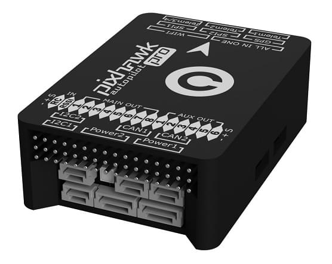

# Pixhawk 3 Pro (Знято з виробництва)

:::warning
PX4 не розробляє цей (або будь-який інший) автопілот.
Contact the [manufacturer](https://store-drotek.com/) for hardware support or compliance issues.
:::

Pixhawk<sup>&reg;</sup> 3 Pro базується на апаратному дизайні FMUv4 (Pixracer) з деякими оновленнями та додатковими функціями.
The board was designed by [Drotek<sup>&reg;</sup>](https://drotek.com) and PX4.



:::info
The main hardware documentation is here: https://drotek.gitbook.io/pixhawk-3-pro/hardware
:::

:::tip
This autopilot is [supported](../flight_controller/autopilot_pixhawk_standard.md) by the PX4 maintenance and test teams.
:::

## Короткий опис

- Microcontroller: **STM32F469**; Flash size is **2MiB**, RAM size is **384KiB**
- **ICM-20608-G** gyro / accelerometer
- **MPU-9250** gyro / accelerometer / magnetometer
- **LIS3MDL** compass
- Датчики, підключені через дві шини SPI (одна високочастотна й одна малошумна шина)
- Два шини I2C
- Два CAN шини
- Показники напруги / батареї з двох блоків живлення
- FrSky<sup>&reg;</sup> інвертор
- 8 Main + 6 AUX виводів PWM (окремий IO чіп, PX4IO)
- microSD (логування)
- S.BUS / Spektrum / SUMD / PPM вхід
- JST GH роз'єми: ті самі роз'єми та розводка, що й у Pixracer

## Де купити

From [Drotek store](https://store.drotek.com/) (EU) :

- [Pixhawk 3 Pro (Pack)](https://store.drotek.com/autopilots/844-pixhawk-3-pro-pack.html)
- [Pixhawk 3 Pro](https://store.drotek.com/autopilots/821-pixhawk-pro-autopilot-8944595120557.html)

From [readymaderc](https://www.readymaderc.com) (USA) :

- [Pixhawk 3 Pro](https://www.readymaderc.com/products/details/pixhawk-3-pro-flight-controller)

## Збірка прошивки

:::tip
Most users will not need to build this firmware!
It is pre-built and automatically installed by _QGroundControl_ when appropriate hardware is connected.
:::

To [build PX4](../dev_setup/building_px4.md) for this target:

```
make px4_fmu-v4pro_default
```

## Відладочний порт

Плата має порти FMU та IO для відладки, як показано нижче.


The pinouts and connector comply with the [Pixhawk Debug Mini](../debug/swd_debug.md#pixhawk-debug-mini) interface defined in the [Pixhawk Connector Standard](https://github.com/pixhawk/Pixhawk-Standards/blob/master/DS-009%20Pixhawk%20Connector%20Standard.pdf) (JST SM06B connector).

| Pin                        | Сигнал                              | Вольтаж               |
| -------------------------- | ----------------------------------- | --------------------- |
| 1 (red) | VCC TARGET SHIFT                    | +3.3V |
| 2 (blk) | CONSOLE TX (OUT) | +3.3V |
| 3 (blk) | CONSOLE RX (IN)  | +3.3V |
| 4 (blk) | SWDIO                               | +3.3V |
| 5 (blk) | SWCLK                               | +3.3V |
| 6 (blk) | GND                                 | GND                   |

Інформацію про підключення та використання цього порту див:

- [SWD Debug Port](../debug/swd_debug.md)
- [PX4 System Console](../debug/system_console.md#pixhawk_debug_port) (Note, the FMU console maps to UART7).

## Налаштування послідовного порту

| UART   | Пристрій   | Порт                                          |
| ------ | ---------- | --------------------------------------------- |
| UART1  | /dev/ttyS0 | WiFi                                          |
| USART2 | /dev/ttyS1 | TELEM1 (керування потоком) |
| USART3 | /dev/ttyS2 | TELEM2 (керування потоком) |
| UART4  |            |                                               |
| UART7  | CONSOLE    |                                               |
| UART8  | SERIAL4    |                                               |

<!-- Note: Got ports using https://github.com/PX4/PX4-user_guide/pull/672#issuecomment-598198434 -->
