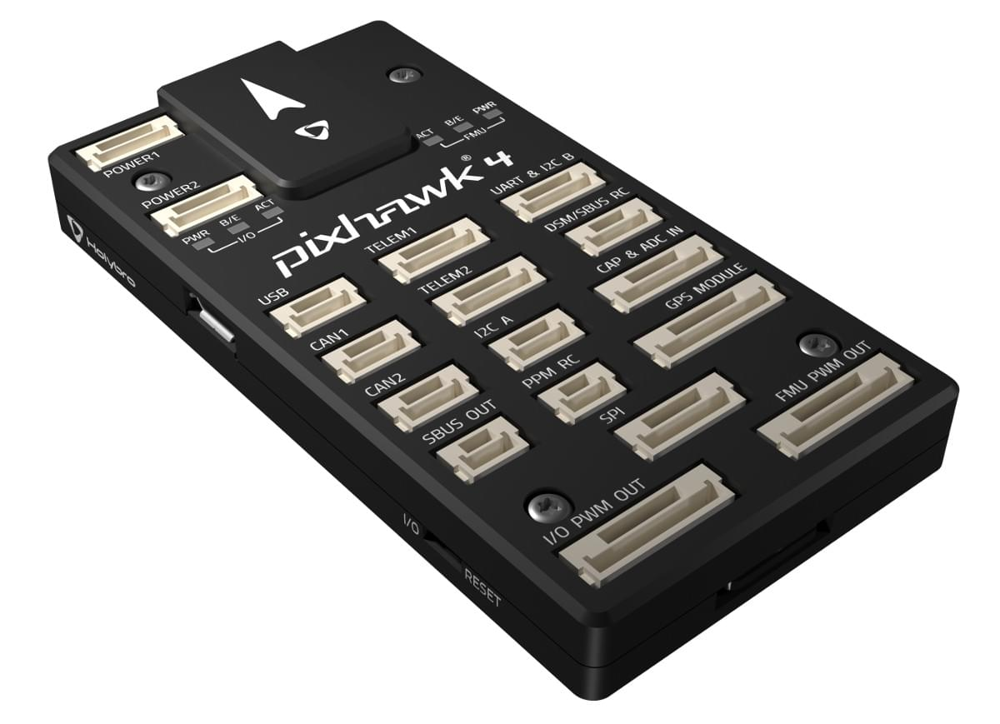

# Holybro Pixhawk 4

:::warning
PX4 не розробляє цей (або будь-який інший) автопілот.
Contact the [manufacturer](https://holybro.com/) for hardware support or compliance issues.
:::

_Pixhawk 4_<sup>&reg;</sup> is an advanced autopilot designed and made in collaboration with Holybro<sup>&reg;</sup> and the PX4 team.
Він оптимізований для роботи з PX4 v1.7 та пізніших версій, і підходить для академічних та комерційних розробників.

It is based on the [Pixhawk-project](https://pixhawk.org/) **FMUv5** open hardware design and runs PX4 on the [NuttX](https://nuttx.apache.org/) OS.

 

:::tip
This autopilot is [supported](../flight_controller/autopilot_pixhawk_standard.md) by the PX4 maintenance and test teams.
:::

## Короткий опис

- Головний FMU процесор: STM32F765
  - 32 Bit Arm® Cortex®-M7, 216MHz, 2MB memory, 512KB RAM
- IO Processor: STM32F100
  - 32 Bit Arm®️ Cortex®️-M3, 24MHz, 8KB SRAM
- Бортові сенсори:
  - Акселератор/гіроскоп: ICM-20689
  - Accel/Gyro: BMI055 або ICM20602
  - Магнітометр: IST8310
  - Барометр: MS5611
- GPS: u-blox Neo-M8N GPS/ГЛОНАСС приймач; інтегрований магнетометр IST8310
- Інтерфейси:
  - 8-16 PWM виходи (8 із IO, 8 із FMU)
  - 3 виділених PWM/Capture входи на FMU
  - Виділений R/C вхід для CPPM
  - Виділений R/C вхід для Spektrum / DSM та S.Bus з аналоговим / PWM RSSI входом
  - Спеціалізований S.BUS вивід сервоприводу
  - 5 загальних послідовних портів
  - 3 I2C порти
  - 4 шини SPI
  - До 2 CANBus для подвійного CAN з послідовним ESC
  - Аналогові входи для напруги / струму з 2 батарей
- Система живлення:
  - Вивід енергомодуля 4.9~5.5 В
  - Вхід USB Power: 4.75~5.25V
  - Вхід сервоприводу: 0~36V
- Вага та розміри:
  - Вага: 15.8g
  - Розміри: 44x84x12мм
- Інші характеристики:
  - Температура роботи: -40 ~ 85°c

Additional information can be found in the [Pixhawk 4 Technical Data Sheet](https://github.com/PX4/PX4-user_guide/raw/main/assets/flight_controller/pixhawk4/pixhawk4_technical_data_sheet.pdf).

## Де купити

Order from [Holybro](https://holybro.com/products/pixhawk-4).

## З’єднання


:::warning
The **DSM/SBUS RC** and **PPM RC** ports are for RC receivers only.
Вони працюють на електроживленні! НІКОЛИ не підключайте до нього жодних сервоприводів, джерел живлення або батарей (або до будь-якого підключеного приймача).
:::

## Схема розташування виводів

Download _Pixhawk 4_ pinouts from [here](https://cdn.shopify.com/s/files/1/0604/5905/7341/files/Pixhawk4-Pinouts.pdf).

:::info
Connector pin assignments are left to right (i.e. Pin 1 - це найлівіший контакт).
The exception is the [debug port(s)](#debug_port) (pin 1 is the right-most, as shown below).
:::

## Налаштування послідовного порту

| UART   | Пристрій   | Порт                                          |
| ------ | ---------- | --------------------------------------------- |
| UART1  | /dev/ttyS0 | GPS                                           |
| USART2 | /dev/ttyS1 | TELEM1 (керування потоком) |
| USART3 | /dev/ttyS2 | TELEM2 (керування потоком) |
| UART4  | /dev/ttyS3 | TELEM4                                        |
| USART6 | /dev/ttyS4 | RC SBUS                                       |
| UART7  | /dev/ttyS5 | Debug Console                                 |
| UART8  | /dev/ttyS6 | PX4IO                                         |

## Розміри


## Номінальна напруга

_Pixhawk 4_ can be triple-redundant on the power supply if three power sources are supplied. The three power rails are: **POWER1**, **POWER2** and **USB**.

:::info
The output power rails **FMU PWM OUT** and **I/O PWM OUT** (0V to 36V) do not power the flight controller board (and are not powered by it).
You must supply power to one of **POWER1**, **POWER2** or **USB** or the board will be unpowered.
:::

**Normal Operation Maximum Ratings**

За таких умов всі джерела живлення будуть використовуватися в цьому порядку для живлення системи:

1. **POWER1** and **POWER2** inputs (4.9V to 5.5V)
2. **USB** input (4.75V to 5.25V)

**Absolute Maximum Ratings**

За таких умов система не буде витрачати жодної потужності (не буде працювати), але залишиться неушкодженою.

1. **POWER1** and **POWER2** inputs (operational range 4.1V to 5.7V, 0V to 10V undamaged)
2. **USB** input (operational range 4.1V to 5.7V, 0V to 6V undamaged)
3. Servo input: VDD_SERVO pin of **FMU PWM OUT** and **I/O PWM OUT** (0V to 42V undamaged)

## Зборка/інсталяція

The [Pixhawk 4 Wiring Quick Start](../assembly/quick_start_pixhawk4.md) provides instructions on how to assemble required/important peripherals including GPS, Power Management Board etc.

## Збірка прошивки

:::tip
Most users will not need to build this firmware!
It is pre-built and automatically installed by _QGroundControl_ when appropriate hardware is connected.
:::

To [build PX4](../dev_setup/building_px4.md) for this target:

```
make px4_fmu-v5_default
```

<a id="debug_port"></a>

## Відладочний порт

The [PX4 System Console](../debug/system_console.md) and [SWD interface](../debug/swd_debug.md) run on the **FMU Debug** port, while the I/O console and SWD interface can be accessed via **I/O Debug** port.
In order to access these ports, the user must remove the _Pixhawk 4_ casing.


The pinout uses the standard [Pixhawk debug connector pinout](https://github.com/pixhawk/Pixhawk-Standards/blob/master/DS-009%20Pixhawk%20Connector%20Standard.pdf).
Для отримання інформації про з'єднання дивіться:

- [System Console > Pixhawk Debug Port](../debug/system_console.md#pixhawk_debug_port)

## Периферійні пристрої

- [Digital Airspeed Sensor](https://store-drotek.com/793-digital-differential-airspeed-sensor-kit-.html)
- [Telemetry Radio Modules](../telemetry/index.md)
- [Rangefinders/Distance sensors](../sensor/rangefinders.md)

## Підтримувані платформи / Конструкції

Будь-який мультикоптер / літак / наземна платформа / човен, який може керуватися звичайними RC сервоприводами або сервоприводами Futaba S-Bus.
The complete set of supported configurations can be seen in the [Airframes Reference](../airframes/airframe_reference.md).

## Подальша інформація

- [Pixhawk 4 Technical Data Sheet](https://github.com/PX4/PX4-user_guide/raw/main/assets/flight_controller/pixhawk4/pixhawk4_technical_data_sheet.pdf)
- [FMUv5 reference design pinout](https://docs.google.com/spreadsheets/d/1-n0__BYDedQrc_2NHqBenG1DNepAgnHpSGglke-QQwY/edit#gid=912976165).
- [Pixhawk 4 Wiring QuickStart](../assembly/quick_start_pixhawk4.md)
- [Pixhawk 4 Pinouts](https://cdn.shopify.com/s/files/1/0604/5905/7341/files/Pixhawk4-Pinouts.pdf) (Holybro)
- [Pixhawk 4 Quick Start Guide](https://cdn.shopify.com/s/files/1/0604/5905/7341/files/Pixhawk4-quickstartguide.pdf) (Holybro)
