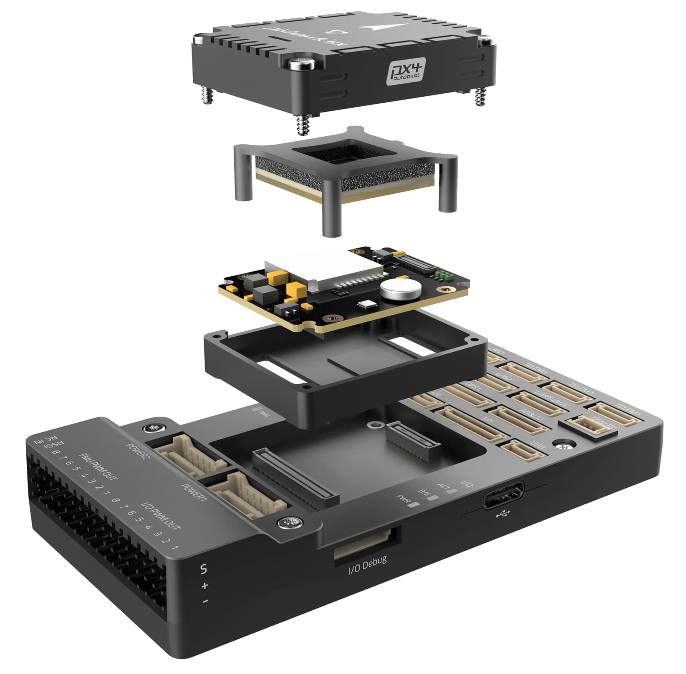
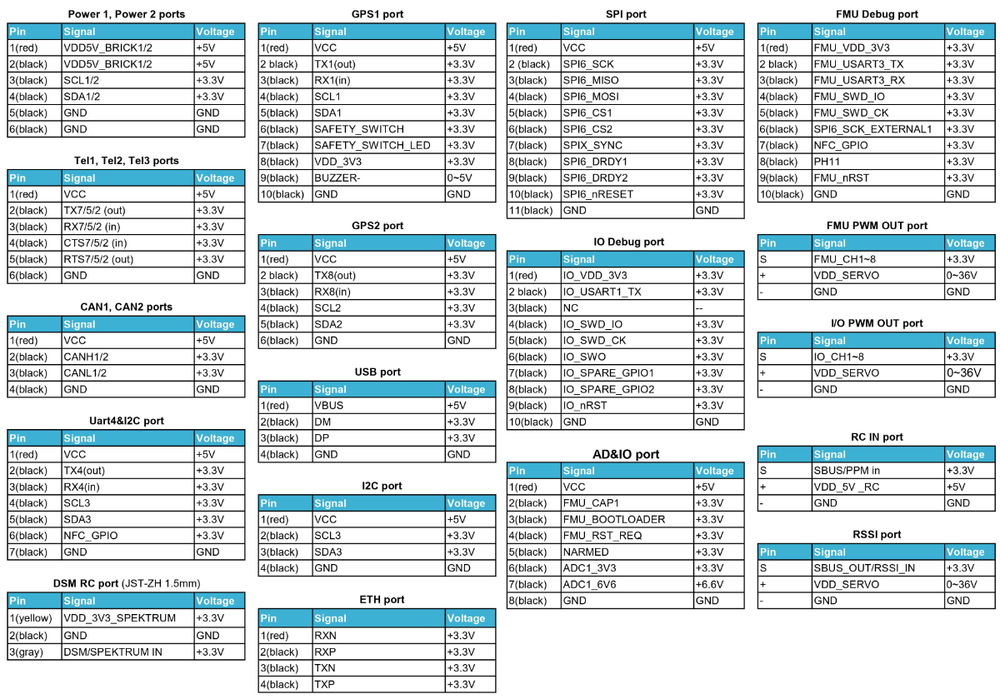

# Holybro Pixhawk 5X

:::warning
PX4 не розробляє цей (або будь-який інший) автопілот.
Contact the [manufacturer](https://holybro.com/) for hardware support or compliance issues.
:::

_Pixhawk 5X_<sup>&reg;</sup> є останнім оновленням успішної серії політних контролерів Pixhawk®, розроблених та виготовлених у співпраці між Holybro<sup>&reg;</sup> та командою PX4.

It is based on the [Pixhawk​​® Autopilot FMUv5X Standard](https://github.com/pixhawk/Pixhawk-Standards/blob/master/DS-011%20Pixhawk%20Autopilot%20v5X%20Standard.pdf), [Autopilot Bus Standard](https://github.com/pixhawk/Pixhawk-Standards/blob/master/DS-010%20Pixhawk%20Autopilot%20Bus%20Standard.pdf), and [Connector Standard](https://github.com/pixhawk/Pixhawk-Standards/blob/master/DS-009%20Pixhawk%20Connector%20Standard.pdf).
Він поставляється з попередньо встановленою найновішою версією PX4 Autopilot​®, потрійним резервуванням, температурним контролем, ізольованими датчиками, що забезпечує неймовірну продуктивність і надійність.

 

:::tip
This autopilot is [supported](../flight_controller/autopilot_pixhawk_standard.md) by the PX4 maintenance and test teams.
:::

## Введення

Всередині Pixhawk® 5X ви можете знайти STM32F7 на базі STMicroelectronics® у поєднанні з сенсорною технологією від Bosch®, InvenSense®, що дає вам гнучкість і надійність для керування будь-яким автономним транспортним засобом, придатним як для академічних, так і для комерційних застосувань.
Мікроконтролер Pixhawk® 5X F7 має 2 МБ флеш-пам'яті та 512 КБ ОЗП.
Автопілот PX4 використовує переваги збільшеної потужності та оперативної пам’яті.
Завдяки оновленій потужності обробки розробники можуть бути більш продуктивними та ефективними у своїй роботі з розробкою, що дозволяє використовувати складні алгоритми та моделі.

Відкритий стандарт FMUv5X включає в себе високопродуктивні IMU з низьким рівнем шуму, призначені для кращої стабілізації.
Triple redundant IMU & double redundant barometer on separate buses.
Коли автопілот PX4 виявляє відмову датчика, система безперервно переключається на інший, щоб забезпечити надійність керування польотом.

Кожен незалежний LDO живить кожен набір сенсорів з незалежним керуванням живленням.
Нова конструкція віброізоляції для фільтрації високочастотної вібрації та зменшення шуму для забезпечення точних показань, що дозволяє транспортним засобам досягати кращих загальних характеристик польоту.
Зовнішня шина датчика (SPI5) має дві лінії вибору мікросхем та сигнали готовності даних для додаткових датчиків та корисного навантаження з інтерфейсом SPI, а також з інтегрованим Ethernet PHY від Microchip (LAN8742AI-CZ-TR), підтримується високошвидкісний обмін даними з обчислювальними пристроями місії через Ethernet.
Два розумних порти моніторингу батареї (SMBus), підтримка модуля живлення INA226 SMBus.

Pixhawk® 5X ідеально підходить для розробників у корпоративних дослідницьких лабораторіях, стартапах, академії (дослідження, професори, студенти) та комерційних застосувань.

## Ключові пункти дизайну

- Модульний політний контролер
  - відокремлений IMU, FMU та Base system, з'єднані за допомогою роз'ємів Pixhawk® Autopilot Bus на 100 & 50 контактів, призначені для гнучких та налаштовуваних систем
- Резервування
  - 3x датчики IMU & 2x датчики барометра на окремих шинах, що дозволяє паралельну та безперервну роботу навіть в разі відмови обладнання
- Потрійне резервування доменів
  - Повністю ізольовані сенсорні домени з окремими шинами та окремим керуванням живленням
- IMU з контролем температури
  - Вбудовані нагрівальні резистори IMU, що забезпечують оптимальну робочу температуру IMU
- Система ізоляції вібрації
  - Нова система, призначена для фільтрації високочастотних вібрацій та зменшення шуму для забезпечення точних даних
- Інтерфейс Ethernet
  - Для високошвидкісної інтеграції комп'ютера місії
- Автоматизоване калібрування сенсорів, що усуває відхилення сигналів та температури
- Моніторинг двох розумних батарей на SMBus
- Додаткова лінія GPIO та 5V для зовнішнього NFC зчитувача
- Безпечний елемент для безпечної аутентифікації дрона (SE050)

## Технічна специфікація

- FMU Processor: STM32F765
  - 32 Bit Arm® Cortex®-M7, 216MHz, 2MB memory, 512KB RAM

- IO Processor: STM32F100
  - 32 Bit Arm®️ Cortex®️-M3, 24MHz, 8KB SRAM

- Бортові сенсори:

  - Accel/Gyro: ICM-20649
  - Accel/Gyro: ICM-42688P
  - Акселератор/гіроскоп: ICM-20602
  - Magnetometer: BMM150
  - Barometer: 2x BMP388

- Інтерфейси

  - 16 PWM виводів сервоприводів
  - R/C вхід для Spektrum / DSM
  - Виділений R/C вхід для PPM та S.Bus входу
  - Спеціалізований аналоговий / PWM вхід RSSI та вивід S.Bus
  - 4 загальних послідовних порти
    - 3 з повним контролем потоку
    - 1 з відокремленням 1.5A поточної межі
    - 1 з I2C та додатковою лінією GPIO для зовнішнього NFC зчитувача
  - 2 порти GPS
    - 1 повний GPS порт & порт запобіжного перемикача
    - 1 базовий порт GPS
  - 1 I2C порт
  - 1 порт Ethernet
    - Transformerless Applications
  - 100Mbps
  - 1 шина SPI
  - 2 лінії вибору чіпу
  - 2 лінії готових даних
  - 1 SPI SYNC лінія
  - 1 лінія SPI reset
  - 2 CAN шини для CAN периферії
    - CAN шина має individual silent controls або ESC RX-MUX control
  - 2 порти вводу живлення з SMBus
  - 1 AD & IO port
    - 2 додаткових аналогових входи
    - 1 PWM/Capture вхід
    - 2 виділені відладочні та GPIO лінії

- Номінальна напруга

  - Максимальна вхідна напруга: 6 В
  - Вхід USB Power: 4.75~5.25V
  - Вхід сервоприводу: 0~36V

- Розміри

  - Модуль політного контролера: 38.8 x 31.8 x 14.6mm
  - Стандартна базова плата: 52.4 x 103.4 x 16.7mm

- Вага

  - Модуль політного контролера: 23g
  - Стандартна базова плата: 51g

- Інші характеристики:
  - Operating & storage temperature: -40 ~ 85°c

## Де купити

Замовляйте на [Holybro](https://holybro.com/products/pixhawk-5x).

## Зборка/інсталяція

[Швидкий старт з підключення Pixhawk 5X](../assembly/quick_start_pixhawk5x.md) надає інструкції щодо збірки необхідних/важливих периферійних пристроїв, включаючи GPS, модуль живлення тощо.

## З'єднання


## Схема розташування виводів



:::info
Connector pin assignments are left to right (i.e. Pin 1 - це найлівіший контакт).
:::info

- The [camera capture pin](../camera/fc_connected_camera.md#camera-capture-configuration) (`PI0`) is pin 2 on the AD&IO port, marked above as `FMU_CAP1`.
- Схему контактів _Pixhawk 5X_ можна завантажити у форматі PDF [тут](https://github.com/PX4/PX4-user_guide/blob/main/assets/flight_controller/pixhawk5x/pixhawk5x_pinout.pdf) або [тут](https://cdn.shopify.com/s/files/1/0604/5905/7341/files/Holybro_Pixhawk5X_Pinout.pdf).

## Налаштування послідовного порту

| UART   | Пристрій   | Порт                            |
| ------ | ---------- | ------------------------------- |
| USART1 | /dev/ttyS0 | GPS                             |
| USART2 | /dev/ttyS1 | TELEM3                          |
| USART3 | /dev/ttyS2 | Debug Console                   |
| UART4  | /dev/ttyS3 | UART4 & I2C |
| UART5  | /dev/ttyS4 | TELEM2                          |
| USART6 | /dev/ttyS5 | PX4IO/RC                        |
| UART7  | /dev/ttyS6 | TELEM1                          |
| UART8  | /dev/ttyS7 | GPS2                            |

## Розміри


## Номінальна напруга

_Pixhawk 5X_ can be triple-redundant on the power supply if three power sources are supplied. The three power rails are: **POWER1**, **POWER2** and **USB**.
The **POWER1** & **POWER2** ports on the Pixhawk 5X uses the 6 circuit [2.00mm Pitch CLIK-Mate Wire-to-Board PCB Receptacle](https://www.molex.com/molex/products/part-detail/pcb_receptacles/5024430670).

**Normal Operation Maximum Ratings**

За таких умов всі джерела живлення будуть використовуватися в цьому порядку для живлення системи:

1. **POWER1** and **POWER2** inputs (4.9V to 5.5V)
2. **USB** input (4.75V to 5.25V)

**Absolute Maximum Ratings**

За таких умов система не буде витрачати жодної потужності (не буде працювати), але залишиться неушкодженою.

1. **POWER1** and **POWER2** inputs (operational range 4.1V to 5.7V, 0V to 10V undamaged)
2. **USB** input (operational range 4.1V to 5.7V, 0V to 6V undamaged)
3. Servo input: VDD_SERVO pin of **FMU PWM OUT** and **I/O PWM OUT** (0V to 42V undamaged)

**Voltage monitoring**

Цифровий моніторинг батареї I2C увімкнено за замовчуванням (див. [Швидкий старт >  Живлення](../assembly/quick_start_pixhawk5x.md#power)).

::: info
Аналоговий моніторинг батареї через ADC не підтримується на цій конкретній платі, але може підтримуватися в варіантах цього політного контролера з іншою базовою платою.
:::

## Збірка прошивки

:::tip
Most users will not need to build this firmware!
It is pre-built and automatically installed by _QGroundControl_ when appropriate hardware is connected.
:::

To [build PX4](../dev_setup/building_px4.md) for this target:

```
make px4_fmu-v5x_default
```

<a id="debug_port"></a>

## Відладочний порт

The [PX4 System Console](../debug/system_console.md) and [SWD interface](../debug/swd_debug.md) run on the **FMU Debug** port.

The pinouts and connector comply with the [Pixhawk Debug Full](../debug/swd_debug.md#pixhawk-debug-full) interface defined in the [Pixhawk Connector Standard](https://github.com/pixhawk/Pixhawk-Standards/blob/master/DS-009%20Pixhawk%20Connector%20Standard.pdf) interface (JST SM10B connector).

| Pin                            | Сигнал                              | Вольтаж               |
| ------------------------------ | ----------------------------------- | --------------------- |
| 1 (red)     | `Vtref`                             | +3.3V |
| 2 (blk)     | Console TX (OUT) | +3.3V |
| 3 (blk)     | Console RX (IN)  | +3.3V |
| 4 (blk)     | `SWDIO`                             | +3.3V |
| 5 (blk)     | `SWCLK`                             | +3.3V |
| 6 (blk)     | `SWO`                               | +3.3V |
| 7 (blk)     | NFC GPIO                            | +3.3V |
| 8 (чорний)  | PH11                                | +3.3V |
| 9 (чорний)  | nRST                                | +3.3V |
| 10 (чорний) | `GND`                               | GND                   |

Інформацію про використання цього порту див:

- [SWD Debug Port](../debug/swd_debug.md)
- [PX4 System Console](../debug/system_console.md) (Note, the FMU console maps to USART3).

## Периферійні пристрої

- [Digital Airspeed Sensor](https://holybro.com/products/digital-air-speed-sensor)
- [Telemetry Radio Modules](https://holybro.com/collections/telemetry-radios?orderby=date)
- [Rangefinders/Distance sensors](../sensor/rangefinders.md)

## Підтримувані платформи / Конструкції

Будь-який мультикоптер / літак / наземна платформа / човен, який може керуватися звичайними RC сервоприводами або сервоприводами Futaba S-Bus.
The complete set of supported configurations can be seen in the [Airframes Reference](../airframes/airframe_reference.md).

## Подальша інформація

- [Гайд з підключення Pixhawk 5X](../assembly/quick_start_pixhawk5x.md)
- [Pixhawk 5X Overview & Specification](https://cdn.shopify.com/s/files/1/0604/5905/7341/files/Holybro_Pixhawk5X_Spec_Overview.pdf) (Holybro)
- [Pixhawk 5X Pinouts](https://cdn.shopify.com/s/files/1/0604/5905/7341/files/Holybro_Pixhawk5X_Pinout.pdf) (Holybro)
- [FMUv5X reference design pinout](https://docs.google.com/spreadsheets/d/1Su7u8PHp-Y1AlLGVuH_I8ewkEEXt_bHHYBHglRuVH7E/edit#gid=562580340).
- [Pixhawk Autopilot FMUv5X Standard](https://github.com/pixhawk/Pixhawk-Standards/blob/master/DS-011%20Pixhawk%20Autopilot%20v5X%20Standard.pdf).
- [Pixhawk Autopilot Bus Standard](https://github.com/pixhawk/Pixhawk-Standards/blob/master/DS-010%20Pixhawk%20Autopilot%20Bus%20Standard.pdf).
- [Pixhawk Connector Standard](https://github.com/pixhawk/Pixhawk-Standards/blob/master/DS-009%20Pixhawk%20Connector%20Standard.pdf).
