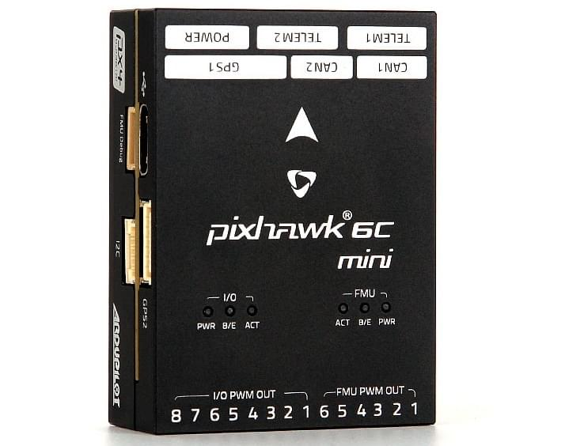

# Holybro Pixhawk 6C Mini

:::warning
PX4 не розробляє цей (або будь-який інший) автопілот.
Contact the [manufacturer](https://holybro.com/) for hardware support or compliance issues.
:::

_Pixhawk 6C Mini_<sup>&reg;</sup> is the latest update to the successful family of Pixhawk® flight controllers designed and made in collaboration with Holybro<sup>&reg;</sup> and the PX4 team.

Він оснащений високопродуктивним процесором H7, резервуванням IMU, платою IMU з контролем температури та економічно вигідним дизайном, що забезпечує неймовірну продуктивність і надійність.
It complies with the Pixhawk [Connector Standard](https://github.com/pixhawk/Pixhawk-Standards/blob/master/DS-009%20Pixhawk%20Connector%20Standard.pdf).



:::tip
This autopilot is [supported](../flight_controller/autopilot_pixhawk_standard.md) by the PX4 maintenance and test teams.
:::

## Введення

Pixhawk® 6C Mini є останнім оновленням успішної серії політних контролерів Pixhawk®.

Inside the Pixhawk® 6C Mini, you can find an STMicroelectronics® based STM32H743, paired with sensor technology from Bosch® & InvenSense®, giving you flexibility and reliability for controlling any autonomous vehicle, suitable for both academic and commercial applications.

Мікроконтролер H7 Pixhawk® 6C Mini містить ядро Arm® Cortex®-M7 до 480 MHz, має 2MB flash пам’яті та 1MB RAM.
Завдяки оновленій потужності обробки розробники можуть бути більш продуктивними та ефективними у своїй роботі з розробкою, що дозволяє використовувати складні алгоритми та моделі.

Pixhawk 6C Mini включає високопродуктивні, низькошумні IMU на борту, розроблені бути економічними, але водночас маючи резервування IMU.
Система віброізоляції для фільтрації високочастотної вібрації та зменшення шуму для забезпечення точних показань, що дозволяє транспортним засобам досягати кращих загальних характеристик польоту.

Pixhawk® 6C Mini ідеально підходить для розробників у корпоративних дослідницьких лабораторіях, стартапах, академічних закладах (дослідники, професори, студенти) та комерційних застосувань.

**Key Design Points**

- High performance STM32H743 Processor with more computing power & RAM
- Новий економічний дизайн із низькопрофільним форм-фактором
- Нова інтегрована система віброізоляції, призначена для фільтрації високочастотних вібрацій та зменшення шуму для забезпечення точних даних
- IMUs are temperature-controlled by onboard heating resistors, allowing optimum working temperature of IMUs&#x20

## Технічні характеристики

### **Processors & Sensors**

- FMU Processor: STM32H743&#x20
  - 32 Bit Arm® Cortex®-M7, 480MHz, 2MB memory, 1MB SRAM&#x20
- IO Processor: STM32F103
  - &#x20;32 Bit Arm® Cortex®-M3, 72MHz, 64KB SRAM&#x20
- On-board sensors&#x20
  - &#x20;Accel/Gyro: ICM-42688-P&#x20
  - Accel/Gyro: BMI055&#x20
  - Mag: IST8310&#x20
  - Барометр: MS5611

### **Electrical data**

- Номінальна напруга:
  - Максимальна вхідна напруга: 6 В
  - Вхід USB Power: 4.75~5.25V
  - Вхід Servo Rail: 0\~36V
- Номінальний струм:
  - \`TELEM1\`\` обмежувач максимального вихідного струму: 1A
  - Комбінований обмежувач вихідного струму всіх інших портів: 1A

### **Mechanical data**

- Розміри: 53.3 x 39 x 16.2 mm
- Вага: 39.2г

### **Interfaces**

- 14- PWM servo outputs (8 from IO, 6 from FMU)

- 3 загальних послідовних портів
  - `TELEM1` - Full flow control, separate 1A current limit
  - `TELEM2` - Full flow control

- 2 порти GPS
  - GPS1 - Повний порт GPS (GPS плюс захисний перемикач)
  - GPS2 - Basic GPS порт

- 1 I2C порт
  - Підтримує виділене I2C калібрування EEPROM, розташоване на модулі сенсорів

- 2 CAN шини
  - CAN шина має individual silent controls або ESC RX-MUX control

- 1 порт відладки:
  - FMU Debug Mini

- Виділений R/C вхід для Spektrum/DSM та S.BUS, CPPM, аналоговий / PWM RSSI

- 1 вхідний порт живлення (аналоговий)

- Інші характеристики:
  - Operating & storage temperature: -40 ~ 85°c

## Де купити

Order from [Holybro](https://holybro.com/products/pixhawk-6c-mini).

## Зборка/інсталяція

Порт Pixhawk 4 Mini дуже схожий з портом Pixhawk 6C Mini.
Please refer to the [Pixhawk 4 Mini Wiring Quick Start](../assembly/quick_start_pixhawk4_mini.md) as it provides instructions on how to assemble required/important peripherals including GPS, Power Module etc.

## Схема розташування виводів

- [Holybro Pixhawk 6C Mini Port Pinout](https://docs.holybro.com/autopilot/pixhawk-6c-mini/pixhawk-6c-mini-ports)

## Налаштування послідовного порту

| UART   | Пристрій   | Опис параметра QGC | Мітка порту на FC |
| ------ | ---------- | ------------------ | ----------------- |
| USART1 | /dev/ttyS0 | GPS1               | GPS1              |
| USART2 | /dev/ttyS1 | TELEM3             | N/A               |
| USART3 | /dev/ttyS2 | N/A                | FMU Debug         |
| UART5  | /dev/ttyS3 | TELEM2             | TELEM2            |
| USART6 | /dev/ttyS4 | PX4IO              | I/O PWM Out       |
| UART7  | /dev/ttyS5 | TELEM1             | TELEM1            |
| UART8  | /dev/ttyS6 | GPS2               | GPS2              |

<!-- See http://docs.px4.io/main/en/hardware/serial_port_mapping.html#serial-port-mapping -->

## Розміри


## Номінальна напруга

_Pixhawk 6C Mini_ can be double-redundant on the power supply if two power sources are supplied. The two power rails are: **POWER1** and **USB**.

**Normal Operation Maximum Ratings**

За таких умов всі джерела живлення будуть використовуватися в цьому порядку для живлення системи:

1. **POWER1** inputs (4.9V to 5.5V)
2. **USB** input (4.75V to 5.25V)

**Absolute Maximum Ratings**

За таких умов система не буде витрачати жодної потужності (не буде працювати), але залишиться неушкодженою.

1. **POWER1** inputs (operational range 4.1V to 5.7V, 0V to 10V undamaged)
2. **USB** input (operational range 4.1V to 5.7V, 0V to 6V undamaged)
3. Servo input: VDD_SERVO pin of **FMU PWM OUT** and **I/O PWM OUT** (0V to 42V undamaged)

**Voltage monitoring**

Pixhawk 6C Mini використовує аналогові модулі живлення.

Holybro makes various analog [power modules](../power_module/index.md) for different needs:

- [PM02 Power Module](../power_module/holybro_pm02.md)
- [PM06 Power Module](../power_module/holybro_pm06_pixhawk4mini_power_module.md)
- [PM07 Power Module](../power_module/holybro_pm07_pixhawk4_power_module.md)
- [PM08 Power Module](https://holybro.com/products/pm08-power-module-14s-200a)

## Збірка прошивки

:::tip
Most users will not need to build this firmware!
It is pre-built and automatically installed by _QGroundControl_ when appropriate hardware is connected.
:::

To [build PX4](../dev_setup/building_px4.md) for this target:

```
make px4_fmu-v6c_default
```

<a id="debug_port"></a>

## Відладочний порт

The [PX4 System Console](../debug/system_console.md) and [SWD interface](../debug/swd_debug.md) run on the **FMU Debug** port.

The pinouts and connector comply with the [Pixhawk Debug Mini](../debug/swd_debug.md#pixhawk-debug-mini) interface defined in the [Pixhawk Connector Standard](https://github.com/pixhawk/Pixhawk-Standards/blob/master/DS-009%20Pixhawk%20Connector%20Standard.pdf) interface (JST SH connector).

| Pin                        | Сигнал                              | Вольтаж               |
| -------------------------- | ----------------------------------- | --------------------- |
| 1 (red) | `Vtref`                             | +3.3V |
| 2 (blk) | Console TX (OUT) | +3.3V |
| 3 (blk) | Console RX (IN)  | +3.3V |
| 4 (blk) | `SWDIO`                             | +3.3V |
| 5 (blk) | `SWCLK`                             | +3.3V |
| 6 (blk) | `GND`                               | GND                   |

Інформацію про використання цього порту див:

- [SWD Debug Port](../debug/swd_debug.md)
- [PX4 System Console](../debug/system_console.md) (Note, the FMU console maps to USART3).

## Периферійні пристрої

- [Digital Airspeed Sensor](https://holybro.com/products/digital-air-speed-sensor)
- [Telemetry Radio Modules](../telemetry/index.md):
  - [Holybro Telemetry Radio](../telemetry/holybro_sik_radio.md)
  - [Holybro Microhard P900 Radio](../telemetry/holybro_microhard_p900_radio.md)
  - [Holybro XBP9X Telemetry Radio](../telemetry/holybro_xbp9x_radio.md)
- [Rangefinders/Distance sensors](../sensor/rangefinders.md)

## Підтримувані платформи / Конструкції

Будь-який мультикоптер / літак / наземна платформа / човен, який може керуватися звичайними RC сервоприводами або сервоприводами Futaba S-Bus.
The complete set of supported configurations can be seen in the [Airframes Reference](../airframes/airframe_reference.md).

## Дивіться також

- [Holybro Docs](https://docs.holybro.com/) (Holybro)
- [Pixhawk 4 Mini Wiring Quick Start](../assembly/quick_start_pixhawk4_mini.md) (and [Pixhawk 6C Wiring QuickStart](../assembly/quick_start_pixhawk6c.md))
- [PM02 Power Module](../power_module/holybro_pm02.md)
- [PM06 Power Module](../power_module/holybro_pm06_pixhawk4mini_power_module.md)
- [PM07 Power Module](../power_module/holybro_pm07_pixhawk4_power_module.md)
- [PM08 Power Module](https://holybro.com/products/pm08-power-module-14s-200a)
- FMUv6C reference design pinout.
- [Pixhawk Connector Standard](https://github.com/pixhawk/Pixhawk-Standards/blob/master/DS-009%20Pixhawk%20Connector%20Standard.pdf).
