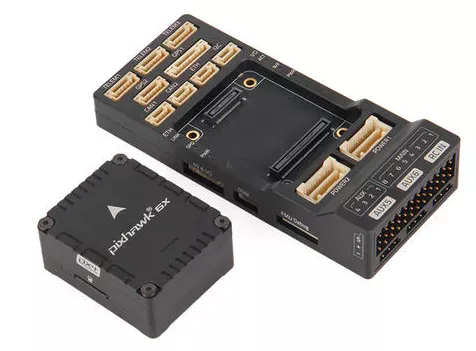
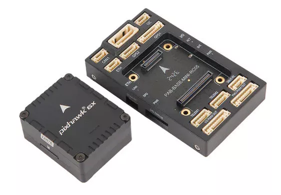

# Holybro Pixhawk 6X

:::warning
PX4 не розробляє цей (або будь-який інший) автопілот.
Contact the [manufacturer](https://holybro.com/) for hardware support or compliance issues.
:::

_Pixhawk 6X_<sup>&reg;</sup> is the latest update to the successful family of Pixhawk® flight controllers designed and made in collaboration with Holybro<sup>&reg;</sup> and the PX4 team.

It is based on the [Pixhawk​​® Autopilot FMUv6X Standard](https://github.com/pixhawk/Pixhawk-Standards/blob/master/DS-012%20Pixhawk%20Autopilot%20v6X%20Standard.pdf), [Autopilot Bus Standard](https://github.com/pixhawk/Pixhawk-Standards/blob/master/DS-010%20Pixhawk%20Autopilot%20Bus%20Standard.pdf), and [Connector Standard](https://github.com/pixhawk/Pixhawk-Standards/blob/master/DS-009%20Pixhawk%20Connector%20Standard.pdf).

Оснащений високопродуктивним процесором H7, модульним дизайном, потрійним резервуванням, платою IMU з контролем температури, ізольованими доменами сенсорів, що забезпечує неймовірну продуктивність, надійність та гнучкість.

### Pixhawk 6X (Rev 3)

 

### Pixhawk 6X (ICM-45686)

:::: tabs

:::tab Standard v2A



:::

:::tab Standard v2B


:::

:::tab Mini


:::

::::

:::tip
This autopilot is [supported](../flight_controller/autopilot_pixhawk_standard.md) by the PX4 maintenance and test teams.
:::

## Введення

Всередині Pixhawk® 6X ви можете знайти STM32H753 на базі STMicroelectronics®, поєднаний з сенсорною технологією від Bosch®, InvenSense®, що надає вам гнучкість і надійність для керування будь-яким автономним апаратом, придатним як для академічних, так і для комерційних застосувань.

Мікроконтролер H7 Pixhawk® 6X містить ядро Arm® Cortex®-M7 до 480 MHz, має 2MB flash пам’яті та 1MB RAM. Автопілот PX4 використовує переваги збільшеної потужності та оперативної пам’яті. Завдяки оновленій потужності обробки розробники можуть бути більш продуктивними та ефективними у своїй роботі з розробкою, що дозволяє використовувати складні алгоритми та моделі.

Відкритий стандарт FMUv6X містить високопродуктивні IMU з низьким рівнем шуму, призначені для кращої стабілізації. Triple redundant IMU & double redundant barometer on separate buses. Коли автопілот PX4 виявляє відмову датчика, система безперервно переключається на інший, щоб забезпечити надійність керування польотом.

Кожен незалежний LDO живить кожен набір сенсорів з незалежним керуванням живленням. Система віброізоляції для фільтрації високочастотної вібрації та зменшення шуму для забезпечення точних показань, що дозволяє транспортним засобам досягати кращих загальних характеристик польоту.

Зовнішня шина датчиків (SPI5) має дві лінії вибору чипів та сигнали готовності даних для додаткових датчиків та корисного навантаження з інтерфейсом SPI, а також з інтегрованим Microchip Ethernet PHY, високошвидкісний обмін даними з комп'ютерами місії через ethernet тепер можливий.

Pixhawk®​ 6X ідеально підходить для розробників у корпоративних дослідницьких лабораторіях, стартапах, академічних потреб (досліджень, професорів, студентів) та комерційного застосування.

## Ключові пункти дизайну

- Високопродуктивний процесор STM32H753
- Modular flight controller: separated IMU, FMU, and Base system connected by a 100-pin & a 50-pin Pixhawk®​ Autopilot Bus connector.
- Redundancy: 3x IMU sensors & 2x Barometer sensors on separate buses
- Потрійне резервування доменів: повністю ізольовані сенсорні домени з окремими шинами та окремим керуванням живленням
- Нова система ізоляції вібрацій для фільтрації високочастотних вібрацій та зменшення шуму для забезпечення точних вимірювань
- Інтерфейс Ethernet для високошвидкісної інтеграції комп'ютера місії
- IMUs are temperature-controlled by onboard heating resistors, allowing optimum working temperature of IMUs&#x20;

### Processors & Sensors

- Процесор FMU: STM32H753
  - 32 Bit Arm® Cortex®-M7, 480MHz, 2MB flash memory, 1MB RAM
- IO Processor: STM32F100
  - 32 Bit Arm®️ Cortex®️-M3, 24MHz, 8KB SRAM
- Сенсори на платі
  - Accel/Gyro: ICM-20649 або BMI088
  - Accel/Gyro: ICM-42688-P
  - Accel/Gyro: ICM-42670-P
  - Mag: BMM150
  - Barometer: 2x BMP388

### Електричні дані

- Номінальна напруга:
  - Максимальна вхідна напруга: 6 В
  - Вхід USB Power: 4.75~5.25V
  - Вхід Servo Rail: 0\~36V
- Номінальний струм:
  - `TELEM1` output current limiter: 1.5A
  - Комбінований обмежувач вихідного струму всіх інших портів: 1.5A

### Механічні характеристики

- Розміри
  - Модуль політного контролера: 38.8 x 31.8 x 14.6mm
  - Стандартна базова плата: 52.4 x 103.4 x 16.7mm
  - Міні базова плата: 43.4 x 72.8 x 14.2 mm
- Вага
  - Модуль політного контролера: 23g
  - Стандартна базова плата: 51g
  - Міні базова плата: 26.5g

### Інтерфейси

- 16 PWM виводів сервоприводів

- R/C вхід для Spektrum / DSM

- Виділений R/C вхід для PPM та S.Bus входу

- Спеціалізований аналоговий / PWM вхід RSSI та вивід S.Bus

- 4 загальних послідовних порти
  - 3 з повним контролем потоку
  - 1 з окремим обмеженням струму 1.5A (Telem1)
  - 1 з I2C та додатковою лінією GPIO для зовнішнього NFC зчитувача

- 2 порти GPS
  - 1 повний GPS плюс порт запобіжного перемикача
  - 1 базовий порт GPS

- 1 I2C порт

- 1 порт Ethernet
  - Transformerless Applications
  - 100Mbps

- 1 шина SPI
  - 2 лінії вибору чіпу
  - 2 лінії готових даних
  - 1 SPI SYNC лінія
  - 1 лінія SPI reset

- 2 CAN шини для CAN периферії
  - CAN шина має individual silent controls або ESC RX-MUX control

- 2 порти вводу живлення з SMBus

  - 1 AD & IO port
  - 2 додаткових аналогових входи
  - 1 PWM/Capture вхід
  - 2 виділені відладочні та GPIO лінії

- Інші характеристики:
  - Operating & storage temperature: -40 ~ 85°c

## Де купити

Order from [Holybro](https://holybro.com/products/pixhawk-6x).

## Зборка/інсталяція

The [Pixhawk 6X Wiring Quick Start](../assembly/quick_start_pixhawk6x.md) provides instructions on how to assemble required/important peripherals including GPS, Power Module etc.

## З'єднання

Sample Wiring Diagram


## Схема розташування виводів

- [Holybro Pixhawk Baseboard Pinout](https://docs.holybro.com/autopilot/pixhawk-6x/pixhawk-baseboard-pinout)
- [Holybro Pixhawk Mini-Baseboard Pinout](https://docs.holybro.com/autopilot/pixhawk-6x/pixhawk-mini-baseboard-pinout)
- [Holybro Pixhawk Jetson Baseboard](https://docs.holybro.com/autopilot/pixhawk-baseboards/pixhawk-jetson-baseboard)
- [Holybro Pixhawk RPi CM4 Baseboard](https://docs.holybro.com/autopilot/pixhawk-baseboards/pixhawk-rpi-cm4-baseboard)

Примітки:

- The [camera capture pin](../camera/fc_connected_camera.md#camera-capture-configuration) (`PI0`) is pin 2 on the AD&IO port, marked above as `FMU_CAP1`.

## Налаштування послідовного порту

| UART   | Пристрій   | Порт                            |
| ------ | ---------- | ------------------------------- |
| USART1 | /dev/ttyS0 | GPS                             |
| USART2 | /dev/ttyS1 | TELEM3                          |
| USART3 | /dev/ttyS2 | Debug Console                   |
| UART4  | /dev/ttyS3 | UART4 & I2C |
| UART5  | /dev/ttyS4 | TELEM2                          |
| USART6 | /dev/ttyS5 | PX4IO/RC                        |
| UART7  | /dev/ttyS6 | TELEM1                          |
| UART8  | /dev/ttyS7 | GPS2                            |

## Розміри

[Pixhawk 6X Dimensions](https://docs.holybro.com/autopilot/pixhawk-6x/dimensions)

## Номінальна напруга

_Pixhawk 6X_ can be triple-redundant on the power supply if three power sources are supplied. The three power rails are: **POWER1**, **POWER2** and **USB**.
The **POWER1** & **POWER2** ports on the Pixhawk 6X uses the 6 circuit [2.00mm Pitch CLIK-Mate Wire-to-Board PCB Receptacle](https://www.molex.com/molex/products/part-detail/pcb_receptacles/5024430670).

**Normal Operation Maximum Ratings**

За таких умов всі джерела живлення будуть використовуватися в цьому порядку для живлення системи:

1. **POWER1** and **POWER2** inputs (4.9V to 5.5V)
2. **USB** input (4.75V to 5.25V)

**Absolute Maximum Ratings**

За таких умов система не буде витрачати жодної потужності (не буде працювати), але залишиться неушкодженою.

1. **POWER1** and **POWER2** inputs (operational range 4.1V to 5.7V, 0V to 10V undamaged)
2. **USB** input (operational range 4.1V to 5.7V, 0V to 6V undamaged)
3. Servo input: VDD_SERVO pin of **FMU PWM OUT** and **I/O PWM OUT** (0V to 42V undamaged)

**Voltage monitoring**

Digital I2C battery monitoring is enabled by default (see [Quickstart > Power](../assembly/quick_start_pixhawk6x.md#power)).

:::info
Analog battery monitoring via an ADC is not supported on this particular board, but may be supported in variations of this flight controller with a different baseboard.
:::

## Збірка прошивки

:::tip
Most users will not need to build this firmware!
It is pre-built and automatically installed by _QGroundControl_ when appropriate hardware is connected.
:::

To [build PX4](../dev_setup/building_px4.md) for this target:

```
make px4_fmu-v6x_default
```

<a id="debug_port"></a>

## Відладочний порт

The [PX4 System Console](../debug/system_console.md) and [SWD interface](../debug/swd_debug.md) run on the **FMU Debug** port.

The pinouts and connector comply with the [Pixhawk Debug Full](../debug/swd_debug.md#pixhawk-debug-full) interface defined in the [Pixhawk Connector Standard](https://github.com/pixhawk/Pixhawk-Standards/blob/master/DS-009%20Pixhawk%20Connector%20Standard.pdf) interface (JST SM10B connector).

| Pin                            | Сигнал                              | Вольтаж               |
| ------------------------------ | ----------------------------------- | --------------------- |
| 1 (red)     | `Vtref`                             | +3.3V |
| 2 (blk)     | Console TX (OUT) | +3.3V |
| 3 (blk)     | Console RX (IN)  | +3.3V |
| 4 (blk)     | `SWDIO`                             | +3.3V |
| 5 (blk)     | `SWCLK`                             | +3.3V |
| 6 (blk)     | `SWO`                               | +3.3V |
| 7 (blk)     | NFC GPIO                            | +3.3V |
| 8 (чорний)  | PH11                                | +3.3V |
| 9 (чорний)  | nRST                                | +3.3V |
| 10 (чорний) | `GND`                               | GND                   |

Інформацію про використання цього порту див:

- [SWD Debug Port](../debug/swd_debug.md)
- [PX4 System Console](../debug/system_console.md) (Note, the FMU console maps to USART3).

## Периферійні пристрої

- [Telemetry Radio Modules](https://holybro.com/collections/telemetry-radios?orderby=date)
- [Rangefinders/Distance sensors](../sensor/rangefinders.md)
- [Holybro Sensors](https://holybro.com/collections/sensors)
- [Holybro GPS & RTK Systems](https://holybro.com/collections/gps-rtk-systems)
- [Power Modules & PDBs](https://holybro.com/collections/power-modules-pdbs)

## Підтримувані платформи / Конструкції

Будь-який мультикоптер / літак / наземна платформа / човен, який може керуватися звичайними RC сервоприводами або сервоприводами Futaba S-Bus.
The complete set of supported configurations can be seen in the [Airframes Reference](../airframes/airframe_reference.md).

## Подальша інформація

- [Holybro Docs](https://docs.holybro.com/) (Holybro)
- [Pixhawk 6X Wiring QuickStart](../assembly/quick_start_pixhawk6x.md)
- [Pixhawk Autopilot FMUv6X Standard](https://github.com/pixhawk/Pixhawk-Standards/blob/master/DS-012%20Pixhawk%20Autopilot%20v6X%20Standard.pdf).
- [Pixhawk Autopilot Bus Standard](https://github.com/pixhawk/Pixhawk-Standards/blob/master/DS-010%20Pixhawk%20Autopilot%20Bus%20Standard.pdf).
- [Pixhawk Connector Standard](https://github.com/pixhawk/Pixhawk-Standards/blob/master/DS-009%20Pixhawk%20Connector%20Standard.pdf).
