# Holybro Pixhawk Mini (Припинено)

:::warning
PX4 не розробляє цей (або будь-який інший) автопілот.
Contact the [manufacturer](https://holybro.com/) for hardware support or compliance issues.
:::

The Holybro _Pixhawk<sup>&reg;</sup> Mini_ autopilot is a next-generation evolution of the Pixhawk.
Це близько 1/3 розміру оригінального Pixhawk та має потужніші процесори та сенсори.

Pixhawk Mini базується на відкритому проекті PX4 і був оптимізований для стеку керування польотом PX4.

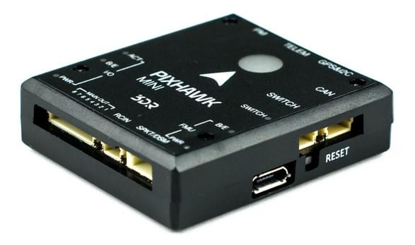

Wiring information is available [below](#wiring).

:::info
This flight controller was designed by 3DR in collaboration with HobbyKing<sup>&reg;</sup>.
Раніше він був відомий як 3DR Pixhawk Mini.
:::

:::tip
This autopilot is [supported](../flight_controller/autopilot_pixhawk_standard.md) by the PX4 maintenance and test teams.
:::

## Характеристики

**Processors:**

- **Main Processor:** STM32F427 Rev 3
- **IO Processor:** STM32F103

**Sensors:**

- **Accel/Gyro/Mag:** MPU9250
  - [deprecated](https://github.com/PX4/PX4-Autopilot/pull/7618) by the PX4 firmware
- **Accel/Gyro:** ICM20608
- **Barometer:** MS5611

**Voltage ratings:**

- **Power module output:** 4.1\~5.5V
- **Max input voltage:** 45V (10S LiPo)
- **Max current sensing:** 90A
- **USB Power Input:** 4.1\\`5.5V
- **Servo Rail Input:** 0\~10V

**Interfaces:**

- 1 x UART Serial Port (для GPS)
- Spektrum DSM/DSM2/DSM-X® Satellite Compatible RC вхід
- Futaba S BUS® Compatible RC вхід
- PPM Sum Signal RC вхід
- I2C (для цифрових сенсорів)
- CAN (для цифрового керування мотором з сумісними контролерами)
- ADC (для аналогових сенсорів)
- Мікро USB порт

**Weight and dimensions:**

- **Dimensions:** 38x43x12mm
- **Weight:** 15.8g

**GPS module (supplied with kit):**

- **GNSS receiver:** u-blox<sup>&reg;</sup> Neo-M8N; compass HMC5983
- **Weight:** 22.4g
- **Dimensions:** 37x37x12mm

## Де купити

Припинено.

## Призначення конекторів

`<To be added>`

## Функції

Основні функції Pixhawk Mini:

- Просунутий 32 bit ARM Cortex® M4 Processor що управляється NuttX RTOS
- 8 PWM/servo виводів
- Кілька варіантів підключення для додаткової периферії (UART, I2C, CAN)
- Резервні входи живлення та автоматичне перемикання на резервне джерело
- Інтегрований перемикач безпеки та опційна зовнішня кнопка безпеки для легкої активації мотора
- Мультиколірний LED індикатор
- Інтегрований багатотональний п'єзозвуковий індикатор
- microSD-карта для довгострокового логування
- Легкі у використанні конектори Micro JST

The Pixhawk Mini is shipped with new **GPS module**:

- На основі u-blox M8N
- Одночасний прийом до 3 GNSS (GPS, Galileo, GLONASS, BeiDou)
- Найкраща в галузі навігаційна чутливість -167 dBm
- Безпека та захист цілісності
- Підтримує всі системи супутникового доповнення
- Просунуте виявлення перешкод і спуфінгу
- Варіативність продукту для задоволення вимог до продуктивності та вартості

## Набір комплекту

The _Pixhawk Mini_ is shipped with the following contents:

| Компонент                                                                                                    | Зображення                                                                                                                           |
| ------------------------------------------------------------------------------------------------------------ | ------------------------------------------------------------------------------------------------------------------------------------ |
| Pixhawk Mini Autopilot                                                                                       | 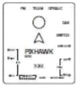                                                |
| Модуль GPS                                                                                                   | 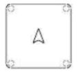                                  |
| Quad Power Distribution Board                                                                                | 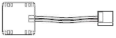 |
| 8 Channel PWM Breakout board                                                                                 | 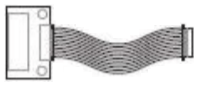   |
| кабель на 4 піна (для I2C)                                                                | 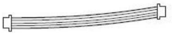        |
| RC-in кабель для PPM/SBUS                                                                                    |                         |
| 6 to 6/4 ‘Y’ адаптер для GPS та додаткових пристроїв I2C                                                     | 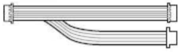               |
| 6-піновий кабель (2) (для плати розподілу живлення та для компасу/gps) | 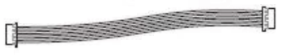                                     |
| 6-піновий JST для легасі телеметрійного радіо до DF13                                                        |                     |
| Запобіжний перемикач                                                                                         | 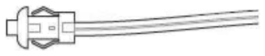                                 |
| 8 Channel PWM Breakout cable                                                                                 | 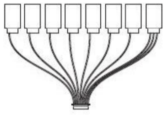    |
| Монтажна піна                                                                                                | 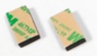                                                |
| I2C breakout board ? - не входить до списку запчастин у додатку                                              | -                                                                                                                                    |

## Додаткові аксесуари

- Telemetry Radio Sets: 915 MHz (USA), 433 MHz (European)
  ::: info
  When installing the 3DR telemetry radios, use the connectors that come with Pixhawk Mini, rather than those that come with the radios.

:::

- Модуль живлення 3DR 10S

- WiFi Телеметрійне радіо

- Цифровий датчик швидкості польоту

## Сумісність

### RC радіо

- PPM вивід RC приймачів
- Spektrum DSM RC приймачі
- Futaba S BUS RC приймачі

### ESC регулятори швидкості

- Всі стандартні ESC з PWM входом

## Призначення пінів конекторів (виводи пінів)

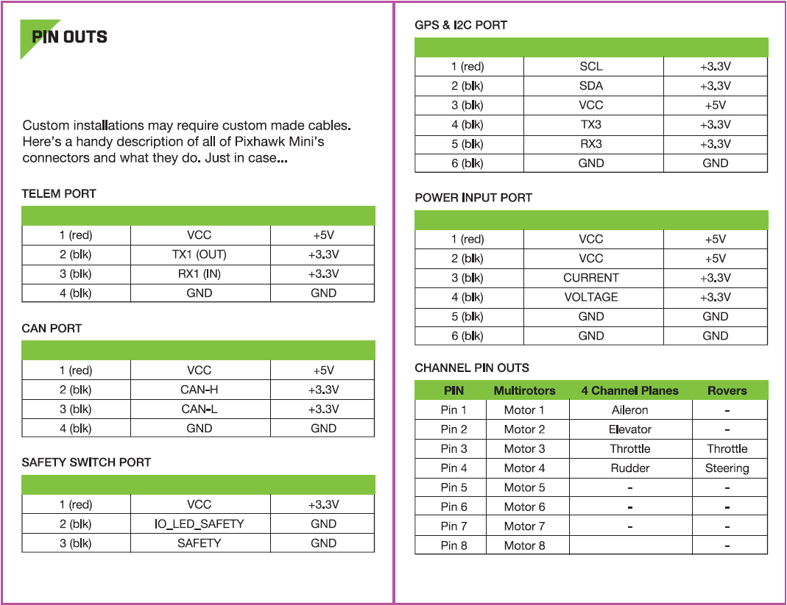

## Порівняння продуктів

### Pixhawk Mini та Pixhawk (оригінальний)

- Одна третя розміру - від 50х81.5х15.5мм до 38x43х12мм.
- Процесор Rev 3 для повного використання 2 МБ флеш-пам'яті.
- Покращені датчики, як основний, так і додатковий IMU MPU9250 та ICM20608 відповідно.
  Результат - це більш стабільний, більш надійний політ і навігація.
- Модуль GPS+Компас включено. Містить Neo M8N з підтримкою GLONASS; компас HMC5983.
  Очікуйте швидшого та сильнішого захоплення GPS.
- Мікро JST конектори замість DF-13.
  З ними набагато простіше працювати.
- Інтегрований п'єзозвуковий динамік та запобіжний перемикач.
- Підтримує 4S акумулятори нативно за допомогою включеної плати розподільників потужності (PDB).

### Pixhawk Mini та Pixfalcon

- Покращені датчики, як основний, так і додатковий IMU MPU9250 та ICM20608 відповідно.
  Очікуйте кращої обробки вібрацій та надійності.
- Інтерфейс CAN для підтримки UAVCAN.
- Включає 8-канальний вивід сервоприводу для літаків та інших апаратів, яким потрібен заживлений PWM вивід.
- Включає плату розгалуження I2C для загальної кількості 5 з'єднань I2C.
- Аналогічний розмір.

Pixhawk Mini має вдосконалений процесор та сенсорну технологію від ST Microelectronics® та операційну систему реального часу NuttX, що забезпечує відмінну продуктивність, гнучкість та надійність для керування будь-яким безпілотним транспортним засобом.

## Відомі проблеми

- Some Pixhawk Minis have a [hardware defect](https://github.com/PX4/PX4-Autopilot/issues/7327#issuecomment-317132917) that makes the internal MPU9250 IMU unreliable.
  - The problem is only present in older hardware revisions, because [it was fixed at some point by the manufacturer](https://github.com/PX4/PX4-Autopilot/issues/7327#issuecomment-372393609).
  - Щоб перевірити, чи певна плата постраждала чи ні, залиште плату відключеною на деякий час, потім увімкніть її та спробуйте запустити драйвер mpu9250 з командного рядка PX4. Якщо плата пошкоджена, драйвер не запуститься.
  - The MPU9250 is [disabled by default](https://github.com/PX4/PX4-Autopilot/pull/7618) on the PX4 firmware.
  - Дефектні Pixhawk Mini не будуть калібруватися без зовнішнього магнітометра або підключеного GPS, навіть у приміщенні.
  - When using an external GPS, [this is not a problem](https://github.com/PX4/PX4-Autopilot/pull/7618#issuecomment-320270082) because the secondary ICM20608 provides the accelerometer and the gyro, while the external GPS provides the magnetometer.

<a id="wiring"></a>

## Посібник зі швидкого запуску підключення

:::warning
The _Pixhawk Mini_ is no longer manufactured or available from 3DR.
:::

This quick start guide shows how power the [Pixhawk Mini](../flight_controller/pixhawk_mini.md) and connect its most important peripherals.

### Стандартна схема проводки

The image below shows standard _quadcopter_ wiring using the _Pixhawk Mini Kit_ and 3DR Telemetry Radios (along with ESC, motor, battery and a ground control station running on a phone).
Ми розглянемо кожен основний елемент в наступних розділах.

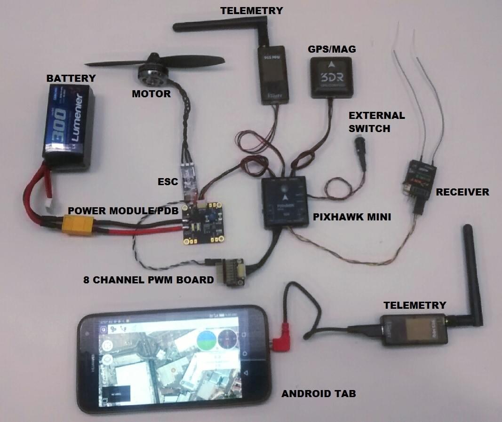

:::info
The output wiring/powering is slightly different for other types of vehicles. Це докладніше описано нижче для VTOL, Plane, Copter.
:::

### Монтаж та орієнтація контролера

The _Pixhawk Mini_ should be mounted on the frame using
vibration-damping foam pads (included in the kit). Вона повинна бути
розташувати якомога ближче до центру тяжіння вашого автомобіля верхньою стороною вгору
зі стрілкою в напрямку передньої частини автомобіля.

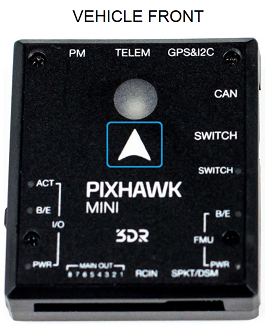


:::info
Якщо контролер не може бути змонтований у рекомендованому/стандартному положенні (наприклад, через обмеження місця), вам потрібно буде налаштувати програмне забезпечення автопілота з орієнтацією, яку ви фактично використовували: [Орієнтація контролера польоту](../config/flight_controller_orientation.md).
:::

### GPS + Компас

Attach the 3DR GPS + Compass to the Pixhawk Mini's **GPS&I2C** port (top right) using the supplied 6 pin cable.
GPS/компас слід монтувати на раму якомога подалі від інших електронних пристроїв, з напрямком вперед транспортного засобу (відокремлення компаса від інших електронних пристроїв зменшить втручання).

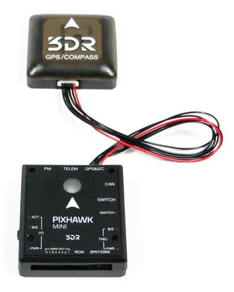

NOTE - INSERT IMAGE SHOWING BOTH PORTS? OR FRONT-FACING image of GPS&I2C

The compass must be calibrated before it is first used: [Compass Calibration](../config/compass.md)

### Power

The image below shows typical power-supply wiring when using _Pixhawk Mini_ in a Quadcopter.
This uses the _Quad Power Distribution Board_ that comes in the kit to supply both the Pixhawk Mini and the ESC/Motor from the battery (and can also power other accessories).

:::info
The _Quad Power Distribution Board_ includes a power module (PM) that is suitable for batteries <= 4S.
The _3DR 10S Power Module_ (Discontinued) is recommended if you need more power.
:::

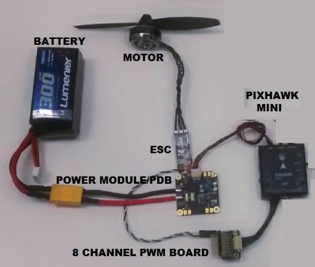

The _Pixhawk Mini_ is powered through the **PM** port.
При використанні модуля живлення (як у цьому випадку) порт також буде читати аналогові вимірювання напруги та струму.

До 4 ESC можна живити окремо від розподільного щита (хоча в цьому випадку підключено лише один).

Сигнали керування надходять з MAIN OUT. In this case there is only one control channel, which is connected to the ESC via the _8 Channel PWM Breakout Board_.

Шина виводу Pixhawk Mini (MAIN OUT) не може живити підключені пристрої (і не потребує цього в схемі, як показано).
Для транспортних засобів, де MAIN OUT підключений до пристроїв, які споживають енергію (наприклад, сервопривід, використовуваний у літаку), вам потрібно буде живити рейку за допомогою BEC (елімінаційна схема батареї).
Включена плата розподільчого модуля дозволяє одному каналу надавати живлення на інші виходи.

### Радіоуправління

Pixhawk Mini підтримує багато різних моделей радіоприймачів:

- Spektrum and DSM receivers connect to the **SPKT/DSM** input.

  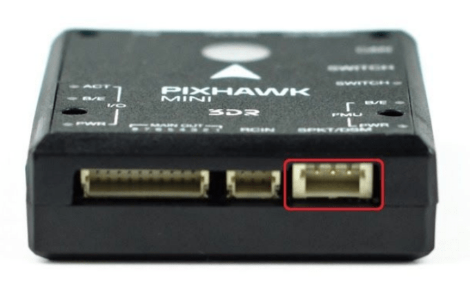

- PPM-SUM and S.BUS receivers connect to the **RCIN** port.

  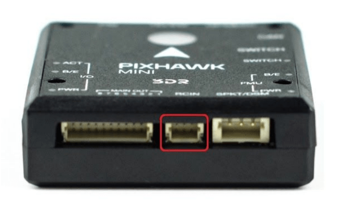

- PPM and PWM receivers that have an _individual wire for each channel_ must connect to the **RCIN** port _via a PPM encoder_ [like this one](http://www.getfpv.com/radios/radio-accessories/holybro-ppm-encoder-module.html) (PPM-Sum receivers use a single signal wire for all channels).

Для отримання додаткової інформації про вибір радіосистеми, сумісність приймача та зв'язок вашої передавача/приймача, див. статтю: [Пульт керування передавачів & приймачів](../getting_started/rc_transmitter_receiver.md).

### Запобіжний перемикач (опційно)

Контролер має вбудований безпечний перемикач, який ви можете використовувати для активації двигуна, як тільки автопілот готовий злетіти.
Якщо на певному транспортному засобі важкодоступний до цього перемикача, ви можете прикріпити (необов’язкову) зовнішню кнопку безпеки, як показано нижче.

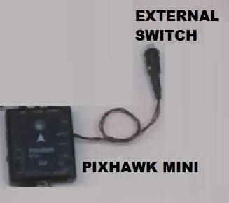

### Телеметричні радіостанції

### Двигуни

The mappings between MAIN/AUX output ports and motor/servos for all supported air and ground frames are listed in the [Airframe Reference](../airframes/airframe_reference.md).

:::warning
Відображення не є однорідним для всіх конструкцій (наприклад, ви не можете покладатися на те, що ручка газу буде на тому ж вихідному порту для всіх повітряних конструкцій).
Переконайтеся, що ви використовуєте правильне зіставлення для вашого апарату.
:::

:::tip
Якщо ваша рама не вказана в довідці, використовуйте "загальну" раму відповідного типу.
:::info

- The output rail must be separately powered, as discussed in the [Power](#power) section above.
- Pixhawk Mini не може бути використаний для каркасів QuadPlane VTOL. Це через те, що QuadPlane потребує 9 виводів (4 основних, 5 додаткових) і Pixhawk Mini має лише 8 виводів (8 основних).

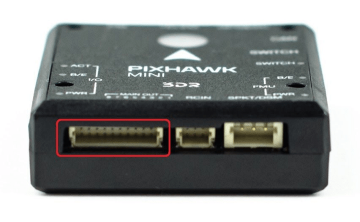

### Інші периферійні пристрої

The wiring and configuration of other components is covered within the topics for individual [peripherals](../peripherals/index.md).

### Налаштування

Загальну інформацію про конфігурацію описано в: [Конфігурація автопілота](../config/index.md).

Конкретні конфігурації QuadPlane тут: [QuadPlane VTOL налаштування](../config_vtol/vtol_quad_configuration.md)

## Збірка прошивки

:::tip
Більшості користувачів не потрібно збирати цю прошивку!
It is pre-built and automatically installed by _QGroundControl_ when appropriate hardware is connected.
:::

To [build PX4](../dev_setup/building_px4.md) for this target:

```
make px4_fmu-v3_default
```

## Відладочний порт

This board does not have a debug port (i.e it does not have a port for accessing the [System Console](../debug/system_console.md) or [SWD interface](../debug/swd_debug.md)).

Розробники повинні будуть припаяти дроти до підключених площин для SWD, а також до STM32F4 (IC) TX і RX, щоб отримати консоль.
