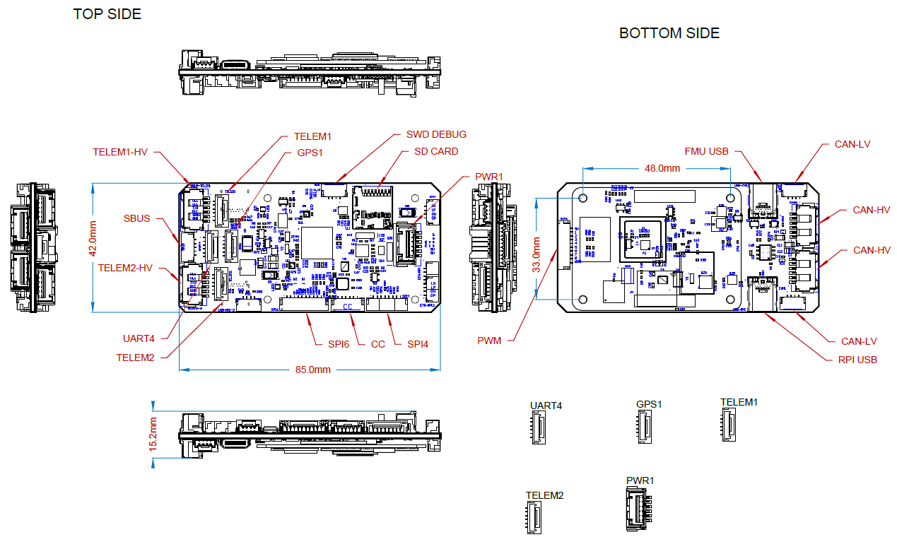

# RaccoonLab FMUv6X Autopilot

:::warning
PX4 не розробляє цей (або будь-який інший) автопілот.
Contact the [manufacturer](https://raccoonlab.co) for hardware support or compliance issues.
:::

The [RaccoonLab FMUv6X](https://docs.raccoonlab.co/guide/autopilot/RCLv6X.html) flight controller is based on the following Pixhawk​® standards: [Pixhawk Autopilot FMUv6X Standard](https://github.com/pixhawk/Pixhawk-Standards/blob/master/DS-012%20Pixhawk%20Autopilot%20v6X%20Standard.pdf), [Autopilot Bus Standard](https://github.com/pixhawk/Pixhawk-Standards/blob/master/DS-010%20Pixhawk%20Autopilot%20Bus%20Standard.pdf), and [Connector Standard](https://github.com/pixhawk/Pixhawk-Standards/blob/master/DS-009%20Pixhawk%20Connector%20Standard.pdf).

Equipped with a high-performance H7 Processor, modular design, triple redundancy, temperature-controlled IMU board, and isolated sensor domains, it delivers exceptional performance, reliability, and flexibility.
At RaccoonLab, we focus on DroneCAN and Cyphal-based onboard control system buses.
Our autopilot is part of a larger DroneCAN and Cyphal ecosystem, making it an ideal choice for next-generation intelligent vehicles.


RaccoonLab offers versatile HATs for both Raspberry Pi and NVIDIA Jetson Xavier NX, enhancing connectivity and functionality.
The [Jetson Xavier NX HAT](https://docs.raccoonlab.co/guide/nx_hat/) is designed to integrate the CAN bus with the Jetson Xavier NX, enabling access to Cyphal and DroneCAN protocols.
The [Raspberry Pi CM4 HAT](https://docs.raccoonlab.co/guide/rpi_hat/) provides robust features, including CAN bus connectivity, an LTE modem, internal voltage measurement, SWD debugging for other MCUs, and UART communication with PX4 over MAVLINK.
These HATs expand the capabilities of devices, making them ideal for advanced robotics and UAV applications.

:::tip
This autopilot is [supported](../flight_controller/autopilot_pixhawk_standard.md) by the PX4 maintenance and test teams.
:::

## Ключові пункти дизайну

- Високопродуктивний процесор STM32H753
- Modular flight controller: separated IMU, FMU, and Base system connected by a 100-pin & a 50-pin Pixhawk Autopilot Bus connector.
- Redundancy: 3x IMU sensors & 2x Barometer sensors on separate buses
- Потрійне резервування доменів: повністю ізольовані сенсорні домени з окремими шинами та окремим керуванням живленням
- Нова система ізоляції вібрацій для фільтрації високочастотних вібрацій та зменшення шуму для забезпечення точних вимірювань
- Інтерфейс Ethernet для високошвидкісної інтеграції комп'ютера місії

## Processors & Sensors

- Процесор FMU: STM32H753
  - 32 Bit Arm Cortex-M7, 480MHz, 2MB flash memory, 1MB RAM
- IO Processor: STM32F100
  - 32 Bit Arm Cortex-M3, 24MHz, 8KB SRAM
- Сенсори на платі
  - Accel/Gyro: ICM-20649 або BMI088
  - Accel/Gyro: ICM-42688-P
  - Accel/Gyro: ICM-42670-P
  - Mag: BMM150
  - Barometer: 2x BMP388

## Електричні дані

- Номінальна напруга:
  - Max input voltage: 36V
  - Вхід USB Power: 4.75~5.25V
  - Вхід Servo Rail: 0\~36V
- Номінальний струм:
  - `TELEM1` output current limiter: 1.5A
  - Комбінований обмежувач вихідного струму всіх інших портів: 1.5A

## Механічні характеристики

- Розміри
  - Модуль політного контролера: 38.8 x 31.8 x 14.6mm
  - Стандартна базова плата: 52.4 x 103.4 x 16.7mm
  - Міні базова плата: 43.4 x 72.8 x 14.2 mm
- Вага
  - Модуль політного контролера: 23g
  - Стандартна базова плата: 51g
  - Міні базова плата: 26.5g

3D model can be downloaded on [GrabCAD](https://grabcad.com/library/raccoonlab-autopilot-1).



## Інтерфейси

- 16 PWM виводів сервоприводів
- R/C вхід для Spektrum / DSM
- Виділений R/C вхід для PPM та S.Bus входу
- Спеціалізований аналоговий / PWM вхід RSSI та вивід S.Bus
- 4 загальних послідовних порти
  - 3 з повним контролем потоку
  - 1 with separate 1.5A current limit (`TELEM1`)
  - 1 з I2C та додатковою лінією GPIO для зовнішнього NFC зчитувача
- 2 порти GPS
  - 1 повний GPS плюс порт запобіжного перемикача
  - 1 базовий порт GPS
- 1 I2C порт
- 1 порт Ethernet
  - Transformerless Applications
  - 100Mbps
- 1 шина SPI
  - 2 лінії вибору чіпу
  - 2 лінії готових даних
  - 1 SPI SYNC лінія
  - 1 лінія SPI reset
- 2 CAN шини для CAN периферії
  - CAN шина має individual silent controls або ESC RX-MUX control
- 2 порти вводу живлення з SMBus
  - 1 AD & IO port
  - 2 додаткових аналогових входи
  - 1 PWM/Capture вхід
  - 2 виділені відладочні та GPIO лінії

## Налаштування послідовного порту

| UART   | Пристрій   | Порт                            |
| ------ | ---------- | ------------------------------- |
| USART1 | /dev/ttyS0 | GPS                             |
| USART2 | /dev/ttyS1 | TELEM3                          |
| USART3 | /dev/ttyS2 | Debug Console                   |
| UART4  | /dev/ttyS3 | UART4 & I2C |
| UART5  | /dev/ttyS4 | TELEM2                          |
| USART6 | /dev/ttyS5 | PX4IO/RC                        |
| UART7  | /dev/ttyS6 | TELEM1                          |
| UART8  | /dev/ttyS7 | GPS2                            |

## Номінальна напруга

_RaccoonLab FMUv6X_ can be triple-redundant on the power supply if three power sources are supplied.
The three power rails are: **POWER1**, **POWER2** and **USB**.
The **POWER1** & **POWER2** ports on the RaccoonLab FMUv6X uses the 6 circuit [2.00mm Pitch CLIK-Mate Wire-to-Board PCB Receptacle](https://www.molex.com/molex/products/part-detail/pcb_receptacles/5024430670).

**Normal Operation Maximum Ratings**

За таких умов всі джерела живлення будуть використовуватися в цьому порядку для живлення системи:

1. **POWER1** and **POWER2** inputs (4.9V to 5.5V)
2. **USB** input (4.75V to 5.25V)

:::tip
The manufacturer [RaccoonLab Docs](https://docs.raccoonlab.co/guide/autopilot/RCLv6X.html) are the canonical reference for the RaccoonLab FMUv6X Autopilot.
Вони повинні використовуватися за перевагою, оскільки вони містять найбільш повну та актуальну інформацію.
:::

## Де купити

[RaccoonLab Store](https://raccoonlab.co/store)

[Cyphal store](https://cyphal.store)

## Збірка прошивки

:::tip
Most users will not need to build this firmware!
It is pre-built and automatically installed by _QGroundControl_ when appropriate hardware is connected.
:::

To [build PX4](../dev_setup/building_px4.md) for this target:

```sh
make px4_fmu-v6x_default
```

## Підтримувані платформи / Конструкції

Будь-який мультикоптер / літак / наземна платформа / човен, який може керуватися звичайними RC сервоприводами або сервоприводами Futaba S-Bus.
The complete set of supported configurations can be seen in the [Airframes Reference](../airframes/airframe_reference.md).

## Подальша інформація

- [Pixhawk Автопілот FMUv6X Стандартний](https://github.com/pixhawk/Pixhawk-Standards/blob/master/DS-012%20Pixhawk%20Autopilot%20v6X%20Standard.pdf)
- [Стандарт шини автопілота Pixhawk](https://github.com/pixhawk/Pixhawk-Standards/blob/master/DS-010%20Pixhawk%20Autopilot%20Bus%20Standard.pdf)
- [Стандарт Pixhawk Connector Standard](https://github.com/pixhawk/Pixhawk-Standards/blob/master/DS-009%20Pixhawk%20Connector%20Standard.pdf)
- [RaccoonLab docs](http://docs.raccoonlab.co)
