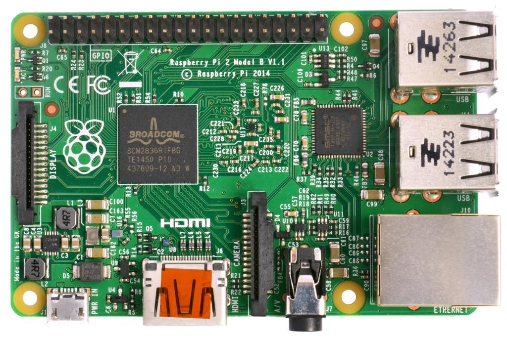

# Автопілот Raspberry Pi 2/3/4 Navio2

<LinkedBadge type="warning" text="Experimental" url="../flight_controller/autopilot_experimental.html"/>

:::warning
PX4 не розробляє цей (або будь-який інший) автопілот.
Contact the [manufacturer](https://emlid.com/) for hardware support or compliance issues.
:::

Це "швидкий старт" розробника для автопілотів Raspberry Pi 2/3/4 Navio2.
It allows you to build PX4 and transfer to the RPi, or build natively.



## OS Image

Use the preconfigured [Emlid Raspberry Pi OS image for Navio 2](https://docs.emlid.com/navio2/configuring-raspberry-pi).
Образ за замовчуванням вже містить більшість процедур налаштування, показаних нижче.

:::warning
Make sure not to upgrade the system (more specifically the kernel).
By upgrading, a new kernel can get installed which lacks the necessary HW support (you can check with `ls /sys/class/pwm`, the directory should not be empty).
:::

## Встановлення доступу

Образ OS Raspberry Pi вже має налаштований SSH.
Ім'я користувача "pi" та пароль "raspberry".
Для цілей цього посібника ми припускаємо, що ім'я користувача та пароль залишаються цими за замовчуванням.

To setup the Pi to join your local wifi, follow [this guide](https://www.raspberrypi.org/documentation/configuration/wireless/wireless-cli.md), or connect it via an ethernet cable.

To connect to your Pi via SSH, use the default username (`pi`) and hostname (`navio`).
Крім того (якщо це не спрацювало), ви можете знайти IP-адресу вашого RPi та вказати її.

```sh
ssh pi@navio.local
```

або

```sh
ssh pi@<IP-ADDRESS>
```

## Розширення файлової системи

Розширте файлову систему, щоб використовувати всю SD-карту під час запуску:

```sh
sudo raspi-config --expand-rootfs
```

## Вимикання оверлея Navio RGB

Існуючий оверлей Navio RGB використовує GPIO, що використовуються PX4 для RGB Led.
Edit `/boot/config.txt` by commenting the line enabling the `navio-rgb` overlay.

```
#dtoverlay=navio-rgb
```

## Тестування передачі файлів

Ми використовуємо SCP для передачі файлів з комп'ютера для розробки на цільову плату через мережу (WiFi або Ethernet).

Щоб перевірити налаштування, спробуйте передати файл з ПК для розробки на Pi через мережу зараз.
Переконайтеся, що у Pi є доступ до мережі, і ви можете використовувати SSH для входу.

```sh
echo "Hello" > hello.txt
scp hello.txt pi@navio.local:/home/pi/
rm hello.txt
```

Це повинно скопіювати файл "hello.txt" у домашню директорію вашого Pi.
Перевірте, що файл дійсно було скопійовано, і ви можете перейти до наступного кроку.

## PX4 Development Environment

These instructions explain how to install a PX4 development environment for building RPi on Ubuntu 18.04.

:::warning
PX4 binaries for Navio 2 can only be run on Ubuntu 18.04.

You can build PX4 using the GCC toolchain on Ubuntu 20.04, but the generated binary files are too new to run on actual Pi (as of September 2023).
For more information see [PilotPi with Raspberry Pi OS Developer Quick Start > Alternative build method using docker](../flight_controller/raspberry_pi_pilotpi_rpios.md#alternative-build-method-using-docker).
:::

### Install the Common Dependencies

To get the common dependencies for Raspberry Pi:

1. Download [ubuntu.sh](https://github.com/PX4/PX4-Autopilot/blob/main/Tools/setup/ubuntu.sh) <!-- NEED px4_version --> and [requirements.txt](https://github.com/PX4/PX4-Autopilot/blob/main/Tools/setup/requirements.txt) from the PX4 source repository (**/Tools/setup/**): <!-- NEED px4_version -->

   ```sh
   wget https://raw.githubusercontent.com/PX4/PX4-Autopilot/main/Tools/setup/ubuntu.sh
   wget https://raw.githubusercontent.com/PX4/PX4-Autopilot/main/Tools/setup/requirements.txt
   ```

2. Run **ubuntu.sh** in a terminal to get just the common dependencies:

   ```sh
   bash ubuntu.sh --no-nuttx --no-sim-tools
   ```

3. Then setup a cross-compiler (either GCC or clang) as described in the following sections.

### GCC (armhf)

Ubuntu software repository provides a set of pre-compiled toolchains. Note that Ubuntu Focal comes up with `gcc-9-arm-linux-gnueabihf` as its default installation which is not fully supported, so we must manually install `gcc-8-arm-linux-gnueabihf` and set it as the default toolchain. This guide also applies to earlier Ubuntu releases (Bionic).
The following instruction assumes you haven't installed any version of arm-linux-gnueabihf, and will set up the default executable with `update-alternatives`.
Install them with the terminal command:

```sh
sudo apt-get install -y gcc-8-arm-linux-gnueabihf g++-8-arm-linux-gnueabihf
```

Set them as default:

```sh
sudo update-alternatives --install /usr/bin/arm-linux-gnueabihf-gcc arm-linux-gnueabihf-gcc /usr/bin/arm-linux-gnueabihf-gcc-8 100 --slave /usr/bin/arm-linux-gnueabihf-g++ arm-linux-gnueabihf-g++ /usr/bin/arm-linux-gnueabihf-g++-8
sudo update-alternatives --config arm-linux-gnueabihf-gcc
```

### GCC (aarch64)

If you want to build PX4 for ARM64 devices, this section is required.

```sh
sudo apt-get install -y gcc-8-aarch64-linux-gnu g++-8-aarch64-linux-gnu
sudo update-alternatives --install /usr/bin/aarch64-linux-gnu-gcc aarch64-linux-gnu-gcc /usr/bin/aarch64-linux-gnu-gcc-8 100 --slave /usr/bin/aarch64-linux-gnu-g++ aarch64-linux-gnu-g++ /usr/bin/aarch64-linux-gnu-g++-8
sudo update-alternatives --config aarch64-linux-gnu-gcc
```

### Clang (optional)

First install GCC (needed to use clang).

We recommend you to get clang from the Ubuntu software repository, as shown below:

```sh
sudo apt-get install clang
```

Example below for building PX4 firmware out of tree, using _CMake_.

```sh
cd <PATH-TO-PX4-SRC>
mkdir build/px4_raspberrypi_default_clang
cd build/px4_raspberrypi_default_clang
cmake \
-G"Unix Makefiles" \
-DCONFIG=px4_raspberrypi_default \
-UCMAKE_C_COMPILER \
-DCMAKE_C_COMPILER=clang \
-UCMAKE_CXX_COMPILER \
-DCMAKE_CXX_COMPILER=clang++ \
../..
make
```

## Збірка коду

Вкажіть IP-адресу (або ім'я хоста) вашого Pi:

```sh
export AUTOPILOT_HOST=navio.local
```

або

```sh
export AUTOPILOT_HOST=192.168.X.X
```

:::info
The value of the environment variable should be set before the build, or `make upload` will fail to find your Pi.
:::

Скомпілюйте виконувальний файл на вашому комп'ютері для розробки:

```sh
cd PX4-Autopilot
make emlid_navio2
```

The "px4" executable file is in the directory **build/emlid_navio2_default/**.
Make sure you can connect to your Pi over SSH, see [instructions how to access your Pi](#setting-up-access) following the instructions for armhf under Raspberry Pi.

Потім завантажте його за допомогою:

```sh
cd PX4-Autopilot
make emlid_navio2 upload
```

Потім підключіться через ssh та запустіть його на Pi (як root):

```sh
cd ~/px4
sudo ./bin/px4 -s px4.config
```

A successful build followed by executing PX4 will give you something like this:

```sh

______  __   __    ___
| ___ \ \ \ / /   /   |
| |_/ /  \ V /   / /| |
|  __/   /   \  / /_| |
| |     / /^\ \ \___  |
\_|     \/   \/     |_/

px4 starting.


pxh>
```

## Автозавантаження

To autostart px4, add the following to the file **/etc/rc.local** (adjust it accordingly if you use native build), right before the `exit 0` line:

```sh
cd /home/pi && ./bin/px4 -d -s px4.config > px4.log
```
