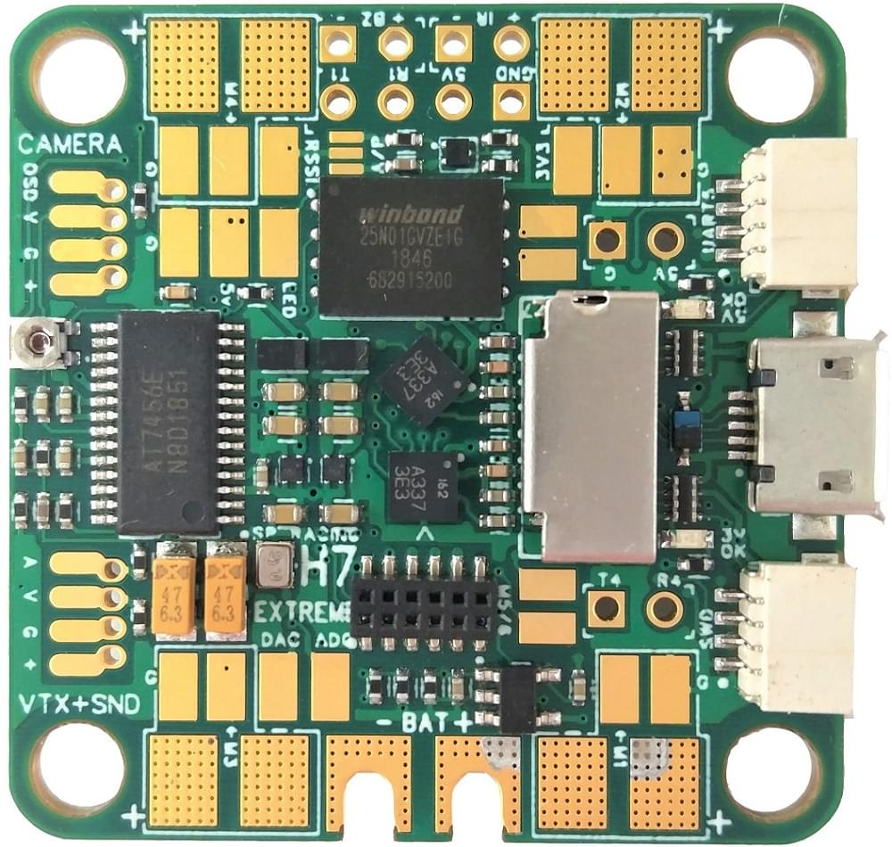
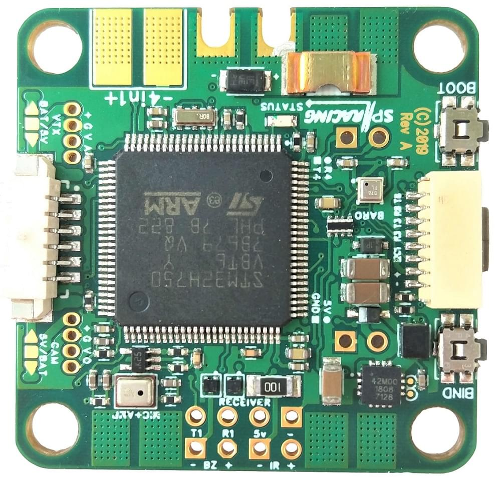

# SPRacingH7EXTREME (Версія PX4)

:::warning
PX4 не розробляє цей (або будь-який інший) автопілот.
Contact the [manufacturer](https://shop.seriouslypro.com) for hardware support or compliance issues.
:::

The [SPRacingH7EXTREME](https://shop.seriouslypro.com/sp-racing-h7-extreme) is a feature packed FC/PDB with DUAL ICM20602 gyros, H7 400/480Mhz(+) CPU, high-precision BMP388 barometer, SD Card socket, current sensor, 8 easily accessible motor outputs, OSD, Microphone, Audio output, and more.

Це може бути легко використовувати для невеликих і великих квадрокоптерів, літаків, восьмикоптерів та більш розвинених конструкцій.
Найкраще використовувати з окремими ESC, оскільки він має вбудовану плату розподілу живлення (PDB).
Підключення 4in1 ESC також легко.

Також є 12-контактний стековий роз’єм, який забезпечує ще 4 виходи двигуна, підключення SPI та UART.

:::info
This flight controller is [manufacturer supported](../flight_controller/autopilot_manufacturer_supported.md).
:::

## Основні характеристики

- Main System-on-Chip: [STM32H750VBT6 rev.y/v](https://www.st.com/en/microcontrollers-microprocessors/stm32h750vb.html)
  - CPU: 400/480Mhz(+) ARM Cortex M7 з одинарною точністю FPU. (+ 480МГц з процесорами Rev V)
  - RAM: 1MB
  - 16MB External Flash 4-bit QuadSPI in Memory Mapped mode for code _and_ config.
- Бортові сенсори:
  - Dual Gyros (1xSPI кожен, з окремими сигналами переривань, 32khz capable, fsync capable)
  - Високоточний барометр BMP388 (I2C + переривання)
  - Датчик струму 110A
- GPS через зовнішній 8-контактний IO порт.
- Audio/Visual
  - On-screen display OSD (dedicated SPI, character based, MAX7456)
  - Датчик мікрофона
  - Аудіо вивід з CPU DAC.
  - Аудіо мікшер для виводів мікрофона/DAC.
- Інтерфейси
  - SD Card (4-bit SDIO not 1-bit SPI)
  - Інфрачервоний транспондер (сумісний з iLAP)
  - Buzzer circuitry
  - RSSI (Analog/PWM)
  - 12 motor outputs (4 by motor pads, 4 in the middle, and 4 on stacking connector).
  - 1x SPI breakout onto stacking connector
  - 6 Serial Ports (5x TX & RX, 1x TX-only bi-directional for telemetry)
  - Кнопка запуску (Натиск з боку)
  - Bind/User кнопка (Бічний натиск)
  - Порти ресивера (усі звичайні протоколи, без потреби в інверторі)
  - CAM OSD control and Video IN on CAM socket.
  - SWD debugging port.
- Video OUT + Audio OUT on VTX socket.
- USB з можливістю OTG (ID та VBUS з'єднані з CPU)
- Система живлення
  - Інтегрований PDB.
  - 2-6S BEC
  - Телевізійний захистний діод
  - Призначений 500ma VREG для гіроскопів, з конденсаторами для фільтрації шуму гіроскопа.
  - Другий 500 мА VREG для ЦП, барометра, мікрофону тощо.
- Інші характеристики
  - LED-статус
  - Підтримка світлодіодної стрічки (з добре розташованими підключеннями).
  - Запуск з картки SD або зовнішнього флеш-накопичувача.
  - Прошивка з SD карти.
  - Дизайн з припаями зверху.
  - Вирізи на платах друкованих плат для дротів батарей.
  - Немає компаса, використовуйте зовнішній GPS з магнітометром/компасним датчиком, підключеним до порту GPS IO.
  - Також працює з Betaflight 4.x +, Cleanflight 4.x +.
  - Розроблено Домініком Кліфтоном, хлопцем, що створив Cleanflight
- Розміри
  - 36x36 мм із зразком кріплення 30.5\*30.5, отвори M4.
  - Втулки з м’яким кріпленням від M4 до M3 постачаються.

## Де купити

The SPRacingH7EXTREME is available from the [Seriously Pro shop](https://shop.seriouslypro.com/sp-racing-h7-extreme).

:::info
Select the PX4 edition when purchasing!
:::

## Керівництво, Pinouts та Схеми підключення

The manual with pinouts can be downloaded from [here](http://seriouslypro.com/files/SPRacingH7EXTREME-Manual-latest.pdf).
See the [SPRacingH7EXTREME website](http://seriouslypro.com/spracingh7extreme) for other diagrams.

## Автори

This design was created by [Dominic Clifton](https://github.com/hydra)
Initial PX4 support by [Igor-Misic](https://github.com/Igor-Misic)
