# VOLOLAND NarinFC-H7

<Badge type="tip" text="PX4 v1.17" />

:::warning
PX4 не розробляє цей (або будь-який інший) автопілот.
Contact the [manufacturer](https://vololand.com) for hardware support or compliance issues.
:::

The NarinFC-H7 is an advanced flight controller produced by [VOLOLAND Inc.](https://vololand.com).
It uses a high-performance STM32H7 processor and integrates industrial-grade sensors for improved performance and reliability.

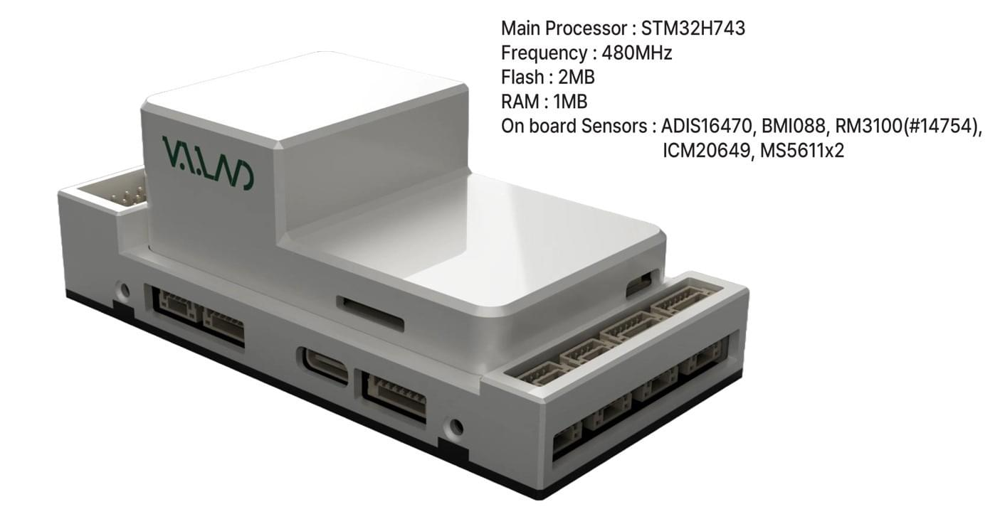

:::info
This flight controller is [manufacturer supported](../flight_controller/autopilot_manufacturer_supported.md).
:::

## Основні характеристики

### Processors & Sensors

- FMU Processor: STM32H743
- Бортові сенсори:
  - Accelerometer/Gyroscope: ADIS16470
  - Прискорювач/гіроскоп: ICM-20649
  - Акселерометр/Гіроскоп: BMI088
  - Магнітометр: RM3100
  - Barometer: MS5611 x2

### Інтерфейси

- 14 PWM servo outputs
- Multiple RC inputs (SBUS / CPPM / DSM)
- Analog/PWM RSSI input
- 2 GPS ports (GPS and UART4)
- 4x I2C buses
- 2x CAN bus ports
- 2x Power ports
- 2x ADC ports
- 1x USB port

### Електричні дані

- Power input: 4.3V ~ 5.4V
- USB input: 4.75V ~ 5.25V

### Механічні дані

- Dimensions: 93.4 x 46.4 x 34.1 mm
- Weight: 106g

## Where to Buy {#store}

Order from [VOLOLAND Inc.](https://vololand.com).

## З'єднання

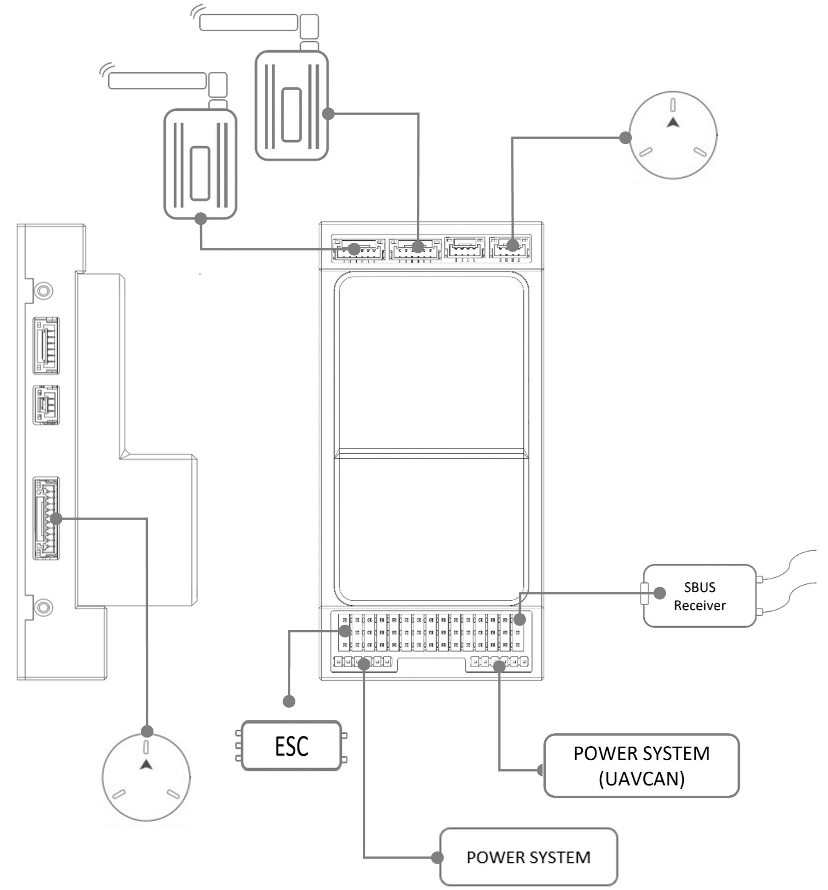

## Розміри

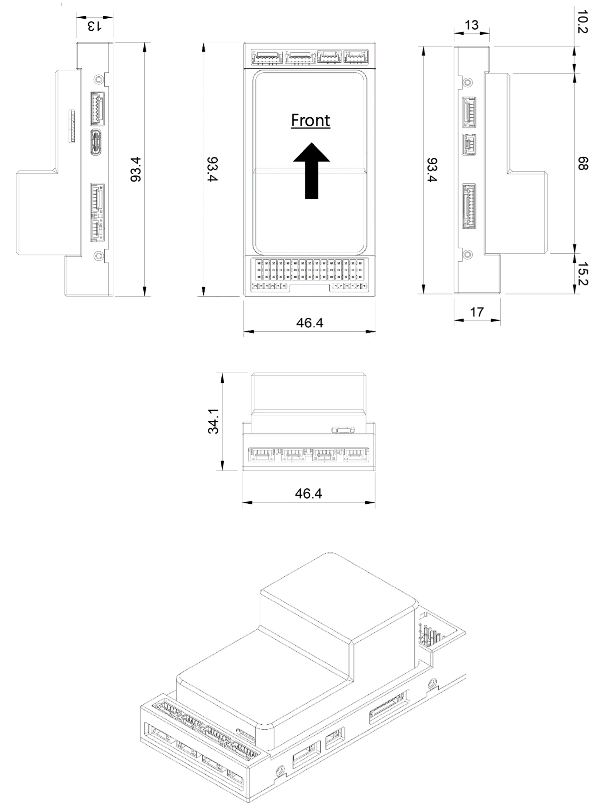

## Схема розташування виводів

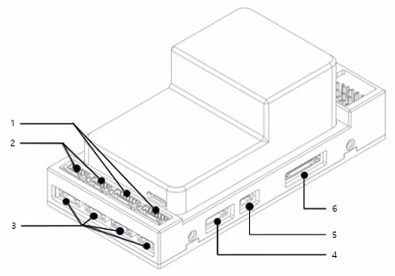

### TELEM1 / TELEM2 Port

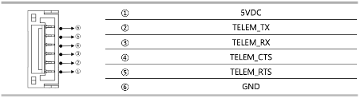

- JST GH 6P connector

### CAN1 / CAN2 Port

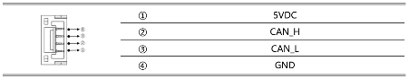

- JST GH 4P connector
- Communication Protocol: UAVCAN v0 (default), UAVCAN v1 (limited support)
- Pin Configuration: CAN_H, CAN_L, VCC, GND

### I2C1, I2C2, I2C3, I2C4 Port

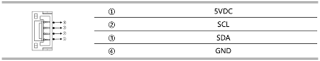

- JST GH 4P connector

### UART4 Port

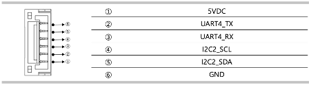

- JST GH 6P connector

### RSSI Port

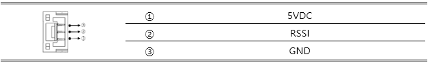

- RSSI input

### GPS & Safety Port

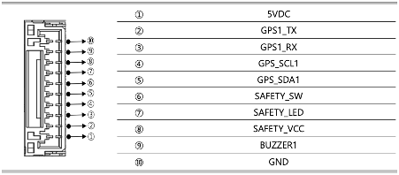

- JST GH 10P connector

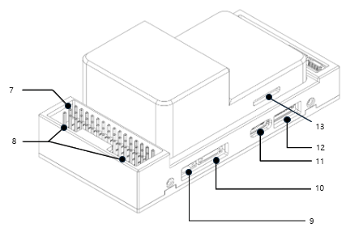

### PWM & RC_IN

The NarinFC-H7 supports up to 14 PWM outputs.

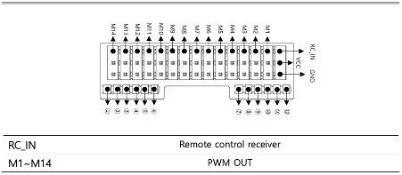

- 2.54mm pitch DuPont connector
- RC_IN: Remote control receiver input is wired directly to the FMU and is enabled via the `rc_input` driver. Compatible with SBUS, CPPM, and DSM protocols.

### Power Input

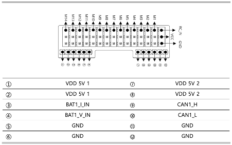

- 2mm pitch DuPont connector

### ADC Port

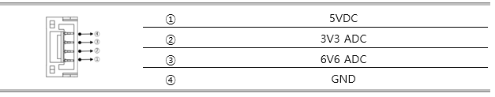

### DEBUG / UART7 Port

UART7 is labelled DEBUG RX/TX.

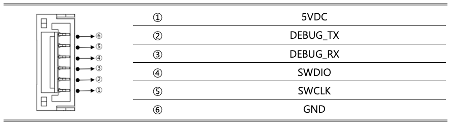

- JST GH 6P connector

### USB Port

- USB-C

### SPI порт

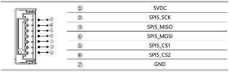

- JST GH 7P connector

## Налаштування послідовного порту

| UART   | Пристрій   | Порт   |
| ------ | ---------- | ------ |
| USART1 | /dev/ttyS0 | GPS1   |
| USART2 | /dev/ttyS1 | TELEM1 |
| UART4  | /dev/ttyS2 | GPS2   |
| USART6 | /dev/ttyS3 | TELEM2 |
| UART8  | /dev/ttyS4 | User   |
| UART7  | /dev/ttyS5 | Debug  |

## PWM Output

The NarinFC-H7 supports up to 14 PWM outputs.
All outputs except M13 and M14 support DShot.
Outputs 1-8 support Bi-Directional DShot.

The 14 PWM outputs are in 4 groups:

- Outputs 1, 2, 3, and 4 in group1
- Outputs 5, 6, 7, and 8 in group2
- Outputs 9, 10, 11, and 12 in group3
- Outputs 13 and 14 in group4

All outputs within the same group must use the same output rate and protocol.

## Analog Inputs

The NarinFC-H7 has 2 user-accessible analog inputs:

- ADC Pin4 → SPARE1_ADC1 (6.6V tolerant)
- ADC Pin18 → SPARE2_ADC1 (3.3V tolerant)

Additional internal ADC channels:

- ADC Pin16 → BATT_VOLTAGE_SENS
- ADC Pin17 → BATT_CURRENT_SENS
- ADC Pin14 → BATT2_VOLTAGE_SENS
- ADC Pin2 → BATT2_CURRENT_SENS
- ADC Pin6 → RSSI_IN
- ADC Pin8 → VDD_5V_SENS
- ADC Pin11 → SCALED_V3V3

## Збірка прошивки

:::tip
Most users will not need to build this firmware!
It is pre-built and automatically installed by _QGroundControl_ when appropriate hardware is connected.
:::

To [build PX4](../dev_setup/building_px4.md) for this target:

```sh
make narinfc_h7_default
```

## Підтримувані платформи / Конструкції

Будь-який мультикоптер / літак / наземна платформа / човен, який може керуватися звичайними RC сервоприводами або сервоприводами Futaba S-Bus.
The complete set of supported configurations can be seen in the [Airframes Reference](../airframes/airframe_reference.md).
