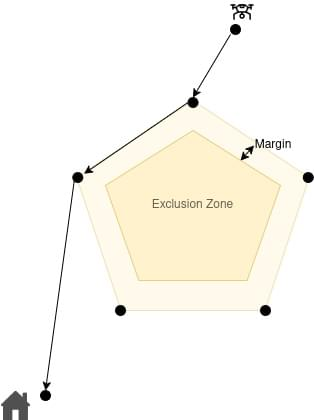
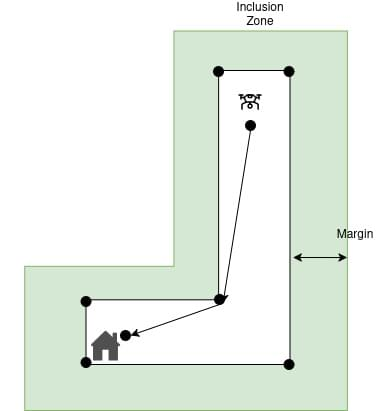

# Режим повернення (типовий транспорт)

The _Return_ flight mode is used to _fly a vehicle to safety_ on an unobstructed path to a safe destination, where it should land.

Наступні теми слід прочитати першими, якщо ви використовуєте ці типи транспортних засобів:

- [Multicopter](../flight_modes_mc/return.md)
- [Fixed-wing (Plane)](../flight_modes_fw/return.md)
- [VTOL](../flight_modes_vtol/return.md)

::: info

- Режим автоматичний - для керування апаратом не потрібно втручання користувача.
- Режим вимагає глобальної оцінки 3D-позиції (з GPS або виведеної з [локальної позиції](../ros/external_position_estimation.md#enabling-auto-modes-with-a-local-position)).
  - Літаючі транспортні засоби не можуть переключатися на цей режим без глобального положення.
  - Літаючі транспортні засоби перейдуть в режим аварійної безпеки, якщо втратять оцінку положення.
- Режим вимагає встановленої домашньої позиції.
- Mode prevents arming (vehicle cannot be armed while this mode is selected).
- RC switches can be used to change flight modes on any vehicle.
- Stick movement in a multicopter (or VTOL in hover) will [by default](#MAN_OVERRIDE_SPD) change the vehicle to [Position mode](../flight_modes_mc/position.md) unless prevented by the active failsafe state.
- VTOL повернеться як MC або FW на основі свого режиму в точці, коли режим повернення було запущено.
  У режимі багтороторного літання він буде дотримуватися параметрів багтороторного літання, таких як "конус" посадки.
  У режимі ФПВ він буде дотримуватися параметрів фіксованого крила (ігнорувати конус), але, якщо не використовується місійна посадка, перейде в режим багтороторного літання та посадиться у пункт призначення після нависання на висоті спуску.

<!-- https://github.com/PX4/PX4-Autopilot/blob/main/src/modules/commander/ModeUtil/mode_requirements.cpp -->

:::

## Загальний огляд

PX4 надає кілька механізмів для вибору безпечного шляху повернення, пункту призначення та посадки, включаючи використання домашнього місця, точок ралі ("безпечні"), шляхів місії та послідовностей посадки, визначених у місії.

All vehicles _nominally_ support all of these mechanisms, but not all of them make as much sense for particular vehicles.
Наприклад, багатокоптер може приземлитися практично будь-де, тому використання послідовності посадки для нього не має сенсу, крім випадків, які трапляються рідко.
Так само, фіксований крилообразний транспортний засіб повинен пролетіти безпечний шлях до посадки: він може використовувати домашнє місце як точку повернення, але за замовчуванням не буде намагатися приземлитися на ньому.

This topic covers all the possible return types that any vehicle _might_ be configured to use — the vehicle-specific return mode topics cover the default/recommended return type and configuration for each vehicle.

The following sections explain how to configure the [return type](#return_types), [minimum return altitude](#minimum-return-altitude) and [landing/arrival behaviour](#loiter-landing-at-destination).

## Return Types (RTL_TYPE) {#return_types}

PX4 provides four alternative approaches for finding an unobstructed path to a safe destination and/or landing, which are set using the [RTL_TYPE](#RTL_TYPE) parameter.

На високому рівні є:

- [Home/rally point return](#rtl_type_0) (`RTL_TYPE=0`): Ascend to safe altitude and return via a direct path to the closest rally point or home location.
- [Mission landing/rally point return](#rtl_type_1) (`RTL_TYPE=1`): Ascend to a safe altitude, fly direct to the closest destination _other than home_: rally point or start of mission landing.
  Якщо не визначено пунктів посадки або збору місії, поверніться додому прямим шляхом.
- [Mission path return](#rtl_type_2) (`RTL_TYPE=2`): Use mission path and fast-continue to mission landing (if defined).
  If no mission _landing_ defined, fast-reverse mission to home.
  If no _mission_ defined, return direct to home (rally points are ignored).
- [Closest safe destination return](#closest-safe-destination-return-type-rtl-type-3) (`RTL_TYPE=3`): Ascend to a safe altitude and return via direct path to closest destination: home, start of mission landing pattern, or rally point.
  Якщо пунктом призначення є схема приземлення, дотримуйтеся цієї схеми, щоб приземлитися.

Більш детальні пояснення щодо кожного з типів наведено в наступних розділах.

### Home/Rally Point Return Type (RTL_TYPE=0) {#rtl_type_0}

This is the default return type for a [multicopter](../flight_modes_mc/return.md) (see topic for more information).

У цьому типі повернення транспортний засіб:

- Ascends to a safe [minimum return altitude](#minimum-return-altitude) (above any expected obstacles).
- Flies to the home position or a rally point (whichever is closest), preferring a [geofence-aware](#geofence_awareness) horizontal path over a direct path where possible.
- On [arrival](#loiter-landing-at-destination) descends to "descent altitude" and waits for a configurable time.
  Цей час можна використати для розгортання шасі для посадки.
- Lands or waits (this depends on landing parameters),
  By default an MC or VTOL in MC mode will land and a fixed-wing vehicle circles at the descent altitude.
  ВТОЛ у режимі FW вирівнює свою орієнтацію на точку призначення, переходить у режим МБ і потім приземлюється.

:::info
If no rally points are defined, this is the same as a _Return to Launch_ (RTL)/_Return to Home_ (RTH).
:::

### Mission Landing/Rally Point Return Type (RTL_TYPE=1) {#rtl_type_1}

This is the default return type for a [fixed-wing](../flight_modes_fw/return.md) or [VTOL](../flight_modes_vtol/return.md) vehicle (see topics for more information).

У цьому типі повернення транспортний засіб:

- Ascends to a safe [minimum return altitude](#minimum-return-altitude) (above any expected obstacles) if needed.
  Транспортний засіб підтримує свою початкову висоту, якщо вона вище, ніж мінімальна висота повернення.
- Flies at constant-altitude to a rally point or the start of a [mission landing pattern](#mission-landing-pattern) (whichever is closest), preferring a [geofence-aware](#geofence_awareness) horizontal path over a direct path where possible.
  Якщо місця посадки або збору не визначені, транспортний засіб повертається додому прямим шляхом.
- Якщо призначенням є місійний маршрут посадки, апарат буде дотримуватися маршруту для посадки.
- If the destination is a rally point or home it will [land or wait](#loiter-landing-at-destination) at descent altitude (depending on landing parameters).
  За замовчуванням багатороторні квадрокоптери або вертикально-взлітно-посадкові літаки в режимі багатороторника приземлюються, а фіксованокрилі літаки обертаються на висоті спуску.

  A VTOL in FW mode can first fly a _VTOL approach loiter_ associated with that destination.
  A _VTOL approach loiter_ is a [MAV_CMD_NAV_LOITER_TO_ALT](https://mavlink.io/en/messages/common.html#MAV_CMD_NAV_LOITER_TO_ALT) item that the vehicle uses to descend to the approach altitude.
  For upload details, see [VTOL Fixed-wing Mode Return](../flight_modes_vtol/return.md#fixed-wing-mode-fw-return).
  If several approach loiters are defined for the destination, PX4 chooses the most wind-aligned one. It then flies from the approach loiter to the destination point, transitions to MC mode at the destination, and lands.

:::info
Fixed wing vehicles commonly also set [MIS_TKO_LAND_REQ](#MIS_TKO_LAND_REQ) to _require_ a mission landing pattern.
:::

### Mission Path Return Type (RTL_TYPE=2) {#rtl_type_2}

This return type uses the mission (if defined) to provide a safe return _path_, and the [mission landing pattern](#mission-landing-pattern) (if defined) to provide landing behaviour.
If there is a mission but no mission landing pattern, the mission is flown _in reverse_.
Точки ралі, якщо вони є, ігноруються.

:::info
The behaviour is fairly complex because it depends on the flight mode, and whether a mission and mission landing are defined.
:::

:::warning
This return type does have [geofence awareness](#geofence_awareness) (at any stage).
:::

Mission _with_ landing pattern:

- **Mission mode:**
  - Mission is continued in "fast-forward mode" and then lands.
    - DO_JUMP commands, delays and other non-position mission items are ignored, and loiter and other position waypoints are converted to simple waypoints.
- **Auto mode other than mission mode:**
  - Ascend to a safe [minimum return altitude](#minimum-return-altitude) above any expected obstacles.
  - Летіть безпосередньо до найближчої точки маршруту (для FW - не посадкової точки) і знижуйтеся до висоти точки маршруту.
  - Continue mission in fast forward mode from that waypoint, using the same traversal rules as above.
- **Manual modes:**
  - Ascend to a safe [minimum return altitude](#minimum-return-altitude) above any expected obstacles.
  - Прямий польот до позиції послідовності посадки та спуск до висоти позначеної точки
  - Приземлення з використанням місійного шаблону посадки

Mission _without_ landing pattern defined:

- **Mission mode:**
  - Місія виконується "швидко назад" (у зворотному напрямку) починаючи з попередньої точки маршруту
    - DO_JUMP commands, delays and other non-position mission items are ignored, and loiter and other position waypoints are converted to simple waypoints.
    - Транспортні засоби VTOL переходять у режим FW (за потреби) перед тим, як летіти місію задом наперед.
  - On reaching waypoint 1, the vehicle ascends to the [minimum return altitude](#minimum-return-altitude) and flies to the home position (where it [lands or waits](#loiter-landing-at-destination)).
- **Auto mode other than mission mode:**
  - Летіть безпосередньо до найближчої точки маршруту (для FW - не посадкової точки) і знижуйтеся до висоти точки маршруту.
  - Продовжуйте місію у зворотному напрямку, точно так само, як буде активовано режим Повернення у режимі місії (див. вище)
- **Manual modes:** Fly directly to home location and land.

Якщо місія не визначена, PX4 буде летіти безпосередньо до домашньої локації та приземлиться (точки ралі ігноруються).

Якщо місія змінюється під час режиму повернення, тоді поведінка повторно оцінюється на основі нової місії за тими ж правилами, що й вище (наприклад, якщо нова місія не має послідовності приземлення, а ви в місії, місія змінюється).

:::info
For `RTL_TYPE=4`, PX4 currently chooses between continuing to a mission landing and reversing toward home by comparing raw mission item indices.
This is only an approximation of the flown path length, because the number if mission items is not indicative of the distance remaining and non-position items are also counted.
:::

### Closest Safe Destination Return Type (RTL_TYPE=3) {#rtl_type_3}

У цьому типі повернення транспортний засіб:

- Ascends to a safe [minimum return altitude](#minimum-return-altitude) (above any expected obstacles).
- Летить прямо до найближчої точки призначення: домашньої локації, шаблону посадки місії або точки ралі.
- If the destination is a [mission landing pattern](#mission-landing-pattern) the vehicle will follow the pattern to land.
- If the destination is a home location or rally point, the vehicle will descend to the descent altitude ([RTL_DESCEND_ALT](#RTL_DESCEND_ALT)) and then [lands or waits](#loiter-landing-at-destination).
  За замовчуванням багатороторні квадрокоптери або вертикально-взлітно-посадкові літаки в режимі багатороторника приземлюються, а фіксованокрилі літаки обертаються на висоті спуску.
  ВТОЛ у режимі FW вирівнює свою орієнтацію на точку призначення, переходить у режим МБ і потім приземлюється.

## Geofence Awareness {#geofence_awareness}

For most of the return types (including the default home/rally point return type) the return path is chosen to avoid breaching any geofence.
Planning is purely horizontal: the altitude profile is unaffected, and only the lateral path is adjusted to avoid the fence.
If no geofence is set, the vehicle flies a direct path to the destination.

While the return mode is inactive, the autopilot constantly recalculates a [shortest horizontal return path](#shortest-path-calculation) that does not enter any exclusion zones and does not exit any inclusion zones.

If the return mode is triggered while the vehicle is violating any geofence, then the vehicle will first fly directly to the most recent recorded location at which it was not violating the geofence.
If no such point exists, or if the autopilot fails to plan a feasible path (e.g. the destination is located in an exclusion zone), then the vehicle falls back to flying directly to the destination.

:::info
The estimated time for return is based on the current shortest horizontal path to the destination and may change if the geofence is updated.
:::

:::warning
Geofence awareness currently supports a maximum of 99 polygon vertices in total (circles count as 8 vertices each).
If this limit is exceeded, the autopilot falls back to a direct path as described above.
:::

:::warning
There is no absolute guarantee that the vehicle will not breach a geofence on the return path.
Things like path tracking error, wind and other disturbances may cause temporary violation of the geofence.
It is therefore very important to consider this possibility and especially to review the geofence breach action (e.g. [GF_ACTION](../advanced_config/parameter_reference.md#GF_ACTION)).
:::

### RTL-types with Geofence-Awareness

The following table shows which return types currently support geofence awareness:

| Return Type (RTL_TYPE) | Geofence Awareness |
| -------------------------------------------------------------- | ------------------ |
| 0 (home/rally point)                        | Так                |
| 1 (mission landing)                         | Так                |
| 2 (mission path)                            | Ні                 |
| 3 (closest safe dest.)      | Так                |
| 4 (mission path)                            | Ні                 |
| 5 (rally point only)                        | Так                |

### Shortest-Path Calculation

For the construction of the shortest path between the starting location and the destination, the autopilot uses the vertices of the geofence polygons as intermediate waypoints.
In order to avoid the path being too close to the polygon boundaries, the autopilot constructs a corresponding set of polygons, which are either enlarged (for exclusion zones) or shrunk (for inclusion zones).
The margin in both images below is 10m.
The figures below show an exclusion zone and an inclusion zone.

## Мінімальна висота повернення

For most [return types](#return_types) a vehicle will ascend to a _minimum safe altitude_ before returning (unless already above that altitude), in order to avoid any obstacles between it and the destination.

:::info
The exception is when executing a [mission path return](#rtl_type_2) from _within a mission_.
У цьому випадку транспортний засіб слідує точкам маршруту місії, які ми припускаємо, що сплановані таким чином, щоб уникнути будь-яких перешкод.
:::

The return altitude for a fixed-wing vehicle or a VTOL in fixed-wing mode is configured using the parameter [RTL_RETURN_ALT](#RTL_RETURN_ALT) (does not use the code described in the next paragraph).

The return altitude for a multicopter (or VTOL vehicle in MC mode) is configured using the parameters [RTL_RETURN_ALT](#RTL_RETURN_ALT), [RTL_CONE_ANG](#RTL_CONE_ANG), and [RTL_MIN_DIST](#RTL_MIN_DIST), which together define a half cone centered around the destination (home location or safety point).

<!-- Original draw.io diagram can be found here: https://drive.google.com/file/d/1W72XeZYSOkRlBSbPXCCiam9NMAyAWSg-/view?usp=sharing -->

Якщо транспорт є:

- Above [RTL_RETURN_ALT](#RTL_RETURN_ALT) (1) it will return at its current altitude.
- Outside of the radius defined [RTL_MIN_DIST](#RTL_MIN_DIST) (3) it will first climb until it reaches [RTL_RETURN_ALT](#RTL_RETURN_ALT).
- Below the cone and within [RTL_MIN_DIST](#RTL_MIN_DIST) it will climb to return at the cone intersection altitude (2), up to [RTL_RETURN_ALT](#RTL_RETURN_ALT).
- Inside the cone (4, 5) it will return at its current altitude.

Примітка:

- If [RTL_CONE_ANG](#RTL_CONE_ANG) is 0 degrees there is no "cone":
  - the vehicle returns at `RTL_RETURN_ALT` (or above).
- If [RTL_CONE_ANG](#RTL_CONE_ANG) is 90 degrees the vehicle will generally return at its current altitude when close to the destination. The return altitude may still be constrained to avoid flying too low while approaching the destination.

## Посадка в пункті призначення

Unless executing a [mission landing pattern](#mission-landing-pattern) as part of the return mode, the vehicle will arrive at its destination, and rapidly descend to the [RTL_DESCEND_ALT](#RTL_DESCEND_ALT) altitude (if above that altitude), where it will loiter for [RTL_LAND_DELAY](#RTL_LAND_DELAY) before landing.
If `RTL_LAND_DELAY=-1` it will loiter indefinitely.

Конфігурація за замовчуванням для посадки залежить від типу транспортного засобу:

- Багтороторні літальні апарати налаштовані на коротку паузу в горизонтальному положенні, розкладаючи стійки посадкової шасі за потреби, а потім сідають.
- Fixed-wing vehicles use a return mode with a [mission landing pattern](#mission-landing-pattern), as this enables automated landing.
  Якщо не використовується посадка за допомогою місії, конфігурація за замовчуванням полягає в нескінченному обертанні, щоб користувач міг взяти керування власноруч і виконати посадку.
- VTOLи в режимі MC літають і сідають точно так само, як багтороторний вертоліт.
- VTOLs in FW mode head towards the landing point, transition to MC mode, and then land on the destination.
  If a VTOL approach loiter is defined for a rally point or home location, the vehicle uses that loiter to reach the approach altitude, then flies to the destination before back-transitioning.

## Схема посадки місії

Шаблон посадки місії - це шаблон посадки, визначений як частина плану місії.
This consists of a [MAV_CMD_DO_LAND_START](https://mavlink.io/en/messages/common.html#MAV_CMD_DO_LAND_START), one or more position waypoints, and a [MAV_CMD_NAV_LAND](https://mavlink.io/en/messages/common.html#MAV_CMD_NAV_LAND) (or [MAV_CMD_NAV_VTOL_LAND](https://mavlink.io/en/messages/common.html#MAV_CMD_NAV_VTOL_LAND) for a VTOL Vehicle).

Landing patterns defined in missions are the safest way to automatically land a _fixed-wing_ vehicle on PX4.
For this reason fixed-wing vehicles are configured to use [Mission landing/really point return](#rtl_type_1) by default.

## Параметри

The RTL parameters are listed in [Parameter Reference > Return Mode](../advanced_config/parameter_reference.md#return-mode) (and summarised below).

| Parameter                                                                                                                                                                  | Опис                                                                                                                                                                                                                                                                                                                                                                                                                                                                                                                                                                                                                                                                                                                                                                                                                                                                                                                                                                                                                                                                                                                                                                                                                                  |
| -------------------------------------------------------------------------------------------------------------------------------------------------------------------------- | ------------------------------------------------------------------------------------------------------------------------------------------------------------------------------------------------------------------------------------------------------------------------------------------------------------------------------------------------------------------------------------------------------------------------------------------------------------------------------------------------------------------------------------------------------------------------------------------------------------------------------------------------------------------------------------------------------------------------------------------------------------------------------------------------------------------------------------------------------------------------------------------------------------------------------------------------------------------------------------------------------------------------------------------------------------------------------------------------------------------------------------------------------------------------------------------------------------------------------------- |
| [RTL_TYPE](../advanced_config/parameter_reference.md#RTL_TYPE)                                                                   | Return mechanism (path and destination). `0`: Return to a rally point or home (whichever is closest) via direct path. `1`: Return to a rally point or the mission landing pattern start point (whichever is closest), via direct path. Якщо не визначено ні місійної посадки, ні точок ралі, повертайтеся додому через прямий шлях. If the destination is a mission landing pattern, follow the pattern to land. `2`: Use the mission path to landing while skipping DO_JUMP and other non-position mission items if a landing pattern is defined, otherwise fast-reverse to home with the same traversal rules. Ігноруємо точки ралі. Fly direct to home if no mission plan is defined. `3`: Return via direct path to closest destination: home, start of mission landing pattern or safe point. Якщо пунктом призначення є схема приземлення, дотримуйтеся цієї схеми, щоб приземлитися. |
| [RTL_RETURN_ALT](../advanced_config/parameter_reference.md#RTL_RETURN_ALT)                            | Повернути висоту в метрах (за замовчуванням: 60м), коли [RTL_CONE_ANG](../advanced_config/parameter_reference.md#RTL_CONE_ANG) дорівнює 0. Якщо вже вище цієї величини, транспортний засіб повернеться на поточну висоту.                                                                                                                                                                                                                                                                                                                                                                                                                                                                                                                                                                                                                                                                                                                                                                                                                                                                                                |
| [RTL_DESCEND_ALT](../advanced_config/parameter_reference.md#RTL_DESCEND_ALT)                         | Altitude above the destination used for the final descent before landing or loitering (default: 30m).                                                                                                                                                                                                                                                                                                                                                                                                                                                                                                                                                                                                                                                                                                                                                                                                                                                                                                                                                                                                                                                                              |
| [RTL_LAND_DELAY](../advanced_config/parameter_reference.md#RTL_LAND_DELAY)                            | Time to wait at `RTL_DESCEND_ALT` before landing (default: 0.5s) - by default this period is short so that the vehicle will simply slow and then land immediately. Якщо встановлено значення -1, система буде кружляти на висоті `RTL_DESCEND_ALT` замість посадки. Затримка надається для того, щоб ви могли налаштувати час для розгортання шасі для посадки (автоматично спрацьовує).                                                                                                                                                                                                                                                                                                                                                                                                                                                                                                                                                                                                                                                                                                                        |
| [RTL_MIN_DIST](../advanced_config/parameter_reference.md#RTL_MIN_DIST)                                  | Within this distance from the return destination, the return altitude is calculated from the "cone" rather than directly from `RTL_RETURN_ALT`.                                                                                                                                                                                                                                                                                                                                                                                                                                                                                                                                                                                                                                                                                                                                                                                                                                                                                                                                                                                                                                                                       |
| [RTL_CONE_ANG](../advanced_config/parameter_reference.md#RTL_CONE_ANG)                                  | Половина кута конуса, який визначає висоту повернення транспортного засобу RTL. Values (in degrees): `0`, `25`, `45`, `65`, `80`, `90`. Note that `0` is "no cone" (always return at `RTL_RETURN_ALT` or higher), while `90` indicates an almost vertical cone, so the vehicle generally returns at its current altitude when close to the destination. The return altitude may still be constrained to avoid flying too low while approaching the destination.                                                                                                                                                                                                                                                                                                                                                                                                                                                                                                                                                                                                                                                 |
| [RTL_APPR_FORCE](../advanced_config/parameter_reference.md#RTL_APPR_FORCE)                            | [VTOL FW only] If set, home or rally-point RTL destinations are only considered when a valid VTOL approach loiter is defined for that landing location. Mission landing patterns are unaffected.                                                                                                                                                                                                                                                                                                                                                                                                                                                                                                                                                                                                                                                                                                                                                                                                                                                                                                                                                  |
| [MAN_OVERRIDE_SPD](../advanced_config/parameter_reference.md#MAN_OVERRIDE_SPD)                      | Speed (normalized stick travel per second) above which moving the sticks controlling a multicopter (or VTOL in hover) gives control back to the pilot by switching to [Position mode](../flight_modes_mc/position.md) (or Altitude mode if position is unavailable). At the default 1 a half-stick movement in ~0.5 s triggers it; lower is more sensitive. A stick held statically has zero speed and will not trigger. Set to -1 to disable. <Badge type="tip" text="PX4 v1.18" />                                                                                                                                                                                                                                                                                                                                                                                                                                                                                                                                                                                         |
| [RTL_LOITER_RAD](../advanced_config/parameter_reference.md#RTL_LOITER_RAD)                            | [Тільки фіксоване крило] Радіус круга обертання (у значенні [RTL_LAND_DELAY](#RTL_LAND_DELAY)).                                                                                                                                                                                                                                                                                                                                                                                                                                                                                                                                                                                                                                                                                                                                                                                                                                                                                                                                                                                                      |
| [MIS_TKO_LAND_REQ](../advanced_config/parameter_reference.md#MIS_TKO_LAND_REQ) | Вказує, чи _необхідний_ місійний маршрут посадки або зльоту. Зазвичай літаки з фіксованим крилом встановлюють це для вимоги до посадкового маршруту, але VTOL - ні.                                                                                                                                                                                                                                                                                                                                                                                                                                                                                                                                                                                                                                                                                                                                                                                                                                                                                                                                                                                                                                   |
