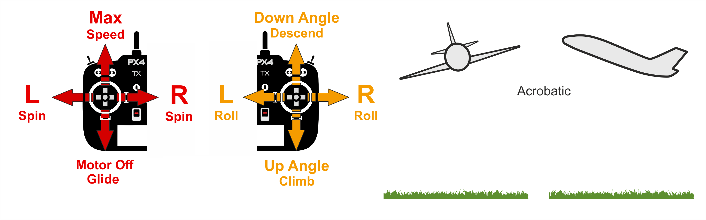

# Режим Acro (фіксоване крило)

&nbsp;&nbsp;

_Acro mode_ is the manual mode for performing acrobatic maneuvers e.g. rolls, flips, stalls and acrobatic figures.

Ручки крена, тангажу та риштування керують швидкістю кутової обертання навколо відповідних вісей, а керування тяги безпосередньо передається до розподілу керування.
Коли стіки будуть відцентровані, апарат перестане обертатися, але залишиться у своїй поточній орієнтації (на боці, перевернутий, тощо) і рухатиметься відповідно до свого поточного імпульсу.

## Технічний опис

Ручний режим для виконання акробатичних маневрів, наприклад, перекидів, сальто, стійок і акробатичних фігур.

Вхідні сигнали стіків крену-тангажу перетворюються на команди кутової швидкості, які стабілізуються автопілотом.
Передача дроселя здійснюється безпосередньо для керування розподілом.

## Параметри

| Параметр                                                                                                                                                             | Опис                                                                                                                                                                                                                                                                                          |
| -------------------------------------------------------------------------------------------------------------------------------------------------------------------- | --------------------------------------------------------------------------------------------------------------------------------------------------------------------------------------------------------------------------------------------------------------------------------------------- |
| [FW_ACRO_X_MAX](../advanced_config/parameter_reference.md#FW_ACRO_X_MAX)    | Максимальна швидкість обертання корпусу x (швидкість обертання корпусу x, яку контролер намагається досягти, якщо користувач вводить ролл-стік в режимі acro). За замовчуванням: 90 градусів.                              |
| [FW_ACRO_Y_MAX](../advanced_config/parameter_reference.md#FW_ACRO_Y_MAX)    | Максимальна швидкість тіла y в режимі acro (максимальна швидкість тіла y, якої намагається досягти контролер, якщо користувач вводить пітч-стик у режимі acro). За замовчуванням: 90 градусів.                             |
| [FW_ACRO_Z_MAX](../advanced_config/parameter_reference.md#FW_ACRO_Z_MAX)    | Максимальна швидкість обертання корпусу z в режимі acro (максимальна швидкість обертання корпусу, якої намагається досягти контролер, якщо користувач вводить стик рискання в режимі acro). За замовчуванням: 45 градусів. |
| [FW_ACRO_YAW_EN](../advanced_config/parameter_reference.md#FW_ACRO_YAW_EN) | Enable yaw rate controller (if disabled the pilot commands directly the yaw actuator). `0`: Disabled (Default), `1`: Enabled.                                                           |
