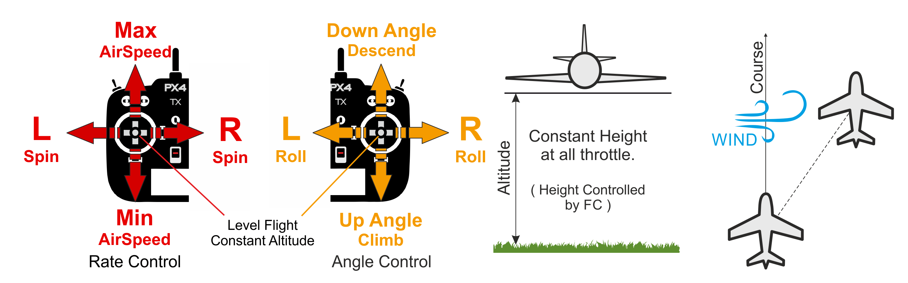

# Режим Altitude (Фіксоване крило)

&nbsp;&nbsp;

The _Altitude_ flight mode is the safest and easiest non-GPS manual mode.
Це полегшує пілотам контроль висоти транспортного засобу, і зокрема досягати і підтримувати фіксовану висоту.
Режим не буде намагатися утримати курс транспортного засобу від вітру.
Швидкість активно контролюється, якщо встановлений датчик швидкості.

:::tip
_Altitude mode_ is similar to [Position mode](../flight_modes_fw/position.md) in that both modes level the vehicle and maintain altitude when sticks are released.
Різниця полягає в тому, що режим позиції утримує фактичний шлях польоту (курс) стабільним проти вітру, тоді як висота лише утримує напрямок.
:::

The vehicle performs a [coordinated turn](https://en.wikipedia.org/wiki/Coordinated_flight) if the roll sticks are non-zero, while the pitch stick controls the rate of ascent/descent.
Засувка визначає швидкість повітря — при 50% засувки літак буде утримувати свою поточну висоту з заданою крейсерською швидкістю.

Коли всі стіки відпущені/центровані (без кочення, тангажу, повороту та близько 50% керування газом), літак повернеться до прямого, рівного польоту (залежно від вітру) та збереже свою поточну висоту.
This makes it easy to recover from any problems when flying.
Крен, тангаж та риск - всі кутово-керовані (тому неможливо перекочувати або робити петлю транспортному засобу).

Стік повороту може бути використана для збільшення/зменшення кута приводу автомобіля на поворотах.
Якщо контролер фіксований у центрі, то він самостійно здійснює координацію повороту, що означає, що він застосовує необхідну швидкість розвороту для поточного кута крену, щоб виконати плавний поворот.

The diagram below shows the mode behaviour visually (for a [mode 2 transmitter](../getting_started/rc_transmitter_receiver.md#transmitter_modes)).

## Технічний підсумок

Altitude mode like [Stabilized mode](../flight_modes_fw/stabilized.md) but with altitude stabilization.
Швидкість також стабілізується, якщо встановлений датчик швидкості.
Курс транспортного засобу не фіксується, і він може дрейфувати по причині вітру.

- Центровані вхідні показники крену/тангажу/рискання (в межах дедбенду):
  - Автопілот рівномірно підтримує транспортний засіб і утримує висоту і швидкість повітря.
- Зовнішній центр:
  - Стік регулює висота польоту.
  - Резервний стік керує швидкістю літального апарату, якщо підключений датчик швидкості. Without an airspeed sensor the vehicle will fly level at trim throttle ([FW_THR_TRIM](../advanced_config/parameter_reference.md#FW_THR_TRIM)), increasing or decreasing throttle as needed to climb or descend.
  - Стік керування використовує кут крена. Autopilot will maintain [coordinated flight](https://en.wikipedia.org/wiki/Coordinated_flight).
  - Стік крену додає додатковий значення швидкості рискання (додається до розрахованого автопілотом для підтримки координованого польоту).
    Може бути використаний для ручної зміни кута рискання безпілотного засобу.
- Потрібен ручний ввід управління (наприклад, за допомогою пульта дистанційного керування, джойстика).
- Необхідне джерело вимірювання висоти (зазвичай барометр або GPS)

## Параметри

Режим впливає на наступні параметри:

| Параметр                                                                                                                                                                                  | Опис                                                                                                                                               |
| ----------------------------------------------------------------------------------------------------------------------------------------------------------------------------------------- | -------------------------------------------------------------------------------------------------------------------------------------------------- |
| [FW_AIRSPD_MIN](../advanced_config/parameter_reference.md#FW_AIRSPD_MIN)                                              | Мінімальна швидкість. За замовчуванням: 10 м/с.                                                    |
| [FW_AIRSPD_MAX](../advanced_config/parameter_reference.md#FW_AIRSPD_MAX)                                              | Максимальна швидкість. За замовчуванням: 20 м/с.                                                   |
| [FW_AIRSPD_TRIM](../advanced_config/parameter_reference.md#FW_AIRSPD_TRIM)                                           | Крейсерська швидкість. За замовчуванням: 15 м/с.                                                   |
| [FW_MAN_P_MAX](../advanced_config/parameter_reference.md#FW_MAN_P_MAX)                            | Установлення максимального кроку в режимі стабілізації кута нахилу. За замовчуванням: 45 градусів. |
| [FW_MAN_R_MAX](../advanced_config/parameter_reference.md#FW_MAN_R_MAX)                            | Максимальне значення крена в режимі стабілізації кута нахилу. За замовчуванням: 45 градусів.       |
| [FW_T_CLMB_R_SP](../advanced_config/parameter_reference.md#FW_T_CLMB_R_SP) | Максимальна задана швидкість підйому. За замовчуванням: 3 м/с.                                     |
| [FW_T_SINK_R_SP](../advanced_config/parameter_reference.md#FW_T_SINK_R_SP) | Максимальне значення зниження швидкості. За замовчуванням: 2 м/с.                                  |

<!--
FW notes:
FW position controller is basically 2 independent pieces
* L1 is for navigation - determines the roll and yaw needed to achieve the desired waypoint (or loiter)
* TECS is for speed and height control - determines throttle and elevator position needed to achieve the commanded altitude and airspeed
Overall that gives you an attitude setpoint (roll, pitch, yaw) and throttle which is sent off to the attitude controller
-->
