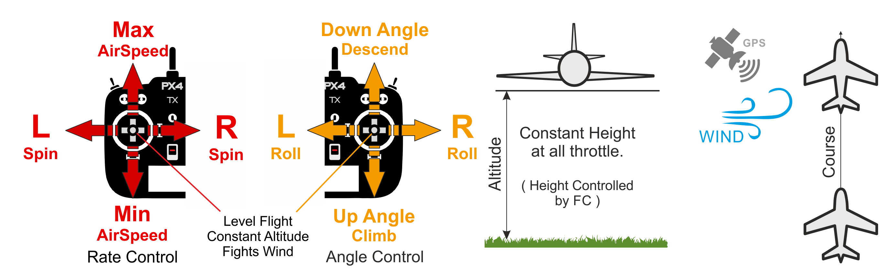

# Cruise Mode (Fixed-Wing)

&nbsp;&nbsp;

_Cruise mode_ (also shown as _Position_ in some tools) is the easiest and safest manual mode.
It is supported on vehicles that have a position estimate (e.g. GPS).
Це полегшує пілотам контроль висоти транспортного засобу, і зокрема досягати і підтримувати фіксовану висоту.
The mode will hold the vehicle's course against wind.
Швидкість активно контролюється, якщо встановлений датчик швидкості.

The vehicle performs a [coordinated turn](https://en.wikipedia.org/wiki/Coordinated_flight) if the roll sticks are non-zero, while the pitch stick controls the rate of ascent/descent.
Засувка визначає швидкість повітря — при 50% засувки літак буде утримувати свою поточну висоту з заданою крейсерською швидкістю.

When all sticks are released/centered (no roll, pitch, yaw, and ~50% throttle) the aircraft will return to straight, level flight, and keep its current altitude and flight path irrespective of wind.
This makes it easy to recover from any problems when flying.
Roll and pitch are angle-controlled (so it is impossible to roll over or loop the vehicle).

Стік повороту може бути використана для збільшення/зменшення кута приводу автомобіля на поворотах.
Якщо контролер фіксований у центрі, то він самостійно здійснює координацію повороту, що означає, що він застосовує необхідну швидкість розвороту для поточного кута крену, щоб виконати плавний поворот.
The diagram below shows the mode behaviour visually (for a [mode 2 transmitter](../getting_started/rc_transmitter_receiver.md#transmitter_modes)).

## Технічний опис

Cruise mode is like [Altitude mode](../flight_modes_fw/altitude.md) but with course stabilization.
Швидкість також стабілізується, якщо встановлений датчик швидкості.

- Центровані вхідні показники крену/тангажу/рискання (в межах дедбенду):
  - Autopilot levels vehicle and maintains altitude, airspeed and course over ground.
- Зовнішній центр:
  - Стік регулює висота польоту.
  - Резервний стік керує швидкістю літального апарату, якщо підключений датчик швидкості. Without an airspeed sensor the vehicle will fly level at trim throttle ([FW_THR_TRIM](../advanced_config/parameter_reference.md#FW_THR_TRIM)), increasing or decreasing throttle as needed to climb or descend.
  - Стік керування використовує кут крена. Autopilot will maintain [coordinated flight](https://en.wikipedia.org/wiki/Coordinated_flight).
  - Стік крену додає додатковий значення швидкості рискання (додається до розрахованого автопілотом для підтримки координованого польоту).
    Може бути використаний для ручної зміни кута рискання безпілотного засобу.
- Потрібен ручний ввід управління (наприклад, за допомогою пульта дистанційного керування, джойстика).
- Необхідне джерело вимірювання висоти (зазвичай барометр або GPS)

<!-- AUTO-GENERATED: mode_requirements_fixed_wing_posctl -->

### Mode Requirements

The following requirements must be met to arm in this mode, or to switch to this mode when it is armed.

- [`mode_req_angular_velocity`](../flight_modes/mode_requirements.md#mode_req_angular_velocity) — Angular velocity
- [`mode_req_attitude`](../flight_modes/mode_requirements.md#mode_req_attitude) — Attitude/pose
- [`mode_req_local_alt`](../flight_modes/mode_requirements.md#mode_req_local_alt) — Local altitude relative to EKF2 origin ('0') position
- [`mode_req_local_position_relaxed`](../flight_modes/mode_requirements.md#mode_req_local_position_relaxed) — Position relative to EKF2 origin ('0') point but accepts poor accuracy
- [`mode_req_manual_control`](../flight_modes/mode_requirements.md#mode_req_manual_control) — Requires stick input

<!-- END AUTO-GENERATED: mode_requirements_fixed_wing_posctl -->

## Параметри

Режим впливає на наступні параметри:

| Parameter                                                                                                                                                                                       | Опис                                                                                                                                               |
| ----------------------------------------------------------------------------------------------------------------------------------------------------------------------------------------------- | -------------------------------------------------------------------------------------------------------------------------------------------------- |
| [FW_AIRSPD_MIN](../advanced_config/parameter_reference.md#FW_AIRSPD_MIN)                                                    | Мінімальна швидкість. За замовчуванням: 10 м/с.                                                    |
| [FW_AIRSPD_MAX](../advanced_config/parameter_reference.md#FW_AIRSPD_MAX)                                                    | Максимальна швидкість. За замовчуванням: 20 м/с.                                                   |
| [FW_AIRSPD_TRIM](../advanced_config/parameter_reference.md#FW_AIRSPD_TRIM)                                                 | Крейсерська швидкість. За замовчуванням: 15 м/с.                                                   |
| [FW_MAN_P_MAX](../advanced_config/parameter_reference.md#FW_MAN_P_MAX)                                  | Установлення максимального кроку в режимі стабілізації кута нахилу. За замовчуванням: 45 градусів. |
| [FW_MAN_R_MAX](../advanced_config/parameter_reference.md#FW_MAN_R_MAX)                                  | Максимальне значення крена в режимі стабілізації кута нахилу. За замовчуванням: 45 градусів.       |
| [FW_T_CLMB_R_SP](../advanced_config/parameter_reference.md#FW_T_CLMB_R_SP)       | Максимальна задана швидкість підйому. За замовчуванням: 3 м/с.                                     |
| [FW_T_SINK_R_SP](../advanced_config/parameter_reference.md#FW_T_SINK_R_SP)       | Максимальне значення зниження швидкості. За замовчуванням: 2 м/с.                                  |
| [FW_PN_R_SLEW_MAX](../advanced_config/parameter_reference.md#FW_PN_R_SLEW_MAX) | Roll setpoint slew rate limit. Default: 90 °/s.                                                    |

## MAVLink Commands

The following commands are relevant to this mode:

- [MAV_CMD_DO_CHANGE_SPEED](https://mavlink.io/en/messages/common.html#MAV_CMD_DO_CHANGE_SPEED) — Sets the cruise airspeed for centred throttle stick.

  This requires an airspeed sensor.
  Only the airspeed speed type is handled (`param1` must be `0`); other speed types are ignored.
  At centered throttle the vehicle holds the commanded airspeed (`param2`) if a positive value is set (non-positive values are ignored).
  The value is constrained between [FW_AIRSPD_MIN](../advanced_config/parameter_reference.md#FW_AIRSPD_MIN) and [FW_AIRSPD_MAX](../advanced_config/parameter_reference.md#FW_AIRSPD_MAX), and defaults to [FW_AIRSPD_TRIM](../advanced_config/parameter_reference.md#FW_AIRSPD_TRIM) if no airspeed has been commanded.
  Deflecting the throttle stick scales the airspeed toward `FW_AIRSPD_MIN` (back) or `FW_AIRSPD_MAX` (forward) around this value.
  The commanded airspeed resets to `FW_AIRSPD_TRIM` on every flight mode change.

Note, other commands may be supported.
