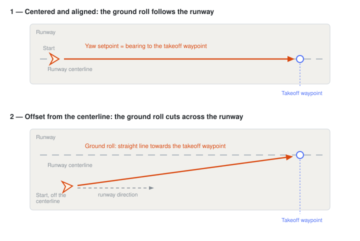

# Режим зльоту (з фіксованим крилом)

The _Takeoff_ flight mode causes the vehicle to take off to a specified height and then enter [Hold mode](../flight_modes_fw/takeoff.md).

Vehicles are [hand or catapult launched](#catapult-hand-launch) by default, but can also be [configured](#RWTO_TKOFF) to use a [runway takeoff](#runway-takeoff) when supported by the hardware.

::: info

- Режим автоматичний - для керування апаратом не потрібно втручання користувача.
- Mode requires at least a valid altitude estimation.
  - Flying vehicles can't switch to this mode without valid altitude.
  - Flying vehicles will failsafe if they lose the altitude estimate.
  - Disarmed vehicles can switch to mode without valid altitude estimate but can't arm.
- Перемикачі радіокерування можна використовувати для зміни режимів польоту.
- RC stick movement is ignored in catapult takeoff but can be used to nudge the vehicle in runway takeoff.
- The [Failure Detector](../config/safety.md#failure-detector) will automatically stop the engines if there is a problem on takeoff.

<!-- https://github.com/PX4/PX4-Autopilot/blob/main/src/modules/commander/ModeUtil/mode_requirements.cpp -->

:::

## Технічний підсумок

Takeoff mode (and [fixed wing mission takeoff](../flight_modes_fw/mission.md#mission-takeoff)) has two modalities: [catapult/hand-launch](#catapult-hand-launch) or [runway takeoff](#runway-takeoff) (hardware-dependent).
The mode defaults to catapult/hand launch, but can be set to runway takeoff by setting [RWTO_TKOFF](#RWTO_TKOFF) to 1.

To use _Takeoff mode_ you first switch to the mode, and then arm the vehicle (or send the [MAV_CMD_NAV_TAKEOFF](https://mavlink.io/en/messages/common.html#MAV_CMD_NAV_TAKEOFF) command which does both).
Прискорення запуску з руки/катапульти спричиняє запуск двигунів.
Для запуску на злітну смугу мотори автоматично посилюються, як тільки транспортний засіб був увімкнений.

Незалежно від модальності, шлях польоту (початкова точка та курс взльоту) та висота дозволу визначені:

- Точкою виходу є позиція транспортного засобу, коли спочатку ввімкнений режим зльоту.
- The course is set to the vehicle heading on arming by default.
  If a valid waypoint latitude/longitude is set the vehicle will instead track towards the waypoint.
- The clearance altitude is set to [MIS_TAKEOFF_ALT](#MIS_TAKEOFF_ALT) by default.
  If a valid waypoint altitude is set is set the vehicle will instead use it as the clearance altitude.

By default, on takeoff the aircraft will follow the line defined by the starting point and course, climbing at the maximum climb rate ([FW_T_CLMB_MAX](../advanced_config/parameter_reference.md#FW_T_CLMB_MAX)) until reaching the clearance altitude.
Reaching the clearance altitude causes the vehicle to enter [Hold mode](../flight_modes_fw/takeoff.md).

[FW_TKO_CLMB_T](#FW_TKO_CLMB_T) ends the climbout after a fixed time instead.
The vehicle holds at whatever altitude it has reached by then, or climbs to the clearance altitude if it is still below it.
Use it where altitude is a poor measure of when the climbout is done, such as a rocket-assisted launch.

If a valid waypoint target is set, using `MAV_CMD_NAV_TAKEOFF` or the [VehicleCommand](../msg_docs/VehicleCommand.md) uORB topic, the vehicle will instead track towards the waypoint, and enter [Hold mode](../flight_modes_fw/takeoff.md) after reaching the waypoint altitude (within the acceptance radius).

:::tip
If the local position is invalid or becomes invalid while executing the takeoff, the controller is not able to track a course setpoint and will instead proceed climbing while keeping the wings level until the clearance altitude is reached.
:::

::: info

- Takeoff towards a target position was added in <Badge type="tip" text="PX4 v1.17" />.
- Holding wings level and ascending to clearance attitude when local position is invalid during takeoff was added in <Badge type="tip" text="PX4 v1.17" />.
- QGroundControl does not support `MAV_CMD_NAV_TAKEOFF` (at time of writing).

:::

<!-- AUTO-GENERATED: mode_requirements_fixed_wing_auto_takeoff -->

### Mode Requirements

The following requirements must be met to arm in this mode, or to switch to this mode when it is armed.

- [`mode_req_angular_velocity`](../flight_modes/mode_requirements.md#mode_req_angular_velocity) — Angular velocity
- [`mode_req_attitude`](../flight_modes/mode_requirements.md#mode_req_attitude) — Attitude/pose
- [`mode_req_local_alt`](../flight_modes/mode_requirements.md#mode_req_local_alt) — Local altitude relative to EKF2 origin ('0') position

<!-- END AUTO-GENERATED: mode_requirements_fixed_wing_auto_takeoff -->

### Параметри

Параметри, які впливають як на катапульту/ручний старт, так і на зліт зі злітно-посадкової смуги:

| Parameter                                                            | Опис                                                                                                                                                                      |
| -------------------------------------------------------------------- | ------------------------------------------------------------------------------------------------------------------------------------------------------------------------- |
| [MIS\_TAKEOFF\_ALT][MIS_TAKEOFF_ALT]     | This is the relative altitude (above launch altitude) the system will take off to if not otherwise specified. takeoff. |
| [FW\_TKO\_AIRSPD][FW_TKO_AIRSPD]           | Takeoff airspeed (is set to [FW\_AIRSPD\_MIN][FW_AIRSPD_MIN] if not defined by operator)                                                                                  |
| [FW\_TKO\_PITCH\_MIN][FW_TKO_PITCH_MIN] | Це мінімальний кут нахилу заданий під час фази зльоту                                                                                                                     |
| [FW\_T\_CLMB\_MAX][FW_T_CLMB_MAX]          | Climb rate setpoint during climbout to takeoff altitude.                                                                                                  |
| [FW\_TKO\_CLMB\_T][FW_TKO_CLMB_T]          | Duration of the climbout. If > 0 the climbout ends after this time instead of at the takeoff altitude.                                    |
| [FW\_FLAPS\_TO\_SCL][FW_FLAPS_TO_SCL]    | Налаштування закрилок під час зльоту                                                                                                                                      |
| [FW\_AIRSPD\_FLP\_SC][FW_AIRSPD_FLP_SC] | Factor applied to the minimum airspeed when flaps are fully deployed. Needed if [FW\_TKO\_AIRSPD](#FW_TKO_AIRSPD) is below [FW\_AIRSPD\_MIN][FW_AIRSPD_MIN].              |

[FW_AIRSPD_MIN]: ../advanced_config/parameter_reference.md#FW_AIRSPD_MIN
[FW_FLAPS_TO_SCL]: ../advanced_config/parameter_reference.md#FW_FLAPS_TO_SCL
[FW_AIRSPD_FLP_SC]: ../advanced_config/parameter_reference.md#FW_AIRSPD_FLP_SC
[FW_TKO_AIRSPD]: ../advanced_config/parameter_reference.md#FW_TKO_AIRSPD
[MIS_TAKEOFF_ALT]: ../advanced_config/parameter_reference.md#MIS_TAKEOFF_ALT
[FW_TKO_PITCH_MIN]: ../advanced_config/parameter_reference.md#FW_TKO_PITCH_MIN
[FW_T_CLMB_MAX]: ../advanced_config/parameter_reference.md#FW_T_CLMB_MAX
[FW_TKO_CLMB_T]: ../advanced_config/parameter_reference.md#FW_TKO_CLMB_T

:::info
The vehicle always respects normal FW max/min throttle settings during takeoff ([FW_THR_MIN](../advanced_config/parameter_reference.md#FW_THR_MIN), [FW_THR_MAX](../advanced_config/parameter_reference.md#FW_THR_MAX)).
:::

## Catapult/Hand Launch {#hand_launch}

In _catapult/hand-launch mode_ the vehicle waits to detect launch (based on acceleration trigger).
On launch it enables the motor(s) and climbs with the maximum climb rate [FW_T_CLMB_MAX](#FW_T_CLMB_MAX) while keeping the pitch setpoint above [FW_TKO_PITCH_MIN](#FW_TKO_PITCH_MIN).
Once it reaches [MIS_TAKEOFF_ALT](#MIS_TAKEOFF_ALT) it will automatically switch to [Hold mode](../flight_modes_fw/hold.md) and loiter.
It is possible to delay the activation of the motors and control surfaces separately, see parameters [FW_LAUN_MOT_DEL](#FW_LAUN_MOT_DEL), [FW_LAUN_CS_LK_DY](#FW_LAUN_CS_LK_DY) and [CA_CS_LAUN_LK](#CA_CS_LAUN_LK). The later is also exposed in the actuator configuration page under the advanced view.

Всі рухи стіку радіоуправління ігноруються під час повного взлітного процесу.

Для запуску в цьому режимі:

1. Увімкніть дрон
2. Put the vehicle into _Takeoff mode_
3. Запустіть / киньте транспортний засіб (міцно) безпосередньо у вітер.
   Ви також можете спершу потрясти транспортний засіб, зачекати, поки рушить двигун, а потім кинути його

### Параметри (виявник запуску)

The _launch detector_ is affected by the following parameters:

| Parameter                                                                                                                                                                                       | Опис                                                                                                                  |
| ----------------------------------------------------------------------------------------------------------------------------------------------------------------------------------------------- | --------------------------------------------------------------------------------------------------------------------- |
| [FW_LAUN_DETCN_ON](../advanced_config/parameter_reference.md#FW_LAUN_DETCN_ON)                      | Увімкнути автоматичне визначення запуску. Якщо вимкнені двигуни обертаються при підготовці до польоту |
| [FW_LAUN_AC_THLD](../advanced_config/parameter_reference.md#FW_LAUN_AC_THLD)                         | Acceleration threshold (norm of acceleration must be above this value)                             |
| [FW_LAUN_AC_T](../advanced_config/parameter_reference.md#FW_LAUN_AC_T)                                  | Час спрацьовування (прискорення повинно бути вище порогу на цю кількість секунд)                   |
| [FW_LAUN_MOT_DEL](../advanced_config/parameter_reference.md#FW_LAUN_MOT_DEL)                         | Затримка від виявлення запуску до відкручування мотору                                                                |
| [FW_LAUN_CS_LK_DY](../advanced_config/parameter_reference.md#FW_LAUN_CS_LK_DY) | Delay from launch detection to unlocking the control surfaces                                                         |
| [CA_CS_LAUN_LK](../advanced_config/parameter_reference.md#CA_CS_LAUN_LK)                               | Bitmask to select which control surfaces are to be locked during launch                                               |

## Runway Takeoff {#runway_launch}

Runway takeoffs can be used by vehicles with landing gear and steerable wheel (only).
You will first need to enable the wheel controller using the parameter [FW_W_EN](#FW_W_EN).

Транспортний засіб повинен бути в центрі та вирівняний по злітній смузі, коли починається зльот.
The operator can "nudge" the vehicle while on the runway to help keeping it centered and aligned (see [RWTO_NUDGE](../advanced_config/parameter_reference.md#RWTO_NUDGE)).

The _runway takeoff mode_ has the following phases:

1. **Throttle ramp**: Throttle is ramped up within [RWTO_RAMP_TIME](../advanced_config/parameter_reference.md#RWTO_RAMP_TIME) to [RWTO_MAX_THR](../advanced_config/parameter_reference.md#RWTO_MAX_THR).
2. **Clamped to runway**: Pitch fixed, no roll and takeoff path controlled until the rotation airspeed ([RWTO_ROT_AIRSPD](../advanced_config/parameter_reference.md#RWTO_ROT_AIRSPD)) is reached. Оператор може підганяти транспортний засіб ліворуч/праворуч за допомогою стіка рискання.
3. **Climbout**: Increase pitch setpoint and climb to takeoff altitude. Щоб уникнути ударів крил, контролер буде тримати встановлений кут кочення заблокованим на 0, коли близько до землі, а потім поступово дозволить більше кочення під час підйому. It is based on the vehicle geometry as configured in [FW_WING_SPAN](#FW_WING_SPAN) and [FW_WING_HEIGHT](#FW_WING_HEIGHT).

### Wheel Controller {#wheel_controller}

The wheel controller steers the vehicle on the ground using the steerable nose/tail wheel.
It is enabled with [FW_W_EN](#FW_W_EN) and only runs in automatic modes during runway takeoff and during the landing rollout.
Whenever it is not active (in all manual modes, or if it is disabled), the yaw stick is mapped directly to the wheel.

The controller is cascaded:

1. **Heading controller**: The heading (yaw) error is converted into a yaw rate setpoint with a fixed time constant of 0.1s, limited to [FW_W_RMAX](#FW_W_RMAX).
2. **Rate controller**: A P-I-FF controller ([FW_WR_P](#FW_WR_P), [FW_WR_I](#FW_WR_I), [FW_WR_FF](#FW_WR_FF), integrator limited by [FW_WR_IMAX](#FW_WR_IMAX)) turns the yaw rate setpoint into a normalized wheel steering command in the range [-1, 1].

The heading setpoint during the ground roll is the bearing from the takeoff position to the takeoff waypoint, so the nose is kept aligned with the intended runway direction.
If no navigation reference is available (takeoff without takeoff waypoint), and during the landing rollout, the controller instead holds the heading that was captured at the moment the wheel steering engaged.

Operator yaw stick input is added on top of the controller output to "nudge" the vehicle (enabled with [RWTO_NUDGE](#RWTO_NUDGE) for takeoff, and [FW_LND_NUDGE](../advanced_config/parameter_reference.md#FW_LND_NUDGE) for landing).

:::info
The gains are scaled with groundspeed (using [FW_AIRSPD_STALL](../advanced_config/parameter_reference.md#FW_AIRSPD_STALL) as the reference speed) so that the steering becomes less aggressive as the vehicle accelerates.
This means the controller should be tuned at low speed, around stall airspeed.
:::

For a smooth takeoff the wheel controller usually needs to be tuned:

1. Start with [FW_WR_P](#FW_WR_P) and [FW_WR_FF](#FW_WR_FF) only (set [FW_WR_I](#FW_WR_I) to 0) and taxi/roll the vehicle in _Mission mode_ with active Takeoff waypoint item at low speed.
2. Increase the gains until the vehicle tracks the runway heading without noticeable oscillation of the nose.
3. Add [FW_WR_I](#FW_WR_I) to remove a remaining constant heading offset (e.g. caused by wheel misalignment or crosswind).

:::warning
Excessive gains lead to oscillations of the nose during the ground roll, which can quickly become dangerous at higher groundspeed.
Always test with increasing speed step by step.
:::

### Параметри (зліт зі злітної смуги)

Зліт зі злітної смуги залежить від наступних параметрів:

| Parameter                                                                                                                                          | Опис                                                                                                                                                                                                                                |
| -------------------------------------------------------------------------------------------------------------------------------------------------- | ----------------------------------------------------------------------------------------------------------------------------------------------------------------------------------------------------------------------------------- |
| [RWTO_TKOFF](../advanced_config/parameter_reference.md#RWTO_TKOFF)                                     | Увімкніть зліт по взлітній смузі                                                                                                                                                                                                    |
| [FW_W_EN](../advanced_config/parameter_reference.md#FW_W_EN)                         | Увімкнути контролер колеса                                                                                                                                                                                                          |
| [RWTO_MAX_THR](../advanced_config/parameter_reference.md#RWTO_MAX_THR)          | Максимальне розгін під час взліту зі злітної смуги                                                                                                                                                                                  |
| [RWTO_RAMP_TIME](../advanced_config/parameter_reference.md#RWTO_RAMP_TIME)    | Час прискорення ручки газу                                                                                                                                                                                                          |
| [RWTO_ROT_AIRSPD](../advanced_config/parameter_reference.md#RWTO_ROT_AIRSPD) | Поріг швидкості для початку підняття (нахилення вгору). Якщо не налаштовано оператором, встановлюється на 0,9\*FW_TKO_AIRSPD.          |
| [RWTO_ROT_TIME](../advanced_config/parameter_reference.md#RWTO_ROT_TIME)       | Це час, який необхідно лінійно нарощувати обмеження швидкості прийому під час обертання на зльоті.                                                                                                                  |
| [FW_TKO_AIRSPD](../advanced_config/parameter_reference.md#FW_TKO_AIRSPD)       | Задана швидкість під час розгону під час зльоту (після відкочування). Якщо не налаштовано оператором, встановлюється на FW_AIRSPD_MIN. |
| [RWTO_NUDGE](../advanced_config/parameter_reference.md#RWTO_NUDGE)                                     | Увімкніть керування колесом під час руху по злітній смузі                                                                                                                                                                           |
| [FW_WING_SPAN](../advanced_config/parameter_reference.md#FW_WING_SPAN)          | Розмах крила транспортного засобу. Використовується для запобігання ударів крилом.                                                                                                                  |
| [FW_WING_HEIGHT](../advanced_config/parameter_reference.md#FW_WING_HEIGHT)    | Висота крил над землею (дорожній просвіт). Використовується для запобігання ударів крилом.                                                                                       |

### Parameters (Wheel Controller)

The [wheel controller](#wheel_controller) is affected by the following parameters:

| Parameter                                                                                                                           | Опис                                                                                    |
| ----------------------------------------------------------------------------------------------------------------------------------- | --------------------------------------------------------------------------------------- |
| [FW_W_EN](#FW_W_EN)                                                                       | Увімкнути контролер колеса                                                              |
| [FW_W_RMAX](../advanced_config/parameter_reference.md#FW_W_RMAX)    | Maximum yaw rate setpoint the heading controller outputs                                |
| [FW_WR_P](../advanced_config/parameter_reference.md#FW_WR_P)          | Yaw rate controller proportional gain                                                   |
| [FW_WR_I](../advanced_config/parameter_reference.md#FW_WR_I)          | Yaw rate controller integrator gain (trims a constant heading error) |
| [FW_WR_IMAX](../advanced_config/parameter_reference.md#FW_WR_IMAX) | Yaw rate controller integrator limit                                                    |
| [FW_WR_FF](../advanced_config/parameter_reference.md#FW_WR_FF)       | Yaw rate controller feed forward gain                                                   |

## Дивіться також

- [Takeoff Mode (MC)](../flight_modes_mc/takeoff.md)
- [Planning a mission takeoff](../flight_modes_fw/mission.md#mission-takeoff)

<!-- this maps to AUTO_TAKEOFF in dev -->
