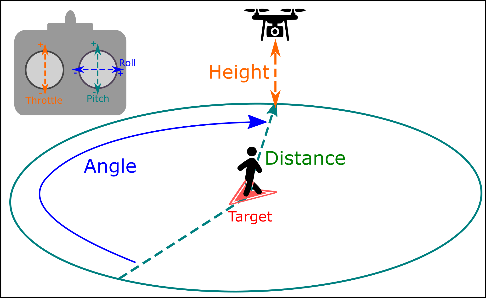
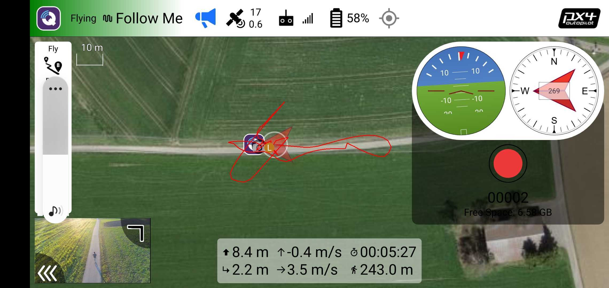

# Режим Follow-Me Слідуй за мною (мультикоптер)

_Follow Me_ mode allows a multicopter to autonomously hold position and altitude relative to another system that is broadcasting its position (and optionally velocity) using the [FOLLOW_TARGET](https://mavlink.io/en/messages/common.html#FOLLOW_TARGET) MAVLink message.

::: info

- Режим автоматичний - для керування апаратом не потрібно втручання користувача.
- Режим потребує принаймні дійсної локальної оцінки позиції (не потребує глобальної позиції).
  - Літаючі транспортні засоби не можуть переключатися на цей режим без глобального положення.
  - Літаючі транспортні засоби перейдуть в режим аварійної безпеки, якщо втратять оцінку положення.
- Режим перешкоджає зброюванню (транспортний засіб повинен бути зброєний при переході на цей режим).
- Режим вимагає, щоб швидкість вітру та час польоту були в межах допустимих значень (вказано через параметри).
- Цей режим в даний час підтримується лише на багатокоптерних (або VTOL у режимі MC).
- Також обраний об'єкт повинен мати можливість постачання інформації про позицію.
- Follow-me mode is supported by _QGroundControl_ on Android devices with a GPS module, and [MAVSDK](#follow-me-with-mavsdk).

<!-- https://github.com/PX4/PX4-Autopilot/blob/main/src/modules/commander/ModeUtil/mode_requirements.cpp -->

:::

## Загальний огляд

The vehicle will automatically yaw to face and follow the target from a specified [relative angle](#FLW_TGT_FA), [distance](#FLW_TGT_DST) and [height](#FLW_TGT_HT) and altitude, depending on the [altitude control mode](#FLW_TGT_ALT_M).

За замовчуванням він буде слідувати безпосередньо за цільовим об'єктом на відстані 8 метрів, і на висоті 8 метрів вище домашньої (озброєної) позиції.

Користувачі можуть налаштувати кут слідування, висоту та відстань за допомогою пульта дистанційного керування, як показано вище:

- _Follow Height_ is controlled with the `up-down` input ("Throttle").
  Центруйте палицю, щоб тримати відстеження цілі на постійній висоті. Підніміть або опустіть палицю, щоб налаштувати висоту.
- _Follow Distance_ is controlled with the `forward-back` input ("Pitch").
  Тиснення палиці вперед збільшує відстань слідування, витягування назад зменшує відстань.
- _Follow Angle_ is controlled with the `left-right` input ("Roll").
  Рух відбувається з точки зору користувача, тому якщо ви стоїте обличчям до дрона й рухаєте палицю ліворуч, він буде рухатися ліворуч.
  Зверху, якщо ви рухатимете палицю вліво, квадрокоптер буде рухатися проти годинникової стрілки.

  Follow Angle визначається як збільшення в годинниковому напрямку відносно напрямку руху цілі (який дорівнює 0 градусів)

  

:::info
Angle, height, and distance values set using the RC controller are discarded when you exit follow-me mode.
Якщо ви вийдете з режиму "Follow-Me" й активуєте його знову, значення будуть скинуті до їх типових значень.
:::

### Відео

<lite-youtube videoid="csuMtU6seXI" params="start=155" title="PX4 Follow Target follows a Rover!"/>

### Safety Precautions

:::warning
**Follow-me mode** does not implement any type of obstacle avoidance.
Special care must be taken when this mode is used.
:::

The following flight precautions should be observed:

- Режим слідування за мною слід використовувати тільки в широких відкритих місцях, які не перешкоджають дерева, електропроводи, будинки тощо.
  - Set the [follow-me height](#FLW_TGT_HT) to a value that is well above any surrounding obstructions.
    By _default_ this is 8 metres above the home (arming) position.
- It is _safer_ to manually fly to a safe height before engaging follow-me mode than to engage follow-me mode when landed (even though the mode implements auto take off).
- Надайте вашому транспортному засобу достатньо місця для зупинки, особливо коли він рухається швидко.
- Будьте готові повернутися до режиму позиціонування, якщо щось піде не так, особливо коли ви використовуєте режим слідування за мною вперше.
- Ви не можете вимкнути режим 'слідуй за мною', використовуючи рухи палицею RC (оскільки це налаштує властивості).
  Вам потрібно мати GroundStation, яка може відправляти сигнали перемикання режиму польоту або налаштований перемикач режиму польоту на вашому RC передавачі.

### Follow-Me with QGroundControl

_Follow Me_ mode is supported using _QGroundControl_ as a target on ground station hardware that has a GPS module.
The recommended configuration is a USB OTG-capable Android device with two telemetry radios.

To setup _Follow Me_ mode:

- Підключіть телеметричне радіо до пристрою земної станції та інше до транспортного засобу (це дозволяє передавати інформацію про позицію між двома радіостанціями).
- Вимкніть режим сну на вашому пристрої Android:
  - This setting can usually be found under: **Settings > Display**.
  - Важливо, щоб ви встановили свій пристрій на Android, щоб не спав, оскільки це може призвести до того, що сигнал GPS перестане випромінюватися через регулярні інтервали.
- Зліт на висоту щонайменше 2-3 метри (рекомендується навіть якщо підтримується автоматичний зліт).
  - Поставте транспортний засіб на землю, натисніть безпечний перемикач і відійдіть принаймні на 10 метрів.
  - Збройте транспортний засіб і злітайте.
- Перемикайтеся в режим слідування за мною.
  - Коптер спочатку підніметься на мінімальну безпечну висоту 1 метр над землею або додому, залежно від наявності датчика відстані.
  - It will ascend until it is 3 meters within the [follow height](#FLW_TGT_HT) to avoid potential collisions before moving horizontally.
  - Коптер завжди буде коригувати свою орієнтацію, щоб бути спрямованим на ціль

At this point you can start moving, and the drone will be following you.

The mode has been tested on the following Android devices:

- Galaxy S10
- Планшет Nexus 7

### Follow-me with MAVSDK

[MAVSDK](https://mavsdk.mavlink.io/main/en/) supports [Follow Me](https://mavsdk.mavlink.io/main/en/), allowing you to create a drone app that is a follow-me target.

For more information see the [Follow Me class](https://mavsdk.mavlink.io/main/en/cpp/api_reference/classmavsdk_1_1_follow_me.html) documentation as well as the [Follow Me Example](https://mavsdk.mavlink.io/main/en/cpp/examples/follow_me.html).

## Налаштування

### Altitude Control Mode

The altitude control mode determine whether the vehicle altitude is relative to the home position, terrain height, or the altitude reported by the follow target.

- `2D tracking` (the default [altitude mode](#FLW_TGT_ALT_M)) makes the drone follow at a height relative to the fixed home position (takeoff altitude).
  Відносна відстань до дрона до цілі зміниться, коли ви підніметесь та опуститесь (використовуйте обережно в гірській місцевості).

- `2D + Terrain` makes the drone follow at a fixed height relative to the terrain underneath it, using information from a distance sensor.

  - If the vehicle does not have a distance sensor following will be identical to `2D tracking`.
  - Датчики відстані не завжди точні, і транспортні засоби можуть бути "скачущими" під час польоту в цьому режимі.
  - Зверніть увагу, що висота вимірюється відносно землі під транспортним засобом, а не цільового об'єкта.
    Дрон може не слідувати за змінами висоти цілі!

- `3D tracking` mode makes the drone follow at a height relative to the follow target, as supplied by its GPS sensor.
  Це адаптується до змін висоти цілі, наприклад, коли ви йдете вгору по пагорбу.

:::warning
Do not set the **Altitude mode ([FLW_TGT_ALT_M](#FLW_TGT_ALT_M)**) to `3D Tracking` when using QGC for Android (or more generally, without checking that [FOLLOW_TARGET.altitude](https://mavlink.io/en/messages/common.html#FOLLOW_TARGET) is an AMSL value).

The MAVLink [FOLLOW_TARGET](https://mavlink.io/en/messages/common.html#FOLLOW_TARGET) message definition expects an altitude relative to mean sea level (AMSL) while QGC on Android is sending an altitude relative to the GPS ellipsoid.
This can differ as much as 200 meters!

The drone probably won't crash due to the built-in minimum safety altitude limit (1 meter), but it may fly much higher than expected.
If the drone's altitude is significantly different than specified, assume that the ground station's altitude output is wrong and use 2D tracking.
:::

### Параметри

The follow-me behavior can be configured using the following parameters:

| Параметр                                                                                                                                                                | Опис                                                                                                                                                                                                                                                                                                                                                                                                                |
| ----------------------------------------------------------------------------------------------------------------------------------------------------------------------- | ------------------------------------------------------------------------------------------------------------------------------------------------------------------------------------------------------------------------------------------------------------------------------------------------------------------------------------------------------------------------------------------------------------------- |
| [FLW_TGT_HT](../advanced_config/parameter_reference.md#FLW_TGT_HT)                                     | Висота автомобіля, який супроводжує, у метрах. Note that this height is fixed _relative to the home/arming position_ (not the target vehicle). Стандартна та мінімальна висота - 8 метрів (близько 26 футів)                                                                                                                                  |
| [FLW_TGT_DST](../advanced_config/parameter_reference.md#FLW_TGT_DST)                                  | Vehicle/ground station separation in the _horizontal_ (x,y) plane, in metres. Мінімально допустимий інтервал - 1 метр. Стандартна відстань - 8 метрів (близько 26 футів).                                                                                                                                                     |
| [FLW_TGT_FA](../advanced_config/parameter_reference.md#FLW_TGT_FA)                                     | Слідкуйте за кутом відносно напрямку руху цілі, в градусах. If a value out of the range [`-180.0`, `+180.0`] is entered, it will get automatically wrapped and applied (e.g. `480.0` will be converted to `120.0`)                                                                           |
| [FLW_TGT_ALT_M](../advanced_config/parameter_reference.md#FLW_TGT_ALT_M)       | Режим керування висотою.  - `0` = 2D Tracking (Altitude Fixed)  - `1` = 2D Tracking + Terrain Following  - `2` = 3D Tracking of the target's GPS altitude **WARNING: [DO NOT USE WITH QGC for Android](#altitude-control-mode)**.                                                                                                       |
| [FLW_TGT_MAX_VEL](../advanced_config/parameter_reference.md#FLW_TGT_MAX_VEL) | Максимальна відносна швидкість для орбітального руху навколо цілі, у м/с. - 10 м/с виявився оптимальним показником для агресивності проти плавності. - Встановлення більш високого значення означає, що траєкторія орбіти навколо цілі буде рухатися швидше, але якщо дрон фізично не здатний досягти такої швидкості, це призводить до агресивної поведінки. |
| [FLW_TGT_RS](../advanced_config/parameter_reference.md#FLW_TGT_RS)                                     | Dynamic filtering algorithm responsiveness that filters incoming target location. - `0.0` = Very sensitive to movements and noisy estimates of position, velocity and acceleration. - `1.0` = Very stable but not responsive filter                                                                                                                                           |

### Tips and tricks

1. Set the [follow distance](#FLW_TGT_DST) to more than 12 meters (8 meters is a "recommended minimum").

  Існує вроджений вплив позиції (3 ~ 5 метрів) між цільовим об'єктом та GPS-датчиком дрона, що змушує дрон слідувати 'примарній цілі' десь поблизу фактичної цілі.
  Це стає більш очевидним, коли відстань слідування дуже мала.
  Ми рекомендуємо встановити достатньо велику відстань, щоб відхилення GPS не було значним.

2. The speed at which you can change the follow angle depends on the [maximum tangential velocity](#FLW_TGT_MAX_VEL) setting.

  Experimentation shows that values between `5 m/s` are `10 m/s` are usually suitable.

3. Використовуючи коригування RC для висоти, відстані та кута, ви можете отримати деякі креативні знімки камери.

  <lite-youtube videoid="o3DhvCL_M1E" title="YUN0012 almostCinematic"/>

  This video demonstrates a Google-Earth view perspective, by adjusting the height to around 50 meters (high), distance to 1 meter (close). Що дозволяє перспективу, як знято з супутника.

## Відомі проблеми

- The SiK 915 Mhz [telemetry radio](../telemetry/sik_radio.md) is known to interfere with the GPS signal being received by some Android devices.
  Тримайте радіо та пристрій на базі Android якомога подалі один від одного при використанні режиму слідування цілі, щоб уникнути перешкод.
- QGC для Android повідомляє про неправильну висоту (висота над еліпсоїдом, а не над рівнем моря).
  Висота може бути відхиленою на до 200м!
