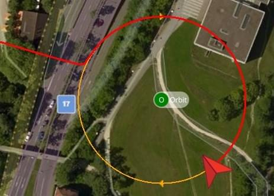
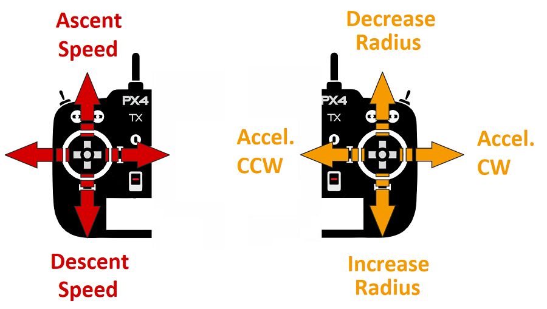

# Орбіта (Мультикоптер)

&nbsp;

The _Orbit_ guided flight mode allows you to command a multicopter (or VTOL in multicopter mode) to fly in a circle at a particular location, by [default](https://mavlink.io/en/messages/common.html#ORBIT_YAW_BEHAVIOUR) yawing so that it always faces towards the center.

::: info

- Режим автоматичний - для керування апаратом не потрібно втручання користувача.
- Режим потребує принаймні дійсної локальної оцінки позиції (не потребує глобальної позиції).
  - Літаючі транспортні засоби не можуть переключатися на цей режим без глобального положення.
  - Літаючі транспортні засоби перейдуть в режим аварійної безпеки, якщо втратять оцінку положення.
- Режим перешкоджає зброюванню (транспортний засіб повинен бути зброєний при переході на цей режим).
- Режим вимагає, щоб швидкість вітру та час польоту були в межах допустимих значень (вказано через параметри).
- Цей режим в даний час підтримується лише на багатокоптерних (або VTOL у режимі MC).
- Рух палиці RC може контролювати підйом/спуск та швидкість та напрямок оберту.
- The mode can be triggered using the [MAV_CMD_DO_ORBIT](https://mavlink.io/en/messages/common.html#MMAV_CMD_DO_ORBIT) MAVLink command.

<!-- https://github.com/PX4/PX4-Autopilot/blob/main/src/modules/commander/ModeUtil/mode_requirements.cpp -->

:::

## Загальний огляд

_QGroundControl_ (or other compatible GCS or MAVLink API) is _required_ to enable the mode, and to set the center position, initial radius and altitude of the orbit.
Після активації транспортний засіб полетить якнайшвидше до найближчої точки на запланованій траєкторії кола і виконає повільний (1 м/с) ходовий оберт навколо запланованого кола за годинниковою стрілкою, обертаючись до центру.

Instructions for how to start an orbit can be found here: [FlyView > Orbit Location](https://docs.qgroundcontrol.com/master/en/qgc-user-guide/fly_view/fly_view.html#orbit) (_QGroundControl_ guide).

:::info
The use of an RC control is _optional_.
Якщо відсутній керування RC, орбіта буде продовжуватися, як описано вище.
RC керування не може бути використане для запуску режиму (якщо ви перемикаєтеся на режим через RC, він буде просто працювати у мирі).
:::

RC керування може бути використане для зміни висоти орбіти, радіусу, швидкості та напрямку обертання:

- **Left stick:**
  - _up/down:_ controls speed of ascent/descent, as in [Position mode](../flight_modes_mc/position.md). Коли в центрі мертвої зони, висота заблокована.
  - _left/right:_ no effect.
- **Right stick:**
  - _left/right:_ controls acceleration of orbit in clockwise/counter-clockwise directions. Коли центрується, поточна швидкість заблокована.
    - Максимальна швидкість становить 10 м/с і подальше обмеження з метою збереження центростремального прискорення нижче 2 м/с².
  - _up/down:_ controls orbit radius (smaller/bigger). Коли центрується, поточний радіус заблокований.
    - Мінімальний радіус - 1м. Максимальний радіус становить 100 м.

The diagram below shows the mode behaviour visually (for a [mode 2 transmitter](../getting_started/rc_transmitter_receiver.md#transmitter_modes)).

Режим можна припинити, переключившись на будь-який інший режим польоту (використовуючи RC або QGC).

## Параметри/Обмеження

Режим впливає на наступні параметри:

| Параметр                                                                                                                                                                   | Опис                                                                                                                |
| -------------------------------------------------------------------------------------------------------------------------------------------------------------------------- | ------------------------------------------------------------------------------------------------------------------- |
| [MC_ORBIT_RAD_MAX](../advanced_config/parameter_reference.md#MC_ORBIT_RAD_MAX) | Maximum radius of orbit. Default: 1000m.                            |
| [MC_ORBIT_YAW_MOD](../advanced_config/parameter_reference.md#MC_ORBIT_YAW_MOD) | Yaw behaviour during orbit flight. Default: Front to Circle Center. |

Наступні обмеження зафіксовані у вихідному коді:

- Початкове / типове обертання 1 м/с у годинному напрямку.
- Максимальне прискорення обмежено до 2 м/с^2, з пріоритетом на збереження командованої траєкторії кола, а не командованої швидкості на землі (тобто транспортний засіб сповільнюватиметься, щоб досягти правильного кола, якщо прискорення перевищує 2 м/с^2).

## Повідомлення MAVLink (розробники)

Режим орбіти використовує наступні команди MAVLink:

- [MAV_CMD_DO_ORBIT](https://mavlink.io/en/messages/common.html#MAV_CMD_DO_ORBIT) - Start an orbit with specified center point, radius, direction, altitude, speed and [yaw direction](https://mavlink.io/en/messages/common.html#ORBIT_YAW_BEHAVIOUR) (vehicle defaults to faceing centre of orbit).
- [ORBIT_EXECUTION_STATUS](https://mavlink.io/en/messages/common.html#ORBIT_EXECUTION_STATUS) - Orbit status emitted during orbit to update GCS of current orbit parameters (these may be changed by the RC controller).
