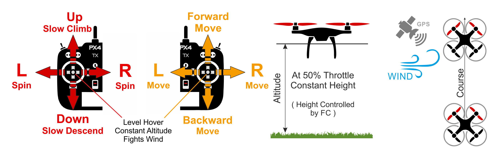

# Режим позиції (мультикоптер)

&nbsp;&nbsp;

_Position_ is an easy-to-fly RC mode in which roll and pitch sticks control acceleration over ground in the vehicle's left-right and forward-back directions (similar to a car's accelerator pedal), and throttle controls speed of ascent-descent.
Коли стіки відпускаються/центруються, автомобіль активно гальмує, вирівнюється і фіксується в певному положенні в 3D-просторі — компенсуючи вітер та інші сили.
With full stick deflection the vehicle accelerates initially with [MPC_ACC_HOR_MAX](#MPC_ACC_HOR_MAX) ramping down until it reaches the final velocity [MPC_VEL_MANUAL](#MPC_VEL_MANUAL).

:::tip
Position mode is the safest manual mode for new fliers.
Unlike [Altitude](../flight_modes_mc/altitude.md) and [Stabilized](../flight_modes_mc/manual_stabilized.md) modes the vehicle will stop when the sticks are centered rather than continuing until slowed by wind resistance.
:::

Діаграма нижче візуально показує поведінку режиму (для передавача режиму 2).

### Посадка

Приземлення в цьому режимі легко:

1. Розмістіть дрон горизонтально над місцем посадки, використовуючи палиці кочення та тангажу.
2. Відпустіть рукоятку кочення і тангажу та дайте їй достатньо часу, щоб повністю зупинитися.
3. Потягніть палицю газу вниз обережно, доки транспортний засіб не доторкнеться до землі.
4. Тягніть палицю газу до максимуму, щоб полегшити і прискорити виявлення землі.
5. The vehicle will lower propeller thrust, detect the ground and [automatically disarm](../advanced_config/prearm_arm_disarm.md#auto-disarming) (by default).

:::warning
While very rare on a well calibrated vehicle, sometimes there may be problems with landing.

- Якщо транспортний засіб не зупиняється горизонтально:
  - You can still land under control in [Altitude mode](../flight_modes_mc/altitude.md).
    Підхід такий самий, як у вищезазначеному випадку, за винятком того, що вам потрібно вручну забезпечити, щоб транспортний засіб залишався вище місця посадки, використовуючи руль і підйомний механізм.
  - Після приземлення перевірте орієнтацію GPS та магнітометра, калібруйте.
- Якщо транспортний засіб не виявляє землю/посадку і не роззброюється:
  - After the vehicle is on the ground switch to [Stabilized mode](../flight_modes_mc/manual_stabilized.md) keeping the throttle stick low, and manually disarm using a gesture or other command.
    За потреби ви також можете використовувати вимикач вимкнення, коли транспортний засіб вже знаходиться на землі.

:::

## Технічний підсумок

Режим RC, де рульові, кренові, керування газом (RPT) керують рухом у відповідних осях/напрямках.
Центральні палиці рівняють транспортний засіб і утримують його на фіксованій висоті та позиції проти вітру.

- Centered roll, pitch, throttle sticks (within RC deadzone [MPC_HOLD_DZ](../advanced_config/parameter_reference.md#MPC_HOLD_DZ)) hold x, y, z position steady against any disturbance like wind.
- Зовнішній центр:
  - Ручки кочення/крена керують горизонтальним прискоренням над землею у ліво-правому та передньо-задньому напрямках транспортного засобу (відповідно).
  - Палиця дросельного клапана контролює швидкість підйому-спуску.
  - Палиця крену контролює швидкість кутової ротації вище горизонтальної площини.
- Зліт:
  - Після посадки транспортний засіб злетить, якщо важіль керування газом підніметься вище 62.5% від повного діапазону (від низу).
- Потрібна глобальна оцінка положення.
- Потрібен ручний ввід управління (наприклад, за допомогою пульта дистанційного керування, джойстика).
  - Крен, Тангаж, Газ: Допомога від автопілота для утримання позиції проти вітру.
  - Курс: Допомога від автопілота для стабілізації швидкості польоту.
    Положення палиці RC відображає швидкість обертання транспортного засобу в цій орієнтації.

### Параметри

All the parameters in the [Multicopter Position Control](../advanced_config/parameter_reference.md#multicopter-position-control) group are relevant. Декілька параметрів, на які варто звернути увагу, перераховані нижче.

| Параметр                                                                                                                                                                                        | Опис                                                                                                                                                                                                                                                                                                                                                                                                                                                                                                                                                                              |
| ----------------------------------------------------------------------------------------------------------------------------------------------------------------------------------------------- | --------------------------------------------------------------------------------------------------------------------------------------------------------------------------------------------------------------------------------------------------------------------------------------------------------------------------------------------------------------------------------------------------------------------------------------------------------------------------------------------------------------------------------------------------------------------------------- |
| [MPC_HOLD_DZ](../advanced_config/parameter_reference.md#MPC_HOLD_DZ)                                                          | Мертва зона палиць, де активовано утримання позиції. За замовчуванням: 0.1 (10% від повного діапазону палиці).                                                                                                                                                                                                                                                                                                                                                                                 |
| [MPC_Z_VEL_MAX_UP](../advanced_config/parameter_reference.md#MPC_Z_VEL_MAX_UP) | Максимальна швидкість вертикального підйому. За замовчуванням: 3 м/с.                                                                                                                                                                                                                                                                                                                                                                                                                                                             |
| [MPC_Z_VEL_MAX_DN](../advanced_config/parameter_reference.md#MPC_Z_VEL_MAX_DN) | Максимальна швидкість вертикального спуску. За замовчуванням: 1 m/s.                                                                                                                                                                                                                                                                                                                                                                                                                                                              |
| [MPC_LAND_ALT1](../advanced_config/parameter_reference.md#MPC_LAND_ALT1)                                                    | Висота для спрацювання першої фази повільної посадки. Below this altitude descending velocity gets limited to a value between [MPC_Z_VEL_MAX_DN](#MPC_Z_VEL_MAX_DN) (or `MPC_Z_V_AUTO_DN`) and [MPC_LAND_SPEED](#MPC_LAND_SPEED). Value needs to be higher than [MPC_LAND_ALT2](#MPC_LAND_ALT2). За замовчуванням 10м. |
| [MPC_LAND_ALT2](../advanced_config/parameter_reference.md#MPC_LAND_ALT2)                                                    | Висота для другої фази повільної посадки. Below this altitude descending velocity gets limited to [`MPC_LAND_SPEED`](#MPC_LAND_SPEED). Значення повинно бути нижче, ніж "MPC_LAND_ALT1". Значення за замовчуванням: 5m.                                                                                                                                                                                                                                 |
| `RCX_DZ`                                                                                                                                                                     | RC dead zone for channel X. The value of X for throttle will depend on the value of [RC_MAP_THROTTLE](../advanced_config/parameter_reference.md#RC_MAP_THROTTLE). For example, if the throttle is channel 4 then [RC4_DZ](../advanced_config/parameter_reference.md#RC4_DZ) specifies the deadzone.                                                                                                                                                                |
| `MPC_XXXX`                                                                                                                                                                  | Більшість параметрів MPC_xxx впливають на поведінку польоту в цьому режимі (принаймні до певної міри). For example, [MPC_THR_HOVER](../advanced_config/parameter_reference.md#MPC_THR_HOVER) defines the thrust at which a vehicle will hover.                                                                                                                                                                                                                  |
| [MPC_POS_MODE](../advanced_config/parameter_reference.md#MPC_POS_MODE)                                                       | Стратегія перекладу введення на рух. From PX4 v1.12 the default (`Acceleration based`) is that stick position controls acceleration (in a similar way to a car accelerator pedal). Інші параметри дозволяють відхилення палиці безпосередньо контролювати швидкість над землею, з і без згладжування та обмежень прискорення.                                                                                                                                               |
| [MPC_ACC_HOR_MAX](../advanced_config/parameter_reference.md#MPC_ACC_HOR_MAX)                         | Максимальне горизонтальне прискорення.                                                                                                                                                                                                                                                                                                                                                                                                                                                                                                                            |
| [MPC_VEL_MANUAL](../advanced_config/parameter_reference.md#MPC_VEL_MANUAL)                                                 | Максимальна горизонтальна швидкість.                                                                                                                                                                                                                                                                                                                                                                                                                                                                                                                              |
| [MPC_LAND_SPEED](../advanced_config/parameter_reference.md#MPC_LAND_SPEED)                                                 | Швидкість спуску на посадку. За замовчуванням: 0.7 m/s.                                                                                                                                                                                                                                                                                                                                                                                                                                                           |

## Додаткова інформація

### Втрата позиції / безпека

Режим позиціонування залежить від наявності прийнятної оцінки позиції.
If the estimate falls below acceptable levels, for example due to GPS loss, this may trigger a [Position (GPS) Loss Failsafe](../config/safety.md#position-gnss-loss-failsafe).
Залежно від конфігурації, наявності пульта дистанційного керування та наявності достатньої оцінки висоти, PX4 може переключитися в режим висоти, ручний режим, режим посадки або завершити роботу.

## Дивіться також

- [Position Slow Mode](../flight_modes_mc/position_slow.md)
