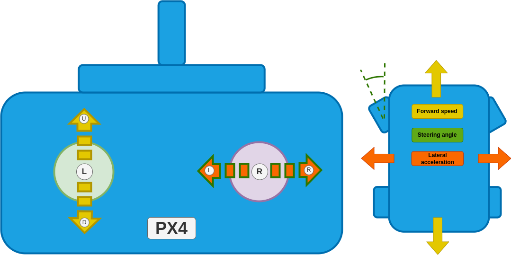

# Drive Modes (Ackermann Rover)

Flight modes (or more accurately "Drive modes" for ground vehicles) provide autopilot support to make it easier to manually drive the vehicle or to execute autonomous missions.

This section outlines all supported drive modes for [Ackermann rovers](../frames_rover/ackermann.md).

For information on mapping RC control switches to specific modes see: [Basic Configuration > Flight Modes](../config/flight_mode.md).

:::warning
Selecting any other mode than those listed below will either stop the rover or can lead to undefined behaviour.
:::

## Manual Modes

Manual modes require stick inputs from the user to drive the vehicle.

The sticks provide the same "high level" control effects over direction and rate of movement in all manual modes:

- `Left stick up/down`: Drive the rover forwards/backwards (controlling speed)
- `Right stick left/right`: Make a left/right turn (controlling steering angle ([Manual mode](#manual-mode)) or yaw rate ([Acro](#acro-mode) and [Position](#position-mode))).

The manual modes provide progressively increasing levels of autopilot support for maintaining a course, speed, and rate of turn, compensating for external factors such as slopes or uneven terrain.

| Режим                      | Функції                                                                                                                                                                                                                                                                             |
| -------------------------- | ----------------------------------------------------------------------------------------------------------------------------------------------------------------------------------------------------------------------------------------------------------------------------------- |
| [Manual](#manual-mode)     | No autopilot support. User is responsible for keeping the rover on the desired course and maintaining speed and rate of turn.                                                                                                                       |
| [Acro](#acro-mode)         | + Maintains the yaw rate (This makes it feel more like driving a car than manual mode).  + Allows maximum yaw rate to be limited (Protects against roll over).                                             |
| [Position](#position-mode) | + Maintains the course (Best mode for driving a straight line). + Maintains speed against disturbances, e.g. when driving up a hill. + Allows maximum speed to be limited. |

:::details
Overview mode mapping to control effect

| Режим                      | Forward/backwards speed                                                                  | Steering angle/yaw rate                                                                                                                                                                                                                        | Required measurements                                                              |
| -------------------------- | ---------------------------------------------------------------------------------------- | ---------------------------------------------------------------------------------------------------------------------------------------------------------------------------------------------------------------------------------------------- | ---------------------------------------------------------------------------------- |
| [Manual](#manual-mode)     | Directly map stick input to motor command.                               | Directly map stick input to steering angle.                                                                                                                                                                                    | None.                                                              |
| [Acro](#acro-mode)         | Directly map stick input to motor command.                               | Stick input creates a yaw rate setpoint for the control system to regulate.                                                                                                                                                    | yaw rate.                                                          |
| [Position](#position-mode) | Stick input creates a speed setpoint for the control system to regulate. | Stick input creates a yaw rate setpoint for the control system to regulate. If this setpoint is zero (stick is centered) the control system will keep the rover driving in a straight line. | yaw rate, yaw, speed and global position (GPS). |

:::

### Ручний режим

In this mode the stick inputs are directly mapped to motor commands.
The rover does not attempt to maintain a specific orientation or compensate for external factors like slopes or uneven terrain!
The user is responsible for making the necessary adjustments to the stick inputs to keep the rover on the desired course.

| Stick                  | Effect                                                     |
| ---------------------- | ---------------------------------------------------------- |
| Left stick up/down     | Drive the rover forwards/backwards.        |
| Right stick left/right | Move the steering angle to the left/right. |

For the configuration/tuning of this mode see [Manual mode](../config_rover/ackermann.md#manual-mode).

### Acro Mode

:::info
This mode requires a yaw rate measurement.
:::

In this mode the vehicle regulates its yaw rate to a setpoint (but does not stabilize heading or regulate speed).

Yaw rate can be directly mapped to a steering input based on the forward speed of the rover:

<!-- prettier-ignore -->

$$\delta = \arctan(\frac{w_b \cdot \dot{\psi}}{v})$$

with

- $w_b:$ Wheel base,
- $\delta:$ Steering angle,
- $\dot{\psi}:$ Yaw rate
- $v:$ Forward speed.

For driving this means that the same right hand stick input will cause a different steering angle based on how fast you are driving.
By limiting the maximum yaw rate, we can restrict the steering angle based on the speed, which can prevent the rover from rolling over.
This mode will feel more like "driving a car" than [Manual mode](#manual-mode).

:::info
The yaw rate is only close loop controlled when driving forwards.
When driving backwards the yaw rate setpoint is directly mapped to a steering angle using the equation above.
This is due to the fact that rear wheel steering (driving a car with front-wheel steering backwards) is non-minimum-phase w.r.t to the yaw rate which leads to instabilities when doing closed loop control.
:::

| Stick                  | Effect                                                                                                                                                                                                              |
| ---------------------- | ------------------------------------------------------------------------------------------------------------------------------------------------------------------------------------------------------------------- |
| Left stick up/down     | Drive the rover forwards/backwards.                                                                                                                                                                 |
| Right stick left/right | Create a yaw rate setpoint for the control system to regulate. If this input is zero the control system will attempt to maintain a zero yaw rate (minimal disturbance rejection) |

For the configuration/tuning of this mode see [Acro mode](../config_rover/ackermann.md#acro-mode).

### Stabilized Mode

:::info
This mode requires a yaw rate and yaw estimate.
:::

In this mode the vehicle regulates its yaw rate to a setpoint and will maintain its heading if this setpoint is zero (but does not regulate speed).
Compared to [Acro mode](#acro-mode), this mode is much better at driving in a straight line as it can more effectively reject disturbances.

| Stick                  | Effect                                                                                                                                                                 |
| ---------------------- | ---------------------------------------------------------------------------------------------------------------------------------------------------------------------- |
| Left stick up/down     | Drive the rover forwards/backwards.                                                                                                                    |
| Right stick left/right | Create a yaw rate setpoint for the control system to regulate. If this input is zero the control system will maintain the current yaw. |

For the configuration/tuning of this mode see [Stabilized mode](../config_rover/ackermann.md#stabilized-mode).

### Position Mode

:::info
This mode requires a yaw rate, yaw, speed and global position estimate.
:::

This is the manual mode with the most autopilot support.
The vehicle regulates its yaw rate and speed to a setpoint.
If the yaw rate setpoint is zero, the controller will remember the GPS coordinates and yaw (heading) of the vehicle and use those to construct a line that the rover will then follow (course control).
This offers the highest amount of disturbance rejection, which leads to the best straight line driving behavior.

| Stick                  | Effect                                                                                                                                                                         |
| ---------------------- | ------------------------------------------------------------------------------------------------------------------------------------------------------------------------------ |
| Left stick up/down     | Stick position sets a forward/back speed setpoint. The vehicle attempts to maintain this speed on slopes etc.                                  |
| Right stick left/right | Create a yaw rate setpoint for the control system to regulate. If this input is zero the control system will maintain the course of the rover. |

For the configuration/tuning of this mode see [Position mode](../config_rover/ackermann.md#position-mode).

## Auto Modes

In auto modes the autopilot takes over control of the vehicle to run missions, return to launch, or perform other autonomous navigation tasks.
For the tuning process see the configuration for [Auto modes](../config_rover/ackermann.md#auto-modes).

### Mission Mode

_Mission mode_ is an automatic mode that causes the vehicle to execute a predefined autonomous [mission plan](../flying/missions.md) that has been uploaded to the flight controller.
The mission is typically created and uploaded with a Ground Control Station (GCS) application, such as [QGroundControl](https://docs.qgroundcontrol.com/master/en/).

#### Mission commands

The following commands can be used in missions at time of writing (`main`/planned for `PX4 v1.16+`):

| QGC mission item                      | Команда                                                                                                                        | Опис                                                              |
| ------------------------------------- | ------------------------------------------------------------------------------------------------------------------------------ | ----------------------------------------------------------------- |
| Mission start                         | [MAV_CMD_MISSION_START](MAV_CMD_MISSION_START)                  | Starts the mission.                               |
| Waypoint                              | [MAV_CMD_NAV_WAYPOINT](MAV_CMD_NAV_WAYPOINT)                    | Navigate to waypoint.                             |
| Return to launch                      | [MAV\_CMD\_NAV\_RETURN\_TO\_LAUNCH][MAV_CMD_NAV_RETURN_TO_LAUNCH]                                                              | Return to the launch location.                    |
| Change speed                          | [MAV\_CMD\_DO\_CHANGE\_SPEED][MAV_CMD_DO_CHANGE_SPEED]                                                                         | Change the speed setpoint                                         |
| Set launch location                   | [MAV_CMD_DO_SET_HOME](MAV_CMD_DO_SET_HOME) | Changes launch location to specified coordinates. |
| Jump to item (all) | [MAV\_CMD\_DO\_JUMP][MAV_CMD_DO_JUMP] (and other jump commands)                                                                | Jump to specified mission item.                   |

[MAV_CMD_MISSION_START]: https://mavlink.io/en/messages/common.html#MAV_CMD_MISSION_START
[MAV_CMD_NAV_WAYPOINT]: https://mavlink.io/en/messages/common.html#MAV_CMD_NAV_WAYPOINT
[MAV_CMD_NAV_RETURN_TO_LAUNCH]: https://mavlink.io/en/messages/common.html#MAV_CMD_NAV_RETURN_TO_LAUNCH
[MAV_CMD_DO_CHANGE_SPEED]: https://mavlink.io/en/messages/common.html#MAV_CMD_DO_CHANGE_SPEED
[MAV_CMD_DO_SET_HOME]: https://mavlink.io/en/messages/common.html#MAV_CMD_DO_SET_HOME
[MAV_CMD_DO_JUMP]: https://mavlink.io/en/messages/common.html#MAV_CMD_DO_JUMP

### Return Mode

This mode uses the [pure pursuit guidance logic](../config_rover/ackermann.md#pure-pursuit-guidance-logic) with the launch position as goal.
Return mode can be activated through the respective [mission command](#mission-commands) or through the ground station UI.
